# CEO Brain — Product Requirements Document (AS-IS)

> **Версия:** 1.1 · **Тип:** AS-IS (реверс-инжиниринг из кода, не roadmap)
> **Дата сборки:** 2026-05-27 · **Источник истины:** код репозитория `manager` (HEAD `97ae418`, 177 Python-модулей, 36 миграций)
> **Метод:** документ собран продуктовым аналитиком из фактического кода, а не из деклараций. Каждое требование привязано к строке кода (`файл:строка`) и к «родному» ID требования из комментариев в коде (`Trace`).
> **v1.1:** структура переразбита на **7 продуктовых фич по типу объекта** — Memory · Tasks · Calendar · Notes · Docs · Tables · Reports. Прежние пайплайн-фичи (CEO Brain Bot / Note Taker / Task Extractor / Task Tracker / Agenda / Briefs / Platform) сохранены как **линия происхождения** требований (§2.2) и в префиксах ID. Ни одно требование не потеряно — см. карты §2.2 (US) и §2.3 (backbone).

---

## 0. Как читать этот документ

Документ описывает **что система реально делает сегодня**, в формате:

```
Фича → User Stories («Артем может …») → User Flow (диаграмма) →
       декомпозиция на Use Cases (Given-When-Then) → FR + NFR (свой ID у каждого)
```

### 0.1 Легенда статуса возможности

| Бейдж | Значение |
|-------|----------|
| 🟢 **LIVE** | Реализовано и поднимается в основном рантайме (`app.main`) без флага. |
| 🟡 **FLAG** | Реализовано полностью, **активируется env-флагом** (по умолчанию `false`). Указан флаг. |
| 🔵 **JOB** | Реализовано, запускается **отдельным процессом/скриптом** (`ops/…`), а не основным процессом. |
| 🟠 **PARTIAL** | Реализовано частично / расходится со старой спекой / есть мёртвый код. |
| ⚪ **SPEC-ONLY** | Описано в старых спеках, **в коде отсутствует** — в этот PRD НЕ включается как работающее (отмечается в §13). |

> **Важно про флаги.** «По умолчанию `false`» в `app/config.py` — это безопасный дефолт для чистого инстанса. В рабочем деплое оператора соответствующие флаги включены, иначе фича не несла бы ценности. Поэтому 🟡 FLAG = «работает, когда включено оператором», а не «не работает».

### 0.2 Схема идентификаторов

Структура — **7 фич по типу объекта**. Идентификаторы требований **сохраняют префикс фичи-происхождения** (это и есть AS-IS-трассировка к коду), поэтому внутри одной новой фичи могут встречаться разные префиксы (например, в **Tasks** есть `FR-TX-*`, `FR-TT-*`, `FR-NT-012`, `FR-PL-006`).

| Префикс ID | Происхождение (старый пайплайн) |
|------------|----------------------------------|
| `*-CB-*` | CEO Brain Bot |
| `*-NT-*` | Note Taker |
| `*-TX-*` | Task Extractor |
| `*-TT-*` | Task Tracker |
| `*-AG-*` | Pre-Meeting Agenda |
| `*-BR-*` | Counterparty Briefs |
| `*-PL-*` | Platform / Data Backbone |

| Тип ID | Сущность |
|--------|----------|
| `US-<F>-<n>` | User Story |
| `UC-<F>-<n>.<m>` | Use Case (Given-When-Then), декомпозиция US |
| `FR-<F>-<nnn>` | Functional Requirement |
| `NFR-<F>-<nnn>` | Non-Functional Requirement |

`Trace:` в каждом требовании ссылается на «родной» ID из комментариев кода (`FR-CR-04-*`, `FR-CR-05-*`, `FR-CB2-*`, `FR-GS-*`) и файл — это и есть доказательство AS-IS.

---

## 1. Продукт и пользователь

### 1.1 Что такое CEO Brain

**CEO Brain** — это «второй мозг» руководителя: монолитный сервис (Python + Postgres), который слушает рабочие каналы компании (Slack, Telegram, Zoom, Fireflies), превращает разговоры и встречи в структурированные **задачи**, **саммари** и **брифы**, отслеживает их жизненный цикл, зеркалит всё в Google (Sheets / Tasks / Docs / Calendar) и отвечает на вопросы руководителя в чате, имея доступ к его реальным данным.

В этом документе те же возможности сгруппированы по **типу объекта, который получает Артем**: его **Memory** (диалоговый доступ ко всему контексту), **Tasks** (полный жизненный цикл задач), **Calendar** (подготовка к встречам по расписанию), **Notes** (саммари встреч), **Docs** (Google-документы), **Tables** (Google Sheets/Tasks + директории) и **Reports** (дайджесты и брифы). Бэкенд-«движок» (ingest из 4 каналов, entity-resolution, шифрование токенов, кросс-канальная доставка) не вынесен в отдельную фичу, а прикреплён к фиче-потребителю и помечен как backbone (см. §2.3).

Один процесс (`app/main.py:run`) поднимает: основной Slack-бот (Socket Mode) + диспетчер кросс-канальной рассылки подписчикам + единоразовую синхронизацию сотрудников + демоны Agenda и Counterparty Briefs + standalone-листенер CEO Brain Bot. Тяжёлые пайплайны встреч и ingest'ы запускаются отдельными процессами `ops/*`.

### 1.2 Пользователь

> **Артем — CEO & Founder, Humanoid.**

| Атрибут | Значение |
|---------|----------|
| Роль | Основатель и генеральный директор робототехнической компании Humanoid. |
| Главная боль | Десятки встреч/неделю (инвесторы, команда, партнёры), сотни сообщений; контекст и договорённости теряются; ручное ведение задач не масштабируется. |
| Цель | «0 ручных действий»: встречи сами превращаются в саммари и задачи; ничего не теряется; перед встречей под рукой контекст; задачи команды видны и двигаются; на любой вопрос — ответ из своих данных. |
| Каналы | Slack (команда + DM с ботами), Telegram (DM с ботом-трекером), Zoom / Fireflies (запись встреч), Google Workspace (Sheets/Docs/Tasks/Calendar). |
| Привилегии | Артем — `admin` (Slack `ADMIN_SLACK_USER_IDS` / Telegram `TELEGRAM_ADMIN_USER_IDS`) и, как правило, владелец `ZOOM_REQUIRED_EMAIL` (`1@thehumanoid.ai`). |

Артем — **основной и привилегированный** пользователь. Команда участвует как авторы сообщений, владельцы и подписчики задач, но адресат ценности и админ — Артем.

### 1.3 Технологический контекст (AS-IS)

`slack-bolt` (Socket Mode) · `langgraph` (пайплайн извлечения) · `sqlalchemy 2` + `alembic` + Postgres · `openai` (gpt-5.5, o4-mini-deep-research, gpt-4o-transcribe-diarize) + `anthropic` (claude-sonnet-4-6) · `google-api-python-client` (Sheets/Tasks/Docs/Calendar) · `cryptography` (Fernet для токенов) · `structlog`. Slack-приложение: Socket Mode, события `app_mention` / `message.{im,mpim,channels,groups}`, message-шорткаты `create_task_from_message` / `create_meeting_from_message` (`ops/slack-manifest.yaml`).

---

## 2. Карта фич

| # | Фича | Что получает Артем | Статус | Главные флаги |
|---|------|--------------------|--------|---------------|
| 1 | **Memory** | Диалоговый ассистент в Slack: пассивно архивирует весь контекст и отвечает на @упоминания/DM, подтягивая данные через MCP. | 🟡 FLAG | `CEO_BRAIN_ENABLED` |
| 2 | **Tasks** | Полный жизненный цикл задачи: извлечение из чатов/встреч, карточки (TG+Slack), статусы, напоминания, подписки, дедуп, резолв людей. | 🟢🟡 LIVE+FLAG | LIVE + ingest-флаги |
| 3 | **Calendar** | Подготовка к встрече по расписанию: повестка перед повторяющейся встречей + калибровка названия встречи по календарю. | 🟡 FLAG | `AGENDA_ENABLED`, `CALENDAR_MATCH_ENABLED` |
| 4 | **Notes** | Авто-саммари встреч: Zoom/Fireflies → транскрипт → короткое саммари в Slack/TG + участники/контрагенты. | 🟡🔵 FLAG+JOB | `ZOOM_REALTIME_ENABLED` / `FIREFLIES_REALTIME_ENABLED` |
| 5 | **Docs** | Полные документы в Google Docs: отчёт встречи, повестка, брифы — единая поверхность рендеринга. | 🟡 FLAG | `*_DOCS_FOLDER_ID` |
| 6 | **Tables** | Google Sheets/Tasks как операционный вид: двусторонняя синка задач, директории, версионная история; хранилище секретов. | 🟢🟡 LIVE+FLAG | разные (см. фичу) |
| 7 | **Reports** | Сводки и брифы: утренние/вечерние/недельные дайджесты, watch-list + deep-research брифы контрагентов перед встречей. | 🟢🟡 LIVE+FLAG | `COUNTERPARTY_BRIEFS_ENABLED` + admin-id |

### 2.1 Верхнеуровневая архитектура (AS-IS)

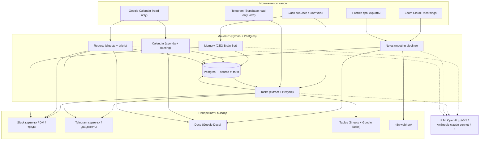

### 2.2 Карта происхождения (старый пайплайн → новая фича)

Доказательство, что при перенарезке **ничего не потеряно**: каждая User Story прежней структуры имеет дом в новой.

| Старый пайплайн | User Stories | → Новая фича |
|-----------------|--------------|--------------|
| **CEO Brain Bot** | US-CB-1, US-CB-2, US-CB-3, US-CB-4 | **Memory** (целиком) |
| **Note Taker** | US-NT-1, US-NT-2, US-NT-3, US-NT-5 | **Notes** |
| | US-NT-4 (полный отчёт-Doc) | **Docs** |
| | US-NT-6 (задачи из встречи) | **Tasks** |
| | US-NT-7 (имя встречи по календарю) | **Calendar** |
| **Task Extractor** | US-TX-1 … US-TX-5 | **Tasks** (целиком) |
| **Task Tracker** | US-TT-1 (кнопки), US-TT-5 (напоминания), US-TT-6 (подписки) | **Tasks** |
| | US-TT-2, US-TT-3, US-TT-4, US-TT-8 (дайджесты/watch-list) | **Reports** |
| | US-TT-7 (правки в Sheets/Tasks) | **Tables** |
| **Pre-Meeting Agenda** | US-AG-1, US-AG-2, US-AG-3 | **Calendar** (целиком) |
| **Counterparty Briefs** | US-BR-1, US-BR-2, US-BR-3 | **Reports** (целиком) |
| **Platform** | US-PL-1, US-PL-2, US-PL-3, US-PL-6 (Sheets/Tasks/директории/версии) | **Tables** |
| | US-PL-5 (Fernet-шифрование) | **Tables** |
| | US-PL-4 (entity-resolution движок) | **Tasks** (кросс-реф Notes/Reports/Calendar) |

### 2.3 Распределение backbone (строго по 7 фичам, без отдельного слоя)

Сквозные модули прикреплены к фиче-«дому» и помечены кросс-ссылками на потребителей — так «строго 7» не теряет движок.

| Backbone-модуль | Дом | Кросс-реф (кто ещё пользуется) |
|-----------------|-----|--------------------------------|
| Slack-листенер + пассивный архив (`slack_bot/app.py`, `ceo_brain/archive/*`) | **Memory** | Tasks (сообщение→задача) |
| Zoom + Fireflies ingest (`app/zoom/*`, `app/fireflies/*`) | **Notes** | Tasks (NT-6), Calendar (NT-7) |
| Telegram ingest (`app/telegram_ingest/*`, read-only вью) | **Tasks** | — |
| Calendar read (`services/calendar_match.py`, `calendar_attendees.py`) | **Calendar** | Reports (триггер брифов), Notes (участники) |
| Entity-движок + кэш (`services/entity_matcher.py`, `entity_apply.py`, `team_member_canonical.py`, `entity_resolution_cache.py`) | **Tasks** | Notes (участники/контрагенты), Reports (орг для брифов), Calendar (имена attendee) |
| Резолв/директория контрагентов (`services/counterparty_match.py`, `sync/counterparties.py`) | **Tables** (директория) + **Reports** (резолв для брифов) | Notes (NT-11) |
| Кросс-канальная доставка (`services/subscriber_updates.py`, `subscriptions.py`, `slack_mirror.py`) | **Tasks** | Notes (саммари), Reports (дайджесты) |
| Google token-vault, Fernet (`sync/google_auth.py`) | **Tables** | Calendar / Docs / Notes (любой Google-вызов) |
| Построитель дайджестов (`services/digest.py`, `admin_digest.py`, `daily_plan.py`, `weekly_plan.py`) | **Reports** | Tasks (per-task напоминания) |
| Google Docs writer (`sync/docs.py`) | **Docs** | Notes / Calendar / Reports |

---

# Фича 1 — Memory 🟡 FLAG
*(происхождение: CEO Brain Bot · `app/ceo_brain/*`)*

**Назначение.** Диалоговый Slack-ассистент лично для Артема. С одного потока Slack-событий делает две вещи: (1) **молча архивирует** каждое сообщение в подписанных каналах в JSONL-файлы + зеркало в Postgres; (2) на **@упоминание или DM** — отвечает через Anthropic API, подтягивая реальные данные Артема (транскрипты Zoom, Telegram, Google Drive, CRM, сам Slack) через MCP-коннекторы (n8n по HTTP JSON-RPC) и 8 локальных Slack-инструментов. Бонусом: каждый DM прогоняется через классификатор задач и может породить черновик задачи (передаётся в фичу **Tasks**).

**Backbone здесь.** Slack-листенер (Socket Mode) и пассивный архив контекста живут в этой фиче; тот же поток событий слушает **Tasks** (классификация сообщение→задача).

**Активация.** `CEO_BRAIN_ENABLED=true` + `CEO_BRAIN_ANTHROPIC_API_KEY` (без ключа — только архив). Поднимается в `app/main.py:198` через `start_standalone_ceo_brain_bot`. Транспорт — Socket Mode (свои токены `CEO_BRAIN_SLACK_*` или fallback на основные). Модель по умолчанию `claude-sonnet-4-6` (`CEO_BRAIN_MODEL`).

**Ключевые флаги:** `CEO_BRAIN_ENABLED` (false), `CEO_BRAIN_ARCHIVE_ONLY` (false), `CEO_BRAIN_ANTHROPIC_API_KEY` (""), `CEO_BRAIN_MODEL` (claude-sonnet-4-6), `CEO_BRAIN_ARCHIVE_CHANNELS` ("" = все), `CEO_BRAIN_ALLOWED_USERS` ("" = всем), `CEO_BRAIN_THREAD_CONTEXT_MSGS` (10), `CEO_BRAIN_MAX_RUN_COST_USD` (1.0), `MCP_SERVERS` (""), `CEO_BRAIN_SLACK_USER_TOKEN` (""), `CEO_BRAIN_TASK_CLASSIFIER_ENABLED` (env, true).

## US-CB-1 — Артем может задать боту вопрос (@упоминание или DM) и получить ответ на основе своих реальных данных

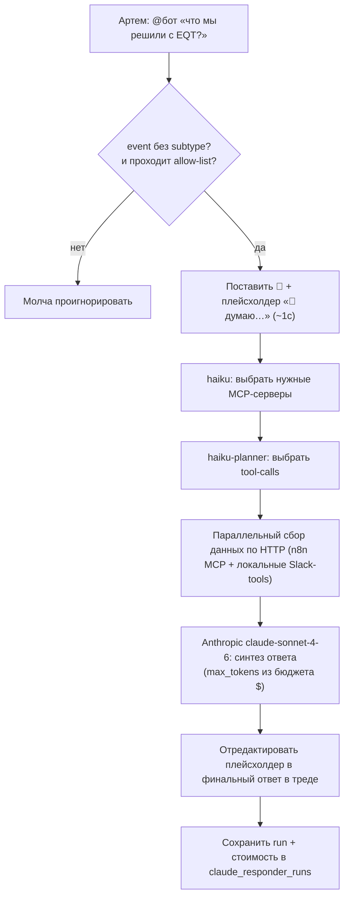

**Use Cases**

- **UC-CB-1.1 — Ответ на @упоминание в канале.**
  *Given* бот включён и упомянут в канале, *When* приходит событие без subtype, *Then* бот ставит реакцию 👀, постит тред-плейсхолдер «🤔 думаю…» (~1с), проводит planning→gather→synthesis и редактирует плейсхолдер в финальный ответ.
  - **FR-CB-001:** На `app_mention`/`message.im` без subtype бот запускает responder и публикует ответ как тред-реплай к исходному сообщению. *Trace: FR-CB2-3.1 · `app/ceo_brain/slack_handler.py:223`, `responder.py:903`.*
  - **NFR-CB-001:** Плейсхолдер появляется практически мгновенно (<1с до сетевой синтез-задержки) и проходит фазы «🔄 планирую…»/«🔍 проверил…». *Trace: NFR-CB2-P.* · `responder.py:1159`.*

- **UC-CB-1.2 — Подтягивание данных через MCP.**
  *Given* вопрос требует данных (встречи/CRM/Drive), *When* responder планирует шаги, *Then* haiku-классификатор выбирает MCP-серверы из `MCP_SERVERS`, haiku-planner — конкретные tool-calls, и они исполняются параллельно по HTTP, после чего Anthropic синтезирует ответ.
  - **FR-CB-002:** Доступ к данным реализован прямым JSON-RPC-over-HTTP к n8n MCP-эндпоинтам (не через Anthropic-MCP, заменён ради латентности), плюс 8 локальных Slack-инструментов как виртуальный сервер `slack_self`. *Trace: FR-CB2-3.31 · `app/ceo_brain/mcp_client.py`, `responder.py:864`,`888`.*
  - **NFR-CB-002:** Сбор данных параллелится; авторизационные заголовки MCP вычищаются из сохраняемого payload. *Trace: NFR-CB2-S.3 · `responder.py:325`,`parallel_gather.py:353`.*

- **UC-CB-1.3 — DM-вопрос + молчаливый черновик задачи.**
  *Given* Артем пишет боту в DM (top-level), *When* сообщение получено, *Then* бот отвечает как в синтетическом треде на его сообщение **и** дополнительно прогоняет текст через классификатор задач, создавая черновик-карточку (фича **Tasks**).
  - **FR-CB-003:** Каждый DM responder'у при `CEO_BRAIN_TASK_CLASSIFIER_ENABLED` дополнительно проходит intent-классификатор и может породить task-draft. *Trace: FR-CR-05-192w · `app/ceo_brain/slack_handler.py:442-559`.*
  - **NFR-CB-003:** Стоимость одного прогона ограничена: `max_tokens` выводится из `CEO_BRAIN_MAX_RUN_COST_USD` ($1.0) при $15/Mtok, потолок 16000 токенов. *Trace: NFR-CB2-C.2 · `responder.py:226`.*

- **UC-CB-1.4 — Деградация при ошибках провайдера.**
  *Given* Anthropic вернул 429 или MCP не отвечает, *When* в пределах ретраев, *Then* бот делает экспоненциальный backoff (2/4/8/16/32с) с прогрессивной деградацией MCP и показывает «⏳ … попытка N/5».
  - **FR-CB-004:** Транзиентные ошибки ретраятся с backoff и понижением набора MCP; при исчерпании — «⚠️ временная ошибка, попробуй через минуту». *Trace: FR-CB2-3.x · `responder.py:1181-1234`.*
  - **NFR-CB-004:** Если финальный `chat_update` 3× упёрся в rate-limit, ответ всё равно доставляется новым тред-сообщением (не теряется). *Trace: `responder.py:695-743`.*

## US-CB-2 — Артем может вести многоходовый диалог в треде (уточнять «а ещё?», «подробнее»)

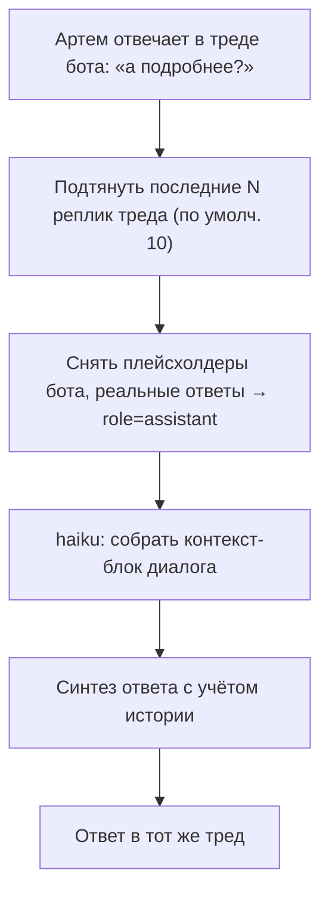

**Use Cases**

- **UC-CB-2.1 — Контекст треда.**
  *Given* Артем отвечает внутри треда бота, *When* responder собирает контекст, *Then* подтягиваются последние `CEO_BRAIN_THREAD_CONTEXT_MSGS` реплик; плейсхолдеры-статусы вычищаются, реальные ответы бота сохраняются как `assistant`.
  - **FR-CB-005:** В треде responder использует историю последних N реплик как контекст; вне треда история не тянется. *Trace: FR-CB2-3.x · `slack_handler.py:42-96`,`249-265`.*
  - **NFR-CB-005:** Объём контекста ограничен N (дефолт 10) во избежание раздувания стоимости. *Trace: `config.py:121`.*

## US-CB-3 — Артем может рассчитывать, что весь Slack-контекст пассивно архивируется (для последующих ответов и аудита)

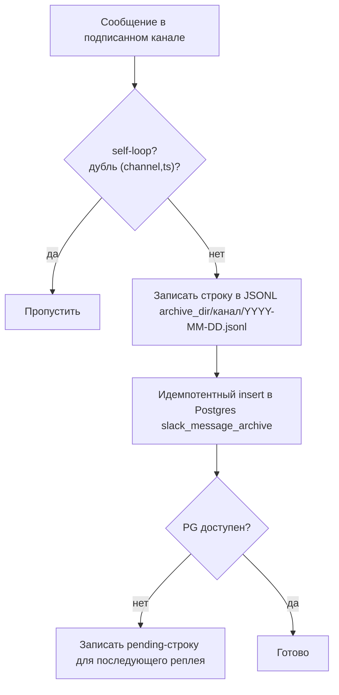

**Use Cases**

- **UC-CB-3.1 — Архивация сообщений.**
  *Given* сообщение в канале из whitelist (`CEO_BRAIN_ARCHIVE_CHANNELS`, пусто = все), *When* событие получено, *Then* оно дозаписывается в дневной JSONL (права 0640/0750) и идемпотентно — в `slack_message_archive` с `UNIQUE(channel_id, ts)`.
  - **FR-CB-006:** Каждое сообщение слышимых каналов архивируется в JSONL + PG-зеркало; дубль `(channel_id, ts)` отбрасывается. *Trace: FR-CB2-2.1/2.2 · `archive/jsonl_sink.py:49`, `pg_sink.py:41`, `dispatcher.py:136`.*
  - **NFR-CB-006:** Архивация best-effort: при сбое записи исключение проглатывается, сессия откатывается, responder всё равно отрабатывает. *Trace: FR-CR-05-192v · `dispatcher.py:172-197`.*

- **UC-CB-3.2 — Отказоустойчивость хранилища.**
  *Given* Postgres недоступен, *When* идёт архивация, *Then* JSONL всё равно пишется, а PG-строка кладётся в `slack_archive_pending.jsonl` для последующего реплея.
  - **FR-CB-007:** При недоступности PG данные не теряются — пишется pending-очередь. *Trace: FR-CB2-2.6 · `archive/service.py:73-126`.*
  - **NFR-CB-007:** Дедупликация Socket-push vs history-poller: один и тот же ts проходит архивный UNIQUE до коммита, responder срабатывает один раз (in-process дедуп 60с). *Trace: `dispatcher.py:49-61`,`234`.*

- **UC-CB-3.3 — Backstop-поллинг истории.**
  *Given* Socket-событие могло потеряться, *When* работает `SlackHistoryPoller` (~1с), *Then* он добирает `conversations.history`/`replies` и реплеит через тот же диспетчер.
  - **FR-CB-008:** Поллер истории — резерв на случай потери Socket-событий; запускается синглтоном на набор каналов. *Trace: FR-CB2-1.6 · `history_poller.py`, `slack_handler.py:124-157`.*

## US-CB-4 — Артем может ограничить, кто вообще разговаривает с ботом

**Use Cases**

- **UC-CB-4.1 — Allow-list.**
  *Given* задан `CEO_BRAIN_ALLOWED_USERS`, *When* приходит DM/@упоминание от пользователя не из списка, *Then* сообщение молча игнорируется (без «access denied», чтобы не шуметь).
  - **FR-CB-009:** При непустом allow-list responder отвечает только перечисленным user-id; остальные молча отсеиваются до responder'а. *Trace: FR-CB2-3.36 · `dispatcher.py:205-225`.*
  - **NFR-CB-009:** Пустой список = без ограничений (отвечает всем). *Trace: `config.py:145`.*

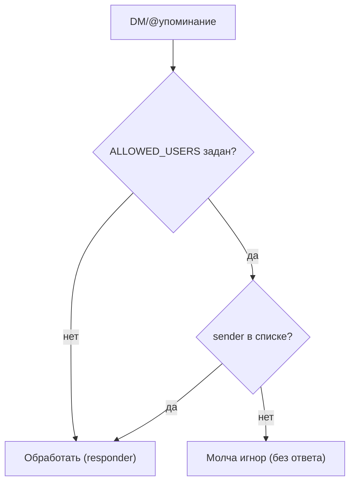

---

# Фича 2 — Tasks 🟢🟡 LIVE+FLAG
*(происхождение: Task Extractor + Task Tracker (lifecycle) + Note Taker (US-NT-6) + Platform (US-PL-4) · `app/intent/*`, `app/orchestrator/*`, `app/telegram_bot/*`, `app/slack_bot/handlers/*`, `app/services/*`)*

**Назначение.** Полный жизненный цикл задачи — от извлечения до закрытия. **Извлечение:** чат-сообщение классифицируется LLM-детектором «это задача?»; если да — три параллельных под-экстрактора (заголовок/описание/приоритет, владелец, дедлайн) строят `TaskDraft` → `ActionDraft` → `Task`; уверенность детектора маппится в UX-действие (карточка-черновик / тишина / авто-создание). Задачи также приходят из встреч (фича **Notes**, US-NT-6). **Жизненный цикл:** интерактивные карточки в Telegram и Slack, переходы статусов кнопками, напоминания, подписки с кросс-канальным fan-out.

**Backbone здесь.** Telegram ingest (read-only Supabase-вью), entity-движок канонизации людей/организаций (+ кэш), дедуп задач и кросс-канальный диспетчер доставки подписчикам. Entity-движок переиспользуют **Notes** (участники/контрагенты), **Reports** (организации брифов) и **Calendar** (имена attendee). Правки задач, прилетающие из Google Sheets/Tasks обратно, описаны в фиче **Tables** (US-TT-7).

**Активация.** Slack passive (`message`-события) и `@упоминание` — **LIVE** в основном Bolt-приложении; message-шорткаты — LIVE. Жизненный цикл — LIVE (часть джобов гейтятся по admin-id). Slack Socket-ingest — `SLACK_INGEST_ENABLED` (false). Telegram realtime view-poll — `VIEW_REALTIME_ENABLED` (false). Telegram historical migration — вручную (`ops/migrate_telegram_history.py`).

**Статусы:** `backlog → todo → in_progress → done` (статус `review` упразднён). Soft-delete — через `deleted_at` (статус сохраняется). Переходы — почти полный граф с обратными рёбрами; `apply()` отвергает same-status и запрещённые рёбра, штампует `started_at`/`completed_at`, пишет `TaskStatusHistory`, запускает fan-out.

**Кнопки карточки:** Start (только владелец на backlog/todo; в Slack — и для бесхозной), Mark done (владелец/админ на in_progress), Edit + Delete (владелец/админ, не на done), Cancel (владелец/админ, маршрутизирует), Subscribe/Unsubscribe (любой кроме владельца). **Нет** Delegate/Snooze/Refresh.

**Ключевые флаги:** *извлечение* — `INTENT_CONFIDENCE_HIGH` (0.75), `INTENT_CONFIDENCE_LOW` (0.40), `CONTEXT_WINDOW_BEFORE` (10), `LLM_PROVIDER` (auto), `OPENAI_MODEL` (gpt-5.5), `DEDUP_FAST_PATH` (true), `SLACK_INGEST_ENABLED` (false), `VIEW_REALTIME_ENABLED` (false) / `VIEW_POLL_INTERVAL_SECONDS` (30) / `VIEW_POLL_BATCH_SIZE` (500), `TELEGRAM_SOURCE_DATABASE_URL` (""); *жизненный цикл* — `TELEGRAM_ADMIN_USER_IDS` (""), `ADMIN_SLACK_USER_IDS` (""), `WORKLOAD_MINUTES_PER_DAY` (360) / `WORKLOAD_DEFAULT_TASK_MINUTES` (120, оценщик не подключён).

## US-TX-1 — Артем может видеть, как бот сам предлагает завести задачу из переписки (пассивный режим)

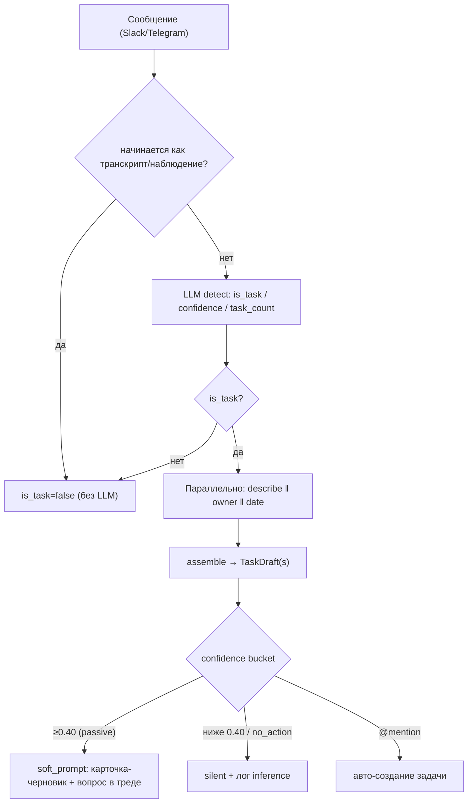

**Use Cases**

- **UC-TX-1.1 — Классификация сообщения.**
  *Given* в наблюдаемом канале появилось сообщение, *When* оно проходит пайплайн, *Then* сначала regex-гард отсекает транскрипты/наблюдения (`is_task=false` без LLM), иначе LLM-детектор возвращает `is_task`, `confidence`, `task_count` и при необходимости делит на несколько задач.
  - **FR-TX-001:** Пайплайн (LangGraph: detect→describe‖owner‖date→assemble) классифицирует сообщение и извлекает поля; мультизадачные сообщения разбиваются. *Trace: FR-CR-05-05/-108/-109 · `app/intent/pipeline.py:181`,`733`.*
  - **NFR-TX-001:** Rule-prefilter не гейтит LLM — служит fallback'ом и страховкой «no_action → создать задачу при совпадении ключевых слов». *Trace: `app/intent/classifier.py:80`,`123`.*

- **UC-TX-1.2 — Маппинг уверенности в UX.**
  *Given* пайплайн вернул `create_task`, *When* применяется политика passive, *Then* при confidence ≥0.40 (medium **и** high) показывается мягкое предложение (карточка-черновик + вопрос в треде), при <0.40 — тишина с логированием inference.
  - **FR-TX-002:** В пассивном режиме confidence ≥`INTENT_CONFIDENCE_LOW` → `soft_prompt` (карточка-черновик), ниже → `silent`; пассив никогда не создаёт задачу сам. *Trace: FR-CR-04-* · `app/orchestrator/service.py:157`.*
  - **NFR-TX-002:** `no_action` всегда молчит, независимо от уверенности; inference всё равно сохраняется для аудита. *Trace: `service.py:175`, `events.py:450`.*

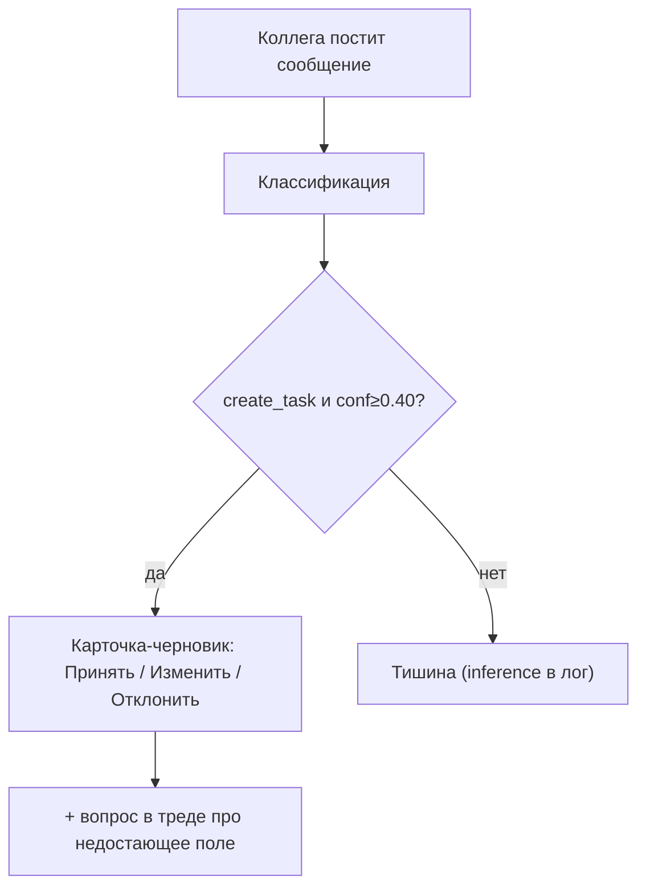

## US-TX-2 — Артем может @упомянуть бота, чтобы немедленно создать задачу (активный режим)

**Use Cases**

- **UC-TX-2.1 — Авто-создание по @упоминанию.**
  *Given* Артем @упоминает бота, *When* сообщение классифицировано, *Then* задача создаётся сразу (без шага «Принять»), постится карточка и вопрос про недостающие поля; даже неразборчивое упоминание порождает минимальный `create_task` («никогда не молчать»).
  - **FR-TX-003:** `@упоминание` — активный путь: немедленный finalize в `Task` + карточка; всегда есть ответ. *Trace: `app/slack_bot/handlers/events.py:670`, `handle_app_mention`.*
  - **NFR-TX-003:** Встречи вне зоны охвата: tool-схема знает 5 интентов, но граф эмитит только `create_task`/`no_action`; meeting-шорткот выдаёт уведомление «только задачи». *Trace: FR-CR-04-19 · `app/intent/pipeline.py:667`, `shortcuts.py:113`.*

## US-TX-3 — Артем может подтвердить/исправить/отклонить черновик и дозаполнить поля диалогом

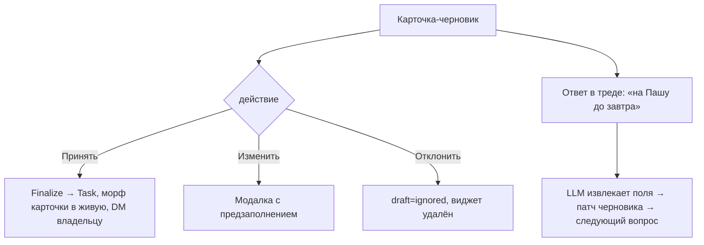

**Use Cases**

- **UC-TX-3.1 — Подтверждение черновика.**
  *Given* показан черновик, *When* Артем/автор жмёт «Принять», *Then* `handle_confirm` финализирует `Task`, превращает карточку в живую и шлёт DM владельцу.
  - **FR-TX-004:** «Принять» → персист `Task` (источниковая привязка к сообщению) + морфинг карточки + уведомление владельца. *Trace: FR-CR-04-32 · `app/orchestrator/finalize.py:124`.*

- **UC-TX-3.2 — Уточнение полей в треде.**
  *Given* у задачи не хватает поля, *When* Артем отвечает в треде естественным языком, *Then* `_handle_followup_reply` извлекает поля LLM'ом, патчит черновик/задачу и задаёт следующий недостающий вопрос.
  - **FR-TX-005:** Недостающие поля дозаполняются диалогом в треде (LLM-извлечение, патч сущности). *Trace: `events.py:117`.*
  - **NFR-TX-005:** Если описание от LLM пустое — черновик отбрасывается, а не отправляется с шаблоном-заглушкой. *Trace: FR-CR-05-105 · `service.py:878`.*

- **UC-TX-3.3 — Резолв владельца и дедлайна.**
  *Given* LLM назвал владельца/дату, *When* идёт валидация, *Then* uid вне ростера отбраковывается как галлюцинация; адресат-датив/заказчик без исполнителя → владелец null → fallback на автора с флагом «предположительно ты»; дата без явного temporal-anchor отбрасывается; при отсутствии даты — дефолт сегодня 18:00.
  - **FR-TX-006:** Владелец/дедлайн извлекаются с детерминированными гардами поверх LLM; дефолтный дедлайн — сегодня 18:00. *Trace: FR-CR-04-22/-30, FR-CR-05-63/-101/-112 · `pipeline.py:287`,`486`, `app/persistence/tasks.py:388`.*
  - **NFR-TX-006:** Задача с дедлайном ≤7 дней → статус `todo` (текущая неделя), иначе `backlog`. *Trace: `tasks.py:331`.*

## US-TX-4 — Артем может подключить ingest из Telegram и из Slack-каналов (фоновые источники)

**Use Cases**

- **UC-TX-4.1 — Realtime-поллинг Telegram view.**
  *Given* `VIEW_REALTIME_ENABLED=true`, *When* листенер тикает каждые 30с, *Then* он читает свежие сообщения из read-only Supabase-вью `humanoid_tg_chats_readonly` и прогоняет их через `prepare_drafts`.
  - **FR-TX-007:** Telegram-сообщения ingest'ятся поллингом read-only вью (батч до 500); уже обработанные короткозамыкаются по bookmark. *Trace: FR-CR-05-35/-36 · `app/telegram_bot/listener.py:932`, `app/telegram_ingest/reader.py:254`.*
  - **NFR-TX-007:** Вью открывается строго read-only (`default_transaction_read_only=on`) — система никогда не пишет в источник. *Trace: `reader.py:254`.*

- **UC-TX-4.2 — Slack Socket-ingest.**
  *Given* `SLACK_INGEST_ENABLED=true`, *When* отдельное Bolt-приложение слышит сообщения, *Then* оно создаёт задачи немедленно с `source_kind='slack'` и постит карточки в Telegram (без Slack-ответа).
  - **FR-TX-008:** Slack Socket-ingest — отдельный канал ввода: создаёт задачи и доставляет TG-карточки. *Trace: FR-CR-05-162 · `app/slack_ingest/listener.py`, `ops/slack_listener.py:35`.*

## US-TX-5 — Артем может рассчитывать, что бот не плодит дубликаты задач

**Use Cases**

- **UC-TX-5.1 — Быстрый дедуп без LLM.**
  *Given* `DEDUP_FAST_PATH=true`, *When* кандидат совпадает по нормализованному заголовку+владельцу или описание похоже (SequenceMatcher ≥0.70) при пересечении владельцев, *Then* он помечается дубликатом **без** LLM-вызова.
  - **FR-TX-009:** Детерминированный fast-path дедуп (exact title+owner / description-similarity) отсекает дубли до LLM. *Trace: FR-CR-05-110/-111 · `app/services/task_dedup.py`.*
  - **NFR-TX-009:** Иначе — LLM-дедуп по последним 10 открытым задачам/черновикам; отключается `DEDUP_FAST_PATH=0`. *Trace: `config.py:348`.*

## US-NT-6 — Артем может получить из встречи готовые задачи (с владельцами и дедлайнами)
*(источник сигнала — пайплайн встреч фичи **Notes**; результат — задачи в этой фиче)*

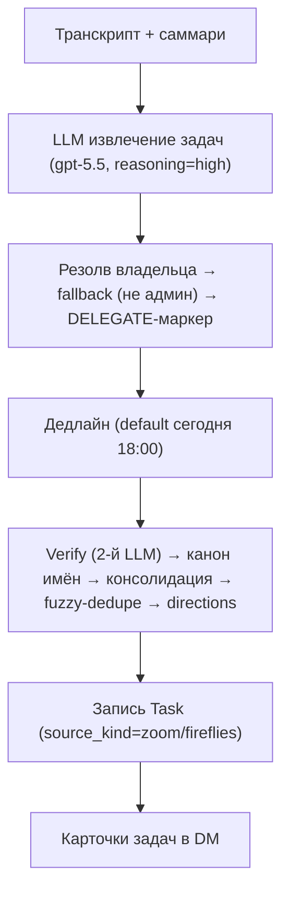

**Use Cases**

- **UC-NT-6.1 — Извлечение и обогащение задач.**
  *Given* саммари готово, *When* шаг задач, *Then* LLM извлекает задачи, резолвит владельца (галлюцинированный uid обнуляется → fallback, никогда не админ), применяет DELEGATE-маркер из заметок, ставит дедлайн (по умолчанию сегодня 18:00).
  - **FR-NT-012:** Из встречи извлекаются задачи с владельцем и дедлайном; владелец-галлюцинация отбраковывается, применяется делегирование одним хопом. *Trace: FR-CR-05-185 · `pipeline.py:1863`,`2031`,`2069`.*
  - **NFR-NT-012:** Дедуп почти-дублей задач — fuzzy SequenceMatcher (topic-prefix + ratio≥0.55 / ≥0.90 без префикса) перед записью. *Trace: FR-CR-05-128 · `app/fireflies/pipeline.py:649`.*

- **UC-NT-6.2 — Классификация направлений.**
  *Given* задачи извлечены, *When* шаг directions, *Then* каждой проставляется стратегическое направление (beta/budget/design/investors/deliverables/other), используемое для фильтра To-Do короткого саммари (фича **Notes**).
  - **FR-NT-013:** Задачам присваивается направление, влияющее на отбор «важных» в To-Do саммари. *Trace: FR-CR-05-163 · `app/services/task_direction.py`, `pipeline.py:2476`.*

## US-TT-1 — Артем может управлять задачей кнопками на карточке (Start/Done/Cancel/Edit/Delete)

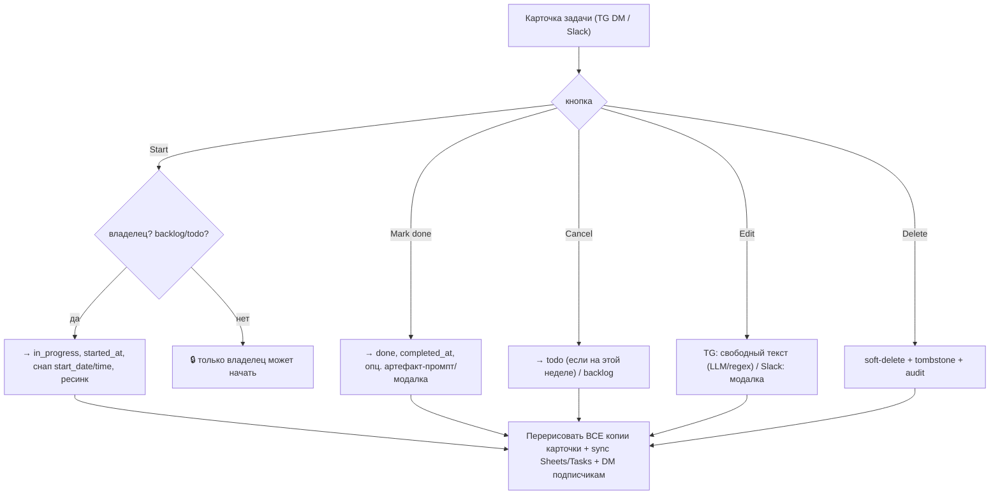

**Use Cases**

- **UC-TT-1.1 — Завершение задачи.**
  *Given* задача `in_progress`, *When* Артем жмёт «Mark done», *Then* статус→done, ставится `completed_at`, пишется history, все копии карточки перерисовываются, изменение синкается в Sheets+Tasks, не-владельцам-подписчикам уходит DM.
  - **FR-TT-001:** «Mark done» переводит в done с историей, ресинком в Google и уведомлением подписчиков; в Slack — через модалку артефакта (опционально), в TG — с опциональным промптом ссылки/заметки. *Trace: FR-CR-04-21, FR-CR-05-37 · `app/slack_bot/handlers/task_actions.py:160`.*
  - **NFR-TT-001:** Любое действие идемпотентно по `audit_logs`; повтор не плодит дублирующих уведомлений. *Trace: NFR-CR-1/2.*

- **UC-TT-1.2 — Контроль прав.**
  *Given* задача с владельцем, *When* не-владелец жмёт «Start» (или не-владелец/не-админ — Edit/Cancel/Delete), *Then* действие блокируется эфемерным «:lock: только владелец/админ», без изменений.
  - **FR-TT-002:** Start — только владелец (или клейминг бесхозной задачи: actor становится владельцем); Edit/Cancel/Delete — владелец/админ. *Trace: `task_actions.py:91`,`262`, `app/telegram_bot/handlers.py:113`.*
  - **NFR-TT-002:** Запрещённый переход (например, старт уже завершённой) → `InvalidTransition`, предупреждение, без изменения состояния. *Trace: `app/services/transitions.py:50`.*

- **UC-TT-1.3 — Start снимает фактическое время старта.**
  *Given* задача в backlog/todo, *When* владелец жмёт «Start», *Then* статус→in_progress и (в TG) `start_date/start_time` фиксируются как «сейчас».
  - **FR-TT-003:** Первый переход в in_progress штампует `started_at` и снап старта. *Trace: FR-CR-05-69 · `transitions.py`, `handlers.py:117`.*

- **UC-TT-1.4 — Cancel маршрутизирует, Delete мягко удаляет.**
  *Given* активная задача, *When* Cancel, *Then* она уходит в `todo` (если дедлайн на этой неделе) или `backlog`; *When* Delete — ставится `deleted_at`, рисуется tombstone, строка в Sheets помечается «deleted».
  - **FR-TT-004:** Cancel маршрутизирует по дедлайну; Delete — soft-delete с tombstone и ресинком. *Trace: FR-CR-04-20 · `task_actions.py`, `_route_on_cancel`.*

## US-TT-5 — Артем может полагаться на напоминания о дедлайнах и старте задач

**Use Cases**

- **UC-TT-5.1 — Напоминание о дедлайне.**
  *Given* задача с дедлайном ≤ сегодня+2, *When* крон дедлайнов, *Then* владельцу уходит DM (с пометкой «Просрочено», если дедлайн в прошлом), дедуп per (task, day).
  - **FR-TT-010:** Дедлайн-крон уведомляет владельцев о приближающихся/просроченных задачах. *Trace: FR-CR-05-49 · `app/services/digest.py:283`.*

- **UC-TT-5.2 — «Пора начинать».**
  *Given* у задачи есть start_time в окне [сейчас−5м, сейчас], *When* крон starts-now, *Then* владельцу уходит напоминание (без start_time — fallback 09:00).
  - **FR-TT-011:** Starts-now крон напоминает о задачах, которым пора стартовать. *Trace: FR-CR-05-03 · `digest.py:224`.*

- **UC-TT-5.3 — Тред-напоминания.**
  *Given* у открытой задачи есть исходный тред, *When* крон тред-напоминаний, *Then* в тот тред раз в день уходит статус-специфичный nudge (done/вне недели — пропускаются).
  - **FR-TT-012:** Открытым задачам с тредом-источником доставляется ежедневный nudge в тред. *Trace: `app/services/thread_reminders.py`.*

## US-TT-6 — Артем (и команда) может подписаться на чужую задачу и получать обновления в свой канал

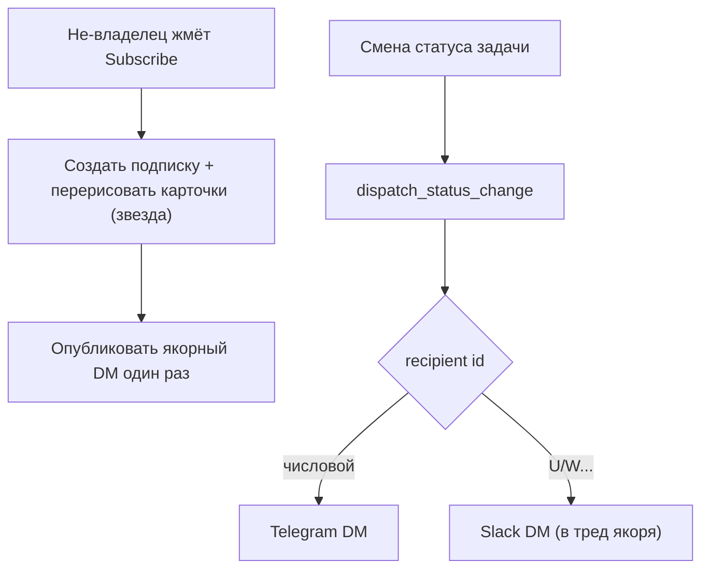

**Use Cases**

- **UC-TT-6.1 — Подписка.**
  *Given* задача с владельцем, *When* не-владелец жмёт Subscribe, *Then* создаётся подписка, карточки обновляются (звезда/лейбл), один раз постится якорный DM для будущих апдейтов.
  - **FR-TT-013:** Любой кроме владельца может подписаться/отписаться; владелец подписан неявно. *Trace: `task_actions.py:414`.*

- **UC-TT-6.2 — Кросс-канальный fan-out.**
  *Given* статус задачи изменился, *When* срабатывает `dispatch_status_change`, *Then* каждому не-владельцу-подписчику уходит однострочный DM, маршрутизируемый по типу id: числовой → Telegram, `U/W…` → Slack; идемпотентно per (task, recipient, transition).
  - **FR-TT-014:** Изменение статуса рассылается подписчикам кросс-канально (TG+Slack) с маршрутизацией по id и идемпотентностью. *Trace: FR-CR-05-02 · `app/services/subscriber_updates.py:88`,`165`, `app/main.py:113`.*
  - **NFR-TT-014:** Рассылка по **редактированию** задачи в Telegram намеренно подавлена (анти-шум); рассылка по статусу — активна. *Trace: FR-CR-05-43 · `handlers.py:948`.*

## US-PL-4 — Артем может рассчитывать на единые имена людей и компаний во всех каналах
*(entity-движок; дом — здесь, потребители — Notes / Reports / Calendar)*

**Use Cases**

- **UC-PL-4.1 — Entity resolution.**
  *Given* в транскрипте/задаче есть «сырые» владельцы и упоминания, *When* работает матчер, *Then* они резолвятся к `team_members`/`counterparties` (LLM-first + rule fallback); владельцы вне списка участников встречи строго обнуляются; результат кэшируется в `entity_resolution_cache` (TTL ~7 дней).
  - **FR-PL-006:** LLM-слой канонизирует людей и организации между Slack/Telegram/Zoom/Calendar; владельцы-не-участники отбраковываются. *Trace: FR-CR-05-193b/c/d/e · `app/services/entity_matcher.py:269`,`316`, `team_member_canonical.py:121`.*
  - **NFR-PL-006:** Идентичные входы матчера → результат из кэша (если `expires_at>now`), `hits_count` инкрементится — экономия LLM-вызовов. *Trace: `app/services/entity_resolution_cache.py:35`,`81`.*

---

# Фича 3 — Calendar 🟡 FLAG
*(происхождение: Pre-Meeting Agenda + Note Taker (US-NT-7) · `app/agenda/*`, `app/services/calendar_match.py`, `calendar_attendees.py`)*

**Назначение.** Подготовка к встрече, управляемая Google-календарём (read-only). Две возможности: (1) **Pre-Meeting Agenda** — незадолго до **повторяющейся** встречи DM с напоминанием (что обсуждали в прошлый раз + открытые задачи из той встречи + ссылка на Google Doc); (2) **Калибровка названия встречи** — по событию календаря название записи переписывается в `DD/MM - <calendar title>` и (для Fireflies) пушится обратно в UI. Везде паттерн «**календарь-первичен, эвристика — фолбэк**».

**Backbone здесь.** Чтение Google Calendar (`events().list`, мульти-календарь через запятую с исключением личного; резолв attendees к именам). Тот же календарный сигнал использует **Reports** как триггер брифов; имена attendee переиспользует **Notes**.

**«Повторяющаяся»** = нормализованное название встречи совпадает с ≥`AGENDA_MIN_PRIOR_MEETINGS` прошлыми записями из `zoom_recordings`. В проде сборка повестки **детерминированная, без LLM** (`_compose_lite`); legacy LLM-путь существует, но не вызывается.

**Активация.** Agenda: `AGENDA_ENABLED=true` + непустой `AGENDA_SLACK_TARGET_CHANNEL_ID` (демон `app/main.py:156`). Калибровка названия: `CALENDAR_MATCH_ENABLED=true` (шаг в пайплайне встреч).

**Ключевые флаги:** `AGENDA_ENABLED` (false), `AGENDA_SLACK_TARGET_CHANNEL_ID` (""), `AGENDA_SOURCE` (calendar | zoom_pattern), `AGENDA_LEAD_TIME_MINUTES` (10), `AGENDA_WINDOW_MINUTES` (1), `AGENDA_LOOKBACK_DAYS` (90), `AGENDA_MIN_PRIOR_MEETINGS` (2), `AGENDA_TICK_INTERVAL_SECONDS` (60), `CALENDAR_MATCH_ENABLED` (false). Общие: `GOOGLE_CALENDAR_*`, `CALENDAR_APPS_SCRIPT_URL`, `ZOOM_REQUIRED_EMAIL` (organizer-gate).

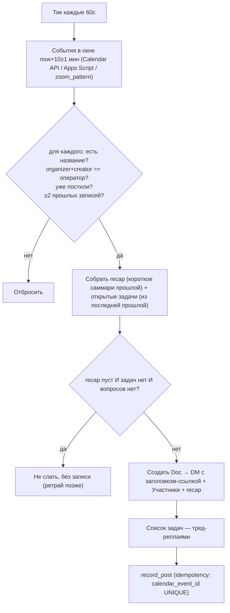

## US-AG-1 — Артем может получить повестку перед повторяющейся встречей

**Use Cases**

- **UC-AG-1.1 — Сборка и отправка повестки.**
  *Given* событие через ~10 мин, с ≥2 совпадающими прошлыми записями, ещё не постилось, *When* демон тикает, *Then* он собирает recap + открытые задачи, создаёт Doc и шлёт один Slack DM (заголовок-ссылка `DD/MM - Агенда к <title>`, Участники, «На прошлой встрече», метка «Статус задач к обсуждению:») + список задач тред-реплаями.
  - **FR-AG-001:** Перед повторяющейся встречей доставляется один DM-повестка (recap + участники + ссылка на Doc) и задачи тред-реплаями. *Trace: FR-CR-05-165/-167 · `app/agenda/runner.py:347`, `app/agenda/slack_format.py:224`.*
  - **NFR-AG-001:** Сборка повестки в проде — без LLM (`_compose_lite`); `AGENDA_COMPOSE_MODEL` читается, но игнорируется. *Trace: FR-CR-05-192u · `app/agenda/compose.py:286`.*

- **UC-AG-1.2 — Идемпотентность.**
  *Given* по событию уже постили повестку, *When* следующий тик, *Then* кандидат отбрасывается (без второго DM); идемпотентность — по `meeting_agendas.calendar_event_id` UNIQUE (или синтетическому id, если у источника нет нативного).
  - **FR-AG-002:** Повестка по событию постится ровно один раз (UNIQUE на event_id / синтетический ключ). *Trace: `app/models/meeting_agenda.py:21`, `runner.py:307`.*
  - **NFR-AG-002:** Идемпотентность переживает рестарт (хранится в БД). *Trace: NFR-MA-O.2.*

- **UC-AG-1.3 — Подавление пустой повестки.**
  *Given* нет ни recap, ни открытых задач, ни вопросов, *When* кандидат обрабатывается, *Then* DM не отправляется и запись не создаётся (ретрай на следующем тике).
  - **FR-AG-003:** Пустая повестка подавляется (нет DM, нет записи), чтобы не слать шум. *Trace: `runner.py:384-401`.*

## US-AG-2 — Артем может рассчитывать, что повестки приходят только по его регулярным встречам (а не по чужим/разовым)

**Use Cases**

- **UC-AG-2.1 — Гейт организатора.**
  *Given* событие на общем календаре, где организатор/создатель — не оператор, *When* фильтр кандидатов, *Then* событие отбрасывается.
  - **FR-AG-004:** Повестки шлются только по встречам, где оператор — организатор и создатель. *Trace: FR-CR-05-167 · `app/agenda/service.py:548-565`.*
  - **NFR-AG-004:** Resource-attendees (переговорки) вычищаются; email'ы резолвятся к именам трёхслойно (fallback→employees→team_members). *Trace: FR-CR-05-192ac · `service.py:152-245`.*

- **UC-AG-2.2 — Порог «повторяемости».**
  *Given* у встречи лишь 1 прошлая запись (intro/разовая), *When* фильтр, *Then* она не считается кандидатом (нужно ≥`AGENDA_MIN_PRIOR_MEETINGS`=2).
  - **FR-AG-005:** Встреча считается повторяющейся только при ≥2 прошлых записях с тем же нормализованным названием. *Trace: `service.py:572`, `config.py:250`.*

## US-AG-3 — Артем может получать повестки даже без доступа к Calendar API (эвристика по Zoom)

**Use Cases**

- **UC-AG-3.1 — Источник zoom_pattern.**
  *Given* `AGENDA_SOURCE=zoom_pattern`, *When* демон тикает, *Then* он майнит недельный/дневной/двухнедельный паттерн из `zoom_recordings` и предсказывает следующий инстанс; не-регулярные группы (<2 priors) пропускаются.
  - **FR-AG-006:** Альтернативный источник предстоящих встреч — эвристика по каденции прошлых Zoom-записей (без Calendar API). *Trace: FR-CR-05-166 · `app/agenda/zoom_pattern.py:254`.*
  - **NFR-AG-006:** Демон отказоустойчив: ошибка Calendar API → fallback на Apps Script; падение одного кандидата логируется, цикл продолжается. *Trace: NFR-MA-R.1 · `runner.py:211`,`286`.*

## US-NT-7 — Артем может получать встречи с корректными человекочитаемыми названиями

**Use Cases**

- **UC-NT-7.1 — Калибровка названия по Calendar (Fireflies).**
  *Given* `CALENDAR_MATCH_ENABLED=true`, *When* у Fireflies-встречи авто-штамп вместо имени, *Then* в окне ±N минут ищется событие календаря, LLM выбирает лучшее совпадение, название переписывается в `DD/MM - <calendar title>` и пушится обратно в Fireflies UI (`updateMeetingTitle`). Фолбэк без календаря — тема выводится из транскрипта (этот шаг описан в **Notes**).
  - **FR-NT-014:** Название встречи калибруется по Google Calendar и переписывается в формат `DD/MM - Title` (для Fireflies — с обратным пушем в UI). *Trace: FR-CR-05-136/-144/-154 · `app/fireflies/pipeline.py:1401`, `app/fireflies/client.py:308`.*
  - **NFR-NT-014:** По умолчанию выключено (`CALENDAR_MATCH_ENABLED=false`); Zoom-пайплайн не переименовывает (только тянет attendees). *Trace: `config.py:304`.*

---

# Фича 4 — Notes 🟡🔵 FLAG+JOB
*(происхождение: Note Taker (захват/транскрипт/саммари/участники) · `app/zoom/*`, `app/fireflies/*`, `app/services/{transcription,slack_mirror,meeting_webhook,zoom_participants}.py`)*

**Назначение.** Два независимых поллера (Zoom Cloud Recordings и Fireflies) забирают записи встреч и прогоняют каждую через почти идентичный ~18-шаговый пайплайн: фильтр → скачивание аудио → транскрипция (Whisper) → детальное саммари → разрешение участников и контрагентов → короткое саммари в Telegram/Slack + n8n webhook. Состояние — в `zoom_recordings`/`meeting_recordings` с булевыми флагами по шагам, поэтому при перезапуске пайплайн идемпотентно продолжается.

**Backbone здесь.** Ingest записей Zoom/Fireflies и транскрипция. Один и тот же пайплайн питает соседние фичи: извлечённые **задачи → Tasks** (US-NT-6), **полный отчёт → Docs** (US-NT-4), **калибровка имени по календарю → Calendar** (US-NT-7), доставка переиспользует кросс-канальный диспетчер из **Tasks**. Резолв участников/контрагентов опирается на entity-движок (**Tasks**, US-PL-4).

**Активация.** Поллеры запускаются скриптом `ops/zoom_fireflies_runner.py` и стартуют поток только при `ZOOM_REALTIME_ENABLED=true` / `FIREFLIES_REALTIME_ENABLED=true` (оба по умолчанию false) и наличии кредов.

**Ключевые флаги:** `ZOOM_REALTIME_ENABLED`/`FIREFLIES_REALTIME_ENABLED` (false), `*_POLL_INTERVAL_SECONDS` (60), batch (Zoom 10 / FF 20), `MIN_MEETING_SECONDS` (300), `ZOOM_REQUIRED_EMAIL` ("") + `ZOOM_REQUIRED_EMAIL_STRICT_HOST` (false), модели (`FIREFLIES_WHISPER_MODEL`=gpt-4o-transcribe-diarize, summary/short/tasks=gpt-5.5, `FIREFLIES_TASKS_REASONING_EFFORT`=high), `ZOOM_BILINGUAL_RESTORATION_ENABLED` (false), `SLACK_MEETING_CHANNEL_ID`/`MEETING_WEBHOOK_URL`, `COUNTERPARTY_RESOLVE_BATCH_SIZE` (20)/`_MAX_WORKERS` (5).

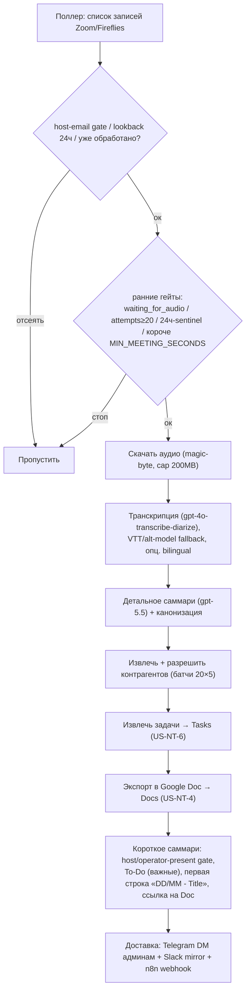

## US-NT-1 — Артем может ничего не делать: встреча в Zoom/Fireflies сама попадает в обработку

**Use Cases**

- **UC-NT-1.1 — Авто-захват записи.**
  *Given* `*_REALTIME_ENABLED=true` и есть креды, *When* поллер тикает каждые 60с, *Then* он берёт новые записи и для каждой запускает идемпотентный `process_one`.
  - **FR-NT-001:** Поллеры Zoom (`/accounts/me/recordings`) и Fireflies (`list_transcripts`) периодически забирают записи и прогоняют через единый пайплайн. *Trace: FR-CR-05-116/-39 · `app/zoom/pipeline.py:2585`, `app/fireflies/pipeline.py:2971`, `ops/zoom_fireflies_runner.py`.*
  - **NFR-NT-001:** Идемпотентность: уже обработанные (`tasks_extracted=true AND last_error IS NULL`) пропускаются; падение на шаге пишет `last_error` и ретраится на следующем поле. *Trace: FR-CR-05-196 · `runner.py:153`, `pipeline.py:2616`.*

- **UC-NT-1.2 — Фильтр «только мои встречи».**
  *Given* задан `ZOOM_REQUIRED_EMAIL`, *When* в списке запись, где Артем не хост, *Then* при `STRICT_HOST=true` она отсеивается сразу; иначе допускается, если email есть среди участников.
  - **FR-NT-002:** Запись принимается, только если `host_email` совпадает с `ZOOM_REQUIRED_EMAIL` (strict) или email есть в участниках (legacy). *Trace: FR-CR-05-143/-167 · `app/zoom/client.py:259-290`.*
  - **NFR-NT-002:** Пустой `ZOOM_REQUIRED_EMAIL` = принимать все (legacy-поведение). *Trace: `config.py:628`.*

- **UC-NT-1.3 — Гейты мусора.**
  *Given* запись короче `MIN_MEETING_SECONDS` (300), или это телефонный 24-часовой sentinel, или аудио ещё не готово, *When* `process_one`, *Then* запись пропускается с явной причиной (`duration_too_short` / `zoom_phone_24h_sentinel` / `waiting_for_audio`).
  - **FR-NT-003:** Ранние гейты отбрасывают слишком короткие/служебные/неготовые записи без обработки. *Trace: FR-CR-05-192t/-197/-198 · `pipeline.py:2604`,`2630`,`2641`.*
  - **NFR-NT-003:** После 20 неудачных попыток запись помечается `permanent_failure_attempts_exceeded` (не зацикливается). *Trace: `pipeline.py:2616`.*

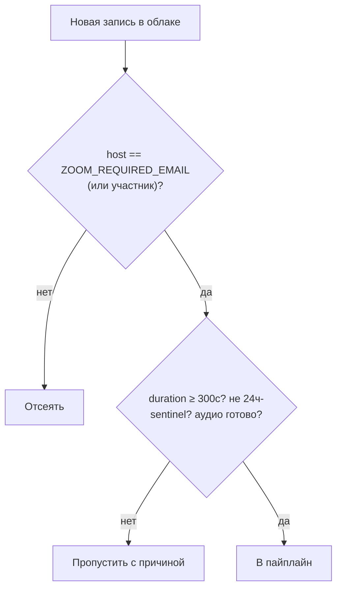

## US-NT-2 — Артем может получить корректный транскрипт даже для шумной/двуязычной записи

**Use Cases**

- **UC-NT-2.1 — Транскрипция с bias-промптом.**
  *Given* аудио скачано, *When* идёт STT, *Then* строится bias-промпт из имён команды и контрагентов (+ бренд «Humanoid»), аудио чанкуется при >24MB/>1300с, используется `gpt-4o-transcribe-diarize`.
  - **FR-NT-004:** STT использует bias-промпт из директорий и чанкование длинного аудио. *Trace: FR-CR-05-127/-164/-115/-177 · `app/services/transcription.py:418`,`114`.*
  - **NFR-NT-004:** Diarize-модели сериализуются в 1 воркер и используют `chunking_strategy="auto"`. *Trace: `transcription.py:114-133`.*

- **UC-NT-2.2 — Защита от галлюцинаций STT.**
  *Given* вывод Whisper выглядит как галлюцинация (повторы/субтитры/низкое разнообразие), *When* это детектится, *Then* срабатывает fallback на VTT-транскрипт, затем на alt-модель `whisper-1`.
  - **FR-NT-005:** При детекте галлюцинации STT — каскад fallback'ов (VTT → alt-модель), результат принимается, только если сам не галлюцинирует. *Trace: FR-CR-05-148/-186 · `pipeline.py:361`,`418`.*
  - **NFR-NT-005:** Двуязычная реставрация (второй проход `language=en` + LLM-реконсиляция) доступна, но по умолчанию выключена (`ZOOM_BILINGUAL_RESTORATION_ENABLED=false`). *Trace: FR-CR-05-170 · `pipeline.py:517`.*

## US-NT-3 — Артем может получить короткое саммари встречи в Slack и Telegram

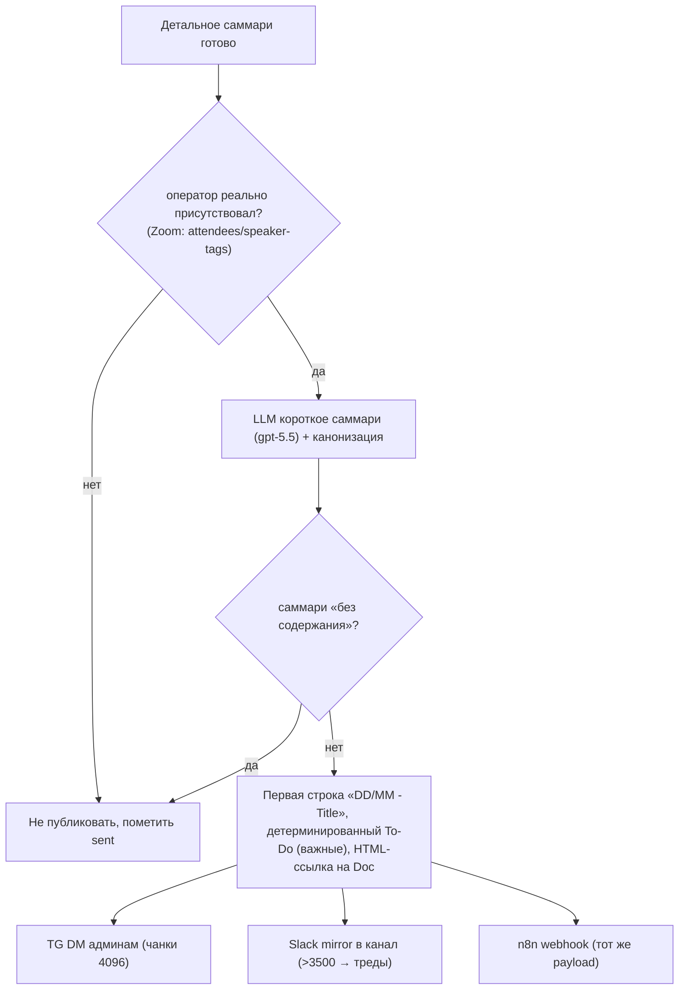

**Use Cases**

- **UC-NT-3.1 — Короткое саммари в Slack-канал.**
  *Given* саммари содержательно, *When* публикуется, *Then* в `SLACK_MEETING_CHANNEL_ID` уходит сообщение: первая строка — кликабельная `DD/MM - Title` (ссылка на Google Doc), затем Участники + Суть + To-Do (только важные направления); длинное (>3500) разбивается на тред-реплаи.
  - **FR-NT-006:** Короткое саммари публикуется в Slack-канал с гиперссылкой-заголовком на Doc, секцией участников/сути и To-Do по важным направлениям; длинный текст уходит в тред. *Trace: FR-CR-05-137/-141/-147/-156/-119 · `app/services/slack_mirror.py:286`, `pipeline.py:843`.*
  - **NFR-NT-006:** Нумерованные задачи компактуются в один блок для Slack. *Trace: FR-CR-05-150 · `slack_mirror.py`.*

- **UC-NT-3.2 — Доставка в Telegram и webhook.**
  *Given* саммари готово, *When* идёт рассылка, *Then* тот же текст уходит DM каждому `TELEGRAM_ADMIN_USER_IDS` (HTML, разбивка по 4096) и POST'ом на `MEETING_WEBHOOK_URL`.
  - **FR-NT-007:** Саммари дублируется в Telegram DM админам и на n8n webhook. *Trace: FR-CR-05-160 · `pipeline.py:1058`, `app/services/meeting_webhook.py:43`.*
  - **NFR-NT-007:** Webhook — fire-and-forget: при non-2xx/пустом теле логируется без ретрая. *Trace: `meeting_webhook.py:81`.*

- **UC-NT-3.3 — Гейт присутствия оператора (Zoom).**
  *Given* запись хостил Артем, но его нет среди участников/спикеров, *When* формируется короткое саммари, *Then* публикация пропускается (помечается sent).
  - **FR-NT-008:** Короткое саммари не публикуется, если оператор фактически не присутствовал на встрече. *Trace: `pipeline.py:778`,`883`.*
  - **NFR-NT-008:** Пустые/бессодержательные саммари не публикуются (анти-спам): детектор «содержательная часть отсутствует» → пометить done, не слать. *Trace: FR-CR-05-157 · `transcription.py:175`.*

## US-NT-5 — Артем может рассчитывать на корректные участники и контрагенты в саммари

**Use Cases**

- **UC-NT-5.1 — Разрешение участников.**
  *Given* есть транскрипт и календарное событие, *When* идёт шаг участников, *Then* список «Участники» формируется из календарных attendees + участников Zoom, канонизированных к реальным именам команды (entity-движок, фича **Tasks**).
  - **FR-NT-010:** «Участники» — авторитетно из календаря/участников Zoom с канонизацией имён. *Trace: FR-CR-05-130/-169/-172/-174/-181/-183 · `app/services/zoom_participants.py`, `calendar_attendees.py`.*

- **UC-NT-5.2 — Разрешение контрагентов.**
  *Given* в директории контрагентов есть записи, *When* шаг контрагентов, *Then* упоминания извлекаются (1 LLM-проход) и резолвятся к директории батчами (20×5 параллельно); нерезолвленные выносятся в TG-виджет enrollment. Директория ведётся в фиче **Tables** (US-PL-3).
  - **FR-NT-011:** Контрагенты извлекаются и резолвятся к директории с батч-параллелизмом; нерезолвленные предлагаются к занесению. *Trace: FR-CR-05-125/-129/-131/-133 · `pipeline.py:1158`,`1291`.*
  - **NFR-NT-011:** Пустая директория контрагентов → шаг пропускается (0 совпадений), не ломает пайплайн. *Trace: `pipeline.py:1176`.*

---

# Фича 5 — Docs 🟡 FLAG
*(поверхность рендеринга Google Docs · `app/sync/docs.py`; источники — Notes / Calendar / Reports)*

**Назначение.** Единая поверхность полных документов в Google Docs. Это **сток**, наполняемый тремя фичами: полный отчёт встречи (**Notes**, US-NT-4 — основной владелец FR этой фичи), документ повестки (**Calendar**, бандл FR-AG-001) и документы брифов на контрагентов/людей (**Reports**, бандл FR-BR-001/-003). Общий writer `app/sync/docs.py` создаёт документ, шарит по ссылке и встраивает ссылку в соответствующее Slack/TG-сообщение. Доступ к Google идёт через token-vault фичи **Tables** (US-PL-5).

## US-NT-4 — Артем может открыть полный отчёт встречи в Google Doc

**Use Cases**

- **UC-NT-4.1 — Экспорт Doc.**
  *Given* детальное саммари и задачи готовы, *When* шаг экспорта, *Then* создаётся Google Doc с полным саммари + секцией контрагентов (🔗) + секцией задач (📌, дословные описания, владелец, дедлайн, приоритет) в папке `*_DOCS_FOLDER_ID`.
  - **FR-NT-009:** Полный отчёт экспортируется в Google Doc (саммари + контрагенты + задачи). *Trace: FR-CR-05-43 · `pipeline.py:716`, `app/sync/docs.py:29`.*
  - **NFR-NT-009:** Doc шарится по ссылке (anyone-with-link writer); ссылка встраивается в Slack/TG саммари. *Trace: FR-CR-05-55/-56/-59.*

> **Другие документы на этой поверхности (кросс-реф, без отдельных FR):**
> - **Повестка** — Google Doc создаётся в рамках FR-AG-001 (фича **Calendar**): заголовок-ссылка `DD/MM - Агенда к <title>` + Участники + recap.
> - **Брифы** — по одному Doc на организацию и на каждого человека, в рамках FR-BR-001/FR-BR-003 (фича **Reports**); кэшируются по контрагенту (TTL 180 дней, US-BR-3).

---

# Фича 6 — Tables 🟢🟡 LIVE+FLAG
*(происхождение: Platform (Sheets/Tasks/директории/версии/секреты) + Task Tracker (US-TT-7) · `app/sync/*`, `app/sheet_sync/*`, `app/services/{team_*,counterparty_*}.py`, `app/models/*`)*

**Назначение.** Google Sheets и Google Tasks как операционный вид над источником истины (Postgres). Центральный `TaskSyncer` пушит каждое изменение задачи в Sheets+Tasks; листенер крутит обратные pull'ы (Sheet-wins). Здесь же — директории (команда, контрагенты), изолированная **версионная** append-only синхронизация (`gs_*`), и **хранилище секретов** (Fernet-шифрование OAuth-токенов), которым пользуются все Google-поверхности.

**Backbone здесь.** Google token-vault (`sync/google_auth.py`, Fernet) — дом для Google-кредов; используется фичами **Calendar**, **Docs**, **Notes** при любом Google-вызове. Директория контрагентов (`sync/counterparties.py`) питает резолв в **Notes** и **Reports**.

**Активация.** Основной task-sync — LIVE. Версионная `sheet_sync` — отдельный контейнер `ops/sheet_sync_runner.py` под `SHEET_SYNC_ENABLED` (default off).

**Ключевые флаги:** `SHEET_POLL_INTERVAL_SECONDS` (60, 0=выкл), `GOOGLE_TASKS_PULL_INTERVAL_SECONDS` (60), `COUNTERPARTIES_POLL_INTERVAL_SECONDS` (300), `SHEET_SYNC_ENABLED` (false), `SECRETS_ENCRYPTION_KEY` (обязателен для Google). Общие: `GOOGLE_*` креды, Service Account.

## Модель данных (сквозная)

| Группа | Таблицы |
|--------|---------|
| Ядро/intent | `tasks` (soft-delete, `source_kind`, recurring, `google_sheets_row_id`/`google_tasks_id`), `task_status_history`, `task_subscriptions`, `meetings`, `intent_inferences`, `action_drafts`, `daily_plan_items` |
| Sync-state | `google_sheets_sync`, `google_tasks_sync` |
| Директории | `team_members`, `employees`, `telegram_chat_members`, `telegram_listener_state` |
| Встречи | `meeting_recordings` (Fireflies), `zoom_recordings` (host_email, calendar_attendees), `meeting_agendas` |
| Контрагенты | `counterparties` (`name_normalised` UNIQUE), `counterparty_attrs`, `counterparty_mentions`, `counterparty_prompts`/`_batches`, `counterparty_briefs`/`_events`/`_links` |
| Архивы/Brain | `slack_events_archive`, `slack_message_archive`, `claude_responder_runs` (TG-архив — read-only Supabase view) |
| Entity | `entity_resolution_cache` (SHA-256 ключ, TTL) |
| Секреты/аудит | `oauth_credentials` (UNIQUE provider+user_key), `audit_logs` |
| Версионная sync | `gs_records`, `gs_record_states` (append-only), `gs_sync_runs`/`_errors`, `gs_sheet_snapshots`, `gs_task_*` |

## US-PL-1 — Артем может вести задачи двусторонне между системой и Google Sheets

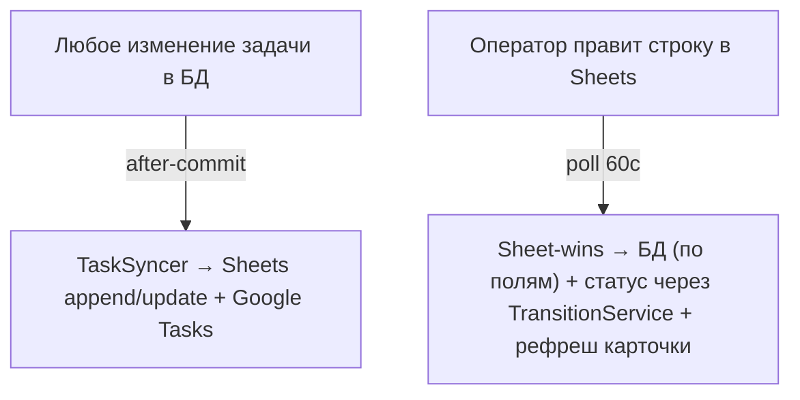

**Use Cases**

- **UC-PL-1.1 — Push в Sheets/Tasks.**
  *Given* хендлер изменил задачу, *When* транзакция закоммичена, *Then* `schedule_sync_task` после коммита пушит строку в Google Sheets (идемпотентно per task) и Google Tasks.
  - **FR-PL-001:** Каждое изменение задачи зеркалится в Google Sheets (Tasks-таб) и Google Tasks. *Trace: FR-CR-04-23/-26 · `app/sync/task_sync.py:111`, `sheets.py:122`, `tasks_api.py:33`.*
  - **NFR-PL-001:** Сбой синка не откатывает персист — статус фиксируется в `google_sheets_sync`/`google_tasks_sync` для последующего ретрая. *Trace: README «Operational notes».*

- **UC-PL-1.2 — Pull из Sheets (Sheet-wins).**
  *Given* оператор поправил строку в Sheets, *When* листенер поллит каждые `SHEET_POLL_INTERVAL_SECONDS`, *Then* БД обновляется по полям; имя владельца резолвится к uid (иначе сохраняется как текст); soft-delete оставляет строку со статусом «deleted».
  - **FR-PL-002:** Правки задач из Sheets подтягиваются в БД (Sheet-wins) с резолвом владельца. *Trace: FR-CR-05-11/-28 · `sheets.py:489`,`336`.*

- **UC-PL-1.3 — Team-таб (append-only push).**
  *Given* в БД появился новый член команды, *When* идёт push Team-таба, *Then* он дозаписывается в лист; удаления в БД **не** удаляют строки (неразрушающий append).
  - **FR-PL-003:** Реестр команды синкается двусторонне; push неразрушающий (append-only). *Trace: FR-CR-05-10/-27 · `app/sync/team_sheet.py:151`.*

## US-PL-2 — Артем может управлять задачами из Google Tasks, и это вернётся в систему

**Use Cases**

- **UC-PL-2.1 — Pull из Google Tasks.**
  *Given* задача изменена/завершена/удалена в Google Tasks UI, *When* pull-цикл каждые `GOOGLE_TASKS_PULL_INTERVAL_SECONDS`, *Then* БД синхронизируется (done+history; отсутствующие — soft-delete), TG-карточка обновляется; незаданные `notes`/`due` не затираются.
  - **FR-PL-004:** Двусторонняя синхронизация с Google Tasks (pull правок/завершений/удалений, без затирания пустых полей). *Trace: FR-CR-05-61/-64 · `app/sync/tasks_pull.py:99`,`217`,`245`.*

## US-TT-7 — Артем может редактировать задачи прямо в Google Sheets/Tasks, и это вернётся в систему
*(пользовательский взгляд на pull-механику US-PL-1.2 / US-PL-2; здесь — с фокусом на UX задачи)*

**Use Cases**

- **UC-TT-7.1 — Pull правок из Sheets.**
  *Given* оператор поправил строку задачи в Google Sheets, *When* листенер поллит каждые `SHEET_POLL_INTERVAL_SECONDS` (60), *Then* БД обновляется по полям, смена статуса проходит через `TransitionService`, TG-карточка перерисовывается (Sheet-wins).
  - **FR-TT-015:** Правки в Sheets подтягиваются в БД (Sheet-wins) и обновляют карточку; имена владельцев резолвятся к uid. *Trace: FR-CR-05-28/-11 · `app/sync/sheets.py:489`,`523`.*

- **UC-TT-7.2 — Pull правок из Google Tasks.**
  *Given* задача изменена/удалена/завершена в Google Tasks UI, *When* pull-цикл (60с), *Then* БД синхронизируется (done+history, soft-delete отсутствующих), карточка обновляется; незаданные поля (`notes`/`due`) не затираются.
  - **FR-TT-016:** Pull из Google Tasks применяет правки/удаления/завершения в БД, не затирая отсутствующие поля. *Trace: FR-CR-05-61/-64 · `app/sync/tasks_pull.py:99`,`217`.*

## US-PL-3 — Артем может вести директорию контрагентов из нескольких Google-таблиц

**Use Cases**

- **UC-PL-3.1 — Wipe-and-reload директории.**
  *Given* изменилась одна из таблиц-источников контрагентов, *When* поллинг каждые `COUNTERPARTIES_POLL_INTERVAL_SECONDS` (300), *Then* директория полностью перезаписывается (wipe + reload), дедуп по `name_normalised`; если все источники пусты/недоступны — wipe пропускается.
  - **FR-PL-005:** Директория контрагентов собирается из нескольких таблиц/вкладок по семантике wipe-and-reload. *Trace: FR-CR-05-124/-128/-132 · `app/sync/counterparties.py:225`,`243`.*

## US-PL-5 — Артем может хранить интеграционные токены безопасно

**Use Cases**

- **UC-PL-5.1 — Шифрование секретов.**
  *Given* система хранит Google OAuth-токены, *When* они сохраняются/читаются, *Then* access/refresh шифруются Fernet'ом ключом из `SECRETS_ENCRYPTION_KEY`; при отсутствии ключа система громко падает (не хранит plaintext).
  - **FR-PL-007:** OAuth-токены шифруются at-rest (Fernet); раздельные ключи `_service_account` (Sheets/Docs/Tasks) и `_calendar` (Calendar). *Trace: FR-CR-05-144/-175 · `app/sync/google_auth.py:29`,`67`.*
  - **NFR-PL-007:** Service Account (предпочтительно) обходит OAuth-танец; календарь читается строго read-only. *Trace: `factories.py:82`,`356`.*

## US-PL-6 — Артем может вести версионную (append-only) таблицу задач отдельным процессом

**Use Cases**

- **UC-PL-6.1 — Версионная sheet-синхронизация.**
  *Given* `SHEET_SYNC_ENABLED=true` (отдельный контейнер `ops/sheet_sync_runner.py`), *When* `run_sync` обрабатывает строки, *Then* по идентичности (DeveloperMetadata `gs_row_uuid`) пишутся create/update/restore/soft-delete в `gs_record_states`; неизменённый payload-hash — без новой записи; отсутствующая строка — soft-delete.
  - **FR-PL-008:** Изолированная версионная синхронизация ведёт append-only историю в `gs_*` (отдельная таблица, отдельный runner), не затрагивая основной task-sync. *Trace: FR-GS-019/020/021 · `app/sheet_sync/engine.py:69`,`132`,`144`.*
  - **NFR-PL-008:** Идемпотентность по payload-hash, атомарность в одном коммите; внутренний id никогда не является колонкой листа. *Trace: NFR-GS-008/009/015, PR-001..005.*

---

# Фича 7 — Reports 🟢🟡 LIVE+FLAG
*(происхождение: Task Tracker (дайджесты/watch-list) + Counterparty Briefs · `app/services/{digest,admin_digest,daily_plan,weekly_plan}.py`, `app/counterparty_briefs/*`)*

**Назначение.** Сводки и брифы для Артема. **Дайджесты задач:** утренние карточки + diff «что изменилось», вечерний статус-нарратив + план на завтра, воскресный недельный план, админский watch-list (in-progress/overdue/stale). **Брифы контрагентов:** для предстоящих встреч с внешней компанией — OpenAI deep-research по организации и её ключевым людям, по одному Google Doc на контрагента и один сгруппированный Slack DM.

**Backbone здесь.** Построитель дайджестов (`services/digest.py`, `admin_digest.py`, `daily_plan.py`, `weekly_plan.py`); резолв организаций/контрагентов для брифов (`counterparty_match.py`, `counterparty_briefs/lookup.py`). Доставка переиспользует кросс-канальный диспетчер из **Tasks**; брифы триггерятся календарным сигналом из **Calendar**; документы рендерятся в **Docs**; директория контрагентов ведётся в **Tables**.

**Активация.** Дайджесты — LIVE, часть гейтится непустыми `ADMIN_SLACK_USER_IDS`/`TELEGRAM_ADMIN_USER_IDS`. Брифы — `COUNTERPARTY_BRIEFS_ENABLED=true` + непустой `COUNTERPARTY_BRIEFS_SLACK_TARGET_CHANNEL_ID` (демон `app/main.py:179`).

**Ключевые флаги:** *брифы* — `COUNTERPARTY_BRIEFS_ENABLED` (false), `_SLACK_TARGET_CHANNEL_ID` (""), `_LOOKAHEAD_DAYS` (7), `_TICK_INTERVAL_SECONDS` (1800), `_LLM_BUDGET_USD` (2.0), `_CACHE_TTL_DAYS` (180), `_MAX_BENEFICIARIES` (5), `_RESEARCH_MODEL` (o4-mini-deep-research), `_EXTRACT_MODEL` (""→openai_model); *дайджесты* — `ADMIN_SLACK_USER_IDS`/`TELEGRAM_ADMIN_USER_IDS`, `stale_threshold_days` (2). Общие: `GOOGLE_CALENDAR_*`, `ZOOM_REQUIRED_EMAIL`.

## US-TT-2 — Артем может получать утренние карточки задач на сегодня и «что изменилось» (как админ)

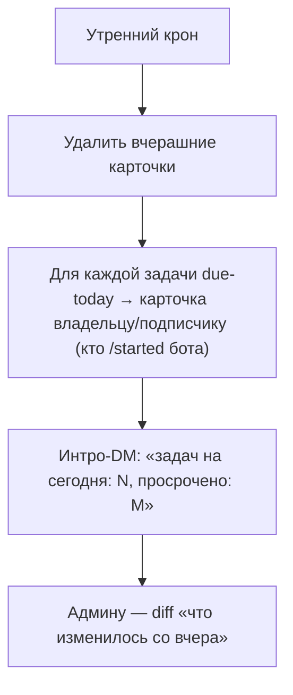

**Use Cases**

- **UC-TT-2.1 — Утренние карточки.**
  *Given* наступило утро, *When* крон запускается, *Then* удаляются вчерашние карточки и каждому владельцу/подписчику, кто запускал TG-бота, постится по карточке на задачу due-today.
  - **FR-TT-005:** Утренний прогон чистит вчерашние карточки и доставляет карточки задач на сегодня получателям, активировавшим бота. *Trace: FR-CR-05-84 · `app/telegram_bot/morning_cards.py:450`.*
  - **NFR-TT-005:** Идемпотентность per (user, day): повторный запуск — no-op; получатели без `/start` отсеиваются. *Trace: `morning_cards.py:464-561`.*

- **UC-TT-2.2 — Админский diff.**
  *Given* Артем — админ, *When* идёт утренний прогон, *Then* он получает DM с дифом «что изменилось по людям со вчера».
  - **FR-TT-006:** Админу доставляется утренний diff-дайджест по изменениям. *Trace: FR-CR-05-91 · `morning_cards.py`.*

## US-TT-3 — Артем может получать вечерний статус-отчёт и план на завтра

**Use Cases**

- **UC-TT-3.1 — Вечерний нарратив.**
  *Given* наступил вечер, *When* крон, *Then* приходит отчёт: Сделано-сегодня / В работе / To-do / Подписки, и вторым сообщением — план на завтра.
  - **FR-TT-007:** Вечерний прогон шлёт статус-нарратив (3+ секции) и отдельное сообщение «план на завтра». *Trace: FR-CR-05-04/-40/-83 · `app/telegram_bot/evening_status.py`.*
  - **NFR-TT-007:** Для админа план на завтра группируется по людям; добавляется watch-list (stale in_progress ≥`stale_threshold_days`, дефолт 2). *Trace: `app/services/admin_digest.py`.*

- **UC-TT-3.2 — Slack daily plan с подтверждением.**
  *Given* вечерний крон в Slack, *When* формируется план, *Then* персистятся `DailyPlanItem` + DM со Skip/Approve; если утром не было Approve — план уходит «как есть» с авто-approve в аудит.
  - **FR-TT-008:** Slack daily-plan персистит элементы и допускает опциональное подтверждение (auto-approve при отсутствии). *Trace: FR-CR-04-25 · `app/services/daily_plan.py:243`.*

## US-TT-4 — Артем может получать воскресный недельный план и принимать задачи на неделю

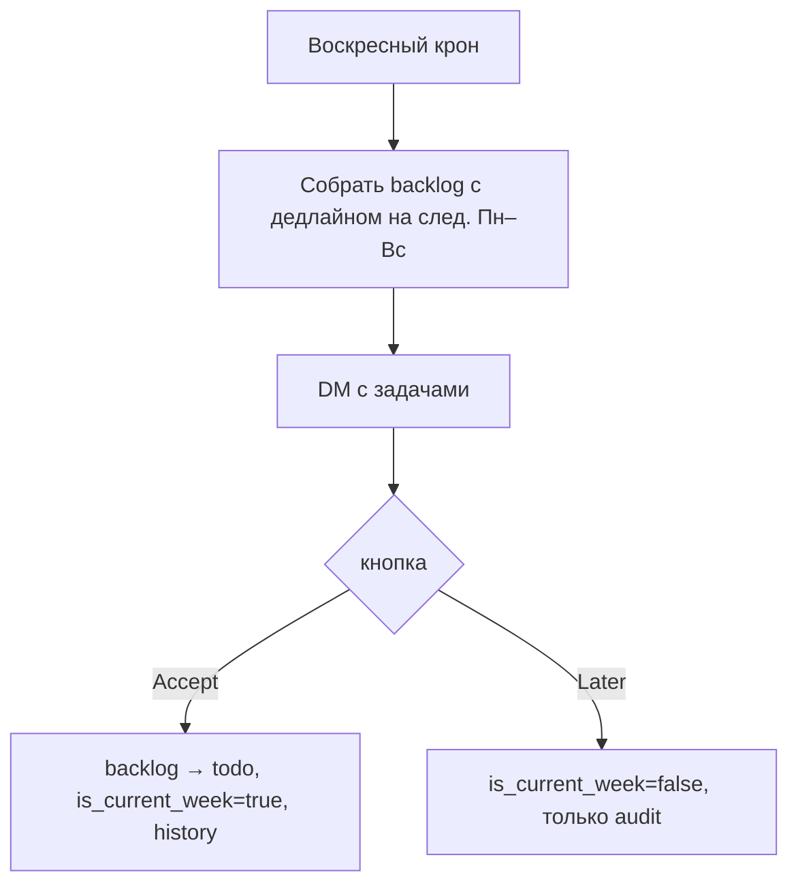

**Use Cases**

- **UC-TT-4.1 — Недельный план.**
  *Given* воскресенье, *When* крон, *Then* приходит DM с backlog-задачами, дедлайн которых на следующую неделю; «Accept» переводит в todo (текущая неделя), «Later» — только аудит, без смены статуса.
  - **FR-TT-009:** Воскресный недельный план предлагает задачи на неделю с действиями Accept/Later. *Trace: `app/services/weekly_plan.py`, `app/slack_bot/handlers/weekly_plan.py:27`.*

## US-TT-8 — Артем (как админ) может видеть watch-list по команде

**Use Cases**

- **UC-TT-8.1 — Админ-дайджесты.**
  *Given* `ADMIN_SLACK_USER_IDS` непуст, *When* идут утренний/вечерний прогоны, *Then* админ получает watch-list (in_progress + просрочки утром; завтрашние + застрявшие in_progress вечером).
  - **FR-TT-017:** Админу доставляются watch-list дайджесты (in-progress/overdue/stale). *Trace: `app/services/admin_digest.py:96`.*
  - **NFR-TT-017:** При пустом списке админов админ-дайджесты — no-op (ничего не шлётся). *Trace: `admin_digest.py:97`.*

## US-BR-1 — Артем может получить бриф на компанию-контрагента перед встречей

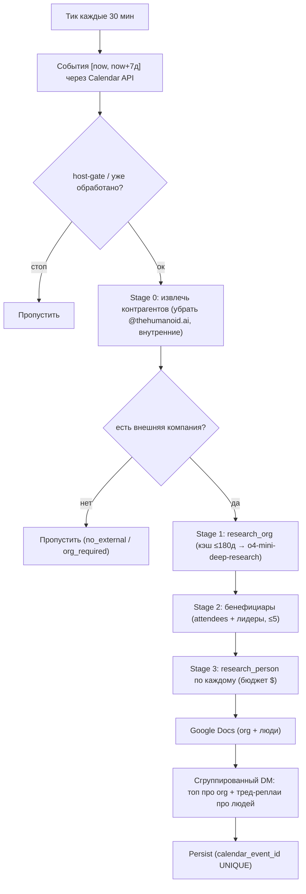

**Use Cases**

- **UC-BR-1.1 — Discovery и сборка брифа.**
  *Given* в окне [now, now+7д] есть событие с внешней компанией, *When* демон обрабатывает событие, *Then* он извлекает контрагентов, ресёрчит организацию (deep-research или кэш) и постит топ-сообщение DM: «Новая встреча DD/MM HH:MM: Title» + ссылка на Doc компании + однострочный gist (цитаты переписаны в кликабельные ссылки).
  - **FR-BR-001:** Для встречи с внешней компанией доставляется сгруппированный DM с брифом организации и ссылкой на Doc. *Trace: FR-CR-05-168 · `app/counterparty_briefs/runner.py:338`, `slack_format.py:286`.*
  - **NFR-BR-001:** Брифы приходят в окне дневного поллинга (за дни до встречи), а не по узкому lead-time. *Trace: `config.py:62`.*

- **UC-BR-1.2 — Гейт «нужна компания».**
  *Given* во встрече только внешние люди без организации (или всё внутреннее `@thehumanoid.ai`), *When* Stage 0, *Then* событие пропускается (`brief_org_required_skip` / `brief_no_external_counterparty`).
  - **FR-BR-002:** Бриф формируется только при наличии внешней организации; чисто внутренние/безорг-встречи пропускаются. *Trace: FR-CB-2.6 · `runner.py:365-375`.*

## US-BR-2 — Артем может получить досье на конкретных людей (бенефициаров) со встречи

**Use Cases**

- **UC-BR-2.1 — Бенефициары и их досье.**
  *Given* организация определена, *When* Stage 2–3, *Then* набор людей сидится из внешних участников + дополняется лидерами компании (LLM, ≤`MAX_BENEFICIARIES`=5), по каждому проводится `research_person` и пишется персональный Doc (фото, Personal Info, DD/MM Саммари, To-Do, позиции, инвестиции и т.д.); в DM каждый человек — тред-реплай.
  - **FR-BR-003:** По ключевым людям компании формируются персональные Docs и тред-реплаи (имя — роль + gist). *Trace: FR-CR-05-171 · `app/counterparty_briefs/extract.py:220`, `doc.py:415`, `slack_format.py:325`.*
  - **NFR-BR-003:** Люди с проваленным research помечаются и **исключаются** из треда перед отправкой. *Trace: FR-CB-4.8 · `runner.py:695-704`.*

## US-BR-3 — Артем может полагаться на кэш и бюджет (без лишних трат)

**Use Cases**

- **UC-BR-3.1 — TTL-кэш.**
  *Given* организацию ресёрчили в последние 180 дней, *When* обработка события, *Then* используется кэш (готовый Doc), новый research и трата не происходят.
  - **FR-BR-004:** Research контрагента кэшируется с TTL 180 дней (переиспользование Doc). *Trace: FR-CB-7.3 · `runner.py:387-417`, `research.py:133`.*

- **UC-BR-3.2 — Бюджет на событие.**
  *Given* суммарная оценка стоимости вот-вот превысит `LLM_BUDGET_USD`, *When* идёт ресёрч людей, *Then* оставшимся проставляется пометка `research_budget_exhausted`, но организация и уже обработанные люди всё равно постятся.
  - **FR-BR-005:** На событие действует денежный бюджет; при исчерпании остальные люди помечаются, а не роняют весь бриф. *Trace: FR-CB-4.5 · `runner.py:533-545`.*
  - **NFR-BR-005:** Идемпотентность по `calendar_event_id` UNIQUE + `counterparty_key` UNIQUE; повторный тик по обработанному событию пропускается; падение экспорта Doc не теряет персист брифа. *Trace: `runner.py:354`,`805`.*

---

## 10. Сводный реестр FR

| ID | Кратко | Фича | Trace (код) |
|----|--------|------|-------------|
| FR-CB-001 | Ответ на @mention/DM как тред-реплай | Memory | FR-CB2-3.1 |
| FR-CB-002 | Данные через n8n MCP (HTTP) + локальные Slack-tools | Memory | FR-CB2-3.31 |
| FR-CB-003 | DM → доп. черновик задачи | Memory→Tasks | FR-CR-05-192w |
| FR-CB-004 | Backoff + деградация MCP при ошибках | Memory | FR-CB2-3.x |
| FR-CB-005 | Контекст треда (N реплик) | Memory | FR-CB2-3.x |
| FR-CB-006 | Архив сообщений JSONL + PG | Memory | FR-CB2-2.1/2.2 |
| FR-CB-007 | Pending-очередь при сбое PG | Memory | FR-CB2-2.6 |
| FR-CB-008 | History-poller как backstop | Memory | FR-CB2-1.6 |
| FR-CB-009 | Allow-list пользователей | Memory | FR-CB2-3.36 |
| FR-NT-001 | Поллеры Zoom/Fireflies + единый пайплайн | Notes | FR-CR-05-116/-39 |
| FR-NT-002 | Host-email фильтр записей | Notes | FR-CR-05-143/-167 |
| FR-NT-003 | Гейты мусора (duration/sentinel/audio) | Notes | FR-CR-05-192t/-197/-198 |
| FR-NT-004 | STT с bias-промптом + чанкование | Notes | FR-CR-05-127/-115 |
| FR-NT-005 | Fallback при галлюцинации STT | Notes | FR-CR-05-148/-186 |
| FR-NT-006 | Короткое саммари в Slack (ссылка+To-Do) | Notes | FR-CR-05-137/-156/-119 |
| FR-NT-007 | Доставка в TG DM + webhook | Notes | FR-CR-05-160 |
| FR-NT-008 | Гейт присутствия оператора | Notes | — |
| FR-NT-009 | Экспорт полного отчёта в Google Doc | Docs | FR-CR-05-43 |
| FR-NT-010 | Участники из календаря/Zoom + канон | Notes | FR-CR-05-130/-169 |
| FR-NT-011 | Извлечение/резолв контрагентов | Notes | FR-CR-05-125/-129 |
| FR-NT-012 | Извлечение задач с владельцем/дедлайном | Tasks | FR-CR-05-185 |
| FR-NT-013 | Классификация направлений задач | Tasks | FR-CR-05-163 |
| FR-NT-014 | Калибровка названия по Calendar | Calendar | FR-CR-05-136/-154 |
| FR-TX-001 | LangGraph-пайплайн + мультизадача | Tasks | FR-CR-05-05/-108 |
| FR-TX-002 | Passive: soft_prompt ≥0.40, иначе silent | Tasks | FR-CR-04-* |
| FR-TX-003 | @mention → авто-создание | Tasks | — |
| FR-TX-004 | «Принять» → персист + DM владельцу | Tasks | FR-CR-04-32 |
| FR-TX-005 | Дозаполнение полей в треде | Tasks | — |
| FR-TX-006 | Резолв владельца/даты + дефолт 18:00 | Tasks | FR-CR-05-63/-112 |
| FR-TX-007 | TG realtime-поллинг read-only вью | Tasks | FR-CR-05-35/-36 |
| FR-TX-008 | Slack Socket-ingest | Tasks | FR-CR-05-162 |
| FR-TX-009 | Fast-path дедуп без LLM | Tasks | FR-CR-05-110/-111 |
| FR-TT-001 | Mark done + ресинк + уведомление | Tasks | FR-CR-05-37 |
| FR-TT-002 | Контроль прав на действия | Tasks | — |
| FR-TT-003 | Start штампует started_at | Tasks | FR-CR-05-69 |
| FR-TT-004 | Cancel-маршрутизация / soft-delete | Tasks | FR-CR-04-20 |
| FR-TT-005 | Утренние карточки + чистка вчерашних | Reports | FR-CR-05-84 |
| FR-TT-006 | Админский утренний diff | Reports | FR-CR-05-91 |
| FR-TT-007 | Вечерний статус + план на завтра | Reports | FR-CR-05-04/-40/-83 |
| FR-TT-008 | Slack daily-plan + approve | Reports | FR-CR-04-25 |
| FR-TT-009 | Недельный план (Accept/Later) | Reports | — |
| FR-TT-010 | Напоминания о дедлайнах | Tasks | FR-CR-05-49 |
| FR-TT-011 | Напоминания «пора начинать» | Tasks | FR-CR-05-03 |
| FR-TT-012 | Тред-напоминания | Tasks | — |
| FR-TT-013 | Подписки на задачу | Tasks | — |
| FR-TT-014 | Кросс-канальный fan-out статусов | Tasks | FR-CR-05-02 |
| FR-TT-015 | Pull правок из Sheets | Tables | FR-CR-05-28/-11 |
| FR-TT-016 | Pull правок из Google Tasks | Tables | FR-CR-05-61/-64 |
| FR-TT-017 | Админ watch-list дайджесты | Reports | — |
| FR-AG-001 | DM-повестка + задачи тред-реплаями | Calendar | FR-CR-05-165/-167 |
| FR-AG-002 | Идемпотентность повестки | Calendar | — |
| FR-AG-003 | Подавление пустой повестки | Calendar | — |
| FR-AG-004 | Гейт организатора+создателя | Calendar | FR-CR-05-167 |
| FR-AG-005 | Порог повторяемости (≥2) | Calendar | — |
| FR-AG-006 | Источник zoom_pattern (без Calendar) | Calendar | FR-CR-05-166 |
| FR-BR-001 | Сгруппированный DM-бриф компании | Reports | FR-CR-05-168 |
| FR-BR-002 | Гейт «нужна внешняя компания» | Reports | FR-CB-2.6 |
| FR-BR-003 | Персональные досье бенефициаров | Reports | FR-CR-05-171 |
| FR-BR-004 | TTL-кэш research (180д) | Reports | FR-CB-7.3 |
| FR-BR-005 | Денежный бюджет на событие | Reports | FR-CB-4.5 |
| FR-PL-001 | Push задач в Sheets+Tasks | Tables | FR-CR-04-23/-26 |
| FR-PL-002 | Pull из Sheets (Sheet-wins) | Tables | FR-CR-05-11/-28 |
| FR-PL-003 | Team-таб append-only sync | Tables | FR-CR-05-10/-27 |
| FR-PL-004 | Двусторонний Google Tasks sync | Tables | FR-CR-05-61/-64 |
| FR-PL-005 | Директория контрагентов wipe-reload | Tables | FR-CR-05-124/-132 |
| FR-PL-006 | Entity resolution (люди/орг) | Tasks | FR-CR-05-193b-e |
| FR-PL-007 | Fernet-шифрование токенов | Tables | FR-CR-05-144/-175 |
| FR-PL-008 | Версионная append-only sync (gs_*) | Tables | FR-GS-019/020/021 |

## 11. Сводный реестр NFR

| ID | Кратко | Фича |
|----|--------|------|
| NFR-CB-001 | Мгновенный плейсхолдер + фазы статуса | Memory |
| NFR-CB-002 | Параллельный сбор + вычистка MCP-авторизации из payload | Memory |
| NFR-CB-003 | Денежный потолок прогона ($, → max_tokens) | Memory |
| NFR-CB-004 | Гарантированная доставка ответа при rate-limit | Memory |
| NFR-CB-005 | Ограниченный объём контекста треда | Memory |
| NFR-CB-006 | Архивация best-effort, не блокирует responder | Memory |
| NFR-CB-007 | Дедуп Socket vs poller (60с) | Memory |
| NFR-CB-009 | Пустой allow-list = без ограничений | Memory |
| NFR-NT-001 | Идемпотентность пайплайна (флаги шагов) | Notes |
| NFR-NT-002 | Пустой host-email = принимать все | Notes |
| NFR-NT-003 | Потолок 20 попыток → permanent fail | Notes |
| NFR-NT-004 | Diarize: 1 воркер, auto-chunking | Notes |
| NFR-NT-005 | Bilingual restoration off by default | Notes |
| NFR-NT-006 | Компактизация нумерованных задач для Slack | Notes |
| NFR-NT-007 | Webhook fire-and-forget | Notes |
| NFR-NT-008 | Анти-спам: пустые саммари не публикуются | Notes |
| NFR-NT-009 | Doc anyone-with-link + встроенная ссылка | Docs |
| NFR-NT-011 | Пустая директория не ломает пайплайн | Notes |
| NFR-NT-012 | Fuzzy-дедуп задач до записи | Tasks |
| NFR-NT-014 | Calendar-match off by default | Calendar |
| NFR-TX-001 | Prefilter не гейтит LLM (страховка) | Tasks |
| NFR-TX-002 | no_action всегда молчит, inference логируется | Tasks |
| NFR-TX-003 | Meetings вне зоны охвата | Tasks |
| NFR-TX-005 | Пустое описание → черновик отбрасывается | Tasks |
| NFR-TX-006 | due ≤7д → todo, иначе backlog | Tasks |
| NFR-TX-007 | TG-вью строго read-only | Tasks |
| NFR-TX-009 | LLM-дедуп по последним 10 (если fast-path off) | Tasks |
| NFR-TT-001 | Идемпотентность действий по audit_logs | Tasks |
| NFR-TT-002 | Запрещённый переход → no-op + warning | Tasks |
| NFR-TT-005 | Идемпотентность утреннего прогона per (user,day) | Reports |
| NFR-TT-007 | Админский план группируется по людям + stale | Reports |
| NFR-TT-014 | TG edit-fanout подавлен (анти-шум) | Tasks |
| NFR-TT-017 | Нет админов → дайджесты no-op | Reports |
| NFR-AG-001 | Сборка повестки без LLM (compose_lite) | Calendar |
| NFR-AG-002 | Идемпотентность переживает рестарт | Calendar |
| NFR-AG-004 | Resource-attendees вычищаются, email→имя | Calendar |
| NFR-AG-006 | Отказоустойчивость демона + Apps Script fallback | Calendar |
| NFR-BR-001 | Окно дневного поллинга (дни, не минуты) | Reports |
| NFR-BR-003 | Проваленный research исключается из треда | Reports |
| NFR-BR-005 | Идемпотентность по event/counterparty ключам | Reports |
| NFR-PL-001 | Сбой синка не откатывает персист | Tables |
| NFR-PL-006 | Кэш entity-resolution (TTL, hits) | Tasks |
| NFR-PL-007 | SA обходит OAuth; Calendar read-only | Tables |
| NFR-PL-008 | Идемпотентность по payload-hash, атомарность | Tables |

---

## 12. Traceability и точки кода (по 7 фичам)

| Фича | Главные модули | «Родной» ID-неймспейс |
|------|----------------|------------------------|
| Memory | `app/ceo_brain/*` (responder, archive, dispatcher, history_poller, mcp_client) | `FR-CB2-200`, `FR-CB2-{1,2,3,4,5}.x` |
| Tasks | `app/intent/*`, `app/orchestrator/*`, `app/context/retriever.py`, `app/slack_ingest/*`, `app/telegram_ingest/*`, `app/telegram_bot/*`, `app/slack_bot/handlers/{task_actions,events}.py`, `app/services/{transitions,subscriber_updates,subscriptions,task_dedup,task_direction,entity_matcher,entity_apply,team_member_canonical,entity_resolution_cache}.py` | `FR-CR-04-*`, `FR-CR-05-05/-35/-108..-112/-185/-193b-e`, `FR-CR-04-20..-32` |
| Calendar | `app/agenda/*`, `app/services/{calendar_match,calendar_attendees}.py`, шаг `_step_match_calendar_title` в `app/fireflies/pipeline.py` | `FR-CR-05-165/-166/-167/-136/-144/-154/-192{u,aa,ab,ac}` |
| Notes | `app/zoom/*`, `app/fireflies/*`, `app/services/{transcription,slack_mirror,meeting_webhook,zoom_participants,summary_canonicalize,bilingual_restorer}.py`, `ops/zoom_fireflies_runner.py` | `FR-CR-05-39/-116` + многие `-1xx` |
| Docs | `app/sync/docs.py` (+ doc-билдеры в `app/agenda/*` и `app/counterparty_briefs/doc.py`) | `FR-CR-05-43/-55/-56/-59` |
| Tables | `app/sync/*`, `app/sheet_sync/*`, `app/services/{team_*,counterparty_*}.py`, `app/models/*`, `alembic/versions/*`, `app/sync/google_auth.py` | `FR-CR-05-10/-11/-27/-28/-61/-64/-124/-144`, `FR-GS-*` |
| Reports | `app/services/{digest,admin_digest,daily_plan,weekly_plan,thread_reminders}.py`, `app/telegram_bot/{morning_cards,evening_status}.py`, `app/slack_bot/handlers/{daily_plan,weekly_plan}.py`, `app/counterparty_briefs/*` | `FR-CR-05-02/-03/-40/-49/-83/-84/-91/-168/-171` |

---

## 13. Известные расхождения «спека vs код» (AS-IS honesty)

Эти пункты включены, чтобы PRD честно отражал реальность, а не старые спеки. **В работающие требования выше они НЕ включены.** Сгруппированы по новым фичам.

**Memory** *(CEO Brain Bot)*
- Архивная правка/удаление сообщений (`FR-CB2-2.4/2.5`) — функции есть в `pg_sink`, но **рантайм-вызывателя нет**; subtyped-события не обрабатываются.
- Ops-CLI экспорта/бэкфилла, метрики Prometheus, archive-lag health (`FR-CB2-6.x`) — **не реализованы**.
- Основной ответ — **не стриминговый** (`messages.create`), хотя `FR-CB2-3.8`/`NFR-P.3` описывали стриминг; стрим остался только в recovery-пути.
- Блок «Sources» заменён на инлайновые гиперссылки.
- Потолок стоимости: спека `$5`, дефолт в коде `$1.0`.

**Notes** *(Note Taker)*
- Дефолт батча поллинга: спека 50, код — 20 (Fireflies) / 10 (Zoom).
- Per-participant Slack DM (член команды получает саммари по `slack_user_id`) — **не реализовано**; доставка = TG-админам + один Slack-канал.
- Entity-resolution-v2 (`_step_extract_via_reasoning`, `FR-CR-05-193g`) — **заглушка**, несмотря на дефолт флага `true`; работают legacy-шаги.
- GMeet / ручная загрузка / голосовой ввод — **spec-only**.
- DB-вью `meeting_summaries_published` — spec/DDL-only.

**Tasks** *(Task Extractor + Task Tracker lifecycle)*
- Спека `FR-TX-*` описывает Telegram-Bot-API (`getUpdates` / `/setup_chat` / favorites) — **код так не работает**: ingest идёт через read-only Supabase-вью + Slack Socket Mode.
- README/спека «high confidence → draft card» — в коде понижено до `soft_prompt`; **пассив никогда не создаёт задачу сам** (только `@mention`).
- Intent-энум: схема знает 5 интентов, граф эмитит только `create_task`/`no_action`.
- Лимит заголовка: 80 (код), не 60 (спека); fuzzy-дедуп 0.70, не 0.85.
- Докстринги промптов упоминают gpt-4o/4o-mini, дефолты конфига — gpt-5.5.
- Кнопок **Delegate/Snooze/Refresh нет** (вопреки `FR-TT-7.1/7.4`, `US-TT-2`).
- `WorkloadEstimator.propose_due_date` реализован, но **не подключён** (мёртвый код); флаги `WORKLOAD_*` ни на что не влияют.
- TG-рассылка по **редактированию** задачи намеренно подавлена.

**Calendar** *(Agenda)*
- Прод-сборка повестки **без LLM** (`_compose_lite`); LLM-категория (`FR-MA-4.x`, `NFR-MA-P.2`) — legacy/spec-only; `AGENDA_COMPOSE_MODEL` игнорируется.
- Slack-формат в спеке устарел (эмодзи-секции 📋/✅/🎯, чекбоксы) — код шлёт другой формат, задачи тред-реплаями.
- `min_prior_meetings`: спека 1, код — 2.

**Reports** *(Task Tracker digests + Briefs)*
- Отдельного «стратегического дайджеста с дедупом» как модуля **нет** — классификация направлений происходит на ingest'е (Tasks), дедуп — на создании.
- Спека помечает дайджесты/напоминания/подписки/Google-Tasks-sync как TODO — **в коде они уже реализованы** (под `FR-CR-05-*`).
- Админский reject ревью-карточки делает **hard delete** (в отличие от user-Delete = soft-delete).
- Брифы: бюджет код `$2.0`, спека `$5.0`; lookahead код 7 дней, спека 14.
- Deep-research таймаут в коде 30 мин против `NFR-CB-P.2 ≤20с`.
- Cache-aware обёртка `research_org_with_cache` обойдена в демоне (`if False`); кэш обрабатывается инлайн.

**Tables** *(Platform)*
- Версионная `sheet_sync` (`FR-GS-*`) полностью реализована и тестируема, но **не подключена к live-листенеру** — только через `ops/sheet_sync_runner.py` под `SHEET_SYNC_ENABLED` (default off).
- Комментарий конфига про «type в колонке A» устарел — `type` вынесен в сателлит `counterparty_attrs`.
- Google Tasks pull для удалённой задачи пишет history `to_status=done` (семантика «cancelled», но в enum хранится `done`).

---

## 14. Глоссарий

| Термин | Значение |
|--------|----------|
| **Источник истины** | Postgres-БД. Slack/Telegram — ввод + UI подтверждения; Google Sheets — операционный вид; Google Tasks — поверхность исполнения. |
| **source_kind** | Дискриминатор происхождения задачи: `slack` / `telegram` / `fireflies` / `zoom`. |
| **soft-delete** | Удаление через `deleted_at` с сохранением последнего статуса (не отдельный статус). |
| **MCP** | Model Context Protocol — коннекторы к данным (n8n) для фичи Memory, вызываются по HTTP JSON-RPC. |
| **Подписчик (subscriber)** | Не-владелец, подписанный на задачу; получает однострочные апдейты статуса в свой канал. |
| **organizer-gate** | Фильтр Calendar/Reports: встреча учитывается, только если организатор/создатель — оператор (`ZOOM_REQUIRED_EMAIL`). |
| **beneficiary** | Конкретный человек со стороны контрагента, по которому формируется персональный бриф. |
| **canonical name** | Единое имя человека/организации после entity-resolution, используемое во всех каналах. |
| **backbone** | Сквозной модуль (ingest, entity-resolution, доставка, token-vault), прикреплённый к фиче-«дому» и переиспользуемый соседними фичами (см. §2.3). |

---

*Документ AS-IS: реверс-инжиниринг из кода `manager` @ `97ae418`. Все требования прослеживаются до строк кода (см. `Trace`). v1.1 переразбит на 7 фич по типу объекта — соответствие старой структуре в §2.2, распределение backbone в §2.3. Roadmap-разделы (should/could-have) из исходных спек не включены — здесь только то, что реально работает.*
