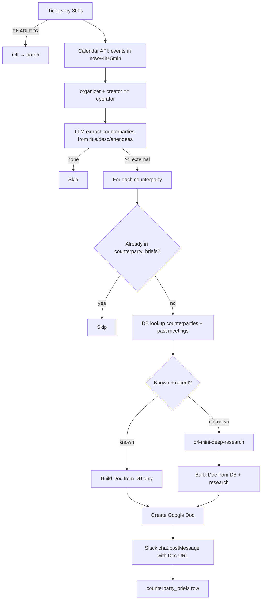
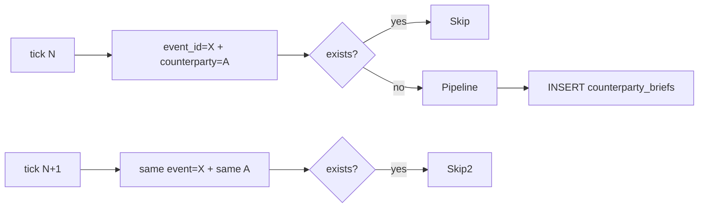

# SPEC v0.2 — Counterparty Briefs (FR-CR-05-168)

> **Версия:** v0.2, 2026-05-14 (revised)
> **Scope:** новая фича — как только в Calendar появляется встреча с новым контрагентом, бот автоматически собирает справки (отдельно по компании + отдельно по каждому бенефициару) и кладёт ссылки в Slack DM
> **Источники данных:** Google Calendar API (предстоящие встречи), таблица `counterparties` + `counterparty_attributes` (FR-CR-05-124), Zoom/Fireflies summary прошлых встреч, OpenAI `o4-mini-deep-research` (web research для unknown)
> **Зависит от:** FR-CR-05-124 (counterparties hub + satellite), FR-CR-05-127 (whisper bias names), FR-CR-05-144 / FR-CR-05-152 (Calendar OAuth), FR-CR-05-165 / FR-CR-05-167 (Agenda runner — переиспользуется как pattern)

---

## v0.2.1 changes vs v0.1 (operator-pinned 2026-05-14)

1. **Event-trigger, не lead-time.** Brief создаётся **как только в Calendar появляется встреча** с новым контрагентом. Tick каждые 30 минут сканирует окно `[now, now + LOOKAHEAD_DAYS]` (default **7 — operator-pinned**).
2. **Раздельные briefs.** Один Doc на компанию + по одному Doc'у на каждого ключевого бенефициара. В Slack — **один** DM на event со ссылками на все Doc'и.
3. **Двухступенчатый research.** Сначала deep-research **компании** → LLM извлекает бенефициаров (CEO / CIO / Board / decision makers + attendees из event) → по каждому бенефициару отдельный deep-research.
4. **Per-counterparty cache.** Doc на конкретного counterparty переиспользуется (TTL **180 дней — operator-pinned «полгода»**), чтобы повторные встречи с одной компанией / человеком не вызывали новый research. После 180 дней — auto-refresh при следующей встрече.
5. **Per-event budget $2 USD** (operator-pinned). Tally: org research (~$0.5-1) + до 5 person research'ей (~$0.5-1 каждый). Если бюджет исчерпан раньше — оставшиеся бенефициары рендерятся как «N/A — research budget exhausted».
6. **Slack target** = тот же `D0ASY5QF6UX` что у Agenda runner (operator's DM).
7. Idempotency по `(event_id)` (event обработан) + по `counterparty_key` (Doc создан) — две UNIQUE'и.

---

## 1. Mission

Перед встречей с внешним контрагентом (Counterparty) автоматически собрать **справку**:

1. **Personal Information** — имя, роль, компания, локация, LinkedIn, email/phone
2. **Recent meetings recap** — наш summary последних 1-3 встреч с этим контрагентом (если были)
3. **To-Do** — open tasks привязанные к контрагенту (если есть)
4. **Profile Overview** — паспорт-резюме на ~150-250 слов
5. **Current Position / Previous Positions** — карьерная история
6. **Investment Highlights / Investments / Exits** (если investor/fund)
7. **Achievements / Honors / Education / Publications**
8. **Skills / Languages**

Доставить как **Google Doc** (с фото вверху) + **Slack DM** с гиперссылкой на Doc и краткой шапкой.

Зачем — оператор готовится к встрече с контактом которого видит впервые / редко: одна ссылка → один Doc → всё что нужно. Сейчас это 5-15 минут ручного поиска в LinkedIn / PitchBook / прошлых заметках.

---

## 2. Клиент и пользователь

### 2.1 Основной клиент

CEO / основатель humanoid.ai (Артём). Также Investor Relations команда (Ирина, Алина) — могут получать briefs для своих встреч если organizer = Артём (FR-CR-05-167 organizer gate).

### 2.2 Роли пользователей

| Роль | Что делает |
|---|---|
| Оператор (CEO) | Получает Slack DM с brief за N часов до встречи, открывает Doc, читает 2-3 минуты |
| Бот | Calendar tick → extract counterparty → lookup / research → build Doc → DM |
| Tawazun-like investor | Объект brief'a (не пользователь) |
| Компания (например Schaeffler, Bracket Capital) | Тоже может быть объектом brief'a (org-level, не person) |

### 2.3 Контекст использования

- Каждые N минут (`COUNTERPARTY_BRIEFS_TICK_INTERVAL_SECONDS`, default 300) бот сканирует Calendar на встречи в окне `[now + LEAD_HOURS - WINDOW, now + LEAD_HOURS + WINDOW]`
- LEAD_HOURS default = 4 (отправить за 4 часа до встречи — у оператора есть время прочитать утром)
- WINDOW = 5 min — runner-tick зашёл в окно, но не дубликат

### 2.4 Частота использования

- Текущая база: 5-12 внешних встреч в день (Wellness, Genia Xasis, Aramco, Nomura, Mitsui, и т.п.)
- Ожидаемый объём DM: 5-12 briefs / день
- Стоимость per brief: ~$0.5-2 USD (o4-mini-deep-research call + Google Doc create)

### 2.5 Уровень боли

Сейчас: до встречи 5-15 минут на LinkedIn + поиск в memory / Drive / notes. Особенно болезненно для intro calls с инвесторами — нужно знать кто такие, что инвестируют, недавняя активность.

---

## 3. Проблема

### 3.1 Какую решаем

«Иду на встречу с человеком которого первый раз вижу — теряю первые 10 минут на icebreaker / профайлинг».

### 3.2 Почему важна

- 5-12 встреч в день × 5-15 минут подготовки = 25-180 минут / день
- Качество встречи зависит от «знал ли я кто это» (помнит ли его недавний deal, его сектор, его связи)
- Часть встреч пропускаются вообще (нет времени на pre-meeting research)

### 3.3 Как решает сейчас

- LinkedIn профиль (если найден)
- PitchBook / Crunchbase (если investor)
- Память + поиск в личных заметках
- Прошлые Fireflies/Zoom summary в Drive (если уже встречались)

### 3.4 Что не работает

- Каждая встреча — ручной поиск. 5 источников × 5-12 встреч в день = устаёшь к обеду.
- Информация фрагментирована.
- История «о чём договорились в прошлый раз» лежит в Google Docs прошлых summary — нужно вспомнить как назывался файл.

### 3.5 Последствия

- 20-180 минут / день на pre-meeting prep
- Иногда встреча начинается с «представьтесь пожалуйста ещё раз»
- Подписка на PitchBook / etc.

---

## 4. Решение

### 4.1 Что предлагает продукт

Slack DM за 4 часа до встречи:

```
*<doc-url|14/05 - Brief: Samer Nawaf Zawaideh (SDF)>*

CIO в Strategic Development Fund (UAE sovereign wealth fund).
Двигаемся к JV в UAE, готовы прислать пакет.

Recent: 08/04 встреча — обсудили JV, ждут наше предложение
Open: отправить JV proposal + materials + data room

Подробно: <google-doc-url>
```

И **Google Doc** с полной справкой в operator-pinned формате (см. §6.2).

### 4.2 Как решает

1. **Discovery** — Calendar API tick каждые 30 мин → events в окне `[now, now + LOOKAHEAD_DAYS]` (default 14)
2. **Per-event idempotency** — если `event_id` уже в `counterparty_briefs_events` — skip (мы его уже обработали)
3. **Filter** — organizer + creator == operator (FR-CR-05-167)
4. **Counterparty extraction** — LLM-извлечение **компании (org)** + initial person'ов из event title / description / attendees. Например `SDF <> Humanoid | Intro call` + attendee `samer.zawaideh@sdf.ae` → org=Strategic Development Fund, initial_persons=[Samer Nawaf Zawaideh].
5. **Org Doc** (always — per event):
   - **DB lookup** в `counterparties` (FR-CR-05-124) — может уже знаем компанию
   - **Cache check** — есть ли свежий `counterparty_briefs` row на этот org_key (TTL ≤ 14 дней)? Если есть — re-use existing Doc URL, skip research
   - **Если нет cache + budget OK** → `o4-mini-deep-research` на org: who are they / sectors / leadership / portfolio / news. Output JSON-schema (`OrgResearch`).
   - **Build org Doc** через `DocsExportService` (FR-CR-05-43): Doc «<DD/MM> - Brief: Strategic Development Fund (org)» по template §6.2-org
   - **Persist** `counterparty_briefs` row с `kind='org'`
6. **Beneficiary extraction** (LLM call, входной материал = `OrgResearch.leadership` + initial_persons из event):
   - LLM выбирает ≤ 5 ключевых бенефициаров: CEO, CIO, CFO, Board members, founders, существующие контакты, attendees из event
   - Output: list of `{person_name, person_role, evidence}` — где `evidence` это «почему мы считаем что это релевантный человек»
   - Дедуп по name normalised
7. **Person Docs** (по одному на каждого бенефициара):
   - DB lookup `counterparty_mentions` + cache check (как для org)
   - Если нет cache + budget OK → `o4-mini-deep-research` на person: career, current role, links, photo, deals
   - Build person Doc по template §6.2-person (operator-pinned формат с фото вверху)
   - Persist `counterparty_briefs` row с `kind='person'`
8. **Single Slack DM** — ОДИН message в `COUNTERPARTY_BRIEFS_SLACK_TARGET_CHANNEL_ID` со ссылками на org Doc + все person Docs:

   ```
   *Новая встреча 14/05 16:00: SDF <> Humanoid | Intro call*

   Справки готовы:
   • <org-doc-url|🏢 Strategic Development Fund>
   • <person-doc-url|👤 Samer Nawaf Zawaideh — CIO>
   • <person-doc-url|👤 Khaled Al Hashemi — CEO>
   ```

9. **Persist** `counterparty_briefs_events` row с `event_id` (UNIQUE) — чтобы не повторить tick

### 4.3 Почему лучше альтернатив

| Альтернатива | Минус |
|---|---|
| PitchBook subscription | $$, не покрывает non-PE контактов |
| Granola / Read.ai pre-meeting briefs | Не видит наши tasks из БД, не видит наши прошлые summary |
| ChatGPT search вручную | 5+ минут per meeting, ничего не cached |
| **Наш агент** | Видит и Calendar, и `counterparties`, и наши прошлые встречи, и web — единый Doc, авто-доставка |

### 4.4 Ключевая ценность

«За 4 часа до встречи приходит ссылка на справку — открыл, прочитал 2 минуты, в курсе».

### 4.5 Ограничения

- Только встречи где `organizer.email + creator.email == operator_email` (FR-CR-05-167)
- Только person/org с распознаваемым именем в title или description
- o4-mini-deep-research имеет cost — лимит per-brief budget (default 2 USD); если LLM запрашивает больше — sкипуем web research, ограничиваемся БД
- LinkedIn profile photo — нельзя скачивать через scraping (TOS); используем профиль URL и просим Google Docs `insertInlineImage` с public URL. Если URL приватен (LinkedIn auth-required) — фото пропускается, остальная часть остаётся

---

## 5. Продуктовые метрики

### 5.1 North Star Metric

**Время от «открыл Slack» до «начал встречу зная контекст»** ≤ 60 секунд (vs. 5-15 минут сейчас).

### 5.2 Метрики качества

- ≥ 90% briefs приходят за 3-5 часов до start
- ≥ 80% briefs содержат **хотя бы один из**: LinkedIn URL, current role, current company
- ≥ 50% briefs содержат recap прошлой встречи (когда встреча — повторная)
- 0 дубликатов на один (event_id, counterparty_key) (idempotency invariant)

### 5.3 Метрики эффективности

- LLM cost per brief ≤ $2 USD (соответствует budget cap)
- Doc creation ≤ 10 сек
- Per-tick wall-clock ≤ 30 сек
- 90-th percentile total time (discovery → DM) ≤ 60 сек

### 5.4 Метрики использования

- # briefs отправлено / день
- % briefs с photo
- % briefs c past-meeting recap
- Click-through rate в Google Doc (если измеряемо)

### 5.5 Метрики ошибок

- `brief_llm_call_failed` — # / день
- `brief_doc_export_failed` — # / день
- `brief_slack_post_failed` — # / день
- `brief_counterparty_not_extractable` — # / день (когда title не содержит имени)

---

## 6. Фичи

### 6.1 MVP (must-have) — v0.1

| ID | Фича | Описание |
|---|---|---|
| F-CB-01 | Calendar tick | Поллинг каждые `BRIEF_TICK_INTERVAL_SECONDS` (default 300) |
| F-CB-02 | Counterparty extraction | LLM-extract person / org из title + description + attendees |
| F-CB-03 | DB lookup | Match с `counterparties` + `counterparty_attributes` + past `zoom_recordings`/`meeting_recordings` |
| F-CB-04 | Deep research | OpenAI `o4-mini-deep-research` для unknown — fills profile fields |
| F-CB-05 | Slack DM | `chat.postMessage` с короткой шапкой + Doc URL |
| F-CB-06 | Google Doc | Создать Doc в формате §6.2, embed photo если есть public URL |
| F-CB-07 | Idempotency | `counterparty_briefs` UNIQUE на `(calendar_event_id, counterparty_key)` |
| F-CB-08 | Feature flag | `COUNTERPARTY_BRIEFS_ENABLED=false` default — runner no-op |
| F-CB-09 | Cost cap | LLM budget per brief ≤ `COUNTERPARTY_BRIEFS_LLM_BUDGET_USD` (default 2) |
| F-CB-10 | Organizer gate | FR-CR-05-167 — только встречи где operator = organizer AND creator |

### 6.2 Doc template (operator-pinned)

```markdown
<photo-url>

# <Full Name> - <Role> at <Company>

## Personal Information
Name: <Full Name>
Role: <Role>
Location: <City, Country>
LinkedIn: <linkedin-url>
Company Website: <site-url>
<Org Name> Overview
Contacts:
  Email: <email1> / <email2>
  Tel.: <phone or n/a>

## DD/MM Саммари
<our recap of the most recent meeting with this counterparty>

## To-Do
- <open task 1>
- <open task 2>

## Profile Overview
<150-250 word free-text bio>

## Current Position

Role: <role>
Company: <company>
Duration: <from> – <to>
Focus: <focus>

[+ Other current roles if any]

## Previous Positions

Role: <role>
Company: <company>
Duration: <from> – <to>
Focus: <focus>

[repeat for each]

## Investment Highlights

Entity Types: <e.g. Sovereign Wealth Fund>
Investor Type: <e.g. SWF>
Investor Status: Active / Inactive
Total Investments: N or N/A
Active Portfolio: N or N/A
Exits: N or N/A
Median Round Amount: $<N>M or N/A
Median Valuation: $<N>M or N/A
Firm-wide Investments: N/A
Investment Preferences: <sectors>

## Investments

| Company | Deal Date | Deal Type | Deal Size | Company Stage | Industry |
|---|---|---|---|---|---|
| <co> | <date> | <type> | $<n>M | <stage> | <industry> |

## Exits

<text or N/A>

## Achievements

- <bullet>
- <bullet>

## Honors & Awards

<bullet list>

## Education

<institution> — <degree>, <years>

## Publications

<list or N/A>

## Skills

<comma-separated list>

## Languages

<lang> — <level>
```

### 6.3 Should-have (Q2-2026)

| ID | Фича | Описание |
|---|---|---|
| F-CB-20 | Re-use cached research | Один и тот же counterparty в неделю не вызывает deep-research дважды; cache TTL = 14 дней |
| F-CB-21 | Multi-counterparty per meeting | Если в встрече 2 внешних контрагента — два отдельных brief'a (или один объединённый Doc — operator pinned) |
| F-CB-22 | Internal company brief | Когда встреча с org (без конкретного physical person) — собирать org-only brief |
| F-CB-23 | Photo upload to Drive | Если LinkedIn picture URL private, использовать UI-based scraping в headless browser (TOS-graceful — только если operator manually triggers) |

### 6.4 Could-have (Q3-Q4 2026)

- Crunchbase / Pitchbook API integration (paid)
- News crawl (последние 30 дней статей о компании)
- Mutual connections via LinkedIn API (если есть paid LinkedIn API)
- Brief-on-demand через `/brief <name>` Slack slash-command

---

## 7. User Stories

### US-CB-1 — За 4 часа до Tawazun call

**Given** оператор настроил `COUNTERPARTY_BRIEFS_ENABLED=true`, и есть Calendar event «SDF <> Humanoid | Intro call» через 4ч 5мин
**And** counterparty «Samer Nawaf Zawaideh» нет в БД
**When** runner делает tick в `now + 4h` (window 5min)
**Then** event попадает в candidates
**And** LLM extract → person=Samer Nawaf Zawaideh, org=Strategic Development Fund
**And** `o4-mini-deep-research` собирает профиль из web
**And** Google Doc «14/05 - Brief: Samer Nawaf Zawaideh (SDF)» создан
**And** Slack DM с шапкой + Doc-link приходит в `D0ASY5QF6UX`
**And** в `counterparty_briefs` row с `calendar_event_id` + `counterparty_key='samer-nawaf-zawaideh'`

### US-CB-2 — Повторный контакт (CB-2)

**Given** counterparty «Genia Xasis» уже была — есть запись в `counterparties` + 3 прошлые встречи в `zoom_recordings`
**And** event «Genia Xasis Weekly fundraising sync» через 4 часа
**When** runner тикает
**Then** ИЗ БД pull: Genia profile + last 1-3 recap + open tasks
**And** `o4-mini-deep-research` НЕ вызывается (counterparty known + recently updated)
**And** Doc создан с секцией «13/05 Саммари: …» из прошлой встречи

### US-CB-3 — Multi-counterparty встреча

**Given** event «Genia & Nick — fundraising debrief» (двое внешних в title)
**When** runner тикает
**Then** **два** brief'a — один на Genia, один на Nick (или один объединённый Doc — flag)
**And** в DM один short message со ссылками на оба Doc'a

### US-CB-4 — Internal-only meeting → no brief

**Given** event «Letучка Артем-Алина» (оба internal)
**When** runner тикает
**Then** LLM extract вернул 0 external counterparties → skip
**And** в БД ничего не записывается, никакой DM

### US-CB-5 — Cost cap exceeded

**Given** `COUNTERPARTY_BRIEFS_LLM_BUDGET_USD=1`, deep-research для unknown counterparty uses $1.50
**When** runner тикает
**Then** `o4-mini-deep-research` НЕ вызывается (estimated cost > budget)
**And** Doc создаётся **без** «Profile Overview / Current Position / etc.» — только то что в БД
**And** `brief_research_skipped_over_budget` log entry

### US-CB-6 — Feature flag OFF

**Given** `COUNTERPARTY_BRIEFS_ENABLED=false` (default)
**Then** runner thread НЕ стартует
**And** в логе `brief_runner_disabled_by_env`

---

## 8. User Flow

### 8.1 Main flow



### 8.2 Idempotency flow



---

## 9. BDD Use Cases

### UC-CB-01 — Unknown investor, intro call

```gherkin
Feature: Pre-meeting brief for an investor
  As an operator
  I want a Google Doc + Slack DM 4 hours before each external meeting
  So I walk into the call already knowing who I'm meeting with

Background:
  Given COUNTERPARTY_BRIEFS_ENABLED is true
  And COUNTERPARTY_BRIEFS_SLACK_TARGET_CHANNEL_ID is "D0ASY5QF6UX"
  And COUNTERPARTY_BRIEFS_LEAD_HOURS is 4
  And operator_email is "1@thehumanoid.ai"

Scenario: Unknown investor — full deep-research path
  Given a Calendar event "SDF <> Humanoid | Intro call" starting in 4 hours
  And the event organizer.email and creator.email are both "1@thehumanoid.ai"
  And no row in counterparties for "Strategic Development Fund"
  And no row in counterparty_mentions for "Samer Nawaf Zawaideh"
  When the brief runner tick executes
  Then it should call OpenAI extract once with title + description
  And extract should return person="Samer Nawaf Zawaideh", org="Strategic Development Fund"
  And it should call o4-mini-deep-research exactly once with the person+org query
  And it should call Google Docs once to create the Doc
  And it should call Slack chat.postMessage once with channel="D0ASY5QF6UX"
  And the Slack text should start with "*<doc-url|14/05 - Brief:"
  And a counterparty_briefs row should exist with calendar_event_id and counterparty_key

Scenario: Repeated counterparty within TTL — no deep-research call
  Given a counterparty_briefs row already exists for this counterparty,
        posted 3 days ago
  When the runner tick fires for a NEW Calendar event mentioning the same counterparty
  Then o4-mini-deep-research is NOT called (cache hit within TTL)
  And the Doc is rebuilt from the cached research_payload JSON
```

### UC-CB-02 — Known counterparty (Genia)

```gherkin
Scenario: Counterparty in DB + past zoom recordings
  Given counterparties row "Genia Xasis" exists with name_normalised="genia xasis"
  And zoom_recordings has 3 rows where title contains "Genia Xasis"
  And tasks has 2 open tasks with source_kind='zoom' linked to those recordings
  When the runner tick fires for "Genia Xasis weekly fundraising sync"
  Then no o4-mini-deep-research call is made
  And the Doc body contains:
    | section | content |
    | "DD/MM Саммари" | summary text from the most recent zoom_recordings row |
    | "To-Do" | both open tasks |
  And the Doc title is "14/05 - Brief: Genia Xasis"
```

### UC-CB-03 — Internal-only meeting

```gherkin
Scenario: All attendees are internal (no @humanoid attendees skipped)
  Given a Calendar event "Internal sync — Артем-Алина" starting in 4 hours
  And all attendees have @thehumanoid.ai emails
  When the runner tick fires
  Then LLM extract is called once
  And returns zero external counterparties
  And no Doc / Slack / DB write happens
  And a "brief_no_external_counterparty" log entry is emitted
```

### UC-CB-04 — Cost cap

```gherkin
Scenario: deep-research budget exceeded
  Given COUNTERPARTY_BRIEFS_LLM_BUDGET_USD is 1
  And the cost estimator says the deep-research call would cost $1.5
  When the runner tick fires for an unknown counterparty
  Then o4-mini-deep-research is NOT called
  And the Doc is built from DB data only
  And a "brief_research_skipped_over_budget" log entry is emitted
```

---

## 10. Functional Requirements

### Категория 1 — Discovery (event-trigger, v0.2)

| ID | Требование | Test |
|---|---|---|
| FR-CB-1.1 | Tick каждые `BRIEF_TICK_INTERVAL_SECONDS` (default 1800 = 30 min) | `test_brief_runner_disabled_no_op` |
| FR-CB-1.2 | Calendar API в окне `[now, now + COUNTERPARTY_BRIEFS_LOOKAHEAD_DAYS]` (default 14) | `test_brief_window_lookahead_days` |
| FR-CB-1.3 | Organizer + creator gate (FR-CR-05-167) | `test_brief_organizer_creator_filter` |
| FR-CB-1.4 | Multi-calendar поддержка через `GOOGLE_CALENDAR_ID` | inherited |
| FR-CB-1.5 | Per-event idempotency: `counterparty_briefs_events.event_id` UNIQUE | `test_brief_event_idempotency_skips_processed` |
| FR-CB-1.6 | Поддерживать `--lookahead-days N` в CLI | `test_brief_cli_lookahead_arg` |

### Категория 2 — Counterparty extraction

| ID | Требование | Test |
|---|---|---|
| FR-CB-2.1 | LLM extract person + org из title / description / attendees | `test_brief_extract_returns_person_and_org` |
| FR-CB-2.2 | Эвристика: attendees email с домена `thehumanoid.ai` → internal, исключать | `test_brief_extract_skips_internal_attendees` |
| FR-CB-2.3 | Если ни person ни org не выделены → skip event | `test_brief_extract_skips_event_with_no_counterparty` |
| FR-CB-2.4 | Multi-counterparty per event: вернуть list of counterparties | `test_brief_extract_supports_multi_counterparty` |
| FR-CB-2.5 | Output JSON-schema валидирован | `test_brief_extract_output_schema` |

### Категория 3 — DB lookup

| ID | Требование | Test |
|---|---|---|
| FR-CB-3.1 | `counterparty_mentions` lookup по `name_normalised` | `test_brief_lookup_person_via_mentions` |
| FR-CB-3.2 | `counterparties` hub lookup по `name_normalised` (FR-CR-05-124) | `test_brief_lookup_org_via_counterparties` |
| FR-CB-3.3 | Past meetings join — `zoom_recordings` / `meeting_recordings` где title contains normalised counterparty name | `test_brief_lookup_finds_past_meetings` |
| FR-CB-3.4 | Open tasks join — `tasks` where `source_conversation_id IN past_meeting_ids AND status != done` | `test_brief_lookup_finds_open_tasks` |

### Категория 4 — Deep research (two-stage, v0.2)

| ID | Требование | Test |
|---|---|---|
| FR-CB-4.1 | **Stage 1 — Org research**: OpenAI `o4-mini-deep-research` call с web search tool на компанию (sectors / leadership / portfolio / news). Output schema `OrgResearch`. | `test_brief_org_research_call` |
| FR-CB-4.2 | **Stage 2 — Beneficiary extraction**: LLM (cheaper model — `OPENAI_MODEL`) на основе `OrgResearch.leadership` + `event.attendees` выбирает ≤ 5 ключевых бенефициаров. Output: list of `{person_name, person_role, evidence}`. | `test_brief_beneficiary_extraction_picks_top_n` |
| FR-CB-4.3 | **Stage 3 — Person research**: для каждого бенефициара отдельный `o4-mini-deep-research` call с web search. Output schema `PersonResearch`. | `test_brief_person_research_call` |
| FR-CB-4.4 | Output validated against schema. Bad shape → None, runner skips this counterparty (но другие в этом же event продолжают). | `test_brief_research_output_schema` |
| FR-CB-4.5 | Cost cap: per-event total cost ≤ `COUNTERPARTY_BRIEFS_LLM_BUDGET_USD` (default 5.0). Skip remaining person research'и когда budget исчерпан, log `brief_research_budget_exhausted`. | `test_brief_research_per_event_budget_cap` |
| FR-CB-4.6 | TTL cache per-counterparty: re-use prior `counterparty_briefs.research_payload` within `COUNTERPARTY_BRIEFS_CACHE_TTL_DAYS` (default **180 — operator-pinned «полгода»**). Cache hit → re-use Doc URL, no new research/Doc creation. After TTL — auto-refresh on next event. | `test_brief_research_uses_cache_within_ttl` |
| FR-CB-4.7 | Failure of org research → skip the whole event (no beneficiaries possible without org context). | `test_brief_org_research_failure_skips_event` |
| FR-CB-4.8 | Failure of one person research → continue with the rest, mark this person as «N/A — research failed» in the grouped Slack DM. | `test_brief_person_research_failure_continues_others` |

### Категория 5 — Doc generation (per-counterparty)

| ID | Требование | Test |
|---|---|---|
| FR-CB-5.1 | Создаёт Google Doc через существующий `DocsExportService` (FR-CR-05-43) | `test_brief_doc_uses_docs_export_service` |
| FR-CB-5.2a | Org Doc title: «DD/MM - Brief: <Org Name> (org)» | `test_brief_org_doc_title_format` |
| FR-CB-5.2b | Person Doc title: «DD/MM - Brief: <Person Name>» | `test_brief_person_doc_title_format` |
| FR-CB-5.3 | Inline photo вверху Person Doc, если в research есть public URL | `test_brief_doc_inserts_photo_when_url_available` |
| FR-CB-5.4 | Skip photo если URL private/missing | `test_brief_doc_skips_photo_when_no_url` |
| FR-CB-5.5a | Org Doc: секции Overview / Leadership / Portfolio / Recent Activity / Past meetings c нами / Open tasks | `test_brief_org_doc_renders_all_sections` |
| FR-CB-5.5b | Person Doc: секции из §6.2 (operator-pinned: Personal Info / DD/MM Саммари / To-Do / Profile Overview / Current Position / Previous Positions / Investment Highlights / Investments / Exits / Achievements / Honors / Education / Publications / Skills / Languages) | `test_brief_person_doc_renders_all_sections` |
| FR-CB-5.6 | DD/MM Саммари в person Doc использует наш summary из последнего zoom/fireflies recording с этим контрагентом | `test_brief_doc_dd_mm_summary_pulled_from_zoom_recordings` |
| FR-CB-5.7 | To-Do — open tasks linked to past meetings с counterparty | `test_brief_doc_todo_contains_open_tasks` |

### Категория 6 — Slack delivery (single grouped DM per event)

| ID | Требование | Test |
|---|---|---|
| FR-CB-6.1 | ОДИН `chat.postMessage` в `COUNTERPARTY_BRIEFS_SLACK_TARGET_CHANNEL_ID` per event | `test_brief_slack_grouped_post_per_event` |
| FR-CB-6.2 | Header format: `*Новая встреча DD/MM HH:MM: <Title>*` + bulleted list ссылок | `test_brief_slack_header_format` |
| FR-CB-6.3 | Slack-safe `<>` escape в name / org / event title | `test_brief_slack_safe_brackets` |
| FR-CB-6.4 | Body ≤ 2900 chars; больше 10 person-briefs → cut с «… ещё N»  | `test_brief_slack_body_cap` |
| FR-CB-6.5 | Failure не блокирует tick loop | inherited |
| FR-CB-6.6 | Каждая ссылка с emoji prefix: 🏢 для org, 👤 для person | `test_brief_slack_links_have_kind_emoji` |

### Категория 7 — Idempotency (two layers)

| ID | Требование | Test |
|---|---|---|
| FR-CB-7.1a | `counterparty_briefs_events.event_id` UNIQUE — event обработан = skip всех счетов | migration test |
| FR-CB-7.1b | `counterparty_briefs.counterparty_key` UNIQUE — Doc per counterparty переиспользуется across events | migration test |
| FR-CB-7.2 | Repeated tick → skip event | `test_brief_event_idempotency_skips_processed` |
| FR-CB-7.3 | Counterparty cache TTL — внутри 14 дней Doc URL переиспользуется | `test_brief_counterparty_cache_reuses_doc` |
| FR-CB-7.4 | `--force-event` CLI flag re-processes event (delete events row) | `test_brief_cli_force_event_flag` |
| FR-CB-7.5 | `--force-counterparty NAME` CLI flag refresh research для конкретного counterparty | `test_brief_cli_force_counterparty_flag` |

### Категория 8 — Feature flag

| ID | Требование | Test |
|---|---|---|
| FR-CB-8.1 | `COUNTERPARTY_BRIEFS_ENABLED=false` (default) — runner no-op | `test_brief_runner_disabled_no_op` |
| FR-CB-8.2 | Missing `COUNTERPARTY_BRIEFS_SLACK_TARGET_CHANNEL_ID` — warning + exit | `test_brief_runner_no_slack_target` |
| FR-CB-8.3 | Missing OpenAI key — research disabled but DB-only path runs | `test_brief_runner_no_openai_key_still_runs_db_only` |

---

## 11. Non-Functional Requirements

| ID | Требование | Цель |
|---|---|---|
| NFR-CB-P.1 | Tick wall-clock ≤ 30 сек | enforced via per-step timeouts |
| NFR-CB-P.2 | Deep-research call ≤ 20 сек | OpenAI client timeout |
| NFR-CB-R.1 | Failure of one candidate must NOT kill the loop | try/except wrapper |
| NFR-CB-R.2 | Per-step failure logged via `brief_*` namespace | structured logging |
| NFR-CB-S.1 | LLM cost cap enforced before call | `COUNTERPARTY_BRIEFS_LLM_BUDGET_USD` |
| NFR-CB-S.2 | DO NOT scrape LinkedIn (TOS); только public URL | code review |
| NFR-CB-S.3 | OpenAI key stored in env, not commit | inherited |
| NFR-CB-O.1 | Per-brief audit: log counterparty_key + research_used + cost | structured log |
| NFR-CB-O.2 | Idempotency must survive process restart | DB-backed |

---

## 12. Architecture

### 12.1 Project Structure (delta)

```
app/
├── counterparty_briefs/                # NEW (FR-CR-05-168)
│   ├── __init__.py
│   ├── extract.py                      # LLM extract person/org from event
│   ├── lookup.py                       # DB lookup counterparties + past meetings
│   ├── research.py                     # o4-mini-deep-research wrapper
│   ├── doc.py                          # Google Doc body renderer
│   ├── slack_format.py                 # Slack DM renderer
│   ├── runner.py                       # daemon thread tick loop
│   └── prompts/
│       ├── extract.md                  # extract counterparty prompt
│       ├── research.md                 # deep-research prompt + output schema
│       └── doc.md                      # Doc body assembly notes (template)
├── models/
│   └── counterparty_brief.py           # NEW — CounterpartyBrief idempotency
└── main.py                             # MODIFIED — boot CounterpartyBriefRunner

alembic/versions/
└── 0029_counterparty_briefs.py         # NEW

ops/
└── brief_run_once.py                   # NEW — one-shot CLI (mirror of agenda_run_once)

tests/requirements/
└── test_counterparty_briefs.py         # NEW

SPEC_COUNTERPARTY_BRIEFS_v0.1.md        # NEW
```

### 12.2 Data Layer

#### ER Diagram (v0.2 — two tables)

```mermaid
erDiagram
    COUNTERPARTY_BRIEFS_EVENTS ||--o{ COUNTERPARTY_BRIEF_LINKS : "event"
    COUNTERPARTY_BRIEF_LINKS }o--|| COUNTERPARTY_BRIEFS : "counterparty"
    COUNTERPARTY_BRIEFS ||--o| COUNTERPARTIES : "counterparty_id (nullable)"

    COUNTERPARTY_BRIEFS_EVENTS {
        int id PK
        string calendar_event_id UNIQUE
        string event_title
        timestamptz scheduled_meeting_at
        timestamptz posted_at
        string slack_channel
        string slack_ts
        decimal total_cost_usd
        json link_summary "[(brief_id,kind)]"
    }
    COUNTERPARTY_BRIEFS {
        int id PK
        string counterparty_key UNIQUE
        string kind "org | person"
        string display_name
        string org_name NULLABLE "for kind=person"
        int counterparty_id FK NULLABLE
        json research_payload "OrgResearch or PersonResearch"
        decimal cost_usd
        string google_doc_id
        string google_doc_url
        timestamptz researched_at
        timestamptz created_at
        timestamptz updated_at
    }
    COUNTERPARTY_BRIEF_LINKS {
        int id PK
        int event_id FK
        int brief_id FK
    }
    COUNTERPARTIES {
        int id PK
        string name
        string name_normalised UNIQUE
    }
```

Two UNIQUE constraints:
  - `counterparty_briefs_events.calendar_event_id` — event обработан = skip
  - `counterparty_briefs.counterparty_key` — Doc per counterparty (TTL refresh, reuse across events)

### 12.3 Service Layer Surface

```python
# app/counterparty_briefs/extract.py
extract_counterparties(*, event, llm_backend, model) -> list[CounterpartyCandidate]

# app/counterparty_briefs/lookup.py
lookup_counterparty(session, *, candidate) -> CounterpartyContext
    # returns: {counterparty_id, past_recordings: [...], open_tasks: [...], attributes: {...}}

# app/counterparty_briefs/research.py
research_counterparty(*, candidate, context, llm_backend, model, budget_usd) -> ResearchResult | None

# app/counterparty_briefs/doc.py
build_doc_body(*, candidate, context, research) -> str
    # returns markdown body for DocsExportService.export_summary

# app/counterparty_briefs/slack_format.py
render_brief_slack_text(*, candidate, doc_url, context) -> str

# app/counterparty_briefs/runner.py
CounterpartyBriefRunner(settings, slack_client, llm_backend, calendar_factory, docs_factory)
    .start() / .stop()
```

### 12.4 LLM Prompts (v0.2 — three stages)

#### `extract.md` (FR-CB-2.1) — stage 0, event → org + initial persons

System: «Extract the EXTERNAL ORGANISATION + any external persons mentioned in this calendar event. Returns one JSON object with `org_name` (string or null) and `initial_persons` (list of `{person_name, person_role}`). Skip internal attendees with @thehumanoid.ai. Return `{org_name: null, initial_persons: []}` when nothing external.»

Output schema:
```json
{
  "org_name": "Strategic Development Fund",
  "initial_persons": [
    {"person_name": "Samer Nawaf Zawaideh", "person_role": "CIO"}
  ]
}
```

#### `research_org.md` (FR-CB-4.1) — stage 1, org deep research

Model: `o4-mini-deep-research` (web search tool ON).

System: «Build a deep research brief on an ORGANISATION. Use web search. Return the schema below.»

Output schema (`OrgResearch`):
```json
{
  "name": "Strategic Development Fund",
  "official_name": "Tawazun Strategic Development Fund (SDF)",
  "website": "https://www.sdf.ae",
  "headquarters": "Abu Dhabi, UAE",
  "type": "Sovereign Wealth Fund",
  "sector_focus": ["Defense", "Aerospace", "IT"],
  "leadership": [
    {"name": "Samer Nawaf Zawaideh", "role": "CIO", "linkedin_url": "...", "evidence_url": "..."},
    {"name": "Khaled Al Hashemi", "role": "CEO", "linkedin_url": "...", "evidence_url": "..."}
  ],
  "portfolio_highlights": [{"name": "HiSky", "deal_size": "$30M", "year": "2021"}],
  "recent_news": [{"date": "2026-04-...", "title": "...", "url": "..."}],
  "overview_paragraph": "...150-250 words..."
}
```

#### `extract_beneficiaries.md` (FR-CB-4.2) — stage 2, beneficiary picker

Model: cheap (`OPENAI_MODEL`).

Input: `OrgResearch.leadership` + `event.attendees` + `initial_persons` from extract step.
Output: ≤ 5 beneficiaries (operator-pinned: «вычленяй ллм и по каждому тоже дип ресерч»).

Output schema:
```json
{
  "beneficiaries": [
    {"person_name": "Samer Nawaf Zawaideh",
     "person_role": "CIO",
     "evidence": "appears as attendee + listed in OrgResearch.leadership"}
  ]
}
```

#### `research_person.md` (FR-CB-4.3) — stage 3, person deep research

Model: `o4-mini-deep-research` (web search tool ON).

Output schema (`PersonResearch`) — operator-pinned format §6.2-person:
```json
{
  "photo_url": "https://...",
  "personal_information": {
    "name": "...", "role": "...", "location": "...",
    "linkedin_url": "...", "company_website": "...",
    "emails": ["..."], "phone": "..."
  },
  "profile_overview": "...150-250 words...",
  "current_positions": [{"role": "...", "company": "...", "duration": "...", "focus": "..."}],
  "previous_positions": [...],
  "investment_highlights": {...},
  "investments": [...],
  "exits": "...",
  "achievements": ["..."],
  "honors_awards": ["..."],
  "education": [...],
  "publications": [...],
  "skills": [...],
  "languages": [{"language": "...", "level": "..."}]
}
```

### 12.5 Infrastructure

- Запускается в существующем bot контейнере (тот что Slack-bot), переиспользует `app.client`
- Не требует дополнительных сервисов
- Идемпотентность через БД
- Доп API: OpenAI `o4-mini-deep-research` (Responses API + web search tool) — billing на OPENAI_API_KEY

---

## 13. Implementation Plan

### Эпик E-CB-1: MVP (v0.1)

| Task | Subtask | AC | Effort |
|---|---|---|---|
| T-CB-001 | Migration + model | `0029_counterparty_briefs.py`, `app/models/counterparty_brief.py` | S |
| T-CB-002 | Config flags | 7 env-var keys в Settings (`BRIEF_*`) | S |
| T-CB-003 | Extract module | `extract.py` + prompt MD | M |
| T-CB-004 | Lookup module | `lookup.py` (counterparties + past recordings + open tasks) | M |
| T-CB-005 | Research module | `research.py` (o4-mini-deep-research wrapper + schema + cost cap + TTL cache) | L |
| T-CB-006 | Doc builder | `doc.py` (markdown template + photo embed) | M |
| T-CB-007 | Slack renderer | `slack_format.py` (header + short body) | S |
| T-CB-008 | Runner | daemon thread, tick loop | M |
| T-CB-009 | One-shot CLI | `ops/brief_run_once.py` (--dry-run / --force / --calendar-event-id) | S |
| T-CB-010 | Wire to main | startup hook в `app/main.py` | S |
| T-CB-011 | Tests | unit + integration — see §14 | L |
| T-CB-012 | SPEC | this doc | done |

### Эпик E-CB-2: Polish (Q2)

| Task | Description |
|---|---|
| T-CB-020 | Multi-counterparty per event — два Doc'a |
| T-CB-021 | Cache invalidation UI — flag «refresh research» |
| T-CB-022 | Photo upload to Drive when LinkedIn private |
| T-CB-023 | News crawl for recent events about counterparty |

---

## 14. Tests Traceability Matrix

| FR | Test (in `tests/requirements/test_counterparty_briefs.py`) |
|---|---|
| FR-CB-1.1 | `test_brief_runner_disabled_no_op` |
| FR-CB-1.2 | `test_brief_window_lookahead` |
| FR-CB-1.3 | `test_brief_organizer_creator_filter` |
| FR-CB-1.5 | `test_brief_cli_lookahead_arg` |
| FR-CB-2.1 | `test_brief_extract_returns_person_and_org` |
| FR-CB-2.2 | `test_brief_extract_skips_internal_attendees` |
| FR-CB-2.3 | `test_brief_extract_skips_event_with_no_counterparty` |
| FR-CB-2.4 | `test_brief_extract_supports_multi_counterparty` |
| FR-CB-2.5 | `test_brief_extract_output_schema` |
| FR-CB-3.1 | `test_brief_lookup_person_via_mentions` |
| FR-CB-3.2 | `test_brief_lookup_org_via_counterparties` |
| FR-CB-3.3 | `test_brief_lookup_finds_past_meetings` |
| FR-CB-3.4 | `test_brief_lookup_finds_open_tasks` |
| FR-CB-4.1 | `test_brief_research_calls_openai_o4_mini_deep_research` |
| FR-CB-4.2 | `test_brief_research_output_schema` |
| FR-CB-4.3 | `test_brief_research_skips_over_budget` |
| FR-CB-4.4 | `test_brief_research_uses_cache_within_ttl` |
| FR-CB-4.5 | `test_brief_research_failure_falls_back_to_db_only` |
| FR-CB-5.1 | `test_brief_doc_uses_docs_export_service` |
| FR-CB-5.2 | `test_brief_doc_title_format` |
| FR-CB-5.3 | `test_brief_doc_inserts_photo_when_url_available` |
| FR-CB-5.4 | `test_brief_doc_skips_photo_when_no_url` |
| FR-CB-5.5 | `test_brief_doc_renders_all_sections` |
| FR-CB-5.6 | `test_brief_doc_dd_mm_summary_pulled_from_zoom_recordings` |
| FR-CB-5.7 | `test_brief_doc_todo_contains_open_tasks` |
| FR-CB-6.1 | `test_brief_slack_post` |
| FR-CB-6.2 | `test_brief_slack_header_format` |
| FR-CB-6.3 | `test_brief_slack_safe_brackets` |
| FR-CB-6.4 | `test_brief_slack_body_cap` |
| FR-CB-7.1 | (migration test) |
| FR-CB-7.2 | `test_brief_idempotency_skips_already_posted` |
| FR-CB-7.3 | `test_brief_cli_force_flag` |
| FR-CB-8.1 | `test_brief_runner_disabled_no_op` |
| FR-CB-8.2 | `test_brief_runner_no_slack_target` |
| FR-CB-8.3 | `test_brief_runner_no_openai_key_still_runs_db_only` |

Total: **30 test cases** (v0.1 minimum).

### 14.1 Test types

| Type | Count |
|---|---|
| Unit (pure logic) | 20 |
| Integration (mocked LLM + Calendar) | 8 |
| Smoke (runner / CLI no-op) | 2 |

---

## 15. Assumptions, Out of Scope, Open Questions

### 15.1 Assumptions

- Calendar OAuth работает (FR-CR-05-144)
- `counterparties` table populated (FR-CR-05-124) для известных контрагентов
- OpenAI account имеет доступ к `o4-mini-deep-research` (Responses API)
- Operator OK c LLM cost ~$0.5-2 per brief

### 15.2 Out of Scope (v0.1)

- ❌ LinkedIn scraping
- ❌ Pitchbook / Crunchbase paid API
- ❌ News crawl (recent press)
- ❌ Brief-on-demand `/brief <name>` slash-command
- ❌ Multi-language docs (только EN/RU mix как сейчас)
- ❌ Photo upload via headless browser

### 15.3 Open Questions

| ? | Why important | Кто отвечает |
|---|---|---|
| Multi-counterparty per event: один Doc или два? | UX — один длинный vs два коротких | operator |
| Lead time: 4 часа или ночью накануне? | 4 часа = утром на месте, накануне = риск что встреча перенесётся | operator |
| Cost budget per brief: $2 default? | Trade-off completeness vs spend | operator |
| Refresh интервал cache (TTL=14d default)? | Слишком короткий — двойные расходы; слишком длинный — устаревшая инфа | operator |

---

## 16. Appendices

### 16.1 Glossary

- **Counterparty** — внешний контрагент (person или org); либо инвестор, либо партнёр, либо клиент
- **Brief** — итоговый Google Doc + Slack DM с информацией про counterparty
- **Deep research** — OpenAI `o4-mini-deep-research` call с web search
- **TTL cache** — re-use prior research within N days, без нового OpenAI call

### 16.2 References

- FR-CR-05-124 — counterparties hub + satellite
- FR-CR-05-127 — Whisper bias names (related)
- FR-CR-05-144 — Calendar OAuth
- FR-CR-05-152 — Multi-calendar
- FR-CR-05-165 — Agenda runner (architectural template)
- FR-CR-05-167 — organizer/creator gate (re-used)

### 16.3 Env vars added (v0.2.1)

Operator-pinned values 2026-05-14:

```bash
COUNTERPARTY_BRIEFS_ENABLED=false                # default false
COUNTERPARTY_BRIEFS_SLACK_TARGET_CHANNEL_ID=D0ASY5QF6UX  # operator's DM
COUNTERPARTY_BRIEFS_LOOKAHEAD_DAYS=7             # 1 week ahead (operator-pinned)
COUNTERPARTY_BRIEFS_TICK_INTERVAL_SECONDS=1800   # default 30min
COUNTERPARTY_BRIEFS_LLM_BUDGET_USD=2.0           # per-event total cap (operator-pinned)
COUNTERPARTY_BRIEFS_CACHE_TTL_DAYS=180           # per-counterparty TTL (operator-pinned: «полгода»)
COUNTERPARTY_BRIEFS_MAX_BENEFICIARIES=5          # ≤ 5 person briefs per event (operator-pinned)
COUNTERPARTY_BRIEFS_RESEARCH_MODEL=o4-mini-deep-research
COUNTERPARTY_BRIEFS_EXTRACT_MODEL=               # falls back to OPENAI_MODEL
```

NB: per-event budget $2 fits ~1 org research ($0.5-1) + 1-2 person research'es ($0.5-1 each). С 5 beneficiaries придётся либо отказаться от части person research'ей (и отправлять «N/A — research budget exhausted» в DM), либо снизить prompt complexity. Trade-off для operator review после первых live runs.

---

**Версия:** v0.1, 2026-05-14
**Maintainer:** Артём Соколов / Андрей Кузьминых
