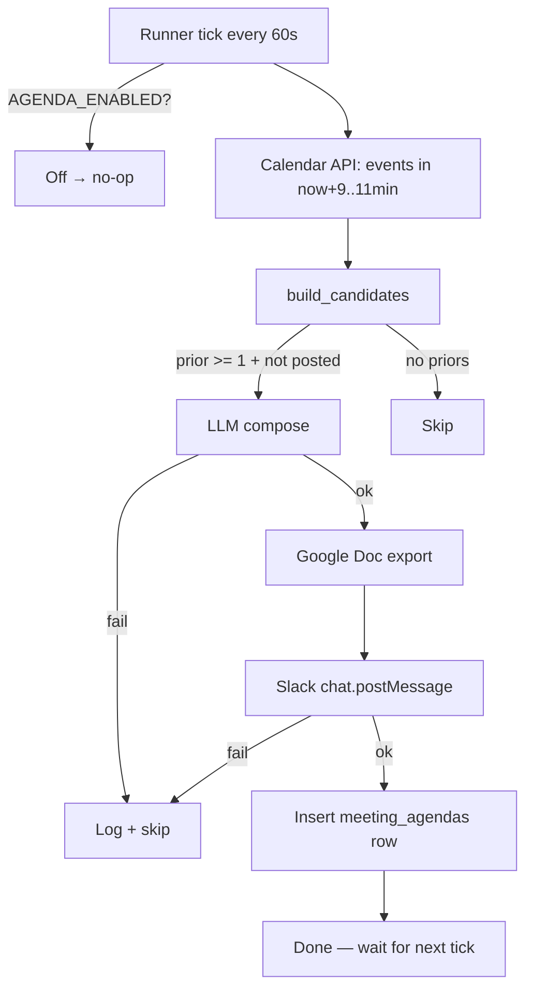
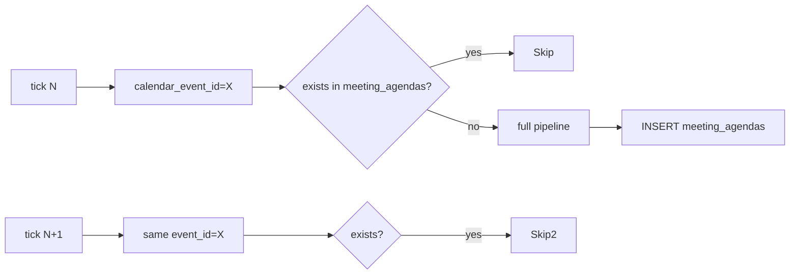

# SPEC v0.1 — Pre-Meeting Agenda (FR-CR-05-165)

> **Версия:** v0.1, 2026-05-13
> **Scope:** новая фича — за N минут до повторяющейся встречи в Google Calendar бот собирает повестку и шлёт её Slack DM-ом
> **Источники данных:** Google Calendar API (read), `zoom_recordings` (read), `tasks` (read), `meeting_agendas` (write — idempotency)

---

## 1. Mission

За 10 минут до старта **повторяющейся** Calendar-встречи (синонимы:
weekly sync, regular call, recurring meeting) автоматически
прислать оператору краткую повестку в Slack DM:

1. **Из прошлого раза** — буллет-выжимка последней встречи с тем же названием.
2. **Задачи и их статусы** — чек-лист открытых задач, привязанных к прошлым встречам этой серии.
3. **К обсуждению** — 2-4 пункта что критично закрыть сегодня.
4. **Гиперссылка** на Google Doc с подробным контекстом.

Идея — превратить летучку из «о чём вообще речь?» в «прохожу по чеклисту».

---

## 2. Клиент и пользователь

### 2.1 Основной клиент

CEO / основатель humanoid.ai (Артем) — один оператор, без внешних пользователей.

### 2.2 Роли пользователей

| Роль | Что делает |
|---|---|
| Оператор | Получает повестку, проходит по checklist на встрече, обновляет статусы задач |
| Бот | Discovers calendar event → собирает контекст → шлёт DM |
| (Опционально) Другие участники команды | Получают чтение через тот же Slack-канал когда `AGENDA_SLACK_TARGET_CHANNEL_ID` указывает на shared channel |

### 2.3 Контекст использования

- Запускается в фоне (daemon thread) в Slack-bot контейнере
- Срабатывает каждые 60 сек (tick)
- Никаких ручных команд — fully passive

### 2.4 Частота использования

- Текущая база: 18+ recurring встреч в неделю (Wellness, Genia, Nomura, Vest и др.)
- Ожидаемый объём DM: 5-15 повесток в день

### 2.5 Уровень боли

Сейчас оператор: открывает Google Calendar → ищет zoom-link → пытается вспомнить о чём была прошлая встреча → проверяет таски руками. **3-5 минут трения перед каждой встречей.**

---

## 3. Проблема

### 3.1 Какую решаем

«Прихожу на регулярный звонок и не помню что договорились в прошлый раз — теряем 5 минут на recap».

### 3.2 Почему важна

- Регулярных встреч с инвесторами / партнёрами 5-10 в неделю
- Утеря контекста = потеря trust («давайте я в почте пришлю» вместо немедленного действия)
- Открытые задачи могут проваливаться между встречами

### 3.3 Как решает сейчас

- Открыть Google Calendar → найти zoom link
- Вспомнить тему / найти zoom recording в Notion / Drive
- Открыть последний detailed_summary doc → пробежать
- Списать open tasks для контекста

### 3.4 Что не работает

- Каждый шаг — ручной
- Если delay 5 минут → начали без контекста
- Tasks из системы — отдельно, не сшиты с meeting

### 3.5 Последствия

- 5-15 минут потерь в день
- Качество встреч ниже («что мы там обсуждали...?»)
- Open tasks подвисают неделями

---

## 4. Решение

### 4.1 Что предлагает продукт

Slack DM за 10 минут до повторяющейся встречи:

```
*13/05 — Повестка ко встрече «Genia Xasis <> Humanoid (Weekly fundraising sync)»*

📋 *Из прошлого раза*
• Обсудили pipeline инвесторов, договорились прислать обновлённый cap table
• Genia запросил intro к Nomura, обещал свести с Виктором
• Договорились — следующая итерация deck'a к среде

✅ *Задачи и их статусы*
☐ Прислать обновлённую cap table (admin, до 15/05)
▣ Подготовить intro к Nomura (admin)
☑ Собрать DD-пакет (admin, done)

🎯 *К обсуждению*
• Cap table — успели ли с новым SAFE
• Nomura intro — статус
• Timeline pre-seed

📄 Подробно (Google Doc)
```

### 4.2 Как решает

1. **Discovery** — Google Calendar API tick каждые 60 сек, ищет events со `start_time ∈ [now+9min, now+11min]`
2. **Recurrence detection** — title нормализуется и сравнивается с `zoom_recordings.title` за последние 90 дней. ≥1 матч → повторяющаяся.
3. **Context aggregation** — pull последней `zoom_recordings.detailed_summary` + open `tasks` где `source_kind='zoom' AND source_conversation_id ∈ prior_zoom_ids AND status ≠ done`.
4. **LLM compose** — single call, JSON output: `previous_recap`, `tasks_checklist`, `open_questions`, `doc_body_md`.
5. **Google Doc** — `DocsExportService.export_summary` создаёт документ с full body.
6. **Slack DM** — `chat.postMessage` в `AGENDA_SLACK_TARGET_CHANNEL_ID`.
7. **Idempotency** — `meeting_agendas` UNIQUE на `calendar_event_id` — повторный tick не зашлёт DM ещё раз.

### 4.3 Почему лучше альтернатив

| Альтернатива | Минус |
|---|---|
| Granola / Fireflies pre-meeting | $$, требует authorize в каждое из 5 OAuth |
| Notion AI | Не видит наши tasks из БД |
| Cron + manual prompt | Не идемпотентно, нет dedup |
| **Наш агент** | Видит и Calendar, и наши tasks, и наш recording history — единый контекст. Stateful (idempotency через `meeting_agendas`) |

### 4.4 Ключевая ценность

«За 10 минут до звонка приходит готовый чеклист, не надо думать».

### 4.5 Ограничения

- Только встречи с минимум 1 прошлым recording с тем же title (`AGENDA_MIN_PRIOR_MEETINGS`) — первая встреча серии повестки НЕ получит
- Title-match — fuzzy (нормализация + сравнение), но не LLM-fuzzy. Operator может изменить title на лету и потерять серию
- Calendar полю `description` пока не парсится — only title + attendees
- Один DM per event — на текущий tick. Не пересылаем при изменении событий

---

## 5. Продуктовые метрики

### 5.1 North Star Metric

**Время от «открыл Slack DM» до «начал звонок зная контекст»** ≤ 30 секунд (vs. 3-5 минут сейчас).

### 5.2 Метрики качества

- ≥ 90% повесток приходят за 9-11 минут до start (single sample window)
- ≥ 95% повторяющихся встреч получают повестку (если они в Calendar + в `zoom_recordings`)
- 0 дубликатов повестки на один event (idempotency invariant)

### 5.3 Метрики эффективности

- LLM time-to-compose ≤ 5 сек (cap by openai_model timeout)
- Calendar API quota: ≤ 1 request / 60 сек / calendar_id
- Per-tick total wall-clock ≤ 10 сек

### 5.4 Метрики использования

- # повесток отправлено в день
- # повесток с открытыми tasks (signal что цикл tracking → meeting → status update работает)
- # повторений события в серии где была повестка (proxy retention)

### 5.5 Метрики ошибок

- `agenda_llm_invalid_json` — # / день
- `agenda_slack_post_failed` — # / день
- `agenda_doc_export_failed` — # / день

---

## 6. Фичи

### 6.1 MVP (must-have) — v0.1

| ID | Фича | Описание |
|---|---|---|
| F-MA-01 | Calendar tick | Поллинг Calendar API каждые `AGENDA_TICK_INTERVAL_SECONDS` (60s) |
| F-MA-02 | Recurrence detection | Нормализация title + match с `zoom_recordings` за `AGENDA_LOOKBACK_DAYS` (90d) |
| F-MA-03 | Context aggregation | Pull последней recording + open tasks для prior_zoom_ids |
| F-MA-04 | LLM compose | Single JSON output via OpenAI с system+user prompt |
| F-MA-05 | Slack DM | `chat.postMessage` в `AGENDA_SLACK_TARGET_CHANNEL_ID` с mrkdwn body + Doc link |
| F-MA-06 | Google Doc | Full body в Drive folder `FIREFLIES_DOCS_FOLDER_ID` |
| F-MA-07 | Idempotency | `meeting_agendas` UNIQUE на `calendar_event_id` |
| F-MA-08 | Feature flag | `AGENDA_ENABLED=false` (default) — runner no-op |

### 6.2 Should-have (Q2-2026)

| ID | Фича | Описание |
|---|---|---|
| F-MA-09 | Per-attendee customisation | Разные повестки для разных attendees (CEO vs CTO) |
| F-MA-10 | Real-time edit on event change | Если operator поменял title / время — переотправить |
| F-MA-11 | Status update buttons in DM | Кнопки «task done» / «push to next week» прямо в DM |

### 6.3 Could-have (Q3+)

- Multi-source attendees mapping (Telegram + Slack users)
- AI-assisted «closing checklist» после встречи (mirror of pre-meeting)
- Calendar event RSVP integration

---

## 7. User Stories

### US-MA-1 — Получить повестку за 10 минут до weekly sync

**Given** оператор настроил `AGENDA_ENABLED=true` и есть событие в Calendar с title «Genia Xasis <> Humanoid (Weekly sync)» через 12 минут
**And** в `zoom_recordings` есть запись с тем же title за прошлую неделю
**When** runner делает tick в `now+10min`
**Then** в Slack DM приходит сообщение `*13/05 — Повестка ко встрече «...»*` с тремя секциями + Doc-link
**And** в `meeting_agendas` появляется row с `calendar_event_id`

### US-MA-2 — Повторный tick не шлёт дубль

**Given** повестка уже отправлена (есть row в `meeting_agendas`)
**When** runner тикает снова в `now+10min` (calendar возвращает тот же event)
**Then** DM НЕ отправляется
**And** runner логирует `agenda_already_posted` (если будем добавлять) и продолжает loop

### US-MA-3 — Первая встреча серии — повестка НЕ приходит

**Given** в Calendar встреча с title который никогда не был записан в `zoom_recordings`
**When** runner тикает
**Then** event попадает в `build_candidates` но `len(prior) < min_prior_meetings` → drop
**And** DM не отправляется

### US-MA-4 — LLM fail → silent skip

**Given** OpenAI вернул not-JSON или истёк timeout
**When** `compose_agenda` ловит exception
**Then** `agenda_llm_call_failed` log
**And** DM не отправляется (но `meeting_agendas` row тоже не создаётся, runner повторит на следующем tick)

### US-MA-5 — Doc creation fail → DM всё равно идёт

**Given** Google Docs API недоступен (sa-quota / network)
**When** `_maybe_create_doc` возвращает `(None, None)`
**Then** Slack DM **всё равно отправляется** (без секции «📄 Подробно»)
**And** в `meeting_agendas` row без `google_doc_id`/`google_doc_url`

### US-MA-6 — Feature flag OFF — silent no-op

**Given** `AGENDA_ENABLED=false`
**When** main процесс стартует
**Then** runner thread НЕ создаётся
**And** в логе: `agenda_runner_disabled_by_env`

---

## 8. User Flow

### 8.1 Main flow (DM delivery)



### 8.2 Idempotency flow



---

## 9. BDD Use Cases

### UC-MA-01 — Weekly sync с прогрессом

```gherkin
Feature: Pre-meeting agenda for recurring sync
  As an operator
  I want a Slack DM 10 minutes before each recurring meeting
  So I walk into the call already knowing the context

Background:
  Given AGENDA_ENABLED is true
  And AGENDA_SLACK_TARGET_CHANNEL_ID is "D0ASY5QF6UX"
  And AGENDA_LEAD_TIME_MINUTES is 10
  And AGENDA_LOOKBACK_DAYS is 90
  And the database has a zoom_recording titled "Weekly sync" from 7 days ago

Scenario: Recurring meeting gets an agenda
  Given a Calendar event id="ev_x" titled "Weekly sync" starting in 10 minutes
  And no MeetingAgenda row exists for ev_x
  When the agenda runner tick executes
  Then it should call OpenAI exactly once with system+user prompt
  And it should call Google Docs once and get back a URL
  And it should call Slack chat.postMessage once with channel="D0ASY5QF6UX"
  And the Slack text should start with "*13/05 — Повестка ко встрече «Weekly sync»*"
  And the Slack text should include "📋 *Из прошлого раза*"
  And the Slack text should include the Google Doc URL
  And a MeetingAgenda row should exist with calendar_event_id="ev_x"

Scenario: Repeated tick within the lead-time window does not duplicate
  Given a MeetingAgenda row for ev_x already exists
  When the agenda runner tick executes
  Then Slack chat.postMessage is NOT called
```

### UC-MA-02 — Первая встреча, без прошлого recording

```gherkin
Scenario: New (non-recurring-yet) meeting is skipped
  Given a Calendar event titled "Brand new investor intro" starting in 10 minutes
  And zoom_recordings has NO row with that title
  When the agenda runner tick executes
  Then build_candidates returns an empty list
  And no LLM call, no Doc, no Slack post is made
```

### UC-MA-03 — LLM fails

```gherkin
Scenario: LLM returns invalid JSON — runner skips and retries next tick
  Given a recurring meeting eligible for agenda
  When OpenAI returns a string instead of dict
  Then compose_agenda returns None
  And no MeetingAgenda row is persisted
  And the next tick will re-attempt this event
```

---

## 10. Functional Requirements Register

### Категория 1 — Discovery

| ID | Требование | Test |
|---|---|---|
| FR-MA-1.1 | Tick каждые `AGENDA_TICK_INTERVAL_SECONDS` (default 60s) | `test_runner_disabled_no_op` |
| FR-MA-1.2 | Поллинг Calendar API в окне `[lead-window, lead+window]` через `fetch_calendar_events_via_api` (приоритет) | covered by runner code path |
| FR-MA-1.3 | Multi-calendar поддержка через `GOOGLE_CALENDAR_ID` (csv) | inherited from FR-CR-05-152 |
| FR-MA-1.4 | Apps Script proxy fallback (FR-CR-05-136) когда `GOOGLE_CALENDAR_CLIENT_ID` не настроен, но `CALENDAR_APPS_SCRIPT_URL` есть | `test_runner_starts_with_apps_script_only` |
| FR-MA-1.5 | Synthetic event id (`agenda_synth:<normalised_title>:<start_iso>`) когда источник не отдаёт нативный id (Apps Script) — стабильный across ticks | `test_normalise_event_synthesises_stable_id_for_apps_script_payload` |
| FR-MA-1.6 | Native event id сохраняется когда есть (Google Calendar API path) | `test_normalise_event_keeps_native_id_when_present` |
| FR-MA-1.7 | Event без title или без start → drop (защита от malformed payload) | `test_normalise_event_returns_none_on_missing_fields` |
| FR-MA-1.8 | Runner НЕ стартует если нет ни одного calendar источника | `test_runner_exits_when_no_calendar_source` |

### Категория 2 — Recurrence detection

| ID | Требование | Test |
|---|---|---|
| FR-MA-2.1 | `normalise_title` lowercase + ё→е + NFKD + drop combining + strip punct + collapse ws | `test_normalise_title_*` (4) |
| FR-MA-2.2 | `find_prior_recordings` matches на нормализованном ключе | `test_find_prior_recordings_matches_normalised_title` |
| FR-MA-2.3 | Lookback respect: только recordings `meeting_date >= now - lookback_days` | `test_find_prior_recordings_respects_lookback_cutoff` |
| FR-MA-2.4 | Future-scheduled recordings (с тем же title но `meeting_date >= now`) НЕ считаются prior | `test_find_prior_recordings_skips_future_scheduled` |
| FR-MA-2.5 | Min prior threshold (`AGENDA_MIN_PRIOR_MEETINGS`, default 1) | `test_build_candidates_respects_min_prior_meetings` |

### Категория 3 — Task aggregation

| ID | Требование | Test |
|---|---|---|
| FR-MA-3.1 | `open_tasks_for_recordings` filters `source_kind='zoom' AND status != done AND deleted_at IS NULL AND source_conversation_id IN zoom_ids` | `test_open_tasks_for_recordings_filters_status_and_orders_by_priority` |
| FR-MA-3.2 | Sort: priority desc → due asc nulls last → created_at asc → id | same test |
| FR-MA-3.3 | Empty input list → empty result | `test_open_tasks_for_recordings_empty_list_returns_empty` |

### Категория 4 — LLM compose

| ID | Требование | Test |
|---|---|---|
| FR-MA-4.1 | Single OpenAI call with system + user prompt, JSON-mode | `test_compose_agenda_happy_path` |
| FR-MA-4.2 | Returns None on exception (network / SDK fail) | `test_compose_agenda_returns_none_on_llm_exception` |
| FR-MA-4.3 | Returns None on non-dict output | `test_compose_agenda_returns_none_on_non_dict_output` |
| FR-MA-4.4 | Coerce missing fields to empty list / string | covered in happy-path test |
| FR-MA-4.5 | Output truncation: previous_recap ≤ 5, open_questions ≤ 4 | enforced in `_coerce_output` |

### Категория 5 — Idempotency

| ID | Требование | Test |
|---|---|---|
| FR-MA-5.1 | `meeting_agendas.calendar_event_id` UNIQUE | migration 0027 |
| FR-MA-5.2 | `AgendaService.is_already_posted` checks before posting | `test_agenda_service_is_already_posted_and_record_post` |
| FR-MA-5.3 | `build_candidates` drops events with existing row | `test_build_candidates_skips_already_posted` |
| FR-MA-5.4 | Runner double-checks idempotency после compose (race-safety) | runner code path |

### Категория 6 — Slack rendering

| ID | Требование | Test |
|---|---|---|
| FR-MA-6.1 | Header format `*DD/MM — Повестка ко встрече «<title>»*` (operator-pinned) | `test_render_agenda_text_format_matches_operator_pin` |
| FR-MA-6.2 | Three sections: «Из прошлого раза» (📋), «Задачи и их статусы» (✅), «К обсуждению» (🎯) | same |
| FR-MA-6.3 | Task status box mapping (todo=☐, in_progress=▣, blocked=⛔, done=☑, cancelled=✕) | same |
| FR-MA-6.4 | Hyperlink to Google Doc as `<url\|Подробно (Google Doc)>` | same |
| FR-MA-6.5 | Truncate to ≤ 2950 chars (Slack 3000 cap) | `test_render_agenda_text_truncates_when_too_long` |
| FR-MA-6.6 | Omit doc section if `doc_url is None` | `test_render_agenda_text_omits_doc_section_when_no_url` |

### Категория 7 — Feature flag

| ID | Требование | Test |
|---|---|---|
| FR-MA-7.1 | `AGENDA_ENABLED=false` (default) — runner no-op, thread not spawned | `test_runner_disabled_no_op` |
| FR-MA-7.2 | Missing `AGENDA_SLACK_TARGET_CHANNEL_ID` — warning + early return | runner code path |
| FR-MA-7.3 | Missing `calendar_factory` — warning + early return | runner code path |

---

## 11. Non-Functional Requirements

| ID | Требование | Цель |
|---|---|---|
| NFR-MA-P.1 | Tick wall-clock ≤ 10 сек | enforced by sequential calls + LLM/Doc/Slack timeouts |
| NFR-MA-P.2 | LLM call ≤ 5 сек | OpenAI client default |
| NFR-MA-R.1 | Failure of one candidate must NOT kill the loop | try/except around `_process_candidate` |
| NFR-MA-R.2 | Failure of one step (LLM / Doc / Slack) MAY allow downstream steps to continue gracefully | doc fail → DM without doc link |
| NFR-MA-R.3 | Daemon thread — process exit doesn't wait for it | `daemon=True` |
| NFR-MA-S.1 | Calendar OAuth credentials from encrypted DB store, not env | inherited from FR-CR-05-144 |
| NFR-MA-S.2 | Slack DM only — no Calendar event modification | runner is read-only on Calendar |
| NFR-MA-O.1 | Structured logging per step (`agenda_*` namespace) | logging_setup |
| NFR-MA-O.2 | Idempotency must survive process restart | DB-backed |

---

## 12. Architecture

### 12.1 Project Structure (delta vs current repo)

```
app/
├── agenda/                          # NEW (FR-CR-05-165)
│   ├── __init__.py
│   ├── service.py                   # pure logic: normalise, find prior, candidates
│   ├── compose.py                   # LLM call wrapper
│   ├── slack_format.py              # mrkdwn renderer
│   ├── runner.py                    # daemon thread tick loop
│   └── prompts/
│       └── agenda.md                # LLM prompt template
├── models/
│   └── meeting_agenda.py            # NEW — MeetingAgenda
└── main.py                          # MODIFIED — boot AgendaRunner after Slack client built

alembic/versions/
└── 0027_meeting_agendas.py          # NEW

tests/requirements/
└── test_agenda.py                   # NEW — 21 tests

SPEC_MEETING_AGENDA_v0.1.md          # NEW
```

### 12.2 Data Layer

#### ER Diagram

```mermaid
erDiagram
    MEETING_AGENDAS ||--o{ ZOOM_RECORDINGS : "references via prior_meeting_zoom_ids JSON"
    ZOOM_RECORDINGS ||--o{ TASKS : "source_conversation_id"

    MEETING_AGENDAS {
        int id PK
        string calendar_event_id UNIQUE
        string recurring_event_id NULLABLE
        string title
        string title_normalised NULLABLE
        timestamptz scheduled_start_at
        timestamptz posted_at
        string slack_channel
        string slack_ts NULLABLE
        string google_doc_id NULLABLE
        string google_doc_url NULLABLE
        json prior_meeting_zoom_ids NULLABLE
        timestamptz created_at
        timestamptz updated_at
    }
    ZOOM_RECORDINGS {
        string zoom_id PK
        string title
        timestamptz meeting_date
        text detailed_summary
        text short_summary
        string google_doc_url
    }
    TASKS {
        int id PK
        string source_kind
        string source_conversation_id
        string title
        string status
        date due_date
    }
```

### 12.3 Service Layer Surface

```python
# app/agenda/service.py
normalise_title(s: str | None) -> str
find_prior_recordings(session, *, title, lookback_days, now=None) -> list[ZoomRecording]
open_tasks_for_recordings(session, *, zoom_ids, limit=30) -> list[Task]
build_candidates(session, *, events, lookback_days, min_prior_meetings, now=None)
    -> list[AgendaCandidate]
AgendaService.is_already_posted(session, *, calendar_event_id) -> bool
AgendaService.record_post(session, *, candidate, slack_channel, slack_ts,
                          google_doc_id, google_doc_url, prior_zoom_ids) -> MeetingAgenda

# app/agenda/compose.py
compose_agenda(candidate, *, llm_backend, model) -> AgendaOutput | None

# app/agenda/slack_format.py
render_agenda_text(*, candidate, output, doc_url) -> str

# app/agenda/runner.py
AgendaRunner(settings, slack_client, llm_backend, calendar_factory, docs_factory)
    .start() -> None  # no-op when disabled
    .stop()  -> None
```

### 12.4 AI Service Layer

Prompt MD: `app/agenda/prompts/agenda.md` (separately committed so non-engineers can edit).

Input shape:
```json
{
  "meeting_title": "...",
  "meeting_date_iso": "...",
  "attendees": ["..."],
  "calendar_description": "...",
  "prior_recordings": [...],
  "open_tasks": [...]
}
```

Output schema (strict, JSON-mode):
```json
{
  "previous_recap": ["...", "..."],
  "tasks_checklist": [{"task_id": 1, "title": "...", "status": "todo", "owner": "...", "due": "..."}],
  "open_questions": ["..."],
  "doc_body_md": "## Из прошлого раза\n..."
}
```

### 12.5 Infrastructure

- Запускается в существующем контейнере `slack-task-tg-listener` (TG worker процесс)? **НЕТ — в `bot` контейнере** (тот что Slack-bot), потому что runner использует `app.client` (Slack WebClient уже доступный).
- Дополнительных процессов / контейнеров не нужно.
- Restart policy: `unless-stopped` — наследуется от parent контейнера.

---

## 13. Implementation Plan

### Эпик E-MA-1: MVP

| Task | Subtask | AC | Status |
|---|---|---|---|
| T-MA-001 | Migration + model | `0027_meeting_agendas.py`, `app/models/meeting_agenda.py` | ✅ |
| T-MA-002 | Pure logic service | `normalise_title`, `find_prior_recordings`, `open_tasks_for_recordings`, `build_candidates`, `AgendaService` | ✅ |
| T-MA-003 | LLM compose | `compose_agenda` + prompts/agenda.md | ✅ |
| T-MA-004 | Slack renderer | `render_agenda_text` | ✅ |
| T-MA-005 | Runner | `AgendaRunner` daemon thread + tick loop | ✅ |
| T-MA-006 | Config flags | 7 env-var keys в Settings | ✅ |
| T-MA-007 | Wire to main | startup hook в `app/main.py` | ✅ |
| T-MA-008 | Tests | 21 pytest cases, all green | ✅ |
| T-MA-009 | Deploy enablement | Env-vars в operator's `.env`, restart bot container | 🔄 operator-side |

---

## 14. Tests Traceability Matrix

| FR | Test (in `tests/requirements/test_agenda.py`) |
|---|---|
| FR-MA-2.1 | `test_normalise_title_lowercases_collapses_ws_and_drops_punct` + `test_normalise_title_handles_cyrillic_and_eyo` + `test_normalise_title_empty_and_none` + `test_normalise_title_is_stable_across_minor_variants` |
| FR-MA-2.2 | `test_find_prior_recordings_matches_normalised_title` |
| FR-MA-2.3 | `test_find_prior_recordings_respects_lookback_cutoff` |
| FR-MA-2.4 | `test_find_prior_recordings_skips_future_scheduled` |
| FR-MA-2.5 | `test_build_candidates_respects_min_prior_meetings` |
| FR-MA-3.1 + 3.2 | `test_open_tasks_for_recordings_filters_status_and_orders_by_priority` |
| FR-MA-3.3 | `test_open_tasks_for_recordings_empty_list_returns_empty` |
| FR-MA-4.1 + 4.4 + 4.5 | `test_compose_agenda_happy_path` |
| FR-MA-4.2 | `test_compose_agenda_returns_none_on_llm_exception` |
| FR-MA-4.3 | `test_compose_agenda_returns_none_on_non_dict_output` |
| FR-MA-5.1 + 5.2 | `test_agenda_service_is_already_posted_and_record_post` |
| FR-MA-5.3 | `test_build_candidates_skips_already_posted` |
| FR-MA-6.1..6.4 | `test_render_agenda_text_format_matches_operator_pin` |
| FR-MA-6.5 | `test_render_agenda_text_truncates_when_too_long` |
| FR-MA-6.6 | `test_render_agenda_text_omits_doc_section_when_no_url` |
| FR-MA-7.1 | `test_runner_disabled_no_op` |

Total: **21 tests**, all green at commit time.

---

## 15. Assumptions, Out of Scope, Open Questions

### 15.1 Assumptions

- Google Calendar OAuth уже настроен (FR-CR-05-144) — наследуем
- `FIREFLIES_DOCS_FOLDER_ID` settles the shared-drive storage problem
- OpenAI key + model уже работают для других pipelines (Fireflies / Zoom)
- Tasks pipeline `source_conversation_id` = `zoom_id` для zoom-source задач (FR-CR-05-39)
- Tasks стейт enum только `backlog/todo/in_progress/done` — `cancelled/blocked` не существуют (FR-CR-04-20)

### 15.2 Out of Scope (v0.1)

- ❌ Real-time edit / cancel — если событие удалили из Calendar, наша повестка живёт
- ❌ Multi-attendee customisation — все получают одинаковый DM (channel single-target)
- ❌ Calendar description AI-parse — берём только title
- ❌ TG-mirror — DM только в Slack (operator pinned)
- ❌ Кнопки в DM (status update / snooze) — отдельная фича Q2

### 15.3 Open Questions

| ? | Why important | Кто отвечает |
|---|---|---|
| Что делать когда календарь rescheduled (например meeting сдвинули на час)? | Идемпотентность сейчас на calendar_event_id — Google Calendar обычно сохраняет id; будет работать. Но если был cancel + recreate — id меняется. | operator |
| Multi-attendee mapping — нужен ли отдельный thread per persona? | UX vs complexity | operator |
| Слать ли повестку в shared channel или только DM? | Privacy vs visibility | operator |

---

## 16. Appendices

### 16.1 Glossary

- **Recurring meeting** — встреча с title, который матчится с ≥`AGENDA_MIN_PRIOR_MEETINGS` записями в `zoom_recordings` за `AGENDA_LOOKBACK_DAYS` дней
- **Lead time** — сколько минут до start_time мы постим повестку
- **Idempotency key** — `meeting_agendas.calendar_event_id` UNIQUE

### 16.2 References

- FR-CR-05-127 — Whisper bias prompt (related: meeting transcript quality)
- FR-CR-05-143 — `ZOOM_REQUIRED_EMAIL` filter (related: which meetings end up in zoom_recordings)
- FR-CR-05-144 — Calendar OAuth (depended-on)
- FR-CR-05-152 — Multi-calendar comma-separated ids (depended-on)
- FR-CR-05-162 — Slack ingest (parallel feature, separate agent)
- FR-CR-05-164 — Whisper bias «Humanoid» always-include (related)

### 16.3 Env vars added

```bash
# Required for activation
AGENDA_ENABLED=true                                     # default false
AGENDA_SLACK_TARGET_CHANNEL_ID=D0ASY5QF6UX             # required
# Optional tuning
AGENDA_LEAD_TIME_MINUTES=10                            # default 10
AGENDA_WINDOW_MINUTES=1                                # default 1
AGENDA_LOOKBACK_DAYS=90                                # default 90
AGENDA_MIN_PRIOR_MEETINGS=1                            # default 1
AGENDA_TICK_INTERVAL_SECONDS=60                        # default 60
AGENDA_COMPOSE_MODEL=                                  # falls back to OPENAI_MODEL
```

---

**Версия:** v0.1, 2026-05-13
**Maintainer:** Артём Соколов / Андрей Кузьминых
