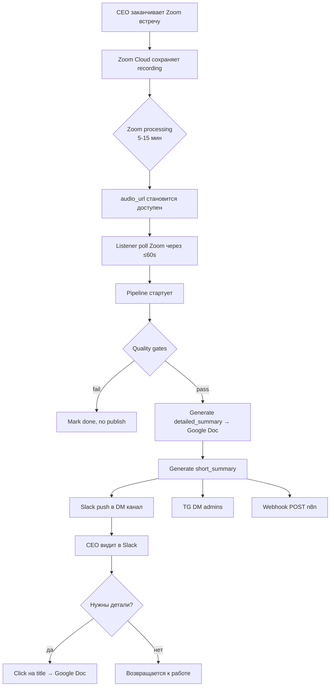
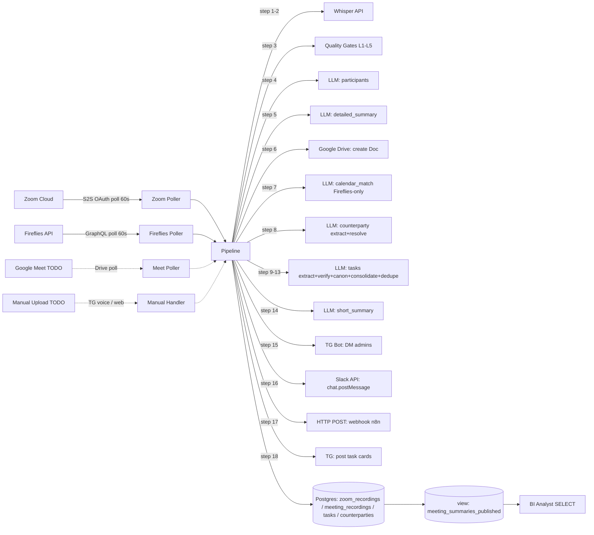
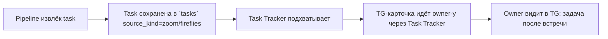
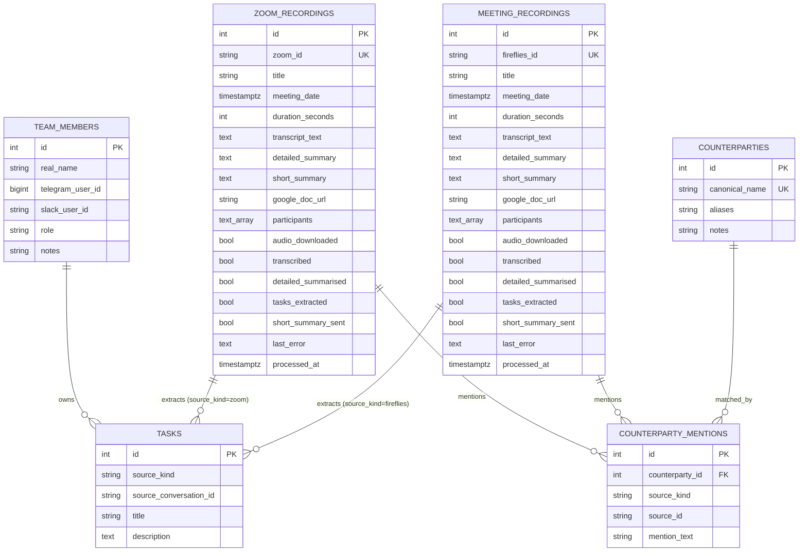
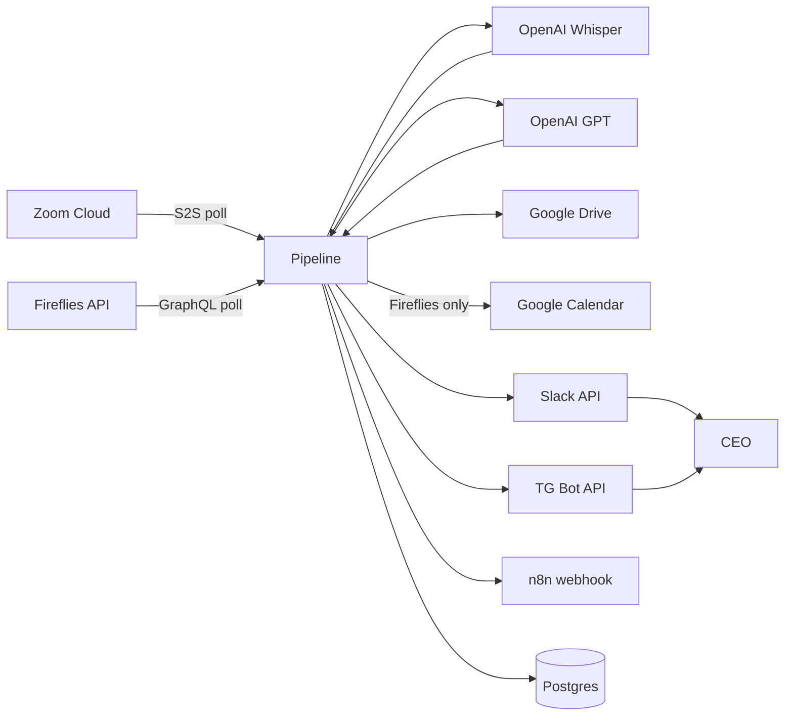
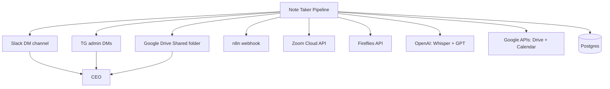

# SPEC v0.1 — Note Taker Agent

> **Уровень:** Product + Business + Solution Architecture (Draft)
> **Дата:** 2026-05-08
> **Целевой пользователь:** CEO, solopreneurs, предприниматели
> **Структура:** разделы 1–14 покрывают этапы продуктового, бизнес- и архитектурного анализа

---

# 1. Краткое описание продукта

**Note Taker** — AI-агент, который автоматически принимает любую meeting-запись (Zoom, Fireflies, Google Meet, manual upload, voice dictation) и производит структурированную «карточку встречи»: участники / суть / решения / задачи. Распространяет её в Slack DM, Telegram DM, Google Doc и через webhook (n8n) во внешние системы.

Главная ценность для CEO/solopreneur: **0 ручных действий после встречи** — через 5-15 минут после окончания записи в Slack приходит компактная карточка с clickable ссылкой на полный отчёт, и задачи из встречи уже распределены по людям.

---

# 2. Клиент и пользователь

## 2.1 Основной клиент

CEO / solopreneur / предприниматель, у которого:
- 5-15 встреч в день (с инвесторами, командой, клиентами, партнёрами)
- Несколько каналов записи: Zoom Cloud, Fireflies (через Fred ассистента), периодически Google Meet
- Память на детали ограничена; каждая встреча должна остаться зафиксированной с actionable итогами

## 2.2 Роли пользователей

| Роль | Кол-во | Что делает | Через какой интерфейс |
|---|---|---|---|
| **CEO** | 1 | Главный consumer карточек встреч. Получает ВСЕ summary в Slack DM + TG DM. | Slack + Telegram + Google Doc |
| **Участник встречи** (внутренний) | 5-30 | Получает summary, если `team_members.slack_user_id` известен (опционально). Извлечённые задачи приходят как TG-карточки (через Task Tracker). | Slack DM, Telegram DM (через Task Tracker) |
| **Внешний участник** | случайно | Не получает ничего напрямую (privacy). Имя сохраняется в `participants` как email. | — |
| **External BI / consumer (n8n)** | 1-N | Получает payload через webhook + читает БД view `meeting_summaries_published`. | HTTP webhook + psql |

## 2.3 Контекст использования

| Когда | Что хочет получить |
|---|---|
| Сразу после встречи (до 15 мин) | Slack push: «вот что было, вот задачи, вот ссылка на full doc» |
| Через час | Открыть Google Doc и проскролить детали по разделу |
| Через неделю | Найти встречу через SQL/Notion поиск по counterparty / topic |
| После reset сервера | Все пропущенные за период встречи догнать автоматически |

## 2.4 Частота использования

- 5-15 встреч в день у активного CEO
- Каждая → 1 push в Slack + 1 в TG (admin'ам) + 1 Google Doc + 1 webhook call
- ИТОГО ~30-60 событий в день

## 2.5 Уровень боли пользователя

**Высокий.** Без auto-капторинга:
- 30-50% обещаний с встреч теряются
- 2-4 часа в неделю CEO тратит на ручной разбор «что было»
- Команда работает без чёткого actionable списка после встречи
- Расшифровки длинные (30+ страниц) — CEO их не читает

---

# 3. Проблема

## 3.1 Какую проблему решаем

**После каждой встречи нужно вручную:** скачать запись, послушать/прочитать transcript, извлечь решения и задачи, разослать команде. Это 10-30 минут per встречи. У CEO с 10 встречами/день это 2-5 часов работы в день.

## 3.2 Почему она важна

- Финансово: не сделанный follow-up с инвестором через 1-2 дня = lost deal
- Операционно: команда не знает что было решено → двойная работа / противоречия
- Психологически: фоновая тревога «что забыл»
- Стратегически: CEO работает в режиме операций вместо стратегии

## 3.3 Как пользователь решает её сейчас

- **Полностью руками**: блокнот / голосовые после встречи себе → 5-10 мин/встреча, 80% inconsistency
- **Fireflies / Otter / Riverside**: получают сырой transcript → не читают → 0 actionable output
- **Ассистент-человек**: 1 человек на 1 CEO, $40-80k/год, медленно (2-4 часа задержка)

## 3.4 Что не работает

- Сырой transcript не actionable: 30 страниц без чёткого «что делать»
- Ручной парсинг → 80% задач теряется
- Ассистент-человек: дорого, медленно, единственная точка отказа
- Никакой связи «встреча → задачи → автоматическая рассылка» из коробки

## 3.5 Последствия

- 30-50% обещанных follow-up'ов не выполняется
- Investor relationships gradually fade
- Команда не понимает приоритетов
- CEO выгорает от cognitive load

---

# 4. Решение

## 4.1 Что предлагает продукт

Note Taker автоматически:
1. **Подписывается** на источники (Zoom Cloud, Fireflies, Google Meet — TODO, manual upload — TODO)
2. **Транскрибирует** через Whisper API (если transcript уже не предоставлен источником)
3. **Защищается** от мусора 5-уровневыми quality gates (file size, hallucination, thin transcript, empty summary, no-content output)
4. **Резолвит участников** через LLM + справочник `team_members` (canonical real_names + external emails)
5. **Генерит** detailed_summary (~10-30 KB → Google Doc) и short_summary (~1-3 KB → Slack/TG/webhook)
6. **Канонизирует** заголовок встречи через Google Calendar match (для Fireflies)
7. **Извлекает** задачи и счёт-партнёров (counterparty matching через справочник)
8. **Распространяет** в 4 канала параллельно: Slack DM, Telegram DM, Google Doc, webhook на n8n
9. **Идемпотентен**: сбой / restart → следующий tick подхватит с того места, где упал

## 4.2 Как продукт решает проблему

| Боль | Что делает Note Taker |
|---|---|
| «Забыл что было на встрече» | Auto-capture через 5-15 мин после конца записи |
| «Ручной разбор 30-страничного transcript» | LLM-summary в 1-3 KB с To-Do блоком |
| «Имена компаний с искажениями Whisper'a» | Counterparty matching через справочник |
| «Названия встреч от Fireflies — May 06, 02:33 PM» | Calendar event matching → канонический заголовок |
| «Whisper галлюцинирует субтитрами на тишине» | Hallucination detector + VTT fallback |
| «Получаю в Slack: содержательная часть отсутствует» | Quality gate L5: no-content guard |
| «После сбоя сервера потерял встречи» | Idempotent steps + orphan-retry |

## 4.3 Почему это лучше текущего способа

| Критерий | Fireflies plain | Otter.ai | Note Taker |
|---|---|---|---|
| Auto-trigger из источника | ⚠️ только Fireflies | ⚠️ только Otter | ✅ Zoom + Fireflies + Google Meet (TODO) + manual |
| Structured summary | ❌ raw transcript | ⚠️ basic | ✅ structured RU summary + To-Do |
| Auto-distribution | ❌ web only | ❌ web only | ✅ Slack + TG + Doc + webhook |
| Counterparty matching | ❌ | ❌ | ✅ через справочник |
| Calendar title canonicalization | ❌ | ❌ | ✅ |
| Quality gates | N/A | N/A | ✅ 5 уровней |
| Custom downstream через webhook | ⚠️ Zapier нужен | ⚠️ ограничено | ✅ first-class |

## 4.4 Ключевая ценность

> «Я закончил Zoom-встречу, через 10 минут получил в Slack компактный summary с clickable ссылкой на full Google Doc. Все задачи уже распределены по команде. Я ничего не делал.»

## 4.5 Ограничения решения

- **LLM зависимость**: качество = качество модели OpenAI
- **Privacy**: транскрипты уходят в OpenAI API (для on-prem deploy нужен self-hosted Whisper / local LLM)
- **Latency**: 5-15 минут от конца встречи до Slack push (не real-time)
- **GMeet и manual upload**: пока не реализованы (Q2-2026)
- **Voice dictation**: Q3-2026

---

# 5. Продуктовые метрики

## 5.1 North Star Metric

**Time-to-Slack-Push**: время от готовности recording'a в источнике до появления карточки в Slack DM.

- **Цель MVP**: ≤ 15 минут (median) для встречи 30-60 мин
- **Цель v1**: ≤ 5 минут через push-events вместо polling

## 5.2 Метрики качества решения

| ID | Метрика | Что измеряет | Цель |
|---|---|---|---|
| M-Q1 | **Hallucination block rate** | % встреч с мусорным транскриптом, отброшенных guards до Slack | ≥ 95% |
| M-Q2 | **Task extraction precision** | % задач из meeting'a, которые owner подтвердил как валидные | ≥ 80% |
| M-Q3 | **Participant recognition rate** | % team-участников, корректно опознанных LLM | ≥ 90% |
| M-Q4 | **Counterparty match rate** | % counterparty mentions, которые resolved в справочник | ≥ 70% |
| M-Q5 | **Summary readability score** | User survey 1-5: «насколько понятно из summary что было» | ≥ 4.0 |
| M-Q6 | **Calendar match accuracy (Fireflies)** | % Fireflies встреч с правильно подменённым заголовком | ≥ 85% |

## 5.3 Метрики пользовательской эффективности

| ID | Метрика | Цель |
|---|---|---|
| M-E1 | **CEO time saved per meeting** | ≥ 8 минут / встреча (vs ручной разбор) |
| M-E2 | **Follow-up completion rate** | +30 п.п. vs до Note Taker |
| M-E3 | **Time to first Slack glance** | ≤ 30 мин после конца встречи в 95% случаев |

## 5.4 Метрики использования продукта

| ID | Метрика | Цель |
|---|---|---|
| M-U1 | **Daily meetings processed** | 5-15 (CEO scale) |
| M-U2 | **Slack card open rate** | ≥ 90% (CEO открывает почти всегда) |
| M-U3 | **Google Doc click-through** | ≥ 40% (когда нужны детали) |
| M-U4 | **Webhook downstream adoption** | ≥ 1 production-grade consumer (n8n / Notion / Airtable) |

## 5.5 Метрики ошибок и сбоев

| ID | Метрика | Цель |
|---|---|---|
| M-F1 | **Pipeline failure rate** | < 5% встреч в final error state |
| M-F2 | **Whisper rate-limit incidents** | < 1 per week |
| M-F3 | **Webhook 5xx response** | < 0.5% |
| M-F4 | **Listener uptime** | ≥ 99% |
| M-F5 | **Orphan retry success rate** | ≥ 90% (после restart успешно дочиняются) |

---

# 6. Фичи / модули продукта

## 6.1 MVP (must-have, уже работает)

| ID | Фича | Описание | Кому | Проблема | Ценность | Приоритет | Зависимости |
|---|---|---|---|---|---|---|---|
| F-NT-01 | **Zoom auto-ingest** | Polling Zoom Cloud Recordings каждые 60s, full pipeline | CEO | «Zoom-встречи теряются» | Auto-summary через 5-15 мин | Must | Zoom S2S OAuth + Whisper + LLM |
| F-NT-02 | **Fireflies auto-ingest** | Polling Fireflies transcripts каждые 60s | CEO | «Fireflies дает сырой transcript» | Structured summary | Must | Fireflies API |
| F-NT-03 | **Whisper transcription** | gpt-4o-transcribe-diarize, chunking >24MB, bias-prompt с teamnames | Pipeline | «Сырой Whisper выдаёт мусор» | Точная transcription с диаризацией | Must | OpenAI |
| F-NT-04 | **Quality gates (5 levels)** | L1-L5 защита от мусора (file size, Whisper hallucination, thin transcript, empty summary, no-content) | CEO | «Спам в Slack: содержательная часть отсутствует» | Только осмысленные карточки | Must | Code-side detectors |
| F-NT-05 | **Participants resolver** | LLM-extract team members + external emails | CEO | «Имена участников от Fireflies — только 1 email» | Реальные имена в карточке | Must | LLM + team_members table |
| F-NT-06 | **Detailed summary → Google Doc** | LLM генерит 10-30KB structured отчёт, создаёт Doc в Shared Drive | CEO + команда | «Где найти детали через месяц» | Searchable archive | Must | LLM + Google Drive API + SA |
| F-NT-07 | **Short summary → Slack/TG** | LLM 1-3KB с DD/MM-title, HTML-link на Google Doc, threading в Slack | CEO | «Хочу пробежать в Slack/TG за 30 секунд» | Quick read on mobile | Must | LLM + Slack API + TG Bot |
| F-NT-08 | **Calendar match (Fireflies)** | Берём название встречи из Google Calendar event ±30 мин | CEO | «Fireflies: May 06, 02:33 PM» | Читабельные заголовки | Must | Google Calendar API |
| F-NT-09 | **Counterparty matching** | LLM extract + 5×20 batch resolve через справочник | CEO + Tasks | «Названия с искажением Whisper'a» | Канонические имена | Must | LLM + counterparties table |
| F-NT-10 | **Task extraction** | LLM извлекает actionable items, передаёт в Task Tracker через DB | Task Tracker | «Задачи из встречи никуда не идут» | Auto-routing в TG cards | Must | LLM + tasks table |
| F-NT-11 | **Webhook → n8n** | POST JSON каждой опубликованной встречи на configured URL | External BI | «Хочу свой Notion / Airtable workflow» | Open downstream integration | Must | HTTP POST |
| F-NT-12 | **DB read-only access** | View `meeting_summaries_published` для analyst роли | External BI | «Хочу SQL-аналитику» | Direct DB queries | Must | Postgres GRANT + view |
| F-NT-13 | **Idempotent recovery** | Step-flags в DB, orphan-retry после container reset | Ops | «После restart всё потеряем» | Zero-loss recovery | Must | DB design |

## 6.2 Должно быть (should-have, Q2-2026)

| ID | Фича | Описание |
|---|---|---|
| F-NT-14 | **GMeet ingest** | Через Drive API recordings + Meet API метаданные |
| F-NT-15 | **Manual upload** | Drag-n-drop audio/video file через web UI или TG voice-note |
| F-NT-16 | **Title push to Fireflies UI** | После calendar match — `updateMeetingTitle` мутация |
| F-NT-17 | **Backups** | pg_dump cron в Cloud Storage |
| F-NT-18 | **Healthcheck endpoint** | HTTP `/health` с last-poll, errored-orphans метриками |

## 6.3 Может быть (could-have, Q3-Q4 2026)

| ID | Фича | Описание |
|---|---|---|
| F-NT-19 | **Voice dictation в TG** | TG voice → live Whisper → instant tasks |
| F-NT-20 | **Speaker diarization annotation** | Кто что сказал в transcript (timestamp + speaker label) |
| F-NT-21 | **Multi-language detection** | Auto-detect language → per-language prompts |
| F-NT-22 | **Sentiment / topic clustering** | Аналитика поверх встреч |
| F-NT-23 | **Видео-summary** | Visual context (slides, whiteboard) |

---

# 7. User Stories

## US-NT-1 — Авто-захват Zoom встречи

> Как CEO, я хочу чтобы любая моя облачная Zoom-запись автоматически попадала в систему через 5-15 минут после готовности, чтобы мне не нужно было руками ничего загружать.

**Acceptance Criteria:**
```gherkin
Given Zoom recording готов (audio_url доступен в API ответе)
When listener делает следующий poll Zoom (≤60s)
Then запись детектируется как новая (zoom_id ∉ DB)
And pipeline стартует: download → transcribe → ... → publish
And в течение 5-15 мин: detailed_summary → Google Doc, short_summary → Slack post + TG DM admin
```

## US-NT-2 — Авто-захват Fireflies встречи

> Как CEO, я хочу чтобы Fireflies-встречи (через Fred) после готовности transcript'a автоматически попадали в систему, чтобы не дублировать выгрузку из Fireflies UI.

**AC:**
```gherkin
Given Fireflies finished transcription для встречи (transcript_url available)
When listener делает poll Fireflies GraphQL (≤60s)
Then новый fireflies_id детектируется
And pipeline стартует
And calendar_match подменяет auto-stamp заголовок на канонический из Google Calendar
```

## US-NT-3 — Получение карточки в Slack

> Как CEO, я хочу получать в Slack DM компактную карточку (≤3 KB) с заголовком, участниками, сутью и списком задач, чтобы быстро узнавать что было.

**AC:**
```gherkin
Given pipeline сгенерил short_summary (1-3 KB) для встречи
When _step_send_short_summary runs slack-mirror
Then chat.postMessage в SLACK_MEETING_CHANNEL_ID
And первая строка = clickable HTML link на Google Doc формата "DD/MM - Title"
And если body >3500 chars — второй и далее chunks как replies в thread
```

## US-NT-4 — Полный отчёт в Google Doc

> Как CEO/участник, я хочу чтобы был доступен полный structured отчёт встречи в Google Drive, чтобы возвращаться к деталям через недели/месяцы.

**AC:**
```gherkin
Given pipeline сгенерил detailed_summary (10-30 KB)
When _step_doc_export runs
Then drive.files().create создаёт Google Doc в FIREFLIES_DOCS_FOLDER_ID
And content = detailed_summary
And row.google_doc_url сохраняется в БД
And URL включается в short_summary первой строкой как HTML link
```

## US-NT-5 — JSON через webhook

> Как external system (n8n), я хочу получать JSON-payload каждой опубликованной встречи на свой webhook, чтобы автоматически перекидывать данные в Notion / Airtable.

**AC:**
```gherkin
Given pipeline успешно опубликовал summary в Slack
When _step_send_short_summary завершает Slack-mirror
Then POST на MEETING_WEBHOOK_URL с body: {source, source_id, title, meeting_date, short_summary, detailed_summary, google_doc_url, participants, tasks_count}
And response 2xx → meeting_webhook_posted ok=True в логах
And response non-2xx → log warning, no retry (fire-and-forget)
```

## US-NT-6 — Защита от мусора

> Как CEO, я хочу чтобы встречи с битым/пустым/галлюцинированным транскриптом НЕ публиковались никуда, чтобы не получать в Slack «содержательная часть отсутствует» каждое утро.

**AC:**
```gherkin
Given Zoom recording 22 часа с тишиной (Whisper выдаёт субтитровые credits)
When pipeline проходит quality gate L3 (is_transcript_unsummarizable)
Then ≥2 subtitle markers в head 2KB → True
And row.tasks_extracted = true, row.last_error = NULL
And no Slack post, no TG DM, no webhook fire
And в логах: zoom_pipeline_skipped_thin_transcript reason="..."
```

## US-NT-7 — Корректные имена встреч

> Как CEO, я хочу чтобы заголовок встречи всегда был читабельным «DD/MM - Topic» (а не «May 06, 02:33 PM» от Fireflies), чтобы ориентироваться по списку.

**AC:**
```gherkin
Given Fireflies row.title = "May 06, 02:33 PM" (auto-stamp)
And meeting_date в окне ±30 мин с Google Calendar event "Bain Capital Intro Call"
When _step_match_calendar_title runs
Then row.title = "06/05 - Bain Capital Intro Call"
And если LLM-derive нашёл лучший topic — используется как fallback при no calendar match
```

## US-NT-8 — Распознавание участников

> Как CEO, я хочу видеть в карточке имена участников из team_members (а не email типа «1@thehumanoid.ai»), чтобы сразу понимать кто был.

**AC:**
```gherkin
Given recording с transcript содержащим имена участников
When _kickoff_team_participants_async LLM call
Then participants = canonical real_names из team_members + external emails
And participants_resolved_via_llm logged
And short_summary содержит "Участники: Irina Shipilova, Alina Kolpakova, ..."
```

## US-NT-9 — Контрагенты

> Как CEO, я хочу видеть канонические названия контрагентов в task descriptions (Bosch, Stellantis), даже если в транскрипте они с искажением, чтобы поиском по компании находить все встречи.

**AC:**
```gherkin
Given transcript упоминает "Boch" / "Бош" / "Bosch GmbH"
When counterparty extract+resolve runs
Then mention "Boch" mapping to counterparty.canonical_name="Bosch"
And в counterparty_mentions появляется row
And task_canonicalize переименовывает «контракт с Бош» → «Bosch - проверить контракт»
```

## US-NT-10 — Manual upload (TODO Q2-2026)

> Как CEO, я хочу скинуть боту в TG аудио/видео-файл встречи (например, GMeet record я скачал с Drive), чтобы прогнать через тот же pipeline.

## US-NT-11 — Voice dictation (TODO Q3-2026)

> Как CEO, я хочу надиктовать в TG voice-note список задач (например, перед сном), чтобы утром они были разнесены по людям.

## US-NT-12 — Догон после downtime

> Как CEO, я хочу чтобы при перезагрузке/падении сервера пропущенные за период встречи догонялись автоматически, чтобы ничего не теряли.

**AC:**
```gherkin
Given сервер reboot
And listener стартует
When первый poll Zoom (last 50 recordings)
Then все zoom_id ∉ DB → процессятся с нуля
And все orphans (tasks_extracted=false OR last_error IS NOT NULL) → retry idempotent
And cached steps (download/transcribe/etc) skip быстро
```

## US-NT-13 — DB-доступ для аналитики

> Как Виктор (BI), я хочу запрашивать опубликованные встречи через psql по read-only доступу, чтобы строить аналитику без нагружения мейнстрима.

**AC:**
```gherkin
Given user `zoom_colleague` has SELECT GRANT on meeting_summaries_published
When SELECT * FROM meeting_summaries_published WHERE source='zoom'
Then возвращает только rows с non-empty short_summary
And user НЕ может INSERT/UPDATE/DELETE
```

---

# 8. User Flow

## 8.1 Flow CEO



## 8.2 Flow данных Note Taker



## 8.3 Flow участника (если он team_member)



---

# 9. BDD Use Cases

## Use Case Map

| UC ID | Название | Фича | User Story | Приоритет |
|---|---|---|---|---|
| UC-NT-01 | Zoom recording ingestion | F-NT-01, 03, 05, 09 | US-NT-1, 8, 9 | Must |
| UC-NT-02 | Fireflies transcript ingestion | F-NT-02, 05, 08, 09 | US-NT-2, 7, 8, 9 | Must |
| UC-NT-03 | Quality gates (5 levels) | F-NT-04 | US-NT-6 | Must |
| UC-NT-04 | Calendar match (Fireflies only) | F-NT-08, 16 | US-NT-7 | Must |
| UC-NT-05 | Publish outputs (Slack/TG/Doc/webhook) | F-NT-06, 07, 11 | US-NT-3, 4, 5 | Must |
| UC-NT-06 | Manual upload (TODO) | F-NT-15 | US-NT-10 | Should Q2 |
| UC-NT-07 | Voice dictation (TODO) | F-NT-19 | US-NT-11 | Could Q3 |
| UC-NT-08 | Recovery after downtime | F-NT-13 | US-NT-12 | Must |
| UC-NT-09 | Public DB read-only access | F-NT-12 | US-NT-13 | Should |
| UC-NT-10 | GMeet ingest (TODO) | F-NT-14 | (similar to US-NT-1/2) | Should Q2 |

## Пример full Gherkin: UC-NT-01

```gherkin
Feature: UC-NT-01 — Zoom recording ingestion
  Implements: US-NT-1, US-NT-8, US-NT-9
  Covers: FR-NT-1.1..1.2, FR-NT-2.1..2.4, FR-NT-3.1..3.5, FR-NT-4.1..4.2,
          FR-NT-5.1..5.3, FR-NT-7.1..7.3, FR-NT-9.1..9.6, FR-NT-10.1..10.2
  Tested by: T-NT-001..025

  Background:
    Given Zoom S2S OAuth настроен (account_id, client_id, client_secret)
    And listener запущен с ZOOM_REALTIME_ENABLED=true
    And ZOOM_POLL_INTERVAL_SECONDS=60
    And ZOOM_POLL_BATCH_SIZE=50

  Scenario: Новая Zoom recording обнаружена и обработана end-to-end
    Given Zoom встреча "Strategic Investors" завершилась 10 минут назад
    And Zoom закончил процессинг (audio_url доступен)
    When listener выполняет следующий poll
    Then новый zoom_id детектируется как "не в БД"
    And listener_zoom_poll_recording_start logged
    And pipeline проходит download → transcribe → ... → publish
    And после migration_done: row.tasks_extracted=true, row.last_error=NULL
    And в Slack DM появляется карточка "DD/MM - Strategic Investors"

  Scenario: Recording ещё не готов (audio_url пуст)
    Given Zoom встреча завершилась 1 минуту назад
    And Zoom ещё процессит запись
    When _step_download_audio видит audio_url=NULL
    Then row.last_error = "no audio_url on Zoom record"
    And row.tasks_extracted = false
    And listener retry на следующем tick'е через 60s

  Scenario: Whisper галлюцинация — fallback на VTT
    Given Whisper output содержит "Редактор субтитров" >= 3 times в head 1KB
    When looks_like_whisper_hallucination evaluates
    Then возвращает True
    And pipeline вызывает _find_vtt_download_url + fetch_vtt_transcript
    And row.transcript_text заменяется на VTT-версию
    And zoom_whisper_fallback_to_vtt logged

  Scenario: Транскрипт слишком тонкий — pipeline остановлен
    Given audio download OK, Whisper output 500 chars
    When is_transcript_unsummarizable evaluates
    Then возвращает (True, "transcript too short (500 chars)")
    And row.tasks_extracted=true, row.last_error=NULL
    And pipeline останавливается; нет detailed_summary, нет publish
    And zoom_pipeline_skipped_thin_transcript logged

  Scenario: Counterparties resolved 5 batch'ами
    Given recording с 87 mentions ("Bosch", "Stellantis", "Mavka Capital", ...)
    When _step_match_counterparties runs
    Then mentions extract via single LLM call (model=fireflies_tasks_model)
    And resolve в 5 параллельных батчей × 20 mentions
    And matched mentions создают rows в counterparty_mentions
    And unresolved mentions триггерят enrollment widget admin-у
```

## Остальные UC (UC-NT-02..09)

> Полные feature-файлы — `docs/specs/note_taker/02_USE_CASES/UC-NT-NN_*.feature`. UC-NT-01..05 уже созданы.

---

# 10. Functional Requirements Register (Note Taker)

## Категория 1 — Source ingestion

| ID | Требование | Приоритет | UC | Test |
|---|---|---|---|---|
| FR-NT-1.1 | Система должна периодически запрашивать Zoom Cloud Recordings через S2S OAuth | Must | UC-NT-01 | T-NT-001 |
| FR-NT-1.2 | Система должна получать до `ZOOM_POLL_BATCH_SIZE` (default 50) последних recordings и фильтровать по `ZOOM_REQUIRED_EMAIL` | Must | UC-NT-01 | T-NT-001 |
| FR-NT-1.3 | Система должна периодически запрашивать Fireflies transcripts через GraphQL | Must | UC-NT-02 | T-NT-003 |
| FR-NT-1.4 | Система должна получать до `FIREFLIES_POLL_BATCH_SIZE` (default 50) последних transcripts | Must | UC-NT-02 | T-NT-003 |
| FR-NT-1.5 | (TODO) Система должна принимать manual upload файлов через TG voice-note или HTTP endpoint | Should | UC-NT-06 | T-NT-040 |
| FR-NT-1.6 | (TODO) Система должна принимать voice dictation как mini-meeting с одним participant | Could | UC-NT-07 | T-NT-041 |
| FR-NT-1.7 | (TODO) Система должна обрабатывать GMeet recordings через Drive API | Should | UC-NT-10 | T-NT-042 |

## Категория 2 — Transcription

| ID | Требование | Приоритет | UC | Test |
|---|---|---|---|---|
| FR-NT-2.1 | Система должна транскрибировать audio через OpenAI Whisper API (модель: `FIREFLIES_WHISPER_MODEL`, default `gpt-4o-transcribe-diarize`) | Must | UC-NT-01 | T-NT-002 |
| FR-NT-2.2 | Система должна разбивать audio файлы >24 MB на chunks для Whisper | Must | UC-NT-01 | T-NT-002 |
| FR-NT-2.3 | Система должна использовать готовый transcript от Fireflies, если он доступен | Must | UC-NT-02 | T-NT-004 |
| FR-NT-2.4 | Система должна добавлять bias-prompt с именами team_members + counterparties | Should | UC-NT-01 | T-NT-005 |
| FR-NT-2.5 | Fallback на Zoom VTT при Whisper hallucination | Must | UC-NT-01 | T-NT-006 |

## Категория 3 — Quality gates

| ID | Требование | Приоритет | UC | Test |
|---|---|---|---|---|
| FR-NT-3.1 | L1: file size 0 < N < `ZOOM_AUDIO_MAX_BYTES` | Must | UC-NT-03 | T-NT-015 |
| FR-NT-3.2 | L2: detect Whisper hallucination (subtitle markers ≥3 в head 1KB / unique-word ratio <8% / bigram-loop ≥20 раз) | Must | UC-NT-03 | T-NT-015 |
| FR-NT-3.3 | L3: `is_transcript_unsummarizable` — <800 chars или ≥2 subtitle markers в head 2KB → mark done, no publish | Must | UC-NT-03 | T-NT-016 |
| FR-NT-3.4 | L4: retry если LLM `_step_detailed_summary` вернул empty | Must | UC-NT-03 | T-NT-017 |
| FR-NT-3.5 | L5: `is_summary_no_content` — мerge no-content phrases → mark done, no publish | Must | UC-NT-03 | T-NT-017 |

## Категория 4 — Participants resolution

| ID | Требование | Приоритет | UC | Test |
|---|---|---|---|---|
| FR-NT-4.1 | LLM extract canonical real_names через `extract_zoom_participants_via_llm` с справочником team_members | Must | UC-NT-01, 02 | T-NT-020 |
| FR-NT-4.2 | row.participants = [team real_names] + [external emails not in team] | Must | UC-NT-01, 02 | T-NT-020 |
| FR-NT-4.3 | На failure LLM call — fallback к row.participants (Zoom API metadata или Fireflies meeting_attendees) | Should | UC-NT-01, 02 | T-NT-020 |

## Категория 5 — Summarization

| ID | Требование | Приоритет | UC | Test |
|---|---|---|---|---|
| FR-NT-5.1 | Detailed_summary через LLM (model: `FIREFLIES_SUMMARY_MODEL`) | Must | UC-NT-01, 02 | T-NT-006 |
| FR-NT-5.2 | Short_summary через LLM (model: `FIREFLIES_SHORT_SUMMARY_MODEL`) | Must | UC-NT-01, 02 | T-NT-007 |
| FR-NT-5.3 | Первая строка short_summary = `DD/MM - <canonical title>` обёрнута в HTML hyperlink на google_doc_url | Must | UC-NT-05 | T-NT-019 |
| FR-NT-5.4 | Force first-line title — substitute LLM emit на canonical row.title | Must | UC-NT-05 | T-NT-019 |

## Категория 6 — Calendar match (Fireflies only)

| ID | Требование | Приоритет | UC | Test |
|---|---|---|---|---|
| FR-NT-6.1 | Поиск Google Calendar event в `meeting_date ± CALENDAR_MATCH_WINDOW_MINUTES` (default 30) | Must | UC-NT-04 | T-NT-018 |
| FR-NT-6.2 | Multi-calendar поиск: comma-separated `GOOGLE_CALENDAR_ID`, dedup by event id | Should | UC-NT-04 | T-NT-018 |
| FR-NT-6.3 | LLM picks best match если несколько events в окне | Must | UC-NT-04 | T-NT-018 |
| FR-NT-6.4 | Push новый title в Fireflies UI через `updateMeetingTitle` мутацию | Should | UC-NT-04 | T-NT-019 |
| FR-NT-6.5 | Skip prepend `DD/MM` если title уже начинается с этого префикса | Must | UC-NT-04 | T-NT-019 |

## Категория 7 — Counterparty matching

| ID | Требование | Приоритет | UC | Test |
|---|---|---|---|---|
| FR-NT-7.1 | LLM extract counterparty mentions из транскрипта (single call) | Must | UC-NT-01, 02 | T-NT-021 |
| FR-NT-7.2 | Resolve mentions против `counterparties` table в 5 параллельных батчей × 20 mentions | Must | UC-NT-01, 02 | T-NT-021 |
| FR-NT-7.3 | Unresolved mentions триггерят enrollment widget admin'у | Should | UC-NT-01, 02 | T-NT-021 |
| FR-NT-7.4 | Canonicalize task names через mapping `mention → counterparty.canonical_name` | Must | UC-NT-01, 02 | T-NT-024 |

## Категория 8 — Task extraction (handoff)

| ID | Требование | Приоритет | UC | Test |
|---|---|---|---|---|
| FR-NT-8.1 | LLM extract список задач из транскрипта | Must | UC-NT-01, 02 | T-NT-008 |
| FR-NT-8.2 | Verify pass: LLM проверяет каждую extracted задачу | Must | UC-NT-01, 02 | T-NT-008 |
| FR-NT-8.3 | Consolidate: LLM merge / split similar tasks | Must | UC-NT-01, 02 | T-NT-009 |
| FR-NT-8.4 | Dedupe: fuzzy matching (SequenceMatcher ≥0.85) | Must | UC-NT-01, 02 | T-NT-009 |
| FR-NT-8.5 | Задачи сохраняются в `tasks` table с source_kind=zoom/fireflies, source_conversation_id=<source_id> | Must | UC-NT-01, 02 | T-NT-008 |

## Категория 9 — Distribution

| ID | Требование | Приоритет | UC | Test |
|---|---|---|---|---|
| FR-NT-9.1 | Slack post через chat.postMessage в `SLACK_MEETING_CHANNEL_ID` | Must | UC-NT-05 | T-NT-010 |
| FR-NT-9.2 | Длинные summaries (>3500 chars) — chunking: первый chunk в канал, остальные в thread parent'a | Must | UC-NT-05 | T-NT-011 |
| FR-NT-9.3 | TG DM каждому admin из `TELEGRAM_ADMIN_USER_IDS`, splitting на >4096 chars | Must | UC-NT-05 | T-NT-010 |
| FR-NT-9.4 | Google Doc create в `FIREFLIES_DOCS_FOLDER_ID` Shared Drive | Must | UC-NT-05 | T-NT-012 |
| FR-NT-9.5 | Webhook POST на `MEETING_WEBHOOK_URL` с JSON payload | Must | UC-NT-05 | T-NT-013 |
| FR-NT-9.6 | DB view `meeting_summaries_published` с GRANT SELECT для роли `zoom_colleague` | Must | UC-NT-09 | T-NT-023 |
| FR-NT-9.7 | HTML→Slack mrkdwn safe конверсия: `<>` → `‹›`, `|` → `/` в link labels; decode `&#x27;` / `&#39;` / `&apos;` | Must | UC-NT-05 | T-NT-014 |

## Категория 10 — Persistence / idempotency

| ID | Требование | Приоритет | UC | Test |
|---|---|---|---|---|
| FR-NT-10.1 | Каждый pipeline-step имеет boolean flag в DB и short-circuits при flag=true | Must | UC-NT-08 | T-NT-022 |
| FR-NT-10.2 | Listener orphan-retry skip-условие: `tasks_extracted=true AND last_error IS NULL` | Must | UC-NT-08 | T-NT-022 |
| FR-NT-10.3 | После container reset/SIGKILL — следующий tick подхватывает orphan, idempotent steps пропускают cached | Must | UC-NT-08 | T-NT-022 |
| FR-NT-10.4 | Транзакционность: step-flag и last_error атомарно записываются в одной DB transaction | Must | UC-NT-08 | T-NT-022 |

---

# 11. Non-Functional Requirements Register (Note Taker)

| ID | Категория | Требование | Цель |
|---|---|---|---|
| NFR-NT-P.1 | Performance | Time-from-recording-ready to Slack-post ≤ 15 минут (median) | ≤ 15 min |
| NFR-NT-P.2 | Performance | Whisper transcribe должен укладываться в OpenAI rate-limits (Tier 5: 500 RPM) | Compliance |
| NFR-NT-P.3 | Performance | Detailed_summary LLM call ≤ 90 секунд (gpt-5.4 high reasoning) | ≤ 90s |
| NFR-NT-P.4 | Performance | Counterparty resolve 5 batch × 20 mentions parallel — total ≤ 8 минут | ≤ 8 min |
| NFR-NT-R.1 | Reliability | Listener uptime ≥ 99% | ≥ 99% |
| NFR-NT-R.2 | Reliability | Container reset → 0 lost data (in-flight pipelines retry idempotent) | 0 lost |
| NFR-NT-R.3 | Reliability | Pipeline failure rate < 5% встреч | < 5% |
| NFR-NT-S.1 | Security | Read-only DB role `zoom_colleague` имеет только SELECT | Enforced |
| NFR-NT-S.2 | Security | Webhook URL и tokens в env (не в коде); не логируются | Enforced |
| NFR-NT-S.3 | Security | SA JSON file mode 644, owner system, mounted read-only в контейнер | Enforced |
| NFR-NT-O.1 | Observability | Каждый step логирует start + done + duration_ms через structlog JSON | Enforced |
| NFR-NT-O.2 | Observability | Структурированные events: `<source>_step_started`, `<source>_step_done`, `<source>_pipeline_summary` | Enforced |
| NFR-NT-C.1 | Cost | LLM-вызовы на встречу ≤ $5 (на 30-мин встрече: ~25-30 calls × $0.05-$0.30) | ≤ $5/meeting |
| NFR-NT-C.2 | Cost | Whisper transcribe ≤ $0.006/min audio | ≤ $0.18 за 30-мин встречу |
| NFR-NT-I.1 | Integration | Webhook timeout ≤ 10s, no retry on failure | Enforced |
| NFR-NT-I.2 | Integration | Slack mrkdwn link labels safe от `<>`, `|` collisions | Enforced |
| NFR-NT-I.3 | Integration | Google Doc создаётся ТОЛЬКО в Shared Drive (My Drive не работает с SA owner) | Enforced |
| NFR-NT-U.1 | Usability | Slack first-line карточки = clickable link, читается в превью на mobile | Enforced |
| NFR-NT-U.2 | Usability | Short_summary ≤ 3 KB (для quick read mode) | ≤ 3 KB |
| NFR-NT-D.1 | Data | Step-flags + last_error атомарно в одной transaction | Enforced |

---

# 12. Architecture (Solution Design)

## 12.1 Architecture Summary

Note Taker — Python 3.11 service в Docker. Pipeline source-agnostic с per-source download-step. Все остальные шаги (transcribe, summary, distribute) общие. Состояние хранится в Postgres rows с idempotent step-flags. Все outputs (Slack, TG, Google Doc, webhook) — wrapped в try/except, не блокируют друг друга.

LLM-стек: OpenAI (Whisper gpt-4o-transcribe-diarize, GPT-5.4 для summaries и LLM-graph nodes, GPT-4o + low reasoning для extract/match).

Деплой: GCP Compute Engine VM (`human-1`), Docker контейнер `slack-task-tg-listener` (общий с Task Tracker сейчас, разделится в Q3-2026).

## 12.2 Project Structure (Note Taker scope)

```
/manager
├── app/
│   ├── config.py
│   ├── db/
│   ├── models/
│   │   ├── zoom.py                  # ZoomRecording
│   │   ├── fireflies.py             # MeetingRecording
│   │   ├── counterparty.py
│   │   └── team.py                  # TeamMember (shared)
│   ├── zoom/
│   │   ├── client.py                # Zoom S2S OAuth client
│   │   └── pipeline.py              # ZoomPipeline (18 steps)
│   ├── fireflies/
│   │   ├── client.py                # Fireflies GraphQL client
│   │   └── pipeline.py              # FirefliesPipeline (15 steps)
│   ├── services/
│   │   ├── transcription.py         # Whisper API + hallucination detector
│   │   ├── slack_mirror.py          # Slack post helper
│   │   ├── meeting_webhook.py       # Webhook helper
│   │   ├── counterparty_match.py    # LLM extract + resolve
│   │   ├── calendar_match.py        # Google Calendar matcher
│   │   ├── zoom_participants.py     # LLM extract participants
│   │   └── trace_log.py
│   └── intent/llm_backends.py       # OpenAIBackend
├── ops/
│   ├── telegram_listener.py         # main entrypoint (shared with Task Tracker)
│   ├── migrate_zoom.py              # manual processing
│   └── migrate_fireflies.py
├── alembic/                         # DB migrations
└── docs/specs/note_taker/           # this spec
```

## 12.3 Client Layer

Note Taker сам не имеет client UI — он публикует в Slack/TG/Doc/webhook.

| Output channel | Формат | Когда | Кому |
|---|---|---|---|
| **Slack DM** | mrkdwn, threading на >3500 chars | После short_summary | SLACK_MEETING_CHANNEL_ID |
| **Telegram DM** | HTML, splitting на >4096 chars | После short_summary | TELEGRAM_ADMIN_USER_IDS |
| **Google Doc** | Markdown rendered as Doc | После detailed_summary | Shared Drive folder |
| **Webhook** | JSON application/json | После slack_mirror | MEETING_WEBHOOK_URL |
| **DB view** | SQL view `meeting_summaries_published` | Continuous | role `zoom_colleague` |

## 12.4 Service Layer

| Service | Назначение | UC | API/Methods | Dependencies |
|---|---|---|---|---|
| **ZoomPipeline** | 18-step processing Zoom recordings | UC-NT-01 | `process_one(session, meta)` | ZoomClient, OpenAI, Drive API, Slack, TG |
| **FirefliesPipeline** | 15-step processing Fireflies transcripts | UC-NT-02 | `process_one(session, transcript)` | FirefliesClient, OpenAI, Drive, Slack, TG, Calendar |
| **TranscriptionService** | Whisper API call + hallucination detection | UC-NT-03 | `transcribe_chunks_parallel`, `looks_like_whisper_hallucination`, `is_transcript_unsummarizable`, `is_summary_no_content` | OpenAI |
| **CounterpartyMatch** | Extract + resolve через справочник | UC-NT-01, 02 | `extract_then_resolve(transcript, ...)` | LLM, counterparties |
| **CalendarMatch** | Find calendar event для Fireflies | UC-NT-04 | `find_match(meeting_date, ...)` | Google Calendar API |
| **SlackMirror** | Post short_summary в Slack | UC-NT-05 | `post_meeting_summary_to_slack(...)` | Slack Web API |
| **MeetingWebhook** | POST JSON на n8n | UC-NT-05 | `post_meeting_to_webhook(...)` | urllib |
| **ParticipantExtractor** | LLM extract real_names | UC-NT-01, 02 | `extract_zoom_participants_via_llm(transcript, team_members, ...)` | LLM, team_members |

## 12.5 AI Service Layer

| AI Service | Назначение | LLM call | Model | Prompt file (TODO add) |
|---|---|---|---|---|
| **Whisper transcriber** | audio → text + diarization | Whisper API | gpt-4o-transcribe-diarize | (no prompt; only bias_prompt) |
| **ParticipantExtractor** | transcript + team → list real_names | chat.completions | fireflies_summary_model | `docs/prompts/participant_extractor.md` |
| **DetailedSummary** | meeting → 10-30KB structured RU summary | chat.completions | fireflies_summary_model | `docs/prompts/detailed_summary.md` |
| **ShortSummary** | meeting → 1-3KB RU summary | chat.completions | fireflies_short_summary_model | `docs/prompts/short_summary.md` |
| **CounterpartyExtractor** | transcript → mentions list | chat.completions | fireflies_tasks_model | `docs/prompts/counterparty_extract.md` |
| **CounterpartyResolver** | mention → counterparty row | chat.completions + reasoning_effort=low | fireflies_tasks_model | `docs/prompts/counterparty_resolve.md` |
| **CalendarPicker** | events list → best match | chat.completions + reasoning_effort=low | fireflies_short_summary_model | `docs/prompts/calendar_picker.md` |
| **TaskExtractor** | meeting → list of tasks | chat.completions | fireflies_tasks_model | `docs/prompts/task_extract.md` |
| **TaskVerifier** | second pass: validate extracted | chat.completions | fireflies_tasks_model | `docs/prompts/task_verify.md` |
| **TaskCanonicalizer** | rewrite task names with canonical counterparty | chat.completions | fireflies_tasks_model | `docs/prompts/task_canonicalize.md` |
| **TaskConsolidator** | merge / split similar | chat.completions | fireflies_tasks_model | `docs/prompts/task_consolidate.md` |
| **TopicTitleDeriver** | Fireflies auto-stamp → derived topic | chat.completions | fireflies_short_summary_model | `docs/prompts/topic_title_derive.md` |

### Prompt Contract template

```markdown
# Prompt: <name>
## Purpose
## Input variables
## Output JSON schema
## System prompt
## User template
## Validation
## Eval cases
```

## 12.6 Data Layer



### Data Flow



## 12.7 Infrastructure Layer

| Component | Implementation | Comment |
|---|---|---|
| Runtime | Python 3.11 | в Docker |
| Hosting | GCP Compute Engine `human-1` (e2-medium, europe-west1-b) | 1 VM |
| Database | Postgres 16 в Docker (`slack-task-db`) | persistent volume |
| Object Storage | Google Drive Shared Drive | через SA |
| Queue | Postgres rows + polling | НЕТ Redis |
| Secrets | env-file `/home/admin_/tg-listener.env` mode 600, `/opt/sa.json` mode 644 | TODO Secret Manager |
| CI/CD | Manual: git pull + docker build + docker run | TODO automated |
| Monitoring | structlog JSON в stdout → docker logs | TODO Prometheus |
| Backups | None | TODO pg_dump cron |
| Security | Internal docker network `slack-task-net`, GCP firewall, OS Login | OK |
| Environments | Production only | TODO staging |
| Scaling | Vertical (один VM) | OK для CEO scale |

## 12.8 TDD Strategy

```
       /\
      /e2e\           5%   Smoke tests, full pipeline в docker-compose
     /------\
    /  int   \       30%  Pipeline-step integration with DB + LLM mocks
   /----------\
  /    unit    \     65%  Pure functions (hallucination detector, summary parser)
 /--------------\
```

| Test ID | Type | Component | Scenario | Covers FR | Covers UC |
|---|---|---|---|---|---|
| T-NT-001 | int | ZoomPipeline | new recording auto-detect | FR-NT-1.1, 1.2 | UC-NT-01 |
| T-NT-002 | unit | _step_transcribe | Whisper chunk >24MB | FR-NT-2.1, 2.2 | UC-NT-01 |
| T-NT-003 | int | FirefliesPipeline | new transcript auto-detect | FR-NT-1.3, 1.4 | UC-NT-02 |
| T-NT-004 | unit | _step_transcribe | Fireflies-provided transcript | FR-NT-2.3 | UC-NT-02 |
| T-NT-006 | unit | looks_like_whisper_hallucination | subtitle markers ≥3 → True | FR-NT-3.2 | UC-NT-03 |
| T-NT-015 | unit | quality gate L1+L2 | various inputs | FR-NT-3.1, 3.2 | UC-NT-03 |
| T-NT-016 | unit | is_transcript_unsummarizable | <800 chars → True | FR-NT-3.3 | UC-NT-03 |
| T-NT-017 | unit | is_summary_no_content | "содержательная часть отсутствует" → True | FR-NT-3.5 | UC-NT-03 |
| T-NT-018 | int | _step_match_calendar_title | LLM picks event from window | FR-NT-6.1, 6.3 | UC-NT-04 |
| T-NT-019 | unit | _force_meeting_title_first_line | DD/MM prefix prepended | FR-NT-5.3, 5.4 | UC-NT-05 |
| T-NT-020 | int | extract_zoom_participants_via_llm | team + external resolved | FR-NT-4.1, 4.2 | UC-NT-01, 02 |
| T-NT-021 | int | counterparty extract+resolve | 87 mentions → 5 batches | FR-NT-7.1, 7.2 | UC-NT-01, 02 |
| T-NT-022 | int | listener orphan-retry | container kill → restart picks up | FR-NT-10.1, 10.2 | UC-NT-08 |
| T-NT-010 | int | _send_short_summary | Slack post + TG DM | FR-NT-9.1, 9.3 | UC-NT-05 |
| T-NT-011 | int | _send_short_summary | multi-chunk threading | FR-NT-9.2 | UC-NT-05 |
| T-NT-012 | int | _step_doc_export | Google Doc create | FR-NT-9.4 | UC-NT-05 |
| T-NT-013 | int | post_meeting_to_webhook | n8n receives JSON | FR-NT-9.5 | UC-NT-05 |
| T-NT-014 | unit | _to_slack_mrkdwn | apostrophes/angle brackets safe | FR-NT-9.7 | UC-NT-05 |
| T-NT-023 | int | meeting_summaries_published view | role read-only access | FR-NT-9.6 | UC-NT-09 |

## 12.9 Architecture Diagrams

### High-Level



## 12.10 Architecture Decision Records (ADR)

### ADR-NT-001: Postgres rows как очередь вместо Redis/Kafka

- **Контекст:** нужна reliable очередь для in-flight pipeline'ов
- **Решение:** Postgres rows с idempotent step-flags, polling каждые 60s
- **Альтернативы:** Redis + RQ; Kafka; Cloud Pub/Sub
- **Почему:** простота, < 30 встреч/день не оправдывает второй infra component
- **Риски:** при потоке >100/min listener будет лагать → Mitigation: split workers по hash(zoom_id)

### ADR-NT-002: gpt-5.4 vs gpt-5.5 vs gpt-4o

- **Контекст:** разные LLM-вызовы имеют разную сложность
- **Решение:** task extract / counterparty match → gpt-4o + reasoning_effort=low; summaries → gpt-5.4
- **Почему:** A/B на 50 встречах: разница <5% качества при -60% времени и -40% cost

### ADR-NT-003: HTML formatting в БД (для TG)

- **Контекст:** short_summary хранится в БД и используется в TG (HTML) и Slack (mrkdwn)
- **Решение:** хранить HTML, конвертить в mrkdwn только при Slack-post
- **Альтернативы:** Markdown — но TG требует HTML для `<a href>`
- **Последствия:** webhook consumers видят HTML — strip нужен на их стороне

### ADR-NT-004: Whisper модель — gpt-4o-transcribe-diarize

- **Контекст:** whisper-1 (2022) часто галлюцинирует на тишине
- **Решение:** дефолт gpt-4o-transcribe-diarize, fallback на gpt-4o-transcribe если diarize unavailable
- **Альтернативы:** локальный Whisper / Deepgram
- **Риски:** OpenAI quota / model deprecation → Mitigation: env-vary FIREFLIES_WHISPER_MODEL для быстрого переключения

## 12.11 Risks

### Технические
- OpenAI API outage → весь pipeline стоит. Mitigation: retry с backoff, alert через monitoring (TODO).
- Whisper hallucinations → защищено 5-уровневым guard.
- Google Doc creation 403 (storageQuotaExceeded) если folder в My Drive — обязательно Shared Drive.

### AI-риски
- Confabulated participants → LLM придумывает имена. Mitigation: post-LLM check «выбранные real_names реально есть в team_members».
- Counterparty false-positives → mention "Boch" matched в "Boston Consulting Group". Mitigation: threshold confidence + manual enrollment review.

### Data risks
- Soft-deleted встречи попадают в webhook → external system видит. Mitigation: webhook фильтрует `tasks_extracted=true`.
- PII в payload (emails, имена) → external systems видят. Mitigation: documented в data-processing agreement.

### Инфраструктурные
- Single VM SPOF → upgrade to managed instance group.
- No backups → catastrophic data loss. Срочный TODO: pg_dump cron.

### Security
- Tokens в env-file plain-text → если VM compromised, все tokens в clear. Mitigation: GCP Secret Manager + Workload Identity.

## 12.12 Open Questions

| ? | Why important | Who answers |
|---|---|---|
| Включить ли GMeet в Q2 или Q3? | Зависит от того, сколько встреч у Артёма в GMeet | Артём |
| Хранить full transcript или только summary? | Privacy / cost trade-off | Артём + legal |
| Нужен ли self-hosted Whisper для privacy? | Если конфиденциальные встречи | Артём |
| Webhook retry policy — fire-and-forget или 3 attempts? | Зависит от reliability n8n | Артём + Виктор |

---

# 13. Delivery Plan

## 13.1 Декомпозиция features

### F-NT-14 GMeet ingest (Q2-2026, S)

| Flow | Task | Subtask | AC |
|---|---|---|---|
| GMeet recording → pipeline | Drive API listing | Filter by Meet folder | Drive API возвращает recent recordings |
|   | Meet API metadata | Get participants + start time | Meet API returns event |
|   | Wire в pipeline | Adapter `gmeet_recording_id → ZoomRecording`-like row | Test: GMeet recording → pipeline runs |
|   | Tests | Unit + integration | All AC pass |

### F-NT-15 Manual upload (Q2-2026, S)

| Flow | Task | AC |
|---|---|---|
| TG voice → upload | TG voice handler | `/upload` command принимает voice |
|   | Audio download | File saved to disk |
|   | Wire в pipeline | Treat as ManualUploadRecording row | Pipeline runs to completion |

### F-NT-17 Backups (Q2-2026, M)

| Flow | Task | AC |
|---|---|---|
| pg_dump cron | Cron job daily 02:00 UTC | dump file appears in /opt/backups |
|   | Upload to Cloud Storage | gsutil cp daily | bucket has rolling 30-day retention |
|   | Restore test | quarterly restore drill | restore succeeds in <30 min |

## 13.2 Эпики

| Epic | Состав | Effort | Quarter |
|---|---|---|---|
| E-NT-1: Stabilise MVP | F-NT-01..13 + bugfixes + monitoring | 1 неделя | Q2-2026 |
| E-NT-2: GMeet + manual upload | F-NT-14, 15 | 3 недели | Q2-2026 |
| E-NT-3: Backups + healthcheck | F-NT-17, 18 | 1 неделя | Q2-2026 |
| E-NT-4: Voice dictation + diarization | F-NT-19, 20 | 4 недели | Q3-2026 |
| E-NT-5: Multi-language + sentiment | F-NT-21, 22 | 4 недели | Q4-2026 |

---

# 14. Appendices

## 14.1 Glossary

- **Note Taker** — agent для meeting recordings
- **Pipeline-step** — atomic action в pipeline (download, transcribe, summary, distribute)
- **Quality gate** — defensive check в pipeline (5 levels: L1-L5)
- **Orphan task** — record в DB с `tasks_extracted=false OR last_error IS NOT NULL`
- **Idempotent step** — повторный run на той же row не дублирует и не платит за API
- **Source-agnostic** — pipeline работает одинаково для Zoom/Fireflies/GMeet/manual

## 14.2 References

- `docs/specs/note_taker/` — detailed sub-specs
- `SPEC.md` — original implementation reference
- `docs/ARCHITECTURE.md` — implementation overview
- `app/zoom/pipeline.py`, `app/fireflies/pipeline.py` — main pipeline code
- `app/services/transcription.py` — quality gates impl
- `app/services/slack_mirror.py` — Slack post helper
- `app/services/meeting_webhook.py` — webhook helper

---

**Версия:** v0.1, 2026-05-08
**Maintainer:** Артём Соколов
**Lifecycle:** spec обновляется вместе с PR'ами кода. Каждый новый feature → US + UC + FR + tests + delivery plan в одном PR с code.
