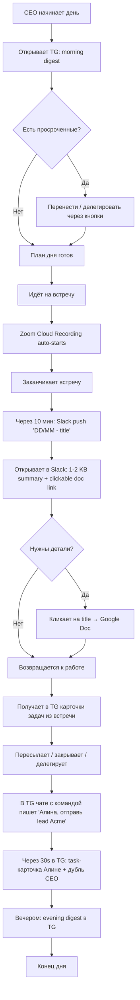
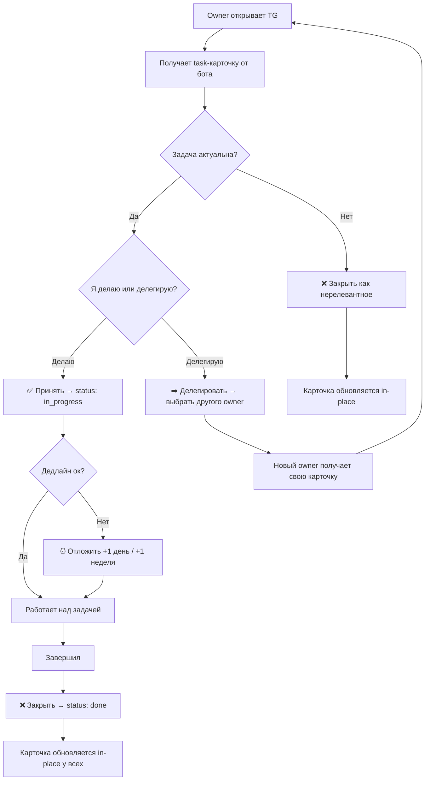
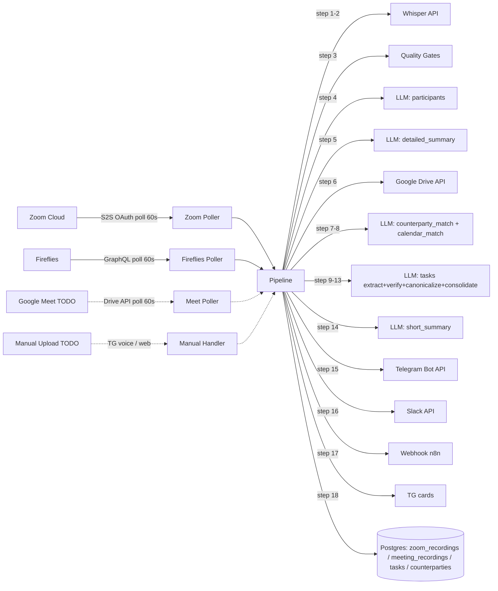
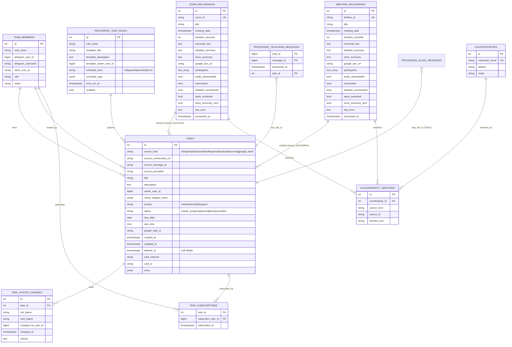
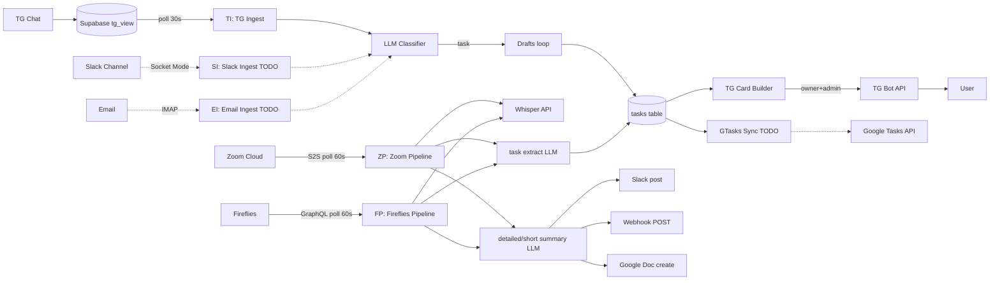
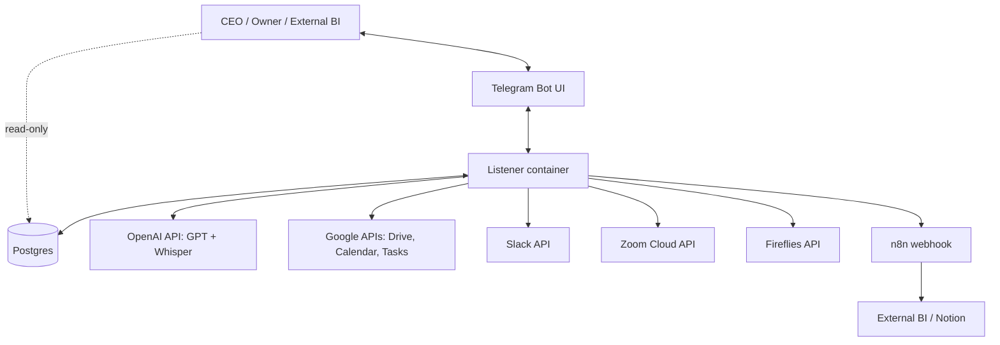

# SPEC v0.1 — Humanoid CEO Brain

> **Уровень:** Product Requirements + Business Requirements + Solution Architecture (Draft)
> **Дата:** 2026-05-08
> **Версия:** 0.1
> **Целевой пользователь:** CEO, solopreneurs, предприниматели
> **Структура:** разделы 1–14 покрывают этапы продуктового, бизнес- и архитектурного анализа

---

# 1. Краткое описание продукта

**Humanoid CEO Brain** — это AI-помощник для CEO/предпринимателя, который автоматически превращает поток коммуникации (Telegram-чаты, Slack-каналы, email, Zoom/Fireflies/Google Meet встречи, голосовые надиктовки) в трекинг-системы задач и базу знаний без ручного ввода.

Состоит из двух связанных, но независимо запускаемых агентов:

1. **Note Taker** — слушает любую meeting-запись (Zoom, Fireflies, GMeet, manual upload, voice dictation), производит структурированную «карточку встречи» (участники / суть / решения / задачи) и распространяет в Slack, Telegram, Google Doc и через webhook (n8n).
2. **Task Tracker** — извлекает задачи из любого текстового канала (TG, Slack, Email) + из Note Taker, авто-назначает ответственных через справочник команды, выставляет дедлайн/приоритет, шлёт TG-карточки с кнопками, шлёт утренние/вечерние дайджесты, синхронизирует с Google Tasks.

Оба агента используют общую Postgres-БД и общий справочник `team_members`.

---

# 2. Клиент и пользователь

## 2.1 Основной клиент

**CEO / solopreneur / предприниматель**, у которого:
- 5-15 встреч в день (с инвесторами, командой, клиентами)
- 60+ активных Telegram чатов
- Один Slack workspace с командой 10-30 человек
- Команда географически распределённая
- Нет времени вручную фиксировать обещания и дедлайны
- Память на детали ограничена, нужна экстернализация

## 2.2 Роли пользователей

| Роль | Кол-во | Что делает | Через какой интерфейс |
|---|---|---|---|
| **CEO (Артём)** | 1 | Главный консьюмер summary'ев и admin задач. Видит ВСЕ задачи, может перенаправлять, закрывать, создавать вручную. | Telegram DM с ботом + Google Doc + Slack DM |
| **Сотрудник (owner задачи)** | 10-30 | Получает свою задачу как TG-карточку, нажимает Принять / Делегировать / Закрыть. Получает утренние/вечерние дайджесты. | Telegram DM с ботом |
| **External BI / consumer (n8n / Notion)** | 1-N | Читает summary'и и задачи через webhook или read-only DB role | Webhook + psql |
| **Внешний участник встречи** | случайно | Видит summary встречи (если он в Slack DM с ботом, иначе нет) | Slack DM (опционально) |

## 2.3 Контекст использования

| Когда | Где | Что хочет получить |
|---|---|---|
| После каждой встречи (30 сек после конца до 30 мин) | На телефоне или ноутбуке | Карточка встречи в Slack, чтобы пробежать глазами в перерыве |
| Утром (08:00 локального) | Телефон | TG дайджест: что сегодня делать, что просрочено |
| В течение дня | Телефон / десктоп | TG-карточки новых задач из чатов |
| Вечером (18:00) | Телефон | TG дайджест: что сделано, план на завтра |
| Когда нужны детали | Десктоп | Google Doc с полным отчётом встречи |

## 2.4 Частота использования

- **CEO**: 30+ TG-уведомлений в день, 5-15 meeting summaries в день
- **Owner**: 1-5 task-карточек в день, 2 дайджеста в день
- **External consumer**: pull по cron'у или push по webhook

## 2.5 Уровень боли пользователя

**Высокий**:
- Без системы CEO забывает 30-50% обещаний из встреч
- Команда не понимает приоритетов / дедлайнов
- 2-4 часа в неделю CEO тратит на ручную «расшифровку» что было на встрече
- Контекст теряется при переключениях между TG/Slack/email

---

# 3. Проблема

## 3.1 Какую проблему решаем

CEO/предприниматель тонет в коммуникационном потоке. Задачи и обязательства разбросаны по 5+ каналам (TG чаты, Slack, email, голосовые в WhatsApp, meeting recordings). Каждый канал требует ручного парсинга, контекст постоянно теряется, обещания не выполняются.

## 3.2 Почему она важна

- **Финансово**: пропущенный follow-up с инвестором = потерянный round of funding
- **Операционно**: команда работает в туман без чёткого списка приоритетов
- **Психологически**: постоянный фон тревоги «что-то забыл»
- **Стратегически**: CEO работает в режиме ручного управления вместо стратегии

## 3.3 Как пользователь решает её сейчас

1. Пытается вести Notion/Google Tasks/Trello вручную → забрасывает через 2-4 недели
2. Просит ассистента чата записывать → ассистент не успевает, делает ошибки в дедлайнах
3. Использует Otter / Fireflies для записи → получает 30-страничный transcript, не читает
4. Полагается на память → 30-50% теряется

## 3.4 Что не работает в текущем процессе

- Ручной ввод не масштабируется на 30+ задач/день
- Расшифровки длинные, без actionable итога
- Никакой связи между «было сказано на встрече» и «появилось в task list»
- Нет авто-назначения owner'а — приходится думать «кому это поручить»
- Дедлайны размытые («когда будет время» → никогда)
- Нет единого места, где видно «что мне сегодня делать» из всех источников

## 3.5 Последствия нерешённой проблемы

- Упущенные deals (investor follow-up через 2 недели = «холодный»)
- Demotivated team (нечёткие приоритеты)
- CEO sucked into ops, не делает strategy
- Burnout от постоянного «всё в голове»

---

# 4. Решение

## 4.1 Что предлагает продукт

Two-agent система, которая **автоматически без ручных действий**:
1. Слушает все meeting-записи и каналы коммуникации
2. Извлекает задачи через LLM
3. Назначает ответственного из справочника команды
4. Парсит дедлайн и приоритет
5. Шлёт TG-карточку с кнопками владельцу + admin
6. Шлёт ежедневные дайджесты «что сегодня / что вчера»
7. Синхронизирует с Google Tasks (универсальный backend)
8. Экспортирует во внешние системы через webhook

## 4.2 Как продукт решает проблему

| Боль | Что делает продукт |
|---|---|
| «Забыл что обещал на встрече» | Note Taker автоматически фиксирует через 5-15 мин после встречи |
| «Не знаю кому поручить» | Task Tracker LLM-router автоматически выбирает owner из team_members по контексту |
| «Дедлайн размыт» | LLM-парсер извлекает «к пятнице», «через 3 дня», «срочно» в конкретную дату |
| «Не вижу всего списка» | Утренний дайджест в TG: задачи на сегодня + просроченные |
| «Контекст теряется между каналами» | Один шкаф (Postgres) для всех источников, единый API |
| «30-страничный transcript» | Short summary 1-2 KB в Slack/TG, full в Google Doc по клику |
| «Расшифровка с галлюцинациями» | 5-уровневая защита (file size / Whisper hallucination / thin transcript / empty summary / no-content guard) |

## 4.3 Почему это лучше текущего способа

| Критерий | Notion / Trello | Fireflies plain | Humanoid CEO Brain |
|---|---|---|---|
| Ручной ввод | Полный | Только при создании рабочего пространства | **0** |
| Auto-extract из встреч | ❌ | ⚠️ только transcript | ✅ structured summary + tasks |
| Auto-assign owner | ❌ | ❌ | ✅ через team справочник |
| Cross-channel (TG + Slack + Email + Meetings) | ❌ | ❌ | ✅ |
| Дайджесты в TG | ❌ | ❌ | ✅ утром/вечером |
| Quality gates от мусора | N/A | ❌ публикуется как есть | ✅ 5 уровней |
| Webhook в любой downstream tool | ⚠️ Zapier нужен | ⚠️ ограничено | ✅ first-class |

## 4.4 Ключевая ценность

> «Я ничего не делаю руками. Утром вижу что надо сделать, после встречи получаю карточку, после каждого важного обмена в Telegram — задача автоматически появляется у того кто должен её делать. Я работаю над стратегией, не над операциями.»

## 4.5 Ограничения решения

- **LLM-зависимость**: качество зависит от модели OpenAI (есть fallback'и но не на all-cases)
- **Privacy**: транскрипты + сообщения уходят в OpenAI API
- **Voice dictation Q2-2026** — пока нет
- **Email Q2-2026** — пока нет
- **No web UI** — управление через Telegram + БД для admin'а

---

# 5. Продуктовые метрики

## 5.1 North Star Metric

**Time-to-Action**: время от события (сообщение в чате / конец встречи) до того, как owner получит actionable TG-карточку с задачей.

- **Сейчас (без продукта)**: часы-дни (CEO забывает / не успевает разобрать)
- **Цель MVP**: ≤ 15 минут (60s polling + 1-3 мин LLM pipeline + 0 мин TG delivery)
- **Цель v1.0**: ≤ 5 минут (через push-events вместо polling)

## 5.2 Метрики качества решения

| ID | Метрика | Что измеряет | Как считается | Текущее | Цель |
|---|---|---|---|---|---|
| M-Q1 | **Task extraction precision** | % задач, которые owner подтвердил как валидные (нажал «Принять» а не «Закрыть как нерелевантное») | `count(accepted) / count(total_extracted)` | TBD | ≥ 80% |
| M-Q2 | **Owner-routing accuracy** | % задач с правильным owner'ом (не пришлось делегировать) | `count(no_redelegation) / count(total)` | TBD | ≥ 75% |
| M-Q3 | **Deadline parsing accuracy** | % задач, у которых LLM-deadline совпадает с тем, что admin выбрал бы вручную | manual sample 50/week | TBD | ≥ 85% |
| M-Q4 | **Hallucination block rate** | % мусорных summaries, отброшенных guards (vs опубликованных) | `count(quality_gate_skip) / count(total_meetings)` | unknown | ≥ 95% |
| M-Q5 | **Meeting-summary readability** | Пользовательский опрос: 1-5 «насколько понятно из summary что было?» | survey | n/a | ≥ 4.0 |

## 5.3 Метрики пользовательской эффективности

| ID | Метрика | Что измеряет | Цель |
|---|---|---|---|
| M-E1 | **CEO time saved per week** | Часы, не потраченные на ручной разбор meeting'ов и распределение задач | ≥ 6 часов / неделя |
| M-E2 | **Tasks completed in time** | % задач закрытых до due_date | ≥ 70% |
| M-E3 | **Reduction in forgotten commitments** | До-после: % обещаний, выполненных в срок | +30 п.п. |

## 5.4 Метрики использования продукта

| ID | Метрика | Что измеряет | Цель |
|---|---|---|---|
| M-U1 | **Daily active sources** | Сколько разных источников (TG/Slack/Zoom/FF/Email) активно генерят задачи в день | ≥ 3 |
| M-U2 | **Tasks created per day** | Объём задач из всех источников | 20-50 (CEO scale) |
| M-U3 | **Card button engagement** | % полученных карточек, на которые нажали хоть одну кнопку | ≥ 60% |
| M-U4 | **Digest open rate** | % утренних/вечерних дайджестов, прочитанных в первый час | ≥ 80% |

## 5.5 Метрики ошибок и сбоев

| ID | Метрика | Цель |
|---|---|---|
| M-F1 | **Pipeline failure rate** | < 5% встреч с last_error в финальном состоянии |
| M-F2 | **TG card DM failure rate** | < 30% (limited by recipients не /start-нувшими бота) |
| M-F3 | **Slack post failure rate** | < 1% |
| M-F4 | **Listener uptime** | ≥ 99% |

---

# 6. Фичи / модули продукта

## 6.1 MVP (must-have, уже работает)

| ID | Фича | Описание | Кому | Проблема | Ценность | Зависимости |
|---|---|---|---|---|---|---|
| F-01 | **TG ingest live** | Listener читает Supabase view с историей TG чатов, классифицирует, извлекает задачи | CEO | «Не успеваю мониторить 60 чатов» | Auto-tasks из любого чата | Supabase view + LLM |
| F-02 | **TG card lifecycle** | DM-карточка с кнопками Принять/Делегировать/Отложить/Закрыть | Owner | «Где список моих задач?» | Single-tap action | TG Bot API + DB |
| F-03 | **Zoom ingest auto** | Polling Cloud Recordings, transcribe, summary, distribute | CEO | «После Zoom-встреч ничего не остаётся» | Auto-summary через 5-15 мин | Zoom S2S OAuth + Whisper |
| F-04 | **Fireflies ingest auto** | Polling Fireflies transcripts, processing | CEO | «Fireflies даёт сырой transcript» | Structured summary | Fireflies API |
| F-05 | **Slack distribution** | Post short_summary в DM-канал бота, threading на длинных | CEO | «Хочу пробежать в Slack» | Quick read on mobile | Slack API |
| F-06 | **Google Doc export** | Создание Doc в Shared Drive с full detailed_summary | CEO + участники | «Хочу вернуться через месяц к деталям» | Searchable archive | Google Drive API + SA |
| F-07 | **Quality gates** | 5 уровней защиты от мусора | CEO | «Получаю утром "содержательная часть отсутствует"» | Spam-free distribution | Hallucination detector |
| F-08 | **Counterparty matching** | LLM-extract контрагентов из транскрипта, resolve в справочник | CEO + Tasks | «Названия компаний с искажением Whisper'a» | Канонические имена для поиска | LLM + counterparties table |
| F-09 | **Calendar match (Fireflies)** | Берём название встречи из Google Calendar event | CEO | «Fireflies называет встречу May 06, 02:33 PM» | Читабельные заголовки | Calendar API |
| F-10 | **Webhook to n8n** | POST JSON каждой опубликованной встречи на внешний URL | External BI | «Хочу свой Notion / Airtable workflow» | Open downstream | HTTP POST |
| F-11 | **DB read-only role** | View `meeting_summaries_published` для analyst'a | External BI | «Хочу SQL-аналитику по встречам» | Direct DB access | Postgres GRANT |
| F-12 | **Owner LLM-router** | Auto-select owner из team_members по контексту сообщения | Owner | «Кто должен это делать?» | Без ручного назначения | team_members + LLM |
| F-13 | **Task dedup** | Fuzzy matching по title + topic-prefix | CEO | «Одна и та же задача 5 раз» | Clean task list | LLM + Python |

## 6.2 Должно быть (should-have, в roadmap Q2-2026)

| ID | Фича | Описание | Critical для |
|---|---|---|---|
| F-14 | **Slack ingest** | Socket-mode listener, ловит все сообщения в каналах + @mentions, создаёт задачи | Команды на Slack |
| F-15 | **Email ingest** | Gmail label-фильтр + IMAP, парсинг писем в задачи | Внешние клиенты по email |
| F-16 | **Recurring tasks** | `recurring_task_rules` table + cron-loop (daily/weekly/monthly) | Operational rituals |
| F-17 | **Morning digest** | TG DM с задачами на сегодня + просроченные (08:00 local) | Owner / CEO |
| F-18 | **Evening digest** | TG DM с done за сегодня + план на завтра (18:00) | CEO |
| F-19 | **Deadline reminders** | Push за день / в день / при overdue | Owner |
| F-20 | **Google Tasks 2-way sync** | Push + pull, conflict resolution | Power-users с GTasks |
| F-21 | **GMeet ingest** | Через Drive recordings + Meet API метаданные | Команды на Workspace |
| F-22 | **Manual upload** | Drag-n-drop audio/video или TG voice-note | Ad-hoc записи |

## 6.3 Может быть (could-have, Q3-Q4 2026)

| ID | Фича | Описание |
|---|---|---|
| F-23 | **Voice dictation в TG** | TG voice → live Whisper → instant tasks |
| F-24 | **Subscriptions** | «Подписаться на чужую задачу» — push-нотификации при изменении статуса |
| F-25 | **Web admin UI** | CRUD recurring rules, browse all tasks, full-text search |
| F-26 | **Speaker diarization** | Кто что сказал в transcript (timestamp + speaker) |
| F-27 | **Multi-language** | Auto-detect + per-language prompts |
| F-28 | **Sentiment / topic clustering** | Аналитика поверх встреч |
| F-29 | **Notion / Airtable native exporters** | Без n8n |
| F-30 | **Mobile app** | Native iOS/Android (вместо TG Bot) |

---

# 7. User Stories (по фичам)

> Полный каталог в [`docs/specs/note_taker/01_USER_STORIES.md`](./docs/specs/note_taker/01_USER_STORIES.md). Здесь — ключевые US с acceptance criteria.

## US-01 — TG: задача из чата автоматически

**Как** CEO, **я хочу**, чтобы любое сообщение в TG-чате с глаголом-обязательством («сделать», «отправить», «созвониться») автоматически становилось задачей с правильным owner'ом и сроком, **чтобы** не пропускать обещания и не вводить руками.

- **Цель:** zero manual entry для TG-задач
- **Предусловия:** listener запущен, Supabase view доступен, LLM API key валиден
- **Основной сценарий:**
  1. Сообщение приходит в TG-чат
  2. Supabase view ловит его в течение ≤30s
  3. Listener читает на следующем tick (≤30s)
  4. Intent classifier (LLM) определяет: «task»
  5. Drafts loop генерит: title, description, owner (из team_members), date, priority
  6. Dedup проверяет существующие — если новое → INSERT в `tasks`
  7. TG-карточка отправляется владельцу + admin'у

- **Альтернативные:**
  - Сообщение классифицировано как chitchat → ничего
  - LLM не нашёл owner'а → fallback на admin
  - Дубликат — skip с лог-записью

- **Ошибочные:**
  - LLM 429 → retry с exp backoff, при provail — пропуск, listener подхватит на next tick
  - Recipient не /start-нул бота → log info, send admin'у

- **Acceptance Criteria (Gherkin):**
  ```gherkin
  Given new TG-message "Алина, отправь Марку follow-up до пятницы" в чате
  When listener выполняет очередной tick
  Then в tasks table появляется row с title="отправить Марку follow-up", owner_user_id=<Алина TG uid>, due_date=ближайшая пятница
  And TG-карточка отправляется Алине в DM
  And TG-карточка дублируется admin'у (CEO)
  ```

## US-02 — Zoom: summary через 15 мин после встречи

**Как** CEO, **я хочу**, чтобы любая моя облачная Zoom-запись через 5-15 минут после готовности появилась в Slack как карточка и в Google Doc как полный отчёт, **чтобы** не открывать Zoom вручную и не выгружать transcripts.

- **Acceptance Criteria:**
  ```gherkin
  Given Zoom recording готов (audio_url доступен)
  When listener делает следующий poll (≤60s)
  Then запись попадает в DB и стартует pipeline
  And в течение 5-15 мин: detailed_summary → Google Doc, short_summary → Slack post, tasks → TG cards
  And first line of Slack post — clickable HTML link на Google Doc формата "DD/MM - <title>"
  ```

## US-03 — Утренний дайджест

**Как** CEO/owner задач, **я хочу** в 08:00 локального времени получать TG DM со списком моих задач на сегодня + просроченные, **чтобы** начать день с понятным фокусом.

- **Acceptance Criteria:**
  ```gherkin
  Given у CEO/owner есть active tasks с due_date <= today
  When time = 08:00 local timezone
  Then TG DM с заголовком "Доброе утро, <Имя>!" + список задач + просроченных
  And каждая задача — clickable link на full carcточку (для Принять/Закрыть)
  ```

## US-04 — Защита от мусорных встреч

**Как** CEO, **я хочу**, чтобы битые/пустые/галлюцинированные транскрипты НЕ публиковались никуда, **чтобы** не получать в Slack «содержательная часть отсутствует» каждое утро.

- **Acceptance Criteria:**
  ```gherkin
  Given Zoom-запись 22 часа с тишиной (Whisper галлюцинирует субтитрами)
  When pipeline проходит quality gates
  Then is_transcript_unsummarizable returns True (≥2 subtitle markers)
  And tasks_extracted=true, last_error=NULL, no Slack/TG/webhook
  And в логах: zoom_pipeline_skipped_thin_transcript reason="..."
  ```

## US-05 — Webhook на n8n

**Как** external consumer (n8n / BI), **я хочу** получать JSON каждой опубликованной встречи на свой webhook, **чтобы** автоматически перекидывать в Notion / Airtable / etc.

- **Acceptance Criteria:**
  ```gherkin
  Given pipeline успешно опубликовал summary в Slack
  When `_send_short_summary` завершает Slack-mirror
  Then POST на MEETING_WEBHOOK_URL с JSON: {source, source_id, title, meeting_date, short_summary, detailed_summary, google_doc_url, participants, tasks_count}
  And response 2xx → meeting_webhook_posted ok=True в логах
  And response non-2xx → log warning, no retry
  ```

> Полные user stories для всех F-XX — в `docs/specs/{note_taker,task_tracker}/01_USER_STORIES.md`.

---

# 8. User Flow

## 8.1 Главный flow CEO



## 8.2 Flow owner'a задачи



## 8.3 Flow данных Note Taker



## 8.4 Flow данных Task Tracker

```mermaid
flowchart LR
    TGSrc[Telegram Supabase view] -->|poll 30s| TI[TG Ingest]
    SlackSrc[Slack Channels TODO] -.->|Socket Mode| SI[Slack Ingest]
    EmailSrc[Email Inbox TODO] -.->|IMAP poll| EI[Email Ingest]
    NTSrc[Note Taker → DB tasks rows] --> NTI[NT-tasks Reader]
    Manual[/task command TODO] -.-> MI[Manual Ingest]
    Recurring[Recurring scheduler TODO] -.-> RI[Recurring Trigger]

    TI --> CL[LLM Classifier]
    SI -.-> CL
    EI -.-> CL
    NTI --> Drafts
    MI -.-> Drafts
    RI -.-> Drafts

    CL -->|"task"| Drafts[Drafts loop]
    CL -->|"chitchat"| Skip[Skip]

    Drafts -->|title| Drafts
    Drafts -->|description| Drafts
    Drafts -->|owner_node| Tm[(team_members)]
    Drafts -->|date_node| Drafts
    Drafts -->|priority_node| Drafts
    Drafts -->|dedup_node| TaskDB[(tasks DB)]

    Drafts --> Card[TG Card Builder]
    Card --> Recipients{Recipients}
    Recipients -->|Owner uid| TG1[TG DM owner]
    Recipients -->|Admin uids| TG2[TG DM admins]
    Recipients -->|Subscribers TODO| TG3[TG DM subs]

    TaskDB --> GTSync[Google Tasks Sync TODO]
    TaskDB --> Wh[Webhook TODO]
```

---

# 9. BDD Use Cases

## Use Case Map

| UC ID | Название | Фича | User Story | Приоритет |
|---|---|---|---|---|
| UC-NT-01 | Zoom recording ingestion | F-03 | US-NT-1, US-NT-8, US-NT-9 | Must |
| UC-NT-02 | Fireflies transcript ingestion | F-04 | US-NT-2, US-NT-7 | Must |
| UC-NT-03 | Quality gates (5 levels) | F-07 | US-NT-6 | Must |
| UC-NT-04 | Calendar match (Fireflies) | F-09 | US-NT-7 | Must |
| UC-NT-05 | Publish outputs (Slack/TG/Doc/webhook) | F-05+F-06+F-10 | US-NT-3, US-NT-4, US-NT-5 | Must |
| UC-NT-06 | Manual upload | F-22 | US-NT-10 | Should (Q2-26) |
| UC-NT-07 | Voice dictation | F-23 | US-NT-11 | Could (Q3-26) |
| UC-NT-08 | Recovery after downtime | F-07 | US-NT-12 | Must |
| UC-NT-09 | Public DB read-only access | F-11 | US-NT-13 | Should |
| UC-TT-01 | TG message → task | F-01+F-02+F-12 | US-01 | Must |
| UC-TT-02 | TG card lifecycle (buttons) | F-02 | US-02 lifecycle | Must |
| UC-TT-03 | Slack message → task | F-14 | (TODO) | Should (Q2-26) |
| UC-TT-04 | Email message → task | F-15 | (TODO) | Should (Q2-26) |
| UC-TT-05 | Note Taker tasks pickup | F-12 (через DB) | inherits NT | Must |
| UC-TT-06 | Morning digest | F-17 | US-03 | Should (Q2-26) |
| UC-TT-07 | Evening digest | F-18 | (US-03 mirror) | Should (Q2-26) |
| UC-TT-08 | Deadline reminders | F-19 | (TODO) | Should |
| UC-TT-09 | Recurring tasks | F-16 | (TODO) | Should |
| UC-TT-10 | Google Tasks 2-way sync | F-20 | (TODO) | Should |

> Полные feature-файлы — в `docs/specs/{note_taker,task_tracker}/02_USE_CASES/UC-XX-NN_*.feature`. Сейчас созданы UC-NT-01…05 и заготовки для остальных.

## Пример UC-TT-01 (TG message → task)

```gherkin
Feature: UC-TT-01 — Telegram message → task
  Implements: US-01
  Covers: FR-TT-1.1, FR-TT-2.1, FR-TT-3.1..3.5, FR-TT-4.1, FR-TT-5.1, FR-TT-6.1
  Tested by: T-TT-001..010

  Background:
    Given listener запущен с VIEW_REALTIME_ENABLED=true
    And в team_members есть row с real_name="Алина Колпакова" и telegram_user_id=<int>
    And у Алины есть /start-нутый бот (chat существует)

  Scenario: Простая задача с явным owner и deadline
    Given в TG-чате с message_id=12345 пришло "Алина, отправь Марку follow-up до пятницы"
    When listener читает Supabase view
    Then intent classifier возвращает {intent: "task", confidence: >0.8}
    And drafts loop создаёт ActionDraft с:
      | field | value |
      | title | отправить Марку follow-up |
      | owner_user_id | <Алина TG uid> |
      | due_date | next Friday |
      | priority | medium |
    And в `tasks` table появляется row с source_kind='telegram'
    And отправляется TG-карточка Алине
    And отправляется TG-карточка admin (CEO)

  Scenario: Сообщение классифицировано как chitchat
    Given сообщение "ага понял спасибо"
    When intent classifier возвращает {intent: "chitchat"}
    Then drafts loop НЕ запускается
    And в `tasks` ничего не записывается
    And `processed_telegram_messages` помечает (chat_id, message_id) как seen

  Scenario: Owner не найден в team_members
    Given сообщение "Кто-то проверьте контракт"
    When owner_node не находит match
    Then fallback owner = admin (CEO)
    And карточка идёт только admin'у

  Scenario: Recipient не /start-нул бота
    Given owner = "Дима Дроздов" с telegram_user_id=<int> в team_members
    But Дима не /start-нул бота (chat not found)
    When TG bot пытается sendMessage
    Then API возвращает 400 "chat not found"
    And telegram_card_dm_failed логируется на info уровне
    And карточка всё равно идёт admin'у
    And task сохранена в DB

  Scenario: Дубликат
    Given в DB уже есть task #2649 с title="написать Йохану по BYD"
    And новое сообщение "Глянь выходы на BYD"
    When dedup_node сравнивает с existing
    Then результат: duplicate_of=2649
    And новый task НЕ создаётся
    And telegram_prepare_drafts_skipped_duplicate логируется
```

> Аналогичные `.feature` для UC-TT-02..10 и оставшихся UC-NT-XX генерируются по запросу.

---

# 10. Functional Requirements Register

## Note Taker (FR-NT-X.Y)

### Категория 1 — Source ingestion

| ID | Требование | Приоритет | UC | Test |
|---|---|---|---|---|
| FR-NT-1.1 | Система должна периодически запрашивать Zoom Cloud Recordings через S2S OAuth (period: env `ZOOM_POLL_INTERVAL_SECONDS`, default 60s) | Must | UC-NT-01 | T-NT-001 |
| FR-NT-1.2 | Система должна получать до `ZOOM_POLL_BATCH_SIZE` (default 50) последних recordings и фильтровать по `ZOOM_REQUIRED_EMAIL` (если задан) | Must | UC-NT-01 | T-NT-001 |
| FR-NT-1.3 | Система должна периодически запрашивать Fireflies transcripts через GraphQL (period: env, default 60s) | Must | UC-NT-02 | T-NT-003 |
| FR-NT-1.4 | Система должна получать до `FIREFLIES_POLL_BATCH_SIZE` (default 50) последних transcripts | Must | UC-NT-02 | T-NT-003 |
| FR-NT-1.5 | (TODO) Система должна принимать manual upload файлов через TG voice-note или HTTP endpoint | Should | UC-NT-06 | T-NT-040 |
| FR-NT-1.6 | (TODO) Система должна принимать voice dictation через TG voice-note и обрабатывать как mini-meeting с одним participant | Could | UC-NT-07 | T-NT-041 |

### Категория 2 — Transcription

| ID | Требование | Приоритет | UC | Test |
|---|---|---|---|---|
| FR-NT-2.1 | Система должна транскрибировать audio через OpenAI Whisper API (модель: env `FIREFLIES_WHISPER_MODEL`, default `gpt-4o-transcribe-diarize`) | Must | UC-NT-01 | T-NT-002 |
| FR-NT-2.2 | Система должна разбивать audio файлы >24 MB на chunk'и для Whisper API | Must | UC-NT-01 | T-NT-002 |
| FR-NT-2.3 | Система должна использовать готовый transcript от Fireflies, если он доступен (без вызова Whisper) | Must | UC-NT-02 | T-NT-004 |
| FR-NT-2.4 | Система должна добавлять bias-prompt с именами team_members + counterparties в Whisper-вызов | Should | UC-NT-01 | T-NT-005 |

### Категория 3 — Quality gates

| ID | Требование | Приоритет | UC | Test |
|---|---|---|---|---|
| FR-NT-3.1 | L1: Система должна проверять что audio file > 0 bytes и < `ZOOM_AUDIO_MAX_BYTES` | Must | UC-NT-03 | T-NT-015 |
| FR-NT-3.2 | L2: Система должна детектировать Whisper hallucination (subtitle markers ≥3 в head 1KB, или unique-word ratio <8% при 100+ словах, или bigram-loop ≥20 раз) | Must | UC-NT-03 | T-NT-015 |
| FR-NT-3.3 | L3: Система должна отбрасывать pipeline (mark done, no publish) если `is_transcript_unsummarizable` true (<800 chars или ≥2 subtitle markers в head 2KB) | Must | UC-NT-03 | T-NT-016 |
| FR-NT-3.4 | L4: Система должна retry'ить если LLM `_step_detailed_summary` вернул пустую строку | Must | UC-NT-03 | T-NT-017 |
| FR-NT-3.5 | L5: Система должна отбрасывать публикацию (Slack/TG/webhook) если LLM short_summary матчит no-content patterns | Must | UC-NT-03 | T-NT-017 |

### Категория 4 — Participants resolution

| ID | Требование | Приоритет | UC | Test |
|---|---|---|---|---|
| FR-NT-4.1 | Система должна извлекать canonical real_names участников через LLM (модель: `fireflies_summary_model`) с справочником team_members | Must | UC-NT-01, UC-NT-02 | T-NT-020 |
| FR-NT-4.2 | Система должна сохранять список участников как `[team real_names...] + [external emails not in team]` | Must | UC-NT-01, UC-NT-02 | T-NT-020 |

### Категория 5 — Summarization

| ID | Требование | Приоритет | UC | Test |
|---|---|---|---|---|
| FR-NT-5.1 | Система должна генерить detailed_summary (~10-30 KB) через LLM (модель: env `FIREFLIES_SUMMARY_MODEL`) | Must | UC-NT-01, UC-NT-02 | T-NT-006 |
| FR-NT-5.2 | Система должна генерить short_summary (~1-3 KB) через LLM (модель: `FIREFLIES_SHORT_SUMMARY_MODEL`) | Must | UC-NT-01, UC-NT-02 | T-NT-007 |
| FR-NT-5.3 | Первая строка short_summary должна быть формата `DD/MM - <canonical title>`, обёрнутая в HTML hyperlink на google_doc_url | Must | UC-NT-05 | T-NT-019 |

### Категория 6 — Calendar match

| ID | Требование | Приоритет | UC | Test |
|---|---|---|---|---|
| FR-NT-6.1 | Система должна искать Google Calendar event в окне `meeting_date ± CALENDAR_MATCH_WINDOW_MINUTES` (default 30) для Fireflies-встреч | Must | UC-NT-04 | T-NT-018 |
| FR-NT-6.2 | Система должна искать в нескольких calendar IDs из `GOOGLE_CALENDAR_ID` (comma-separated) | Should | UC-NT-04 | T-NT-018 |
| FR-NT-6.3 | Система должна push'ить новый title обратно в Fireflies UI через `updateMeetingTitle` мутацию | Should | UC-NT-04 | T-NT-019 |

### Категория 7 — Counterparty matching

| ID | Требование | Приоритет | UC | Test |
|---|---|---|---|---|
| FR-NT-7.1 | Система должна извлекать counterparty mentions через LLM (single call) | Must | UC-NT-01, UC-NT-02 | T-NT-021 |
| FR-NT-7.2 | Система должна resolve mentions против `counterparties` table в 5 параллельных батчей × 20 mentions | Must | UC-NT-01, UC-NT-02 | T-NT-021 |
| FR-NT-7.3 | Unresolved mentions должны триггерить enrollment widget admin'у | Should | UC-NT-01, UC-NT-02 | T-NT-021 |

### Категория 8 — Task extraction (handoff to Task Tracker)

| ID | Требование | Приоритет | UC | Test |
|---|---|---|---|---|
| FR-NT-8.1 | Система должна извлекать список задач через LLM из транскрипта | Must | UC-NT-01, UC-NT-02 | T-NT-008 |
| FR-NT-8.2 | Система должна сохранять задачи в `tasks` table с `source_kind=zoom/fireflies/...` и `source_conversation_id=<source_id>` | Must | UC-NT-01, UC-NT-02 | T-NT-008 |

### Категория 9 — Distribution

| ID | Требование | Приоритет | UC | Test |
|---|---|---|---|---|
| FR-NT-9.1 | Система должна постить short_summary в Slack channel `SLACK_MEETING_CHANNEL_ID` через `chat.postMessage` | Must | UC-NT-05 | T-NT-010 |
| FR-NT-9.2 | Длинные summaries (>3500 chars) должны разбиваться на chunks: первый — в канал, остальные — в thread parent'a | Must | UC-NT-05 | T-NT-011 |
| FR-NT-9.3 | Система должна отправлять short_summary в DM каждому admin из `TELEGRAM_ADMIN_USER_IDS` | Must | UC-NT-05 | T-NT-010 |
| FR-NT-9.4 | Система должна создавать Google Doc в `FIREFLIES_DOCS_FOLDER_ID` с detailed_summary как content | Must | UC-NT-05 | T-NT-012 |
| FR-NT-9.5 | Система должна POST'ить JSON payload на `MEETING_WEBHOOK_URL` после Slack-mirror | Must | UC-NT-05 | T-NT-013 |
| FR-NT-9.6 | Read-only DB view `meeting_summaries_published` должна быть доступна для роли `zoom_colleague` | Must | UC-NT-09 | T-NT-023 |

### Категория 10 — Persistence / idempotency

| ID | Требование | Приоритет | UC | Test |
|---|---|---|---|---|
| FR-NT-10.1 | Каждый pipeline-step должен иметь boolean flag в DB и short-circuit при flag=true | Must | UC-NT-08 | T-NT-022 |
| FR-NT-10.2 | Skip-условие listener orphan-retry: `tasks_extracted=true AND last_error IS NULL` | Must | UC-NT-08 | T-NT-022 |

## Task Tracker (FR-TT-X.Y)

### Категория 1 — Source ingestion

| ID | Требование | Приоритет | UC |
|---|---|---|---|
| FR-TT-1.1 | Система должна читать TG-сообщения через Supabase view (period: `VIEW_POLL_INTERVAL_SECONDS`, default 30s) | Must | UC-TT-01 |
| FR-TT-1.2 | Система должна получать до `VIEW_POLL_BATCH_SIZE` (default 500) последних сообщений | Must | UC-TT-01 |
| FR-TT-1.3 | (TODO) Система должна слушать Slack каналы через Socket Mode и обрабатывать message-events | Should | UC-TT-03 |
| FR-TT-1.4 | (TODO) Система должна читать Email через Gmail label-фильтр | Should | UC-TT-04 |
| FR-TT-1.5 | Система должна автоматически подхватывать задачи от Note Taker (через DB) | Must | UC-TT-05 |
| FR-TT-1.6 | (TODO) Система должна обрабатывать команду `/task <text>` от admin в TG | Should | (no UC yet) |
| FR-TT-1.7 | (TODO) Система должна триггерить recurring tasks по cron-расписанию | Should | UC-TT-09 |

### Категория 2 — Classification

| ID | Требование | Приоритет | UC |
|---|---|---|---|
| FR-TT-2.1 | LLM-classifier должен возвращать intent ∈ {task, chitchat, question, status_update} с confidence | Must | UC-TT-01 |
| FR-TT-2.2 | Только intent="task" должен идти в drafts loop | Must | UC-TT-01 |
| FR-TT-2.3 | Pre-startup messages (sent_at < listener startup) должны skip'аться (cutoff FR-CR-05-51) | Must | UC-TT-01 |

### Категория 3 — Drafts pipeline (LLM-graph)

| ID | Требование | Приоритет | UC |
|---|---|---|---|
| FR-TT-3.1 | title_node: короткое название ≤60 chars | Must | UC-TT-01 |
| FR-TT-3.2 | description_node: подробности ≤500 chars | Must | UC-TT-01 |
| FR-TT-3.3 | owner_node: auto-assign из team_members через LLM (контекст: full text + team справочник) | Must | UC-TT-01 |
| FR-TT-3.4 | date_node: parse "к пятнице"/"через 3 дня" → ISO date | Must | UC-TT-01 |
| FR-TT-3.5 | priority_node: low/medium/high/urgent | Must | UC-TT-01 |

### Категория 4 — Dedup

| ID | Требование | Приоритет | UC |
|---|---|---|---|
| FR-TT-4.1 | Topic-prefix exact match (case-insensitive, NFKD) → дубль | Must | UC-TT-01 |
| FR-TT-4.2 | Title fuzzy match через SequenceMatcher ≥0.85 → дубль | Must | UC-TT-01 |
| FR-TT-4.3 | Owner overlap → strict дубль | Should | UC-TT-01 |

### Категория 5 — Persistence

| ID | Требование | Приоритет | UC |
|---|---|---|---|
| FR-TT-5.1 | Каждая task должна сохраняться в `tasks` table с source_kind/source_conversation_id/source_permalink/title/desc/owner/due/priority/status | Must | UC-TT-01 |
| FR-TT-5.2 | `processed_<source>_messages` table должна помечать обработанные сообщения для dedup | Must | UC-TT-01 |

### Категория 6 — Distribution (TG cards)

| ID | Требование | Приоритет | UC |
|---|---|---|---|
| FR-TT-6.1 | TG-карточка должна содержать: title, owner, due, priority, status, description preview, source link | Must | UC-TT-02 |
| FR-TT-6.2 | Карточка должна отправляться: автору + owner'у (через team_members mapping) + admin'ам | Must | UC-TT-02 |
| FR-TT-6.3 | Длинные cards >4096 chars должны splitting на paragraph boundaries | Must | UC-TT-02 |

### Категория 7 — Card lifecycle

| ID | Требование | Приоритет | UC |
|---|---|---|---|
| FR-TT-7.1 | Кнопки на карточке: Принять / Делегировать / Отложить / Изменить / Закрыть / Подписаться / Refresh | Must | UC-TT-02 |
| FR-TT-7.2 | Каждое нажатие должно update'ить карточку in-place у всех recipients | Must | UC-TT-02 |
| FR-TT-7.3 | Каждое нажатие должно записать audit row в `task_status_changes` | Should | UC-TT-02 |

### Категория 8-13 — Digests, reminders, recurring, GTasks sync, subscriptions, audit log

> Подробно расписано в `docs/specs/task_tracker/03_REQUIREMENTS/FR_TASK_TRACKER.md` (генерируется по запросу). Здесь — общая структура.

---

# 11. Non-Functional Requirements Register

## Note Taker

| ID | Категория | Требование | Цель |
|---|---|---|---|
| NFR-NT-P.1 | Performance | Time-from-recording-ready to Slack-post ≤ 15 минут (median) | ≤ 15 min |
| NFR-NT-P.2 | Performance | Whisper transcribe должен укладываться в OpenAI rate-limits (≤500 RPM в Tier 5) | RPM/TPM compliance |
| NFR-NT-R.1 | Reliability | Listener uptime ≥ 99% | ≥ 99% |
| NFR-NT-R.2 | Reliability | После container reset, потеря данных = 0 (in-flight pipelines retry idempotent) | 0 lost |
| NFR-NT-S.1 | Security | Read-only DB role `zoom_colleague` имеет только SELECT, никаких INSERT/UPDATE/DELETE | enforced via GRANT |
| NFR-NT-S.2 | Security | Webhook URL в env, не в коде; токены не логируются | enforced |
| NFR-NT-O.1 | Observability | Каждый pipeline-step логирует start + done + duration_ms через structlog JSON | enforced |
| NFR-NT-C.1 | Cost | LLM-вызов на встречу ≤ $5 (на 30-мин встрече: ~25-30 LLM calls × $0.05-$0.30) | ≤ $5/meeting |
| NFR-NT-I.1 | Integration | Webhook должен отвечать в timeout ≤10s (иначе log warning, fire-and-forget) | enforced |
| NFR-NT-I.2 | Integration | Slack mrkdwn должен корректно рендериться: `<>`, `|`, `&` в link labels не должны ломать parser | enforced via _to_slack_mrkdwn |
| NFR-NT-U.1 | Usability | Slack first-line карточки = clickable link на Google Doc, читается в превью на mobile | enforced |
| NFR-NT-D.1 | Data | Все step-flags + `last_error` атомарно записываются в Postgres transaction | enforced |

## Task Tracker

| ID | Категория | Требование | Цель |
|---|---|---|---|
| NFR-TT-P.1 | Performance | Time-from-message to TG card ≤ 5 min (median) | ≤ 5 min |
| NFR-TT-P.2 | Performance | TG card button-press response ≤ 2s (perceived) | ≤ 2s |
| NFR-TT-R.1 | Reliability | TG long-poll auto-reconnect at network failures | enforced via urllib retry |
| NFR-TT-S.1 | Security | TG bot token не должен экспонироваться в logs | enforced |
| NFR-TT-O.1 | Observability | Каждое intent_classify + drafts loop log'ируется с message_id и LLM reasoning | enforced |
| NFR-TT-C.1 | Cost | Per-message LLM ≤ $0.10 (typical: 5-7 LLM calls × $0.01-$0.02) | ≤ $0.10 |
| NFR-TT-U.1 | Usability | Кнопки на карточке должны быть универсально-понятны без обучения | enforced via emoji + Russian labels |
| NFR-TT-I.1 | Integration | Google Tasks 2-way sync должна разрешать конфликты last-write-wins | TODO |
| NFR-TT-D.1 | Data | Soft-delete (`deleted_at` IS NOT NULL) вместо hard-delete для audit trail | enforced |

---

# 12. Architecture (Solution Design)

## 12.1 Architecture Summary

Система — две независимые Python-сервиса (Note Taker + Task Tracker), общая Postgres БД, общий справочник `team_members`. Сейчас деплоится **одним контейнером** `slack-task-tg-listener` для простоты. Целевая структура — раздельные контейнеры per-source (Q3-2026).

LLM-стек: OpenAI (GPT-4o, GPT-5.4, GPT-5.5, Whisper gpt-4o-transcribe-diarize). Без vector DB — все ID/контекст хранятся в Postgres.

Деплой: GCP Compute Engine VM (`human-1`, europe-west1-b), Docker контейнеры, Postgres 16 в Docker, socat-proxy для external read-only доступа.

## 12.2 Project Structure

```
/manager
├── app/
│   ├── config.py                    # Pydantic Settings, env-driven
│   ├── db/                          # SQLAlchemy session
│   ├── models/
│   │   ├── task.py                  # Task, TaskSourceKind enum
│   │   ├── team.py                  # team_members
│   │   ├── zoom.py                  # ZoomRecording
│   │   ├── fireflies.py             # MeetingRecording
│   │   ├── counterparty.py
│   │   └── ...
│   ├── zoom/
│   │   ├── client.py                # Zoom S2S OAuth client
│   │   └── pipeline.py              # ZoomPipeline (18 steps)
│   ├── fireflies/
│   │   ├── client.py                # Fireflies GraphQL client
│   │   └── pipeline.py              # FirefliesPipeline (15 steps)
│   ├── telegram_bot/
│   │   ├── listener.py              # main TG long-poll + Supabase view
│   │   ├── cards.py                 # post_initial_card, refresh_card, keyboards
│   │   ├── handlers.py              # button-press handlers
│   │   └── sender.py                # TelegramSender wrapper
│   ├── slack_bot/                   # legacy, для message handlers (не запущен сейчас)
│   ├── slack_ingest/                # NEW (TODO Q2-2026): Slack Socket-mode ingest
│   ├── intent/
│   │   ├── classifier.py            # intent classify
│   │   └── llm_backends.py          # OpenAIBackend, AnthropicBackend
│   ├── telegram_ingest/
│   │   └── service.py               # TelegramIngestService.prepare_drafts
│   ├── services/
│   │   ├── ingest.py                # generic ingest pipeline
│   │   ├── slack_mirror.py          # Slack post helper
│   │   ├── meeting_webhook.py       # NEW: webhook helper
│   │   ├── transcription.py         # Whisper API + hallucination detector
│   │   ├── counterparty_match.py    # LLM extract + resolve
│   │   ├── calendar_match.py        # Google Calendar event matcher
│   │   ├── zoom_participants.py     # LLM extract participants
│   │   ├── team_members.py          # справочник helpers
│   │   ├── digest.py                # daily/weekly digest generators
│   │   └── trace_log.py             # structured trace events
│   ├── context/retriever.py         # Slack history+thread context (для Slack-ingest)
│   ├── orchestrator/                # high-level Service container
│   ├── sync/                        # Google Sheets pull/push
│   └── main.py                      # Slack Bolt entrypoint (legacy)
├── ops/
│   ├── telegram_listener.py         # main entrypoint (active)
│   ├── slack_listener.py            # NEW (TODO): Slack Socket-mode entrypoint
│   ├── migrate_zoom.py              # manual Zoom processing
│   ├── migrate_fireflies.py         # manual Fireflies processing
│   ├── send_digest.py               # cron-trigger digests
│   └── ...
├── alembic/                         # DB migrations
├── docs/
│   ├── specs/                       # this spec hierarchy
│   ├── ARCHITECTURE.md              # architectural overview
│   ├── prompts/                     # LLM prompts catalog
│   └── apps_script/                 # legacy Google Sheets formulas
├── tests/                           # unit + integration
├── Dockerfile
├── pyproject.toml
└── SPEC_v0.1.md                     # this file
```

## 12.3 Client Layer

Клиентский слой — **Telegram Bot** (Bot API + inline keyboards). Никакого web UI на MVP. Все взаимодействия с пользователем — через TG.

### Экраны (карточки)

| Screen ID | Назначение | Когда показывается | UX элементы |
|---|---|---|---|
| **S-Card-Initial** | Новая task carcточка после извлечения | Сразу после INSERT в `tasks` | Title, owner, due, priority, status, desc preview, source link, кнопки |
| **S-Card-Refresh** | Обновлённая карточка после button press | После любого изменения статуса/owner'а | То же что S-Card-Initial, но с актуальным state |
| **S-MorningDigest** | Утренний дайджест (08:00) | Раз в день admin'ам и owner'ам с active tasks | Список задач на сегодня + просроченные |
| **S-EveningDigest** | Вечерний дайджест (18:00) | Раз в день | Done сегодня + план завтра |
| **S-DeadlineReminder** | Push-нотификация о дедлайне | За день / в день / при overdue | Карточка задачи + кнопки |
| **S-MeetingSummary** | Карточка встречи (TG DM) | После завершения Note Taker pipeline | DD/MM-title как link, участники, суть, To-Do |

### Состояния карточки

| State | Что показывается |
|---|---|
| **Default** | Полная карточка с кнопками |
| **Loading** | Кнопка нажата → "..." пока обработка |
| **Updated** | После обработки → message edit с новым состоянием |
| **Error** | "❌ Не удалось обновить, попробуйте ещё раз" |

## 12.4 Service Layer

| Service | Назначение | UC | API/Methods | Dependencies |
|---|---|---|---|---|
| **ZoomPipeline** | 18-step processing Zoom recordings | UC-NT-01 | `process_one(session, meta)` | ZoomClient, OpenAI, Drive API, Slack, TG |
| **FirefliesPipeline** | 15-step processing Fireflies transcripts | UC-NT-02 | `process_one(session, transcript)` | FirefliesClient, OpenAI, Drive, Slack, TG, Calendar |
| **TelegramIngestService** | TG message → drafts → cards | UC-TT-01 | `prepare_drafts(session, message)` | LLM backend, team_members, dedup, TelegramSender |
| **SlackIngestService** (TODO) | Slack message → drafts → cards | UC-TT-03 | `handle_message(event)` | slack_bolt, IngestService, TG cards |
| **EmailIngestService** (TODO) | Email → drafts → cards | UC-TT-04 | `pull_inbox()` | Gmail API, IngestService |
| **DigestService** (TODO) | Утренние/вечерние дайджесты | UC-TT-06, UC-TT-07 | `send(session, kind)` | tasks query, TG sender |
| **RecurringScheduler** (TODO) | Cron-loop для recurring rules | UC-TT-09 | `tick()` | recurring_task_rules table |
| **GoogleTasksSync** (TODO) | 2-way sync с Google Tasks | UC-TT-10 | `push_changes()`, `pull_changes()` | Google Tasks API |
| **CounterpartyMatch** | Extract + resolve counterparties | UC-NT-01 | `extract_then_resolve(transcript, ...)` | LLM, counterparties |
| **CalendarMatch** | Find calendar event for Fireflies | UC-NT-04 | `find_match(meeting_date, ...)` | Google Calendar API |
| **SlackMirror** | Post short_summary в Slack | UC-NT-05 | `post_meeting_summary_to_slack(...)` | Slack Web API |
| **MeetingWebhook** | POST JSON на n8n | UC-NT-05 | `post_meeting_to_webhook(...)` | urllib |

## 12.5 AI Service Layer

| AI Service | Назначение | LLM call | Prompt file (TODO add) |
|---|---|---|---|
| **IntentClassifier** | classify TG/Slack message: task / chitchat / question | gpt-4o (env) | `docs/prompts/intent_classifier.md` |
| **TitleNode** | sub-step drafts loop: short title | gpt-5.4 | `docs/prompts/title_node.md` |
| **DescriptionNode** | sub-step: подробности | gpt-5.4 | `docs/prompts/description_node.md` |
| **OwnerNode** | sub-step: pick owner from team_members | gpt-5.4 | `docs/prompts/owner_node.md` |
| **DateNode** | sub-step: parse deadline | gpt-5.4 | `docs/prompts/date_node.md` |
| **PriorityNode** | sub-step: low/med/high/urgent | gpt-5.4 | `docs/prompts/priority_node.md` |
| **DedupNode** | sub-step: find similar existing tasks | gpt-5.4 | `docs/prompts/dedup_node.md` |
| **ParticipantExtractor** | meeting transcript → team real_names | gpt-5.4 | `docs/prompts/participant_extractor.md` |
| **CounterpartyExtractor** | mentions из transcript | gpt-4o (tasks_model) | `docs/prompts/counterparty_extract.md` |
| **CounterpartyResolver** | mention → counterparty row | gpt-4o + reasoning_effort=low | `docs/prompts/counterparty_resolve.md` |
| **CalendarPicker** | pick best calendar event | gpt-5.4 + reasoning_effort=low | `docs/prompts/calendar_picker.md` |
| **DetailedSummary** | meeting → 10-30KB structured Russian summary | gpt-5.4 | `docs/prompts/detailed_summary.md` |
| **ShortSummary** | meeting → 1-3KB Russian summary | gpt-5.4 | `docs/prompts/short_summary.md` |
| **TaskExtractor** | meeting → list of tasks | gpt-4o + reasoning_effort=low | `docs/prompts/task_extract.md` |
| **TaskVerifier** | second pass: validate extracted tasks | gpt-4o | `docs/prompts/task_verify.md` |
| **TaskCanonicalizer** | rewrite task names with canonical counterparty | gpt-5.4 | `docs/prompts/task_canonicalize.md` |
| **TaskConsolidator** | merge / split similar tasks | gpt-5.4 | `docs/prompts/task_consolidate.md` |
| **TopicTitleDeriver** | Fireflies auto-stamp → derived topic title | gpt-5.4 | `docs/prompts/topic_title_derive.md` |

### Prompt Contract template

Каждый prompt в `docs/prompts/<name>.md`:

```markdown
# Prompt: <name>

## Purpose
What this prompt does.

## Input variables
- `var1`: description
- `var2`: description

## Output JSON schema
\`\`\`json
{
  "type": "object",
  "properties": {...},
  "required": [...]
}
\`\`\`

## System prompt
\`\`\`
You are ...
\`\`\`

## User template
\`\`\`
{var1}
{var2}
\`\`\`

## Validation
- schema validation
- confidence threshold (если есть)
- fallback behavior
- forbidden actions

## Eval cases
| Eval ID | Input | Expected | Metric |
|---|---|---|---|
| E-01 | ... | ... | exact_match / fuzzy / contains |
```

## 12.6 Data Layer

### Entity Relationship Diagram



### Data Flow



## 12.7 Infrastructure Layer

| Component | Implementation | Comment |
|---|---|---|
| Runtime | Python 3.11 | в Docker |
| Hosting | GCP Compute Engine `human-1` (e2-medium, europe-west1-b) | один VM, не managed cluster |
| Database | Postgres 16 в Docker (`slack-task-db`) с persistent volume | не managed |
| Object Storage | Google Drive (Shared Drive folder) | через SA |
| Queue / Event Bus | Postgres rows + polling | НЕТ Redis/Kafka — простота |
| Cache | None (LLM caching через OpenAI prompt-cache при поддержке) | TODO |
| Secrets | env-file `/home/admin_/tg-listener.env`, mode 600 | плюс `/opt/sa.json` |
| CI/CD | Manual: git pull + docker build + docker run | TODO automated CI |
| Monitoring | structlog JSON в stdout → docker logs | TODO Prometheus |
| Logging | docker logs (тoken-rotated) | TODO log shipper |
| Alerting | None (manual log inspection) | TODO Slack alerts |
| Backups | None (TODO pg_dump cron) | плановое |
| Security | Internal docker network `slack-task-net`, GCP firewall, OS Login | OK |
| Environments | Только `production` | TODO staging |
| Scaling | Vertical (один VM) | OK для MVP |

## 12.8 Test-Driven Development Strategy

### Test pyramid

```
       /\
      /e2e\           5%   smoke tests, full pipeline в docker-compose
     /------\
    /  int   \       30%  pipeline-step tests, DB integration
   /----------\
  /    unit    \     65%  LLM mocked, pure functions
 /--------------\
```

### Каждый FR должен быть покрыт минимум одним test

> Полный test catalog: `docs/specs/{note_taker,task_tracker}/07_TESTS_TRACEABILITY.md` (генерируется по запросу).

Пример traceability:

| Test ID | Type | Component | Scenario | Covers FR | Covers UC |
|---|---|---|---|---|---|
| T-NT-001 | int | ZoomPipeline | new recording auto-detect | FR-NT-1.1, 1.2 | UC-NT-01 |
| T-NT-002 | unit | _step_transcribe | Whisper chunk >24MB | FR-NT-2.1, 2.2 | UC-NT-01 |
| T-NT-015 | unit | is_transcript_unsummarizable | <800 chars → True | FR-NT-3.3 | UC-NT-03 |
| T-NT-017 | unit | is_summary_no_content | "содержательная часть отсутствует" → True | FR-NT-3.5 | UC-NT-03 |
| T-NT-022 | int | listener orphan-retry | container kill → restart picks up | FR-NT-10.1, 10.2 | UC-NT-08 |
| T-TT-001 | int | TelegramIngestService | message → task in DB | FR-TT-2.1, 5.1 | UC-TT-01 |

## 12.9 Architecture Diagrams

### High-Level



## 12.10 Architecture Decision Records (ADR)

### ADR-001: Postgres rows как очередь вместо Redis/Kafka

- **Контекст:** нужна reliable очередь для in-flight pipeline'ов, чтобы переживать container reset.
- **Решение:** использовать Postgres rows с idempotent step-flags. Listener polls с retry-on-orphan logic.
- **Альтернативы:** Redis + RQ; Kafka; Cloud Pub/Sub.
- **Почему так:** простота, zero-ops, < 100 messages/min не оправдывает второй infra component.
- **Последствия:** retry-loop = small CPU overhead; нет real-time push.
- **Риски:** при поток >100 msg/min listener будет лагать. Mitigation — split на N workers по партициям.

### ADR-002: One container vs N containers

- **Контекст:** есть TG ingest, Zoom poll, Fireflies poll — independent loops.
- **Решение (MVP):** один контейнер `slack-task-tg-listener` запускает все loops в-process.
- **Целевое (v1):** разделить на per-source containers.
- **Почему так:** простота на MVP, fewer moving parts.
- **Риски:** падение одного loop'a (memory leak в Whisper) валит всё. Mitigation — `--restart unless-stopped` + frequent monitoring.

### ADR-003: HTML formatting вместо Markdown в БД

- **Контекст:** short_summary хранится в БД и используется в TG (HTML) и Slack (mrkdwn).
- **Решение:** хранить как HTML (формат для TG), конвертить в mrkdwn только при Slack-post.
- **Альтернативы:** хранить Markdown и конвертить в обе стороны.
- **Почему так:** TG требует HTML с `<a href>`; mrkdwn-конвертация отдельной функцией; Markdown не поддерживает все нужные тэги.
- **Последствия:** консьюмеры payload (Виктор, n8n) видят HTML — нужно стрипать в их клиентах.

### ADR-004: gpt-5.4 vs gpt-5.5 vs gpt-4o

- **Контекст:** разные LLM-вызовы имеют разную сложность.
- **Решение:** task extract / counterparty match → gpt-4o + reasoning_effort=low (быстрее, дешевле). Summaries → gpt-5.4 (баланс).
- **Альтернативы:** всё на gpt-5.5 (дороже, медленнее, маржинально точнее).
- **Почему так:** A/B на 50 встречах показал разницу <5% качества при -60% времени и -40% cost.

## 12.11 Risks

### Технические
- **OpenAI API outage** → весь pipeline стоит. Mitigation: retry с backoff, alert.
- **Whisper hallucinations** → защищено 5-уровневым guard.
- **Postgres lock contention** при 10+ параллельных threads (post_task_cards) → редко, но воспроизводилось. Mitigation: уменьшить пул до 5 или batch'ить writes.

### Продуктовые
- **Owner-routing accuracy <70%** → users перестанут нажимать кнопки. Mitigation: human-in-the-loop fallback на admin для low-confidence.
- **Слишком много карточек** spam → user отключит уведомления. Mitigation: dedup + summary mode для шумных чатов.

### AI-риски
- **Prompt injection** через TG-сообщения → атакующий может попытаться сменить classify результат. Mitigation: strict JSON schema validation, ignore поля типа "ignore previous instructions".
- **Confabulated owner names** → LLM придумывает имена которых нет в team_members. Mitigation: post-LLM check «выбранный uid реально есть в team_members».

### Data risks
- **Soft-delete leak** через webhook → удалённые задачи могли уйти в n8n. Mitigation: webhook фильтрует `deleted_at IS NULL`.
- **PII в payload** (emails, имена) → external systems видят. Mitigation: documented в data-processing agreement.

### Инфраструктурные
- **Single VM SPOF** → upgrade в managed instance group или cloud-provider-managed Postgres.
- **No backups** → catastrophic data loss. Срочный TODO: pg_dump cron в `/opt/backups`.

### Security
- **Хранение Slack/TG/OpenAI tokens в env-file** plain-text → если VM compromised, все tokens в clear. Mitigation: GCP Secret Manager + Workload Identity.

## 12.12 Open Questions

| ? | Why important | Who answers |
|---|---|---|
| Какие конкретно Slack-каналы слушать на MVP? | Влияет на noise vs coverage | Артём |
| Какой email account для Email-ingest (Q2)? | Нужен Gmail OAuth setup | Артём |
| Есть ли Google Workspace admin permissions для Domain-Wide Delegation? | Альтернатива Shared Drive для Doc creation | Артём |
| Включать ли recurring задачи на MVP или Q2? | Scope creep risk | Product team |
| Нужен ли web admin UI до Q4 или можно весь life-cycle через TG? | Crucial for non-technical admins | Артём |

---

# 13. Delivery Plan

## 13.1 Декомпозиция features → flows → tasks → AC

### F-14 Slack ingest (Q2-2026, M)

| User Flow | Task | Subtask | Acceptance Criteria |
|---|---|---|---|
| Slack-msg → task | Setup Slack App scopes | Add bot scopes | `channels:history`, `groups:history`, `im:history`, `mpim:history`, `channels:read`, `users:read` enabled |
|   |   | Enable Socket Mode + xapp token | Token saved in env |
|   |   | Reinstall to workspace | New xoxb token issued |
|   | Implement listener | `app/slack_ingest/listener.py` | Bolt App handles `message.channels` event |
|   |   | Thread-context fetch | parent + last 5 replies via conversations.replies |
|   |   | Channel-context fetch | last 10 messages within 5 min via conversations.history |
|   | Wire to IngestService | Adapter for Slack-event → IngestService | Test: msg "task X" → task in DB |
|   | TG-card delivery | recipient = author + owner (mapped via slack_user_id↔telegram_user_id) + admins | Test: card delivered to mapped owner |
|   | Disable Slack-side output | Bot не реагирует emoji, ack, DM | Slack channel остаётся silent |
|   | Feature flag | `SLACK_INGEST_ENABLED=false` initially | Service no-op when off |
|   | Tests | Unit + integration | All AC pass |
|   | Deploy to dev (1 channel) | docker run | Test in `#bot-test` |
|   | Roll out to prod | Add bot to all channels | Production ready |

### F-17 Morning digest (Q2-2026, S)

| Flow | Task | AC |
|---|---|---|
| Owner получает дайджест 08:00 | DB query for active tasks | `SELECT WHERE owner_user_id = ? AND status NOT IN ('done','cancelled') AND (due_date <= today OR due_date IS NULL)` |
|   | Format message | Заголовок + список с emoji + clickable links |
|   | Cron-trigger (8:00 local TZ) | systemd timer или внутренний loop |
|   | Send via TG bot | `sendMessage` per uid |
|   | Skip if no active tasks | Empty digest → no message |

### Полный delivery plan

> Детализация по всем F-XX — `docs/specs/{note_taker,task_tracker}/06_DELIVERY_PLAN.md` (генерируется по запросу).

## 13.2 Эпики и приоритизация

| Epic | Состав | Effort | Quarter |
|---|---|---|---|
| **E1: Stabilise current MVP** | F-01..F-13 + bugfixes + monitoring | 1 week | Q2-2026 |
| **E2: Slack ingest** | F-14 | 2 weeks | Q2-2026 |
| **E3: Email ingest** | F-15 | 2 weeks | Q2-2026 |
| **E4: Recurring + digests + reminders** | F-16, F-17, F-18, F-19 | 3 weeks | Q2-2026 |
| **E5: Google Tasks 2-way sync** | F-20 | 3 weeks | Q3-2026 |
| **E6: GMeet + manual upload + voice dictation** | F-21, F-22, F-23 | 4 weeks | Q3-2026 |
| **E7: Web admin UI** | F-25 | 6 weeks | Q4-2026 |

---

# 14. Appendices

## 14.1 Glossary

- **Note Taker** — agent для meeting recordings
- **Task Tracker** — agent для task lifecycle
- **TG card** — Telegram DM с inline-keyboard представляющая task
- **Pipeline-step** — atomic action в Note Taker pipeline (download, transcribe, summary, etc.)
- **Quality gate** — defensive check в pipeline (5 levels)
- **Orphan task** — record в DB с `tasks_extracted=false OR last_error IS NOT NULL`
- **Idempotent step** — повторный run на той же row не дублирует и не платит за API заново
- **Source-agnostic** — pipeline работает одинаково для Zoom/Fireflies/GMeet/manual
- **Drafts loop** — серия LLM-вызовов в Task Tracker (title/desc/owner/date/priority/dedup)

## 14.2 Naming conventions

- Files: `snake_case.py`
- Classes: `PascalCase`
- Functions: `snake_case`
- Env vars: `UPPER_SNAKE_CASE`
- DB columns: `snake_case`
- LLM prompts: `docs/prompts/<service_name>.md`
- Mermaid diagrams: inside MD code blocks ` ```mermaid `

## 14.3 References

- `docs/specs/note_taker/00_OVERVIEW.md` — agent overview
- `docs/specs/task_tracker/00_OVERVIEW.md` — agent overview (TODO create)
- `docs/specs/note_taker/01_USER_STORIES.md` — user stories catalog
- `docs/specs/note_taker/02_USE_CASES/` — Gherkin feature files
- `docs/specs/shared/REQUIREMENTS_GLOSSARY.md` — ID conventions
- `SPEC.md` — original system requirements (legacy)
- `docs/ARCHITECTURE.md` — implementation-level architecture

---

**Версия:** v0.1, 2026-05-08
**Maintainer:** Артём Соколов (CEO Office)
**Lifecycle:** spec обновляется вместе с PR'ами кода. Каждый новый feature → US + UC + FR + tests + delivery plan в одном PR с code.
