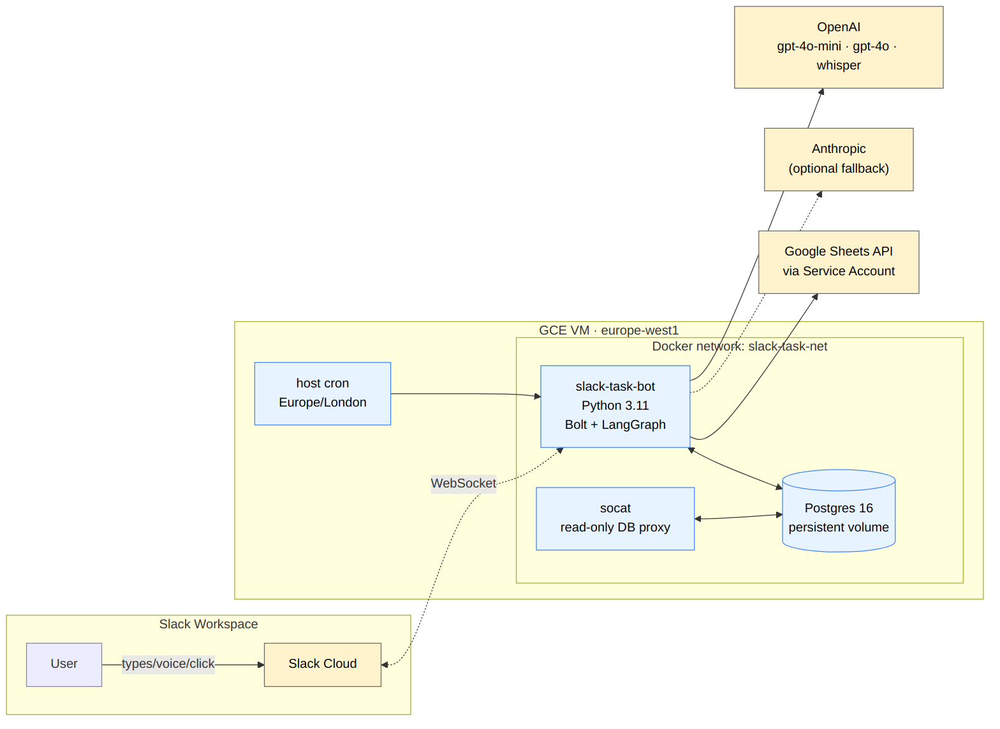
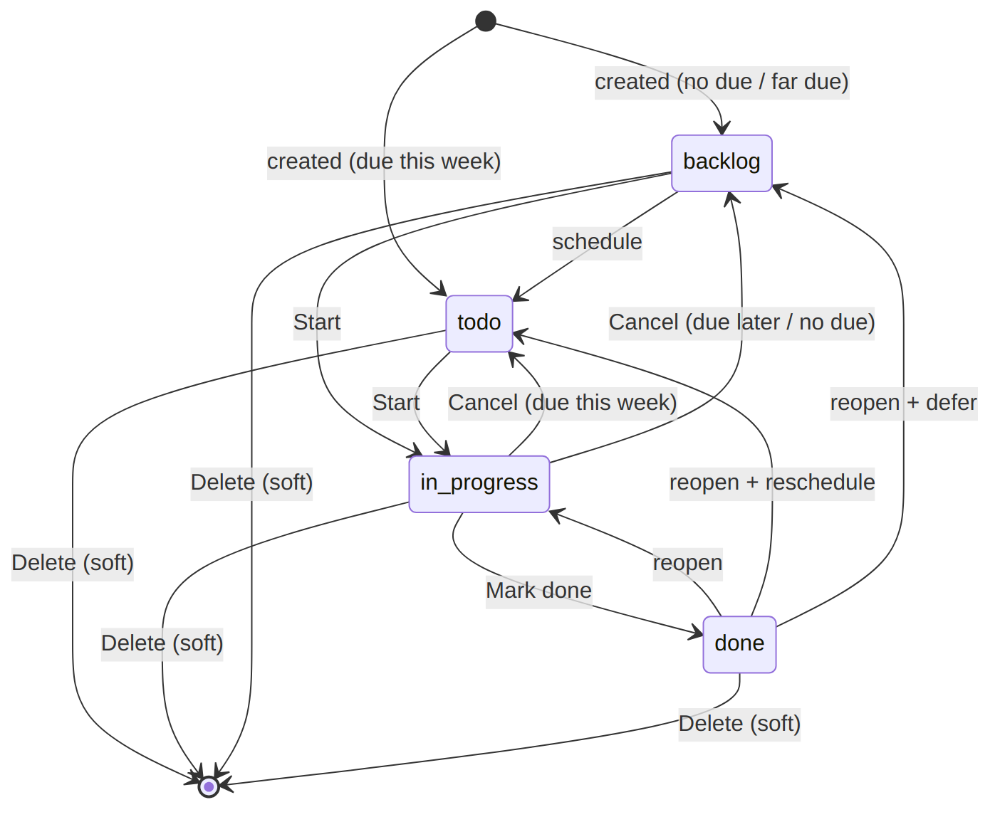
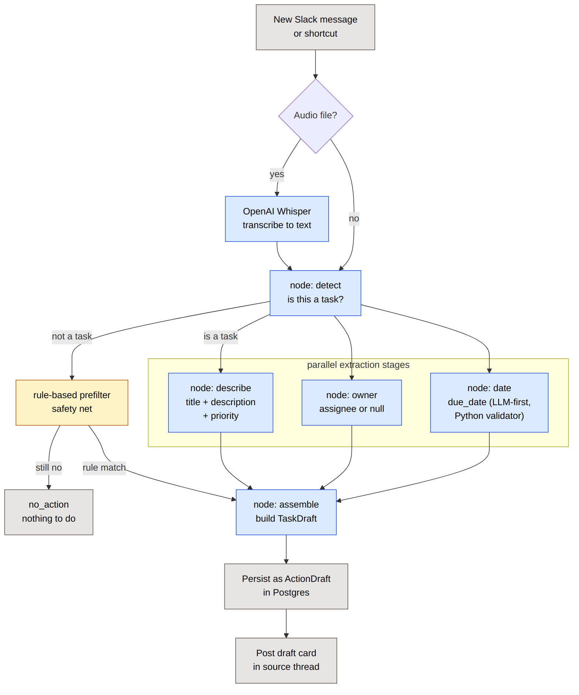
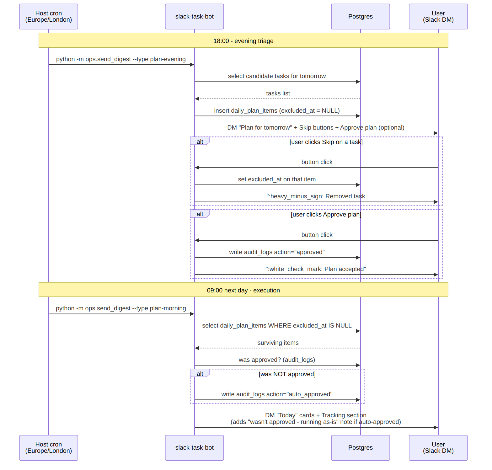
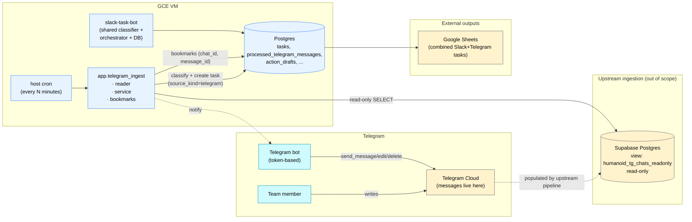

# Slack Task Manager — Product Spec

**Version 1 · Product-facing, non-technical**
For a developer-facing technical reference see `SPEC.md`.

---

## 1. What this agent is

A Slack-native AI task manager. The bot lives inside Slack, listens to
messages, and turns conversations into tracked tasks without anyone
leaving the chat. Tasks land in a shared Google Sheet in real time,
and people get plans and reminders pushed into their Slack DMs.


## 2. Why it exists

Most teams already coordinate work in Slack threads, voice notes, and
DMs. Tasks discussed there get forgotten because moving them into
Jira is friction nobody pays. This bot removes the
friction:

- It **captures the task in place** (mention, shortcut, voice, or
  passive detection of "we need to do X by Friday").
- It **tracks the lifecycle in place** (buttons on the Slack card —
  Start, Mark done, Cancel, Edit, Delete).
- It **reports the state in place** (DMs for digests + reminders, plus
  a live-synced Google Sheet for managers).

The team works where it already is; managers get
visibility through the sheet and DM digests they don't have to chase.

## 3. User roles

The bot serves four roles. Most people fill several at once.

| Role | What's in it for them |
|---|---|
| **Contributor** (anyone in a Slack workspace) | Captures tasks from chat in two clicks; never has to type things into another tool. Gets a daily plan in DM, gets reminders before deadlines slip. |
| **Task owner** (the assignee of a specific task) | Sees clean cards with Start/Mark done/Cancel/Edit. Decides when to start, when to drop, what to attach as a result. Doesn't get pinged by digests for tasks that aren't theirs. |
| **Subscriber** (anyone watching someone else's task) | Sees the task in their *Tracking* section, gets DM updates when the status changes — without owning the work. Useful for stakeholders, dependent reviewers, leadership. |
| **Admin / manager** | Sees the whole team's open work in one DM each morning + evening. Can edit, reassign, or delete any task. Sees a real-time Google Sheet with every task's current state and history. |

There's also one off-stage role:

| Role | What's in it for them |
|---|---|
| **Operator** (the person who runs the bot) | Configures Slack tokens, OpenAI/Anthropic key, Google Service Account; the bot then runs unattended in Docker on a single VM. |

---

## 4. Features

Each feature lists the user stories it serves and a step-by-step flow
for each story. "Flows" describe the user-visible sequence; the bot's
internal mechanics are deliberately omitted.

### Feature 1 — Task capture

The bot supports three entry points so people can capture a task in
whatever way fits the moment.

#### 1.1 Capture via @-mention

> **As a contributor**, I want to mention the bot in any channel and
> describe a task, **so that** the task is captured without me opening
> another tool.

**Flow:**
1. User writes `@bot need to prepare presentation` in a channel.
2. The bot reads the message, extracts title + due date + assignee
   from the text.
3. The bot replies in the same thread with a **draft card** showing
   the extracted fields and three buttons: *Accept*, *Edit*, *Reject*.
4. User clicks *Accept*. The card morphs into a confirmed task card.
5. The task is now in the system; a row appears in the Google Sheet.

#### 1.2 Capture from a voice note

> **As a contributor on the go**, I want to record a Slack voice
> message describing a task, **so that** the bot transcribes it and
> creates the task without me typing.

**Flow:**
1. User records a voice note in Slack.
2. Bot downloads the audio, transcribes it (OpenAI Whisper), and
   feeds the transcript into the same extraction pipeline as text
   messages.
3. Bot replies with the same draft card as in flow 1.1.
4. User Accepts / Edits / Rejects.

#### 1.3 Passive capture (the bot notices for you)

> **As a contributor in a busy channel**, I want the bot to notice
> when someone describes a task ("we need X by Friday"), **so that**
> I don't have to remember to capture it manually.

**Flow:**
1. Someone writes in a channel where the bot is present: *"надо
   подготовить отчёт к понедельнику"*.
2. Bot reads the message, decides "this looks like a task", and posts
   a draft card with the extracted fields plus the three buttons.
3. Whoever cares (often the implied owner or the message author)
   clicks *Accept*, *Edit*, or *Reject*.
4. If nobody reacts in some time, the draft simply expires — nothing
   is created without a human click.

---

### Feature 2 — Task lifecycle

Once a task is confirmed, every status transition is one click on the
card. The lifecycle is deliberately simple: `backlog → todo →
in_progress → done`. There are also two cross-cutting actions —
*Cancel* (un-schedule) and *Delete* (remove).

#### 2.1 Start working

> **As the task owner**, I want to mark a task as started, **so that**
> my team sees what I'm actively working on.

**Flow:**
1. Owner sees the task card (in the source channel or in their
   morning plan DM).
2. Owner clicks *Start*.
3. Card updates: status flips to `in_progress`, *Start* button
   replaced by *Mark done*, started timestamp recorded.
4. All subscribers of the task get a DM notification.
5. The Google Sheet row is updated.

#### 2.2 Complete a task

> **As the task owner**, I want to close a task and optionally
> attach the result, **so that** the team has evidence of what was
> done.

**Flow:**
1. Owner clicks *Mark done* on the task card.
2. A small modal opens with two optional fields: *Artifact URL* and
   *Or description*.
3. Owner can either fill one of them and click *Complete*, or leave
   both empty and click *Complete* anyway.
4. Status flips to `done`. Card buttons collapse to read-only state.
5. Subscribers get a DM. Sheet row reflects `done` + the artifact.

#### 2.3 Cancel — "I won't get to it now"

> **As the task owner**, I want to drop a task back into the queue
> without closing it, **so that** I can come back to it later without
> the manager thinking I've abandoned it.

**Flow:**
1. Owner clicks *Cancel* on the task card.
2. Bot decides where the task goes:
   - if its `due_date` is within this week (Mon–Sun) → back to `todo`;
   - otherwise → back to `backlog`.
3. Card refreshes with the new status.
4. Subscribers get a DM about the status change.
5. Sheet row is updated, with `reason="cancelled"` recorded in the
   task's status history.

#### 2.4 Delete

> **As the task owner or admin**, I want to remove a task entirely
> with confirmation, **so that** I can clean up duplicates or
> mistakes without losing the audit trail.

**Flow:**
1. Owner / admin clicks *Delete* on the task card.
2. A confirmation modal appears: *"This will delete task #N — title.
   The task is hidden from the UI immediately; the row stays in the
   audit log."*
3. User clicks *Delete* in the modal (or *Cancel* to back out).
4. Card is replaced by a tombstone: *":wastebasket: Task #N — title
   deleted by @actor"*.
5. Task disappears from every digest / plan / list / Google Sheet
   (the sheet row's status flips to `deleted` and the timestamp is
   filled).

---

### Feature 3 — Edit any field

> **As the task owner or admin**, I want to edit any field of an
> existing task, **so that** I can correct a wrongly-extracted owner,
> change priority, or update the deadline.

**Flow:**
1. Owner / admin clicks *Edit* on the task card.
2. A modal opens prefilled with all current fields: title,
   description, owner, priority, due date + time, start date + time,
   category, recurring schedule.
3. **Owner dropdown** lists every person the bot has seen in the
   workspace (real names from Slack profiles, never raw usernames).
4. User adjusts fields and clicks *Submit*.
5. Card refreshes with the new values; sheet row updates.

---

### Feature 4 — Subscriptions

Subscribers track work without owning it.

#### 4.1 Subscribe to someone else's task

> **As a stakeholder**, I want to subscribe to a colleague's task,
> **so that** I'm notified when its status changes — without owning
> the work.

**Flow:**
1. User opens any task card where they're not the owner.
2. User clicks *Subscribe*.
3. Bot DMs the user a confirmation with a copy of the task card.
4. From then on, every status change of that task posts a follow-up
   DM in the same thread (one task = one DM thread, so notifications
   don't fragment).
5. The button toggles to *Unsubscribe* on the card.

#### 4.2 Manage all subscriptions in one place

> **As a busy subscriber**, I want a single screen to see and prune
> what I'm subscribed to, **so that** I can clean up old interests
> in one go.

**Flow:**
1. From the daily digest DM, user clicks *Manage subscriptions*.
2. A modal opens listing every task they subscribe to.
3. Each row has an *Unsubscribe* button.
4. Click → that task drops out of the list immediately.

---

### Feature 5 — Daily plan

The daily plan is a two-step nudge: evening triage, morning execution.

#### 5.1 Evening — review tomorrow's plan

> **As a contributor**, I want a quick review of what's on my plate
> tomorrow, **so that** I can drop unrealistic items before bedtime.

**Flow:**
1. At 18:00 local time, bot DMs the user a card titled *"Plan for
   <tomorrow's date>"*.
2. The card lists each candidate task with a *Skip* button on the
   right.
3. At the bottom: *Approve plan* button (optional) and a *Tracking*
   section listing tasks the user subscribes to.
4. User clicks *Skip* on each task they won't get to. Each click drops
   that one task from tomorrow's plan.
5. User can click *Approve plan* to confirm explicitly — but it's
   **optional**. The morning plan runs whether they did or not.

#### 5.2 Morning — execute today's plan

> **As a contributor**, I want my plan ready when I open Slack in the
> morning, **so that** I can start working immediately.

**Flow:**
1. At 09:00 local time, bot DMs the user a *Today* card.
2. Each surviving task from yesterday's plan appears as a full task
   card with a *Start* button.
3. *Tracking* section shows tasks they subscribe to.
4. If the user **didn't** click *Approve plan* the night before, the
   DM gets a small note at the top: *":memo: Plan wasn't explicitly
   approved last night — running as-is."* — so the user knows what
   they're looking at.
5. User clicks *Start* on whatever they begin with.

---

### Feature 6 — Reminders & digests

Five separate reminder channels. Each runs on its own schedule and
is idempotent (one notification per (user, day), no spam on retry).

#### 6.1 Morning digest (per subscriber)

> **As a contributor**, I want a morning summary of what I own and
> watch, **so that** I know what to focus on today.

**Flow:**
1. Each morning, bot DMs every subscriber a digest with three
   sections: *Today*, *Approaching deadlines (next 2 days)*,
   *Overdue*.

#### 6.2 Weekly plan (Sunday)

> **As a contributor**, I want a heads-up on Sunday evening about
> the week ahead, **so that** I plan my week before Monday morning.

**Flow:**
1. Sunday 20:00, bot DMs every owner of `backlog` tasks due in the
   coming week with the list.

#### 6.3 Thread reminders (10:00 weekdays)

> **As a contributor**, I want a soft public nudge in the source
> thread of every active task, **so that** stakeholders see the task
> isn't forgotten and I'm reminded to update it.

**Flow:**
1. Weekday 10:00, bot posts a one-line reminder in the source thread
   of each task in `in_progress` (and `todo` tasks due this week).
2. The text tags the assignee: *":raised_hand: <@owner> task *#N* —
   what's the progress?"*.
3. One ping per (task, day), so the thread doesn't get spammed if
   the cron retries.

#### 6.4 Deadline reminders

> **As an owner**, I want a DM 2 days before the deadline and on
> the day of overdue, **so that** I don't miss things.

**Flow:**
1. Each morning, bot DMs the owner of every task whose due date is
   ≤ 2 days away or already overdue.
2. Includes the task title, due date, status.

#### 6.5 Admin watch-list

> **As an admin**, I want a daily snapshot of the team's active and
> stale work, **so that** I can prevent things from rotting.

**Flow:**
1. Mornings, every admin gets a DM with three sections: *In progress*
   (across the whole team), *Overdue* (across the team).
2. Evenings, admins get *Tomorrow* (tasks due tomorrow by assignee)
   plus *Stale* (`in_progress` with no movement for 2+ days).

---

### Feature 7 — Owner detection (no manual setup)

> **As a contributor**, I want the bot to figure out who a task is for
> based on the message text, **so that** I don't have to fill the
> assignee field manually for every task.

**Flow:**
1. When a task is being captured, the bot's LLM stage looks at the
   message + thread context.
2. If the message names someone explicitly ("Иван, сделай X" / "for
   @ivan" / "<@U123>"), bot picks that person — validated against the
   employees the bot knows about.
3. If nobody is named, bot quietly assigns the task to the message
   author (with an "(implicit)" badge on the card).
4. If the bot finds a name it doesn't recognise (e.g. "make Petya do
   it" but Petya isn't in the workspace), it asks in the source
   thread: *"I couldn't find Petya in the list. Who's the assignee?"*

---

### Feature 8 — Employees directory (auto-discovery)

> **As an operator**, I want the bot to learn the team automatically
> instead of me maintaining a list, **so that** new joiners are
> picked up without a redeploy.

**Flow:**
1. On bot startup, it walks the entire Slack workspace
   (`users.list`) and indexes every member.
2. When the bot is added to a channel / DM it doesn't know yet, it
   walks `conversations.members` and indexes everyone in that room.
3. When someone new posts a message, the bot upserts their profile
   from `users.info`.
4. The Edit-modal owner dropdown reads from this directory in real
   time. Names shown use Slack's `real_name` first (then
   `display_name`, then user id) so cells / dropdowns never read
   "admin" instead of the actual person.

---

### Feature 9 — Live Google Sheets sync

> **As a manager**, I want every task and its current state in a
> shared Google Sheet I can filter / pivot / chart, **so that** I
> have one place to see all work without opening Slack.

**Flow:**
1. Operator gives the bot a Google Service Account JSON and shares
   the target spreadsheet with the SA email.
2. Whenever a task is **created**, edited, started, completed,
   cancelled, or deleted, the bot **updates the same row** in the
   sheet within seconds. The initial sync fires from inside
   `create_task_from_draft`, so the row appears as soon as the Task
   row hits the DB — every channel (Slack orchestrator, Telegram
   immediate-create, Telegram Accept-on-draft, the multi-task
   loop) gets it for free, and a Sheets outage never aborts task
   creation (the call is best-effort).
3. Header row is written automatically on first sync — 22 columns
   in the bot's canonical order: id, title, description, owner,
   priority, category, start date/time, due date/time, recurring
   schedule, status, parent task id, **source** (`slack` /
   `telegram`), source link, created/updated/deleted timestamps,
   completion artifact.
4. The `source` column shows the channel verbatim so a glance at
   the spreadsheet reveals where each task came from — useful for
   filtering when both Slack and Telegram capture work into the
   same table.
5. Deleted tasks stay in the sheet with status `deleted` for audit.

---

### Feature 10 — Audit & history

> **As an admin or auditor**, I want a complete record of who did
> what and when, **so that** I can investigate any task's life from
> creation to closure.

**Flow:**
1. Every status transition is recorded with `from`, `to`, `actor`,
   `reason`, `at` timestamps.
2. Every significant action (create, edit, delete, send digest,
   subscription change) is logged in `audit_logs`.
3. Every Slack message the bot sees is archived (text + transcript
   for voice).
4. Soft-deleted tasks are hidden from the UI but their history
   remains, including the `task_deleted` audit row with the actor
   and the status at the moment of deletion.

---

### Feature 11 — Recurring tasks

> **As an owner**, I want to mark a task as recurring on certain
> weekdays at certain times, **so that** ritual work (standups,
> reviews, etc.) doesn't need re-creating each week.

**Flow:**
1. In the Edit modal, user selects weekdays (Mon, Wed, Fri…) in a
   multi-select.
2. Optionally sets a time range (e.g. 09:00–11:30).
3. Submits. The card now shows a `:repeat: Mon/Wed/Fri 09:00–11:30`
   line.
4. Selecting weekdays IS the toggle — there's no separate "Recurring"
   checkbox. Empty selection = not recurring.


---

### Feature 12 — Telegram as a second source channel

The bot grows a second input channel: Telegram. Tasks captured from
Telegram messages live in the **same** task table and the **same**
Google Sheet as Slack tasks — managers see one combined view,
filterable by source channel.

The Telegram side has a fundamentally different shape: the bot is
NOT added to chats by itself. Instead, an upstream pipeline (out of
scope for us) collects Telegram messages into a read-only Supabase
view; we read from that view on a schedule and process every new
message through the same intent pipeline as Slack.

#### 12.1 — Continuous Telegram task capture

> **As a contributor in a team Telegram chat**, I want my requests
> ("к понедельнику нужен отчёт") to land in the shared task tracker
> just like in Slack, **so that** my team has one home for tasks
> regardless of where the conversation happened.

**Flow:**
1. Contributor writes a message in a Telegram chat that the
   upstream pipeline indexes into the Supabase view.
2. Every few minutes (cron-driven), the bot's Telegram ingest
   worker (`python -m ops.telegram_ingest`) reads new rows from the
   view, strictly after the last `(chat_id, message_id)` it has
   already processed.
3. Each new message goes through the same intent pipeline as a
   Slack message — language-agnostic detection, owner / date / title
   extraction, prefilter safety net.
4. If a task is detected, the bot creates a `Task` row with
   `source_kind = 'telegram'`. The row carries the original chat
   id, message id, reply-to id, and a `https://t.me/c/<chat>/<msg>`
   permalink (when the chat is a public super-group).
5. The new task appears in the same Google Sheet next to Slack
   tasks; admins see it in the morning watch-list digest. Source
   channel is filterable in the sheet via the `source_kind` column.

#### 12.2 — Historical Telegram backfill

> **As an operator deploying the bot in a team that's already used
> Telegram for months**, I want to import the entire Telegram
> history at once, **so that** the bot starts with the team's full
> backlog instead of only seeing future messages.

**Flow:**
1. Operator runs `python -m ops.migrate_telegram_history` once,
   optionally with `--dry-run` first to preview counts.
2. The script walks the entire Supabase view from oldest to newest
   in batches.
3. Each batch is processed inside a transaction; errors per-message
   are caught and counted, not aborting the run.
4. At the end, a summary line in the log: total seen, tasks
   created, no-action, errors.
5. The script is **idempotent**: re-running it picks up only
   messages added since the last run (the same `(chat_id,
   message_id)` bookmarks are reused).

#### 12.3 — Bot-as-listener mode

> **As an operator who can't (yet) hook into the team's existing
> Telegram archive**, I want to add the bot to a chat / group and
> have it capture messages directly via the Bot API, **so that** I
> can test the whole pipeline end-to-end without waiting for the
> upstream Supabase setup.

**Flow:**
1. Operator sets `TELEGRAM_BOT_TOKEN` in the env file.
2. **One-time BotFather step**: `/mybots → bot → Bot Settings →
   Group Privacy → Turn off`. Without this the bot only sees
   `/commands` and direct mentions in group chats.
3. Operator adds the bot to a chat or group as a normal member.
4. A separate container runs `python -m ops.telegram_listener` —
   long-poll on Telegram's Bot API, no public HTTP endpoint
   exposed, just outbound 443.
5. Every new message in those chats lands in the same `tasks`
   table with `source_kind = 'telegram'`, sharing `processed_
   telegram_messages` bookmarks with the Supabase ingest path.
   Same Google Sheet, same admin digests.

The two ingest paths run in parallel and dedupe via the (chat_id,
message_id) primary key — a message captured by either path is
indistinguishable in the DB once written.

#### 12.4 — Private task card with buttons (DM only — group stays clean)

> **As a Telegram contributor in a group**, I want the task card
> to be visible only to the people who care about it — me (the
> author), the assignee, and admins — so that the rest of the
> group doesn't see noise from every captured task.

**Flow:**
1. The listener captures a message; for *private chat* with the
   bot it creates a task immediately (see 12.3); for a *group /
   supergroup / channel* it goes through the confirm-first widget
   first (see 12.7), and only on *Accept* the task is created.
2. The bot **DMs** the card to a small recipient set:
   - the message author;
   - the assignee, if the LLM resolved a different owner;
   - every Telegram admin from `TELEGRAM_ADMIN_USER_IDS`.

   The source group / chat does **not** get a copy. Telegram
   doesn't do per-recipient visibility within a group, so the
   only privacy-preserving option is to skip the group post
   entirely.
3. Each recipient sees a keyboard rendered from THEIR perspective:
   - the author always sees Edit / Subscribe;
   - the owner sees Start / Mark done / Edit / Delete;
   - admins see Edit / Delete on every task.
4. Tapping a button drives the task — the change applies once,
   and the bot edits **every delivered DM** so author / owner /
   admin all see the same state without re-fetching anything:
   - **Start** flips backlog/todo → in_progress.
   - **Mark done** opens the optional-artifact reply (see 12.5).
   - **Subscribe / Unsubscribe** toggles for bystanders.
   - **Delete** soft-deletes; every card flips to a tombstone line.
   - **Edit** opens the natural-language reply conversation (see 12.5).
5. The same Google Sheet row updates after every change.

**Important for the operator**: Telegram's Bot API can DM only
users who have already started a private chat with the bot (sent
`/start` or any DM). Recipients who never started the bot won't
get a card — the bot logs `telegram_card_dm_failed` and moves on.
Ask team members to `/start` the bot once.

**Permissions** match the Slack card: only the owner (or admin)
can do destructive things (Mark done / Cancel / Delete / Edit);
bystanders can subscribe.

#### 12.5 — Mark done + Edit via reply conversation

> **As a Telegram task owner**, I want the same Edit and Mark-done-
> with-artifact flows as Slack — without modal dialogs Telegram
> doesn't support, **so that** I can drive a task end-to-end
> without switching to Slack.

**Mark done flow:**
1. Owner taps *Mark done* on the card.
2. Bot replies in the chat: *"Optional: reply with a link or short
   note. Or `/skip` to complete without."* The reply triggers a
   force-reply UX in the user's client.
3. User replies with one of:
   - a URL (e.g. `https://drive.example.com/file`) → saved as
     `kind=url`;
   - free text → saved as `kind=text`;
   - `/skip` → no artifact.
4. Bot transitions the task to *done*, refreshes the original
   card in place, and updates the Google Sheet row.

**Edit flow:**
1. Owner / admin taps *Edit*.
2. Bot replies with a compact "what's filled / what's missing"
   summary — each known field with its emoji (📌 title, 📝
   description, priority, 📅 due, ⏰ due_time, 🚦 start, 🏷
   category, 👤 owner), followed by a one-liner inviting a free-
   form reply ("e.g. *push the deadline to Friday, priority high,
   category marketing*").
3. User replies in plain language. The bot's intent backend
   (the same OpenAI / Anthropic tool-call that drives the
   classifier) extracts structured field updates. Pure
   `key=value` replies short-circuit the LLM call. Relative dates
   ("tomorrow", "next Friday") are resolved against today.
4. Bot applies the changes, refreshes every delivered card,
   drops the `owner_assumed` flag, updates the sheet.

The matching between bot prompts and user replies uses Telegram's
`reply_to_message_id` field and a 10-minute in-memory TTL —
unrelated chat traffic never accidentally triggers a handler.

#### 12.6 — DM digests, daily plan, reminders for Telegram users

> **As a Telegram user who owns tasks**, I want the same morning
> digest / daily plan / weekly plan / deadline / thread reminders
> that Slack users get, **so that** my channel of choice gets the
> same coverage.

**What's covered:**
- *Morning digest* — DM with Today / Approaching (2 days) /
  Overdue per Telegram owner.
- *Daily plan* — evening heads-up DM, morning execution DM with
  today's tasks. Approve is optional (matches FR-CR-04-25).
- *Weekly plan* — Sunday evening DM listing next week's backlog.
- *Deadline reminders* — DM the owner of any task ≤ 2 days from
  due (or already overdue).
- *Thread reminders* — daily nudge posted in the source Telegram
  chat under the original message.
- *Admin watch-list* — DM each TG admin with the team-wide *In
  progress* + *Overdue* lists.

**Routing rule:** numeric user ids → Telegram, others (Slack
shape `U…` / `W…`) → Slack. A Slack subscriber never gets a
Telegram DM and vice-versa. Per-user / per-day idempotency lives
in `audit_logs` under category prefix `telegram_*`.

**TG admins** are configured via the `TELEGRAM_ADMIN_USER_IDS` env
var (comma-separated numeric ids). Same role as Slack admins:
edit / cancel / delete any task, plus admin watch-list digest.

**Operator setup** — the cron schedule mirrors the Slack one,
just doubled with a Telegram call per slot:
```
08:00  python -m ops.telegram_digest --type morning-digest
08:00  python -m ops.telegram_digest --type plan-morning
10:00  python -m ops.telegram_digest --type thread-reminders   (Mon-Fri)
18:00  python -m ops.telegram_digest --type plan-evening
20:00  python -m ops.telegram_digest --type weekly             (Sundays)
every 6h python -m ops.telegram_digest --type deadlines
09:00  python -m ops.telegram_digest --type admin-watchlist
```

#### 12.7 — Confirm-first widget for tasks captured in groups

> **As a contributor**, when the bot detects a task in a group
> chat, I don't want a task to appear in the system silently. I
> want the bot to ask me *"Create this task?"* in DM first, with
> a forward of the original message and three buttons:
> ✅ Accept / ✏ Edit / ✖ Reject. **So that** the team's task
> table only contains things someone consciously confirmed.

**Routing:**
- *Private chat* with the bot → the user is talking to us
  directly, so consent is implicit and we keep the immediate-
  create flow (12.3 + 12.4).
- *Group / supergroup / channel* → the bot creates an
  `ActionDraft` (state = `proposed`) instead of a Task, then DMs
  the confirm widget to the same recipient set as a regular task
  card (author + admins; FR-CR-04-31 set).

**Widget contents** (each recipient gets one):
1. The original message **forwarded** from the group, so the
   recipient sees who said what and where.
2. A compact preview in HTML: title, owner, priority, due —
   each with its own emoji.
3. Three inline buttons: **✅ Accept**, **✏ Edit**, **✖ Reject**.

The per-recipient `(chat_id, message_id)` pairs are stored on the
draft's `payload["_widgets"]` so any later action edits every
delivered copy in place. The source / context-snapshot /
fallback-author values are stashed under `payload["_pending"]`
for the Accept handler to consume.

**Click outcomes:**
- **Accept** → draft becomes a Task via the same
  `create_task_from_draft` helper used by the immediate-create
  path. Every widget DM is edited into the regular task card
  (12.4 keyboard). Idempotent — a second Accept on a confirmed
  draft just re-renders the existing card.
- **Reject** → draft state flips to `ignored`; every widget is
  edited into a `❌ Draft #N — title — rejected` tombstone with
  an empty keyboard. No Task is created.
- **Edit** on the widget is currently a friendly stub ("Accept
  first, then ✏ Edit on the task card"). Full draft-edit with
  LLM parsing is a follow-up.

**Permalinks:** the `https://t.me/c/<id>/<msg>` URL form only
works for **supergroups and channels** (chat ids carrying the
`-100` prefix, so absolute value > 10¹²). For *basic groups*
the bot now skips the link entirely — generating it would
produce a *"no access"* error in Telegram even for the group's
own admins.

**@-mention shortcut:** when the source message contains an
explicit Telegram username mention (`@petya подготовь презу`),
intent is unambiguous and the listener bypasses the confirm
widget — the Task is created immediately, just like in a private
DM with the bot. The widget is reserved for the «detected, not
addressed» case where consent matters.

**Rendering & copy:** all Telegram messages now use HTML parse
mode (no Markdown italic-trigger problems with usernames like
`@andre_andreevich`). Status `in_progress` displays as
`in progress`. Telegram usernames are stored with the leading
`@`. The Edit prompt is conversational — bullet list of filled
fields, one-line *"missing: …"* note, single-line hint to reply
in plain English. Cancel was removed from the task-card
keyboard — Edit + Delete cover the same intent.


---

### Feature 13 — Unified daily rhythm (Slack + Telegram)

Five small additions cluster into one «day in the life» story.
Identical behaviour in Slack and Telegram — same SQL helpers,
same idempotency keys, only the channel layer differs.

#### 13.1 — Multi-task extraction from one message

> **As a contributor**, when I write «к завтра сделать презу и
> отчёт к пятнице» I want **two** tasks created, not one with a
> munged title — **so that** my list reflects what I actually said.

The intent pipeline grows a list-of-tasks shape:

1. Stage 1 (detect) returns `task_count` and a list of disjoint
   spans of the source text — one chunk per task. Default for
   ambiguous cases is one chunk = whole message (current behaviour).
2. Stages 2a / 2b / 2c run **per chunk**, so each task gets its
   own title / description / priority / owner / due.
3. `IntentClassification.tasks` carries the list; `task` is kept
   as `tasks[0]` so legacy callers don't break.
4. Persistence iterates: one `Task` per chunk in the immediate-
   create flow, one `ActionDraft` per chunk in the confirm-first
   flow (the confirm widget then carries «Create 3 tasks?»).

The detect-stage prompt teaches «split only when each chunk has
its own imperative + object». A phrase like «сделать отчёт и
презентацию по нему» stays one task because the second clause is
a sub-item of the first.

#### 13.2 — Morning digest at 08:00 local: today only

> **As an owner of tasks**, I want my 08:00 DM to contain *only*
> what I'm doing today — not Approaching / Overdue / etc — **so
> that** the message is short and actionable AND lands before the
> work day starts (we used to fire at 09:00 — too late for the
> «what's on for today?» glance).

Behaviour:
- One section: «Today's tasks» — the user's own Tasks with
  `due_date == today`, ordered by `status` (in-progress first,
  then todo, then backlog) then `priority`.
- Two buttons: 🔄 *Refresh* (re-renders) and 📋 *Show
  subscriptions* (toggles a follow-up DM with the list of tasks
  the user is subscribed to but doesn't own).
- If yesterday's evening plan was Approved (or auto-run via
  FR-CR-04-25), today's order matches that plan; otherwise it's
  derived from priority + due.

The Approaching-window list moves to the existing per-task
deadline reminder (FR-CR-04-15) and a weekly digest. Overdue
already DMs separately as a deadline reminder; no duplication.

#### 13.3 — Subscription updates throughout the day

> **As a subscriber**, I want a one-line DM whenever a task I
> follow changes status / gets edited / gets cancelled — **so
> that** I don't have to poll the Sheet or the original card.

What triggers a fanout DM:
- Status transition: backlog ↔ todo ↔ in_progress ↔ done.
- Edit applied via Edit-on-task or Edit-on-draft (the field
  diff goes in the DM).
- Cancel.
- Soft-delete.

The fanout fires inside `TransitionService.apply` and
`apply_edit_reply` — not at the keyboard level — so any future
trigger (slash command, scheduled rule) inherits it. Owner is
excluded (they already see the card update). Per-recipient
idempotency lives in `audit_logs.category='subscriber_update'`
keyed by `(task_id, recipient_user_id, transition_id)`.

The DM is short — title, what changed, link to the source.

#### 13.4 — «Task starting now» nudge

> **As an owner**, when a task with a `start_time` reaches that
> moment, I want a quick DM — **so that** I don't lose
> calendar-shaped work in the noise.

A 5-minute cron tick selects rows where ``start_date == today``
AND ``start_time`` is between ``now-5m`` and ``now``. Owner gets
the full card-shaped DM; subscribers get a one-liner. No
`start_time` ⇒ falls back to `09:00 local` on `start_date`.

Idempotency: an `audit_logs` row per
`(task_id, recipient_user_id, kind='start')` blocks repeats —
re-runs of the cron tick (or a worker restart) don't double-DM.

Cron line:
```
*/5 * * * *   python -m ops.send_digest         --type starts-now
*/5 * * * *   python -m ops.telegram_digest     --type starts-now
```

#### 13.5 — Evening report at 18:00 local: 3-section DM

> **As a contributor**, my 18:00 DM should give me a wrap-up: what
> I closed today, where the things I'm watching stand, and a draft
> of tomorrow — **so that** the next morning starts with a
> confirmed plan instead of a fresh exercise.

The DM has three sections:

1. **Done today** — the user's tasks that flipped to `done` at
   any point today (uses `task_status_history.changed_at >=
   today midnight`). Each carries the completion artifact (link
   or note) when present.
2. **Subscriptions update** — every non-owner-subscribed Task with
   its current status, plus a small *delta vs the previous
   evening report* note when a status changed since yesterday's
   18:00. Diff source: `audit_logs.category='evening_report'`
   snapshot for the prior day.
3. **Tomorrow's plan** — the same auto-curated list that the
   former «evening plan» message carried. Two buttons attach:
   ✅ *Approve* / ✏ *Edit*. *Edit* opens the LLM-driven free-form
   reply ([13.6](#136--llm-edit-on-the-evening-plan)) — same
   parser as Edit-on-task. If the user neither Approves nor Edits
   by 09:00 next day, the plan auto-runs (FR-CR-04-25 — already
   implemented for Slack, ported to TG here).

#### 13.6 — LLM-edit on the evening plan

The Edit button on the tomorrow's-plan section opens the same
free-form reply we use for Edit-on-task — the user can say
«убери задачу #42, добавь подготовку отчёта в начало,
сдвинь презу на четверг». The same `parse_edit_with_llm`
backend converts that into structured operations:

- `remove`: list of task ids to drop from the plan
- `reorder`: list of task ids in the desired order
- `add`: list of `{title, due, priority}` items (these create
  fresh Tasks, then add them to the plan)
- `move_due`: list of `{task_id, due}` for date shifts

Approval becomes implicit on Edit — once the user confirms the
edited plan, the bot stores it and the morning digest will run
in approved mode the next day.

#### 13.7 — Dedup gate + 10 000-char string cap

> **As a contributor**, when the same instruction repeats across
> messages («не забудьте про отчёт», «отправь договор»), I want
> the bot to detect the duplicate and NOT spam my DM with another
> «Create this task?» widget — **so that** my pending list stays
> uncluttered.

How it works:
- The ingest pipeline (`process_all`, `prepare_drafts`) calls
  `app/services/task_dedup.py:check_duplicate` for every fresh
  `TaskDraft` before persisting it.
- The helper looks at the **last 20 open Tasks**, hands them and
  the candidate to the same LLM backend the classifier uses, and
  asks: «is this the same work?». «Same wording for the same
  thing» counts; «same topic, different deliverable» does not.
- When the verdict is «duplicate», the candidate is silently
  dropped — no draft, no widget. The source-message bookmark in
  `processed_telegram_messages` is still written so the same row
  doesn't get re-classified on the next cron tick.
- Failure modes are conservative — an empty lookback, missing LLM
  backend, or any LLM error → «not a duplicate», so the gate
  falls open and we never silently lose legitimately new work.
- Done / soft-deleted Tasks are excluded from the lookback —
  closed work shouldn't suppress the same item being re-scheduled.

> **As an operator**, I want forwarded chat threads or pasted
> documents to never crash a Sheets sync or balloon an LLM
> prompt — **so that** the bot stays predictable.

Every user-provided string field on the task draft (`title`,
`description`, `owner_user_id`, `owner_display_name`) is capped
at **10 000 characters** by a Pydantic `model_validator`. A
belt-and-suspenders cap in `create_task_from_draft` truncates
again at persist time so any path that bypasses the schema (raw
payload dicts, future ingestors) still gets bounded data. 10 000
chars is comfortably under Sheets' 50 000-char cell limit and
generous enough to keep useful context without paying for it
downstream.

#### 13.8 — Confirm-first ingest from the colleague's view

> **As an operator**, when I run the historical migration or the
> incremental cron over the colleague's read-only Supabase view,
> I want every detected task to land in my Telegram DM as a
> «Create this task?» widget — **so that** I can sanity-check
> noise before it lands in my Sheet.

Both `ops.migrate_telegram_history` and `ops.telegram_ingest`
default to **confirm-first** (FR-CR-04-32 parity): each detected
task becomes an `ActionDraft` in `proposed` state and the bot DMs
the standard recipient set (author + admins) with the widget.
Tasks materialise only on ✅ Accept.

The migrator also gained `--since YYYY-MM-DD` and
`--since-days N` so the operator can scope a backfill to «just
yesterday». Older messages get a «skipped (too old)» bookmark
without going anywhere near the LLM, so a re-run with the same
cutoff is fast.

The legacy «task straight to DB» path lives behind
`--auto-confirm`, for the rare case where the operator really
doesn't want to click N buttons.

#### 13.9 — Telegram chat-members registry

> **As an operator**, when somebody writes «Валя сделай отчёт» in
> the chat, I want the bot to map «Валя» to the actual numeric
> Telegram user id, and (when she's `/start`-ed the bot) DM her
> the «Create this task?» widget directly — not just me as admin.

The classifier used to get `known_employees=None` for every
Telegram message, so the LLM owner stage couldn't validate names.
Mentions landed as raw display strings, owners couldn't be DM'd
directly, and the FR-CR-04-22 hallucination guard had nothing to
compare against.

Solution — a self-populating per-chat membership table that the
**live listener writes on every observed message**:

- New `telegram_chat_members` table (migration `0016`), keyed by
  `(chat_id, user_id)`. Carries `username`, `first_name`,
  `last_name`, `has_started_bot` (sticky-True flag), and audit
  timestamps.
- The listener's `tick` upserts every observed sender into the
  registry. The flag flips to True the first time we see traffic
  in that user's private chat with the bot — that's the only
  signal we have that proves they're DM-able.
- The ingest pipeline reads `members_as_known_employees(chat_id)`
  and feeds it as `known_employees` to the classifier. The LLM
  owner stage now has real names + numeric ids to map mentions
  against.
- No separate discovery RPC. Bot API admin enumeration only
  returns chat admins anyway; live traffic is good enough — every
  user who has spoken in a chat the bot can see lands in the
  table within seconds.

When the migration hasn't run yet (a brand-new VM, a stale test
fixture) the read path swallows the error and returns an empty
list, so the classifier just falls through to no-known-employees
mode the same way it always did.

#### 13.10 — Task-card keyboard permission model

> **As a contributor**, I should only see the buttons that make
> sense for my role. Bystanders shouldn't be able to *Start*
> someone else's task; the assignee shouldn't see a no-op
> *Subscribe* toggle (they're already auto-subscribed).

The Telegram task card now follows a strict role-based visibility
model:

- **▶ Start** — only the OWNER (assignee). Admins and bystanders
  see no Start button. An unowned task no longer surfaces Start
  to bystanders either.
- **✔ Mark done / ✏ Edit / 🗑 Delete** — OWNER or ADMIN.
- **🔔 Subscribe / 🔕 Unsubscribe** — anyone EXCEPT the owner.

Layout: row 1 carries the primary action (Start / Mark done) when
visible, row 2 is Edit + Delete side-by-side, row 3 is the
Subscribe toggle.

Same model is used in the live-listener cards (FR-CR-04-32) and
the Accept-on-draft path that swaps a confirm widget for the
final card.

#### 13.11 — Adaptive chat context, admin-owner fallback, source forwards

> **As an operator** scrolling through 100 freshly-extracted
> drafts, I want widgets that **make sense in context** — not
> «hi! I'll write to him» as a verbatim title with a bot account
> as owner and zero hint of what triggered it.

Three quality issues surfaced after the first 100-message
historical migration. All three solved here.

**1. Adaptive chat context.** The classifier was running with
zero prior history per Telegram message, so vague replies like
«хорошо! напишу ему» had nothing to anchor against and landed
as the title verbatim. Fix:
`TelegramSourceReader.recent_in_chat` pulls prior messages from
the same chat, expands the window in increments of 10 (10 → 20
→ 30 …) until the combined text crosses ~10 000 characters,
and hands the result to `ContextWindow.history_before`. Every
stage of the intent pipeline already consumes `history_before`,
so the detect / title / owner stages now see meaningful chat
context.

The detect prompt is taught to flag parroted one-liners
(«ок, сделаю», «договорились», «хорошо, напишу ему») as
no_action by default — they only become tasks when the
surrounding context makes the work unambiguous. The title
prompt is taught to *rewrite* such phrases into a proper
imperative using context: with a prior message «надо ответить
Андрею по сделке Acme», «хорошо, напишу ему» becomes the title
«написать Андрею по сделке Acme», not the literal phrase.
Status-list reports («DBS — нет, Jefferies — отправила, Stifel
— не ответил») and OCR-noise singletons («файндхэзом») are
explicitly rejected upstream too.

**2. Admin-owner fallback chain.** The author-fallback used to
land bot accounts as task owners (a forwarded post from a `bot`
user has `from.is_bot=true` and the bot's own user_id, so the
draft inherited that). The new chain is:

1. LLM-resolved owner — wins.
2. Sender, **only when** they're a registered chat member
   (FR-CR-05-07). A non-member sender is typically a bot
   account or a forwarded post; we don't promote them to owner.
3. First admin from `TELEGRAM_ADMIN_USER_IDS` — same identity
   the confirm-first widget already DMs by default.

This kills the «Валя is the owner because she was named in the
text but isn't in the table» class of bug.

**3. Inline-quote source fallback.** `post_draft_confirmation`
already tries `forwardMessage` first, but the Bot API only
forwards messages the bot has **observed via getUpdates** —
historical migration drafts come out of the colleague's
read-only view, so every forward call returns «message to
forward not found». The widget arrived without source context.

Now the prepare-drafts step pre-stashes `source_text` on
`draft.payload["_pending"]`, and when the forward fails (sender
returns `{}`) the card helper emits a `<blockquote>`-wrapped
HTML quote of the source so the operator sees what triggered
the widget without leaving the DM. Live listener captures still
get a real `forwardMessage` because the bot did observe them —
the fallback only fires when the forward genuinely can't work.

**Note:** the inline-quote fallback was superseded by FR-CR-05-10
(rich descriptions). It's kept in the spec for historical
context, but the code path was removed.

#### 13.12 — Cross-channel team registry + context-rich descriptions

> **As an operator** I want every draft to come with enough
> context to act on without scrolling back to the chat — and to
> never see «CEO Rosecliff» (an outsider mentioned in the deal)
> as the owner of «организовать встречу с CEO Rosecliff». Owners
> must come from a list of REAL teammates that I curate.

Three connected fixes that turn each draft widget into a self-
contained, actionable card:

**1. Team registry as authoritative owner source.** New table
`team_members` carries one row per teammate with both Telegram
and Slack identity, role, email, active flag. The operator owns
it through the `Team` tab of a Google Sheet
(`GOOGLE_TEAM_SHEETS_SPREADSHEET_ID`); the bot syncs it
bidirectionally via `python -m ops.sync_team --seed --pull
--push`.

`as_known_employees(session)` from this table replaces «whoever
was in the chat» as the owner-resolution universe. The new
`_resolve_owner` chain (`app/telegram_ingest/service.py`):

1. LLM `owner_user_id` resolves to a registry row → keep.
2. LLM `owner_display_name` resolves by name match → backfill
   the numeric id from the row.
3. **Otherwise drop the display_name entirely** — the «CEO
   Rosecliff» case (outsiders mentioned but not on the team).
4. Fall through to sender (only when registry empty or sender is
   in it) or to admin from `TELEGRAM_ADMIN_USER_IDS`. Admin
   fallback ALWAYS clobbers the display_name so a stale hint
   never renders next to the admin's id.

**2. Context-rich descriptions.** The title prompt is taught to
write a 1-3 sentence summary of who's involved, what was
discussed upstream, and what concretely needs to happen — using
the FR-CR-05-09 adaptive context window. «хорошо! напишу ему»
with prior context «надо ответить Андрею Соколову по сделке
Acme — он спрашивал про SoW» yields a description like «Андрей
спрашивал про SoW по сделке Acme, нужно подготовить ответ.»
rather than empty.

When the LLM has nothing to summarise (one-liner with empty
history), the ingest fills in `📝 обсуждалось в <chat_title> ·
<YYYY-MM-DD HH:MM>` so the operator at least sees where the
draft came from.

**3. Drop the inline-quote / forward DMs.** The rich description
makes the FR-CR-05-09 fallbacks redundant. `post_draft_
confirmation` now sends EXACTLY ONE message per recipient — the
widget itself, with the description in `📝`. Source text is
still kept on `draft.payload["_pending"]["source_text"]` for
any future «show original» feature.

#### 13.13 — Bidirectional Sheet ↔ DB sync (Tasks + Team)

> **As an operator** I want to edit tasks directly in the
> spreadsheet — push the deadline, change the priority, mark
> something done — and have the bot's DB pick those changes up on
> the next sync. Same story for the Team registry.

Until this fix the Sheet was strictly write-only from the bot's
side: every change pushed a row, but operator edits died on the
next push (overwritten). Now **the Sheet wins** — operator edits
on either tab propagate to the DB on the next pull tick.

**Tasks (`Main` tab).** New `SheetsPullService` reads every row,
matches by `task_id`, applies field-level diffs.

- **Editable from sheet:** title, description, owner, priority,
  category, start_date, start_time, due_date, due_time, status,
  completion_artifact.
- **Read-only from sheet:** task_id, parent_task_id, source,
  source_permalink, *_at timestamps, recurring_*.
- Status changes route through `TransitionService` so audit-log
  + subscriber notifications fire as if from a button click.
  Invalid transitions log + drop.
- Owner resolution: bare uid kept; `@handle` matches against
  `team_members.telegram_username`; real-name match against
  `team_members.real_name` then `employees.real_name`.
  Unresolvable text stays in `owner_display_name` so the
  operator's intent isn't lost.
- New CLI `python -m ops.pull_tasks_sheet` — designed for cron.

**Team (`Team` tab).** Already bidirectional via
`ops.sync_team --pull --push` from FR-CR-05-10. Schedule on cron
at the same cadence.

**Cron** (5 min default, run on the listener host or a sidecar):

```cron
*/5 * * * *  python -m ops.pull_tasks_sheet
*/5 * * * *  python -m ops.sync_team --pull --push
```

Conflict rule: Sheet wins within a single tick window. No
`updated_at` arbitration — keeping it simple beats fighting
clock skew between the bot and the operator's edits.

#### 13.14 — Description completeness, role-aware owner, passive-past detect

Targeted fixes after a second 100-message run.

**Description completeness.** `gpt-4o-mini` was sometimes
clipping the description mid-sentence («так как осталось
открытым с»). The title prompt now has an explicit LENGTH RULE:
40-200 chars, finish every sentence with a period, never trail
off. If the thought won't fit, stop after the first complete
sentence — partial trailing clauses are worse than a shorter
description.

**Role-aware owner disambiguation.** Two «Алина»s in the
registry landed «Валентина» as the owner of «подать заявку на
StartUp Qatar» because the LLM had nothing to tell same-first-
name rows apart. `as_known_employees()` now also surfaces
`role` and `notes`; the owner prompt has a new
`DISAMBIGUATION` block teaching the model to USE role/notes
when several rows share a first name.

**Passive-past status reports.** «письма в Abundance отправлены»
(passive, completed) was being captured as a task. The detect
prompt was extended with passive Russian forms (`отправлены`,
`подписан`, `оплачен`, `утверждён`) plus EN present-perfect
(`sent`, `done`, `approved`, `signed`) and a verbatim example.

#### 13.15 — Bot filter, sibling-draft dedup, third-party titles, widget polish

Targeted fixes after a third 100-message run.

**Bot-account auto-deactivation.** «CEO_office1 bot» kept
landing as a task owner because seed marked every TG sender
`active=True`. New `_looks_like_bot` heuristic catches `bot` /
`_bot` suffix, ` bot` substring, and common bot prefixes
(`office1`, `notif`, `support_`, `assistant_`, `webhook`,
`crm_`); rows that match seed `active=False` with notes «auto:
looks like bot account». Operator can flip on the sheet if the
heuristic was wrong.

**Sibling-draft dedup.** Two adjacent source messages producing
sibling drafts of the same task within one `prepare_drafts`
batch («добавить Юру» × 2, «организовать профиль» × 3) used to
slip through because the first draft wasn't a Task yet.
`check_duplicate` now includes open `ActionDraft(state=
proposed)` rows in the lookback alongside saved Tasks, prefixed
`D#` / `T#` so the LLM can address them distinctly.

**Third-party status promises.** «Нет Алина сама отправит» (a
status sentence about another teammate's commitment) was
landing verbatim as a title. The title prompt gains a
`THIRD-PARTY STATUS PROMISES` block teaching the model to read
context, identify the actual deliverable, and write a clean
imperative — putting the original delegation note in the
description.

**Widget polish.** Removed «📥 Create this task?» header (the
inline keyboard already says ✅ / ✏ / ✖). New layout:
priority emoji + bold title on line 1, description on line 2,
owner + due on line 3. No «high» / «medium» word — colour
carries the signal.

#### 13.16 — Voice replies, registry-aware Edit, source-dialogue column

Three gaps from live Edit-on-task testing.

**Voice messages in pending replies.** The Edit / Mark-done reply
handler accepted only plain text — a voice DM died silently. New
`_maybe_transcribe_voice` on the listener detects `voice` /
`audio` payloads, downloads via Bot API `getFile` + raw GET,
transcribes via Whisper, and treats the transcript as the reply
text. Falls back to «🎙 Не разобрал голос» when nothing usable
came back.

**Registry-aware Edit owner resolution.**
`parse_edit_with_llm` now accepts `known_employees` and renders a
five-column table (slack_user_id / display_name / real_name /
role / notes) into the prompt. The LLM is instructed to round-
trip an id from the table when the user names someone
(«ответственный Андрей Кузьминых»).
`apply_edit_reply_ex` validates: id-from-registry → keep with
display name backfilled; name → resolve locally; unresolvable
text → keep on `owner_display_name`, id cleared. Same plumbing
for `parse_draft_edit_with_llm` / `apply_edit_draft_reply` so
Edit-on-draft works the same way.

**`dialogue` column in Tasks Sheet.** *(Rolled back by 13.17 —
operator reconsidered after the 50-message run: a full chat
transcript in a Sheets cell was too noisy. Removed.)* Originally
a 23rd column with the FR-CR-05-09 adaptive context rendered
plain-text. The FR-CR-05-09 context window itself is still
fed to the LLM through `history_before`; only the per-task
sheet rendering was dropped.

#### 13.17 — Source permalink on widget, dialogue column removed

> **As an operator** I want a 🔗 link to the source message on
> every widget so I can jump back to the chat in one tap. And
> the full-dialogue column from 13.16 was overkill — drop it.

Two follow-ups after the 50-message run.

**🔗 source link on every widget.** `_build_draft_widget_text`
appends a final `🔗 <permalink>` line when
`draft.payload["_pending"]["permalink"]` is set. The deeplink
is the same `t.me/c/<chat>/<msg>` URL the existing
`_telegram_permalink` helper builds for supergroups; private
chats / basic groups omit the line gracefully (no shareable
URL form there).

**Dialogue column removed.** `_HEADER_ROW` / `_task_row` are
back to 22 columns. The `_format_dialogue` helper and the
`task.extra["context_dialogue"]` write paths were removed too.

**Same-chat context guarantee.** `recent_in_chat`'s SQL has
always filtered by `chat_id = :chat_id`, so the LLM's adaptive
window can never leak in unrelated chat history. Pinned by a
test so a future refactor can't accidentally widen the query.

#### 13.18 — Unified card layout + owner deeplink

> **As an operator** the post-Accept task card and the pre-
> Accept confirm widget should look the same — they're the same
> task. And tapping the owner's name should open a chat with
> them, not just stare back as a numeric uid.

**Unified layout.** `build_task_card_text` now mirrors
`_build_draft_widget_text`: priority emoji + bold title on line
1, description, owner + due, source link. No `#id`, no status
word, no priority word — colour carries the signal. Done state
shows ✅ instead of the priority circle so finished work is
distinct at a glance.

**Owner as `tg://user?id=` deeplink.**
`_owner_html_link(owner_user_id, display)` wraps the label in
`<a href="tg://user?id=<uid>">…</a>` when the id is a numeric
Telegram user_id. Tap = private chat opens. Slack `Uxxx` uids
fall through to plain text (Telegram doesn't know them).

**Edit reply: typed name beats sparse registry row.** When the
operator types «ответственный Андрей Кузьминых» and the LLM
round-trips the resolved id, the apply step previously fell
back to the raw uid when the team_members row had no real_name
/ display_name (auto-seeded sparse). New rule: parse the
user's typed reply for an owner-hint pattern
(«ответственн* X», «owner X», «assign to X») and use that
text as `owner_display_name`. Card renders «Андрей Кузьминых»
hyperlinked to the resolved uid instead of `222968032`.

#### 13.19 — Permalink for stripped-prefix supergroup ids

The colleague's Supabase ingestion strips the Bot API's `-100`
prefix when storing chat_ids — `-2061886148` instead of
`-1002061886148`. The original `_telegram_permalink` only
recognised the API form and returned `None` for stripped ids,
so widgets had no 🔗 line. Updated rule recognises both forms:
strip `-100` when present, use the abs value as-is otherwise,
and only return `None` for basic groups (≤ 8-digit id) and
private chats.

#### 13.20 — Title-as-link + owner @handle deeplink

> **As an operator** I'd rather tap the title to jump to the
> source message than read a separate URL line. And owners with
> only a Slack id but a known `@username` should still be
> hyperlinked.

Two visual cleanup items:

**Title is the source-message hyperlink.** The standalone `🔗`
line is gone; the bold title is wrapped in
`<a href="https://t.me/c/<chat>/<msg>">…</a>`. Tap anywhere on
the title = open the original chat message. Private DMs and
basic groups (no shareable URL) fall back to plain `<b>title</b>`.

**Owner `@handle` deeplink fallback.** When `owner_user_id`
isn't numeric but `owner_display_name` is `@username`, render a
`https://t.me/<handle>` link. Same `_owner_html_link` helper now
covers three paths in priority order: numeric uid →
`tg://user?id=…`; `@handle` → `t.me/<handle>`; otherwise plain
text.

#### 13.21 — Owner deeplink via team-registry lookup

> **As an operator** «Юля - аналитик» / «Алина Колпакова» (plain
> real-names, no `@handle`) should still hyperlink to a real
> Telegram chat — not stare back as plain text.

13.20 only hyperlinked `@handle`-shaped displays. New
`_resolve_owner_link_target(session, owner_user_id, display)`
looks up the `team_members` row by either id or name and feeds
its `(telegram_user_id, telegram_username)` to
`_owner_html_link`. The resolution chain becomes:

  1. Registry-resolved numeric TG id → `tg://user?id=<uid>`
  2. Numeric `owner_user_id` → `tg://user?id=<uid>`
  3. Registry-resolved `@handle` → `https://t.me/<handle>`
  4. Display matches `@<handle>` → `https://t.me/<handle>`
  5. Otherwise → plain text

`build_task_card_text` and `_build_draft_widget_text` accept an
optional `session` and thread it through. Every cards.py / sheets
call site already had one available, so the registry lookup
runs everywhere a card is rendered for the operator. Plain real-
name owners now hyperlink as long as their team_members row
carries any TG identity.

#### 13.22 — Owner deeplink prefers public `t.me/<handle>`

13.21 was producing `<a href="tg://user?id=402006206">…</a>` for
owners with only a numeric TG id, but Telegram's client rendered
it as plain text — the `tg://user?id=` mention only renders as
clickable when the tagged user is a member of the current chat,
and the bot's DM with the operator obviously isn't shared with
the owner.

Two changes:

**Priority reorder.** `_owner_html_link` now prefers public
`https://t.me/<handle>` URLs over `tg://user?id=<uid>` —
`t.me/<handle>` works regardless of chat membership.

**Chat-members username fallback.** `_resolve_owner_link_target`
now joins `telegram_chat_members` when the `team_members` row
has a numeric id but no `telegram_username`. The live listener
writes usernames into chat-members on every observed message,
so most teammates' @-handles are there even when auto-seed left
the `team_members.telegram_username` field empty.

Result: every owner whose @-handle has been observed at least
once — anywhere in either table — renders as a clickable
`t.me/<handle>` link.

#### 13.23 — Registry-canonical display, listener auto-enriches team_members

> **As an operator** I want the same teammate to render with the
> SAME name everywhere. «Артем» on one widget and «Артем
> Соколов» on the next is confusing. And I shouldn't have to
> manually fill in TG @-handles for everyone — the listener has
> already seen those people send messages.

Two improvements:

**Registry display always wins.** When `_resolve_owner` matches
the LLM-picked `owner_user_id` to a `team_members` row, the
registry's `display_name` / `real_name` overrides whatever name
fragment the LLM extracted. The Sheet is the source of truth;
all cards for that teammate render identically.

**Listener auto-enriches blank registry fields.** Every observed
message goes through `upsert_member`, which now also updates
the matching `team_members` row when its `telegram_username` /
`real_name` are blank. Operator-edited values are NEVER
overwritten — only nulls get filled. The registry self-completes
from natural chat traffic within minutes of the bot being added
to a chat.

#### 13.33 — Tombstone / reject lines render actor name

«🗑 Task #155 — написать Крису — deleted by 222968032» showed
the actor's raw numeric uid. New `_resolve_actor_label` looks
up the uid in `team_members` / `chat_members` (same path as
the owner-link resolver) and returns `real_name`, falling back
to `@handle`, falling back to the raw uid. `render_tombstone`
and `render_draft_rejected` accept an optional `session` and
use it for the lookup. The listener's callback dispatch threads
session through, so the operator now sees «deleted by Андрей
Кузьминых».

#### 13.32 — Edit-on-task receipt + ambiguous-owner rule

Live testing on the Edit reply flow surfaced two annoyances:

- After replying with «завтра / другого оунера», the operator
  had no visible feedback that the edit landed — the bot
  silently updated the original card (far up in chat) and
  deleted the Edit prompt.
- Vague phrases like «другого оунера» without a specific name
  used to either clear the owner or pick a random match.

Two fixes:

**Visible receipt.** After a successful edit the bot replies
under the operator's message with `✓ Готово` and a per-field
list of what changed. When the user's reply mentioned an
owner change but the LLM didn't resolve a target, the receipt
ends with `🤔 ответственного хотел поменять? уточни на кого
именно`.

**Ambiguous-owner rule.** Edit prompt tells the LLM to OMIT
the `owner` field on vague phrases like «другого», «не X»,
«another owner». Existing owner stays put; receipt nudges the
operator to clarify.


---

#### 13.31 — Owner prompt: role + notes are the source of truth

Operator hand-curates `role` / `notes` on the Team Sheet to
describe who's responsible for what. The owner prompt was
treating those columns as «just disambiguation hints» — the LLM
used them only when several rows shared a first name.

Two changes:

**Stronger system prompt.** New SOURCE-OF-TRUTH block: when the
source describes work without naming a person, the LLM should
pick the teammate whose role / notes match the responsibility
area. Three concrete examples baked in.

**Wider notes column.** The 60-char truncation in the user
prompt was clipping operator-written blurbs before the LLM
could see them. Now 200 chars.

#### 13.30 — Sheet pull auto-merges duplicate rows

The auto-seed produces TWO team_members rows for many
teammates: one from `chat_members` (TG id only) and one from
Slack `employees` (Slack uid only). When the operator
consolidates them on the Sheet by editing one row to carry
BOTH ids, the previous `--pull` crashed on
``UniqueViolation``.

`upsert_from_sheet_rows` now detects this and deletes the
orphan row whose UNIQUE column is being absorbed into the
merge target. Operator's intent is to consolidate; the orphan
is the row that's losing the merge.


---

#### 13.29 — Listener-driven periodic Sheet → DB poll

13.13 documented bidirectional sync via cron, but the default
deploy has no cron set up — operators were stuck running
`--pull` manually after every Sheet edit. New behaviour: the
listener itself polls both Sheets every
``SHEET_POLL_INTERVAL_SECONDS`` (default 60) and applies edits
to the DB.

On each listener tick, when the interval has elapsed since the
last pull, both `TeamSheetSync.pull` and `SheetsPullService.pull`
run in their own session scopes (HTTP errors log + swallow, the
next tick retries). Setting the interval to 0 disables the
in-listener poll for deploys that run an external cron instead.

Operator workflow:

  1. Edit a cell in the Tasks or Team Sheet.
  2. Within ~60 s the listener picks up the edit and updates
     the DB.
  3. The next render of the affected card / widget reflects the
     new state.

No manual `--pull` invocations needed.


---

#### 13.28 — Auto-add new chat users + non-destructive `--push`

Two operator-friendly registry tweaks after losing a round of
manual Sheet edits to an over-eager `--push`.

**Listener auto-creates `team_members` rows.** When the live
listener observes a brand-new user (no existing team-row), it
INSERTs a row with whatever fields the observation provides.
Likely-bot rows start `active=False`. New teammates show up in
the registry automatically — operator polishes on the Sheet
later.

**Non-destructive `--push`.** The new push reads the current
sheet contents, then appends ONLY DB rows that aren't on the
sheet yet (matched by id / telegram_user_id / slack_user_id).
Existing operator edits are NEVER touched. Trade-off: deletions
in the DB don't propagate; the sheet is the operator's source
of truth, deletions flow Sheet → DB via `--pull`.

Recommended workflow:

  1. Operator edits the Sheet (`real_name`, `role`, `email`).
  2. `python -m ops.sync_team --pull` brings edits to the DB.
  3. New users appearing in chats land in the DB automatically.
  4. `python -m ops.sync_team --push` appends those new rows to
     the Sheet without touching existing edits.
  5. Operator polishes the new rows; GOTO 1.


---

#### 13.27 — Owner display: `real_name` first, link only on `@username`

Operator-driven simplification of the owner-rendering rules
(replaces the multi-tiered chain from 13.21/22):

- **Display label priority:** `team_members.real_name` (or
  `chat_members` fallback) → `task.owner_display_name` with
  leading `@` stripped → numeric `task.owner_user_id` raw.
  Visible label NEVER includes the `@` — that's reserved for
  the link href.
- **Link priority:** `team_members.telegram_username` (or
  `chat_members` fallback) → `@handle` parsed off the original
  display → otherwise plain text.

No more `tg://user?id=<uid>` fallback — that link form rendered
silently in cross-chat DMs and looked broken («ссылку не выводи
если username нет»).

After this change the owner cell reads as one of:

  - `<a href="https://t.me/handle">Real Name</a>` (best case)
  - `<a href="https://t.me/handle">handle</a>` (no real_name)
  - `Real Name` (no handle, plain text)
  - `<numeric TG id>` (nothing else available)

#### 13.26 — Use `sender_username` + `message_link` from the source view

Inspecting the actual Supabase view's schema turned up two
columns we hadn't been using:

  - **`sender_username`** — the sender's @-handle, separate from
    the display `sender_name`. We were heuristically guessing
    whether `user_name` was a handle or a real name; now we get
    both cleanly.
  - **`message_link`** — pre-computed `t.me/c/<chat>/<msg>` URL
    that Telegram itself produced. Correct for every chat shape,
    incl. private DMs that we couldn't reconstruct on our side.

The reader's `_FIELD_MAP` and `TelegramSourceMessage` gained the
two new fields. `seed_from_telegram_source` uses the dedicated
username when present and ALSO BACKFILLS existing
team_members rows that were seeded before the view gained the
column. `_telegram_permalink` prefers the view's URL when set,
falling back to chat-id reconstruction.

Result: re-running `python -m ops.sync_team --seed --pull --push`
on a deploy with the modern view auto-fills @-handles for every
teammate the view has ever seen — no manual Sheet edits, no
Bot API round-trips.

#### 13.25 — One-shot team_members backfill (chat_members + Bot API)

13.23 auto-enrich runs on every NEW listener observation, but
rows seeded BEFORE that fix landed (the bulk of the registry on
a deploy that came up before the auto-enrich) stayed sparse
even though earlier traffic in `chat_members` already had the
matching usernames. And users who never sent a message in any
chat the bot is in were invisible to the listener too.

Two new flags on `ops.sync_team`:

**`--backfill`** — walks every `team_members` row, looks up the
most recent `chat_members` observation for that `user_id`, and
fills BLANK fields. Local DB only — fast.

**`--enrich-bot-api`** — for every still-sparse row, calls
Telegram Bot API `getChat(<user_id>)` and adopts the returned
`username` / `first_name` / `last_name`. Works for any user the
bot has ever interacted with (they /started the bot, sent a DM,
or are a member of a chat the bot is in). Slower (one HTTP call
per row), but reaches users the listener hasn't observed.

Operator edits never get overwritten — both passes only fill
nulls.

Recommended catch-up after an upgrade:

```
python -m ops.sync_team --backfill --enrich-bot-api --pull --push
```

#### 13.24 — No placeholder pronouns, no 1st-person-plural in descriptions

Description-quality bugs from the live test:

- «найти выходы на **указанных людей**» — vague placeholder
  pronoun where the context already named the actual targets.
- «**Будем рады**, если сможешь соединить» — first-person-plural
  copy-paste from the source message; the description should be
  third person about a task assigned to ONE specific owner.

Title prompt extended:

**CONCRETE OVER VAGUE** — forbids placeholder phrases like
«указанных», «правильной», «нужного», «the right people»,
«as discussed». When context names them, USE the names. When
it doesn't, write «(уточнить)» — the operator should never have
to guess what the placeholder pronoun refers to.

**THIRD PERSON** — forbids «нам» / «будем рады» / «we'd love to».
The description is a brief about a task assigned to one owner;
1st-person-plural has no place there. When the source uses «we»,
the description rewrites in 3rd person naming the actual party.


---

## 5. Under the hood — how it's built


### Hosting & deployment

- **One Google Cloud VM** (Compute Engine, region `europe-west1`)
  hosts the entire stack. No Kubernetes, no autoscaling — single box,
  Docker, restart-on-failure.
- Three Docker containers run side by side, on a private Docker
  network so they talk to each other but not to the public internet:
  - **`slack-task-bot`** — the application itself. Python 3.11.
    Restart policy `unless-stopped`, so a crash brings it back.
  - **`slack-task-db`** — PostgreSQL 16 (Alpine). Persistent volume
    so data survives container restarts.
  - **`slack-task-db-proxy`** — small `socat` container exposing the
    DB on a non-default host port for read-only inspection from
    outside (admin convenience, not used by the bot itself).
- Source code lives in a Git repository; deploys are `git pull` →
  `docker build` → `docker run`. No CI/CD pipeline yet.

### How the bot talks to Slack

- **Slack Bolt for Python** is the framework that handles incoming
  events, button clicks, modal submits, and slash commands.
- The bot connects to Slack over **Socket Mode** — an outbound
  WebSocket from the bot to Slack — so we don't have to expose a
  public HTTP endpoint, no inbound firewall rules, no SSL cert. The
  VM can sit fully behind a firewall; only outbound 443 needs to
  work.
- A Slack App **manifest** is checked into the repo (`ops/
  slack-manifest.yaml`) — it pins the bot's scopes, shortcuts and
  events as code, so re-installing the app from scratch is a copy-
  paste away.

### Data layer

- **PostgreSQL 16** is the single source of truth. Tables cover:
  - tasks (with status history, subscriptions, sync state);
  - employees directory;
  - daily plan items;
  - draft pipeline (intent inference, action drafts, context
    snapshots);
  - audit log (every significant action keyed for indexed lookup);
  - full Slack message archive (with voice transcripts).
- **Alembic** versions every schema change — currently at migration
  `0013`. Rolling back to any historical state is one command.
- SQLite is used in tests (in-memory) so the test suite runs without
  a Postgres instance — same SQLAlchemy code path.

### Intelligence layer (LLM + speech)

- **LangGraph** drives a small state machine that runs every captured
  message through four focused stages: *detect → describe → owner →
  date → assemble*. Each stage is a separate LLM call with a tiny
  tool schema, which is much more reliable than one mega-prompt.
- **OpenAI** (default `gpt-4o-mini` for routing/title/owner,
  `gpt-4o` for date) is the primary LLM. **Anthropic Claude** is
  available as a fallback / alternate provider via a single env
  setting (`LLM_PROVIDER=anthropic`). Both go through the same
  `LLMBackend` abstraction.
- **OpenAI Whisper** transcribes Slack voice notes. The transcript
  is fed into the same pipeline as text messages.
- A small **rule-based prefilter** acts as a safety net: if the LLM returns
  `no_action` on an obviously task-shaped message, the prefilter
  forces a draft.
- **No data leaves the bot's process** except the literal LLM /
  Whisper API calls — no analytics, no telemetry to third parties.

### External integrations

- **Google Sheets API** — live sync. Auth via a **Service Account**
  (JSON key mounted into the container as `/app/secrets/sa.json`).
  The spreadsheet is shared with the SA's email as Editor; the SA
  has no other access.
- **Google Tasks API** — optional, off by default. Same auth.

### Reliability primitives

- **Idempotency.** Every digest, plan, and reminder is keyed
  `(category, action, actor, date)` in the audit log. Re-running the
  cron on the same day is a no-op.
- **Retries.** Outbound HTTP (Slack, Sheets) is wrapped in
  `tenacity` with exponential backoff for transient failures. Slack
  rate-limits (HTTP 429) are honoured automatically.
- **Soft delete.** Deleted tasks set `deleted_at` and are filtered
  out of every query, but the row stays for audit. Nothing is ever
  hard-deleted from `tasks`.
- **Best-effort sync.** Google Sheets sync is wrapped so a Google
  outage logs a warning but never breaks the Slack interaction —
  task state in Postgres is always authoritative; Sheets is a
  derived view.
- **Per-stage isolation.** A failure in one LangGraph node (e.g. the
  owner stage timing out) leaves that field empty rather than
  aborting the whole capture; the follow-up loop fills it in later.

### Secrets & access

- All secrets live in `/root/slack-task/.env` (loaded at container
  start via `--env-file`):
  - `SLACK_BOT_TOKEN`, `SLACK_APP_TOKEN`, `SLACK_SIGNING_SECRET`
  - `OPENAI_API_KEY`, optionally `ANTHROPIC_API_KEY`
  - `DATABASE_URL`
  - `SECRETS_ENCRYPTION_KEY` (Fernet key for any OAuth tokens stored
    in DB; not used in the SA path)
  - `GOOGLE_SHEETS_SPREADSHEET_ID`, `GOOGLE_SHEETS_TAB_NAME`,
    `GOOGLE_SERVICE_ACCOUNT_JSON_PATH`
  - admin Slack user ids, allowed-owner overrides
- The Service Account JSON is mounted into the container as a
  read-only volume — never baked into the image.

### What runs on cron

The bot's daily / weekly notifications are kicked off by `cron`
on the host (timezone `Europe/London`):

| Time | Job | What it does |
|---|---|---|
| 09:00 | morning digest + morning plan | DM each user their plan + dailies |
| 10:00 (Mon-Fri) | thread reminders | nudge each open task in its source thread |
| 18:00 | evening plan | DM each user the next-day plan |
| 20:00 (Sun) | weekly plan | DM each owner their next week |
| every 6 h | deadline reminders | DM owners whose deadlines are ≤ 2 days |

Each job is its own `python -m ops.send_digest --type ...` call inside
the bot container; idempotency means retries are safe.

### Diagrams

#### System architecture

How the bot, its database, and external services fit together on a
single GCE VM. Slack speaks to the bot over an outbound WebSocket
(Socket Mode), so no public HTTP endpoint is needed.



#### Task lifecycle

The four-state task model with all legal transitions, including the
*Cancel* back-edges that route by `due_date` and the *Delete* soft-
removal terminator.



#### Intent extraction pipeline

How a single Slack message (or voice note) becomes a draft task.
Detection gates the parallel extraction stages; a rule-based
prefilter is a safety net for obviously task-shaped messages the
LLM might miss.



#### Daily plan flow

End-to-end sequence of the evening triage at 18:00 and the morning
execution at 09:00 the next day, including the optional *Approve*
shortcut and the *auto-approved* path when the user didn't explicitly
confirm.



#### Telegram channel

How Telegram messages enter the system from a separate read-only
Supabase view, get processed by the same intent pipeline as Slack,
and land in the same task DB + Google Sheet. The Telegram bot
itself only handles outbound notifications back into Telegram —
it isn't a peer in the chat the way the Slack app is.


