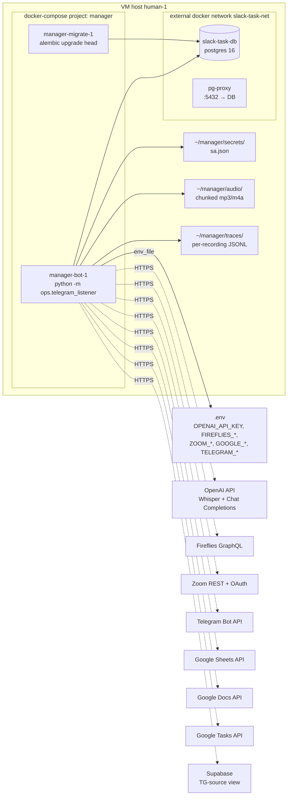
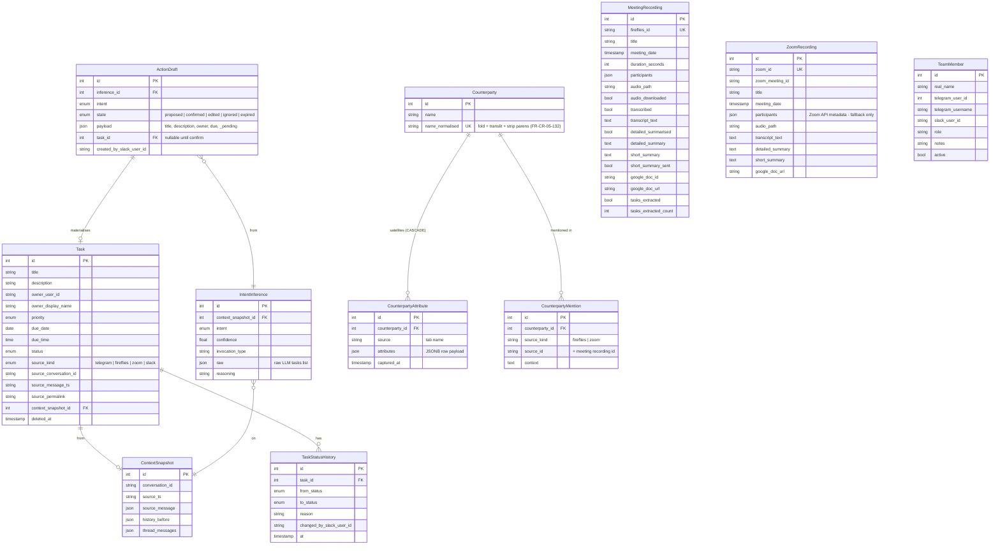
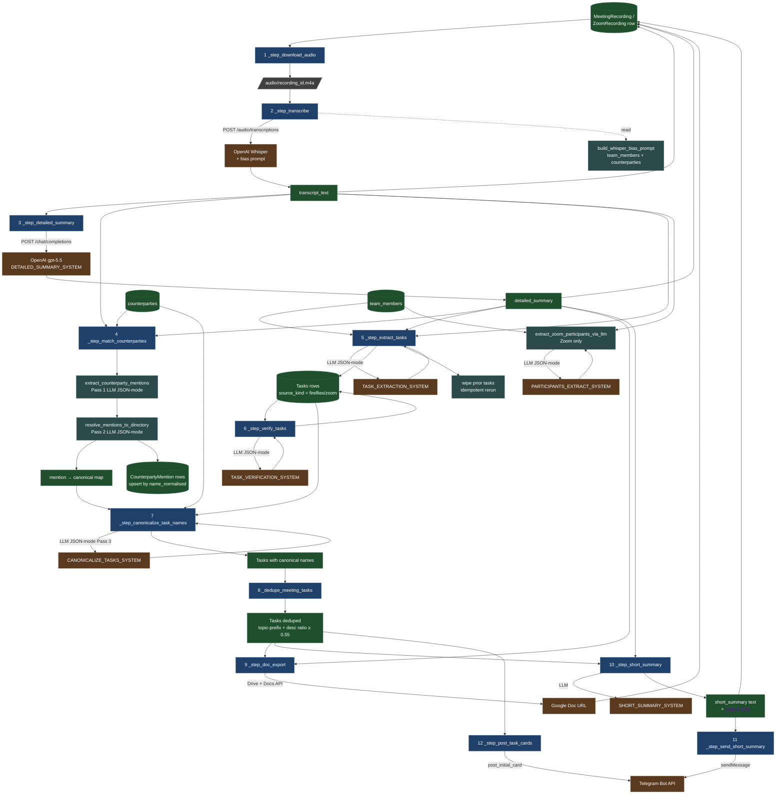
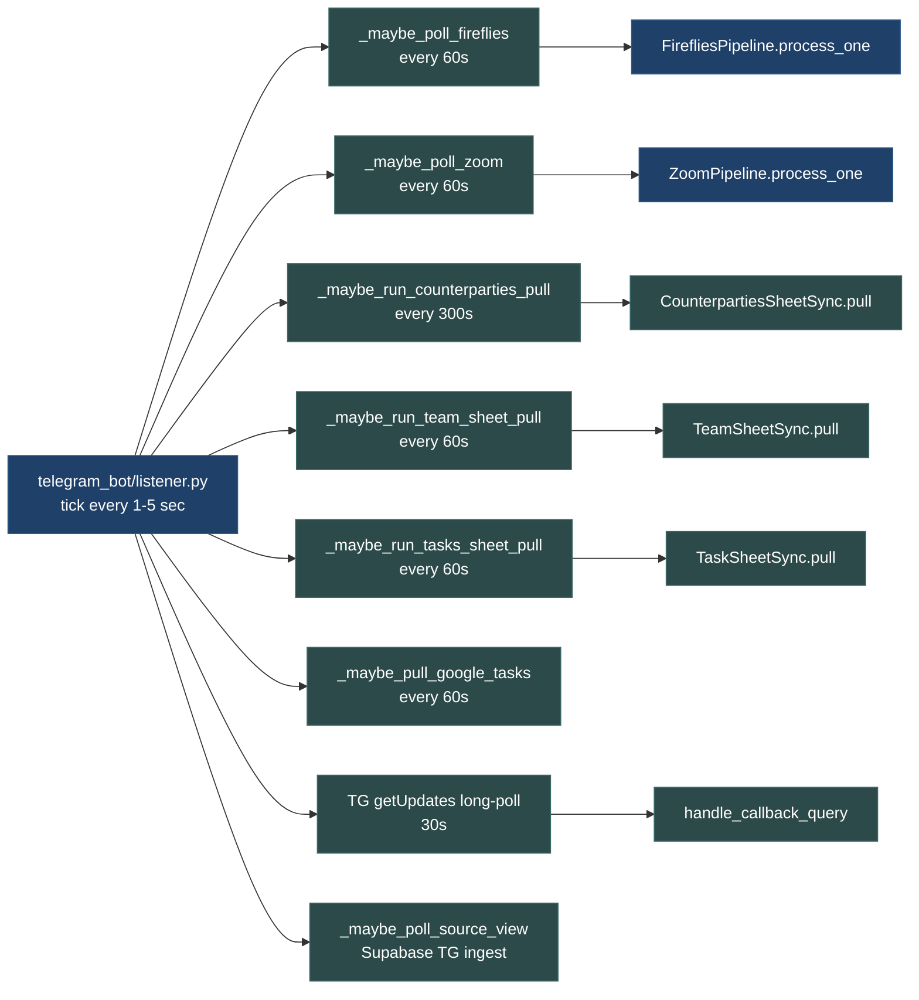
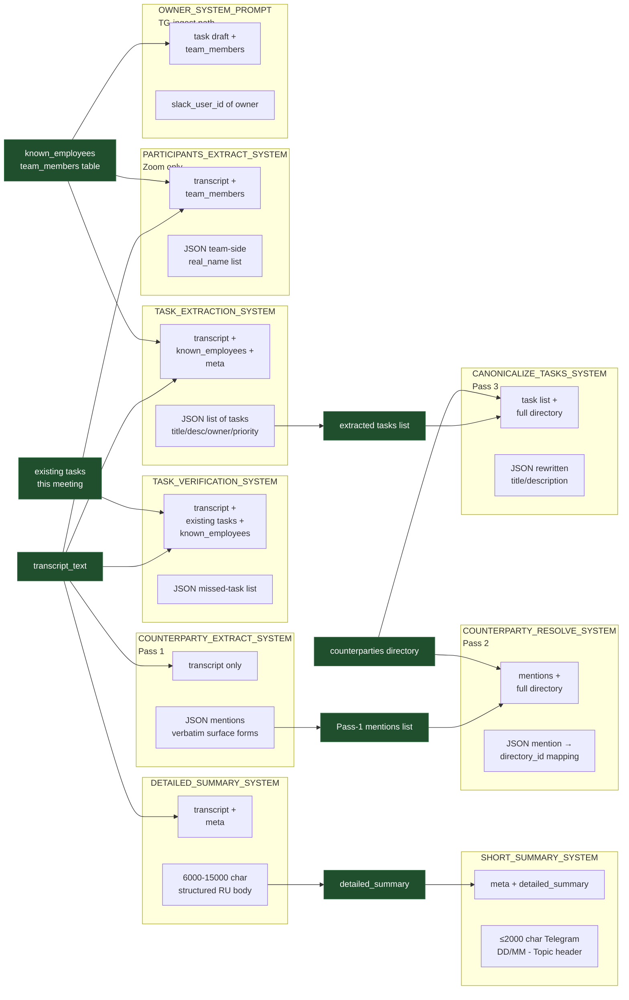
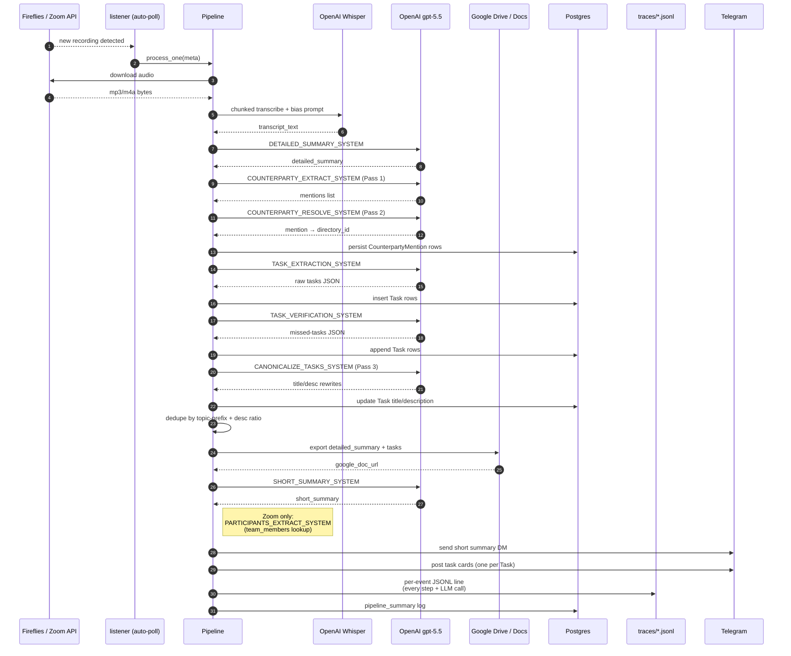

# Architecture diagrams

Mermaid renderings of the manager bot's architecture. Each section
covers one layer; combined they document the live system. Update
when you add a pipeline step / model / integration / system prompt.

> Diagrams use [Mermaid](https://mermaid.js.org). Render with
> `docs/diagrams/` tooling or any markdown viewer with mermaid
> support (GitHub natively renders these).

## 1. Code layout

How the codebase is organised on disk.

```mermaid
graph TD
    APP[app/]:::pkg
    OPS[ops/]:::pkg
    APP --> CONFIG[config.py<br/>Settings + env vars]:::file
    APP --> DB[db.py<br/>session_scope + engine]:::file
    APP --> LOG[logging_setup.py<br/>structlog]:::file

    APP --> MODELS[models/<br/>SQLAlchemy ORM]:::pkg
    APP --> FIREFLIES[fireflies/<br/>pipeline + client + prompts]:::pkg
    APP --> ZOOM[zoom/<br/>pipeline + client]:::pkg
    APP --> SERVICES[services/<br/>shared business logic]:::pkg
    APP --> SYNC[sync/<br/>counterparties / team sheets / tasks]:::pkg
    APP --> TGBOT[telegram_bot/<br/>listener + sender + cards + handlers]:::pkg
    APP --> TGINGEST[telegram_ingest/<br/>messages → ActionDrafts]:::pkg
    APP --> ORCH[orchestrator/<br/>persist inference / drafts]:::pkg
    APP --> PERS[persistence/<br/>Task creation from draft]:::pkg
    APP --> INTENT[intent/<br/>LLM backends + classifier]:::pkg

    OPS --> CLI1[migrate_fireflies.py]:::file
    OPS --> CLI2[migrate_zoom.py]:::file
    OPS --> CLI3[pull_counterparties.py]:::file
    OPS --> CLI4[telegram_listener.py<br/>main process]:::file

    classDef pkg fill:#1e3a5f,stroke:#2d5a8b,color:#fff
    classDef file fill:#2a4a4a,stroke:#3a6a6a,color:#fff
```

## 2. Infrastructure

One bot container + external Postgres + external Google / OpenAI /
Telegram / Fireflies / Zoom APIs. Files mounted via host volumes.

## 3. Data layer (ER)

Core SQLAlchemy models and their key relationships.

## 4. Service layer & data flow

Per-pipeline call graph: which step calls which service, what data
moves in. Both Fireflies and Zoom pipelines share the same shape;
the diagram below documents it once. Step numbers match the order
in `process_one`.

### Listener auto-poll loops (background process)

## 5. Prompts & context

Every system-prompt + the data window each one sees. Prompts are in
`app/fireflies/prompts.py` (4) + `app/services/counterparty_match.py`
(3) + `app/services/zoom_participants.py` (1) = 8 total.

## 6. End-to-end recording lifecycle (sequence)

How a single meeting recording flows through the system from
arrival to a confirmed Task in the operator's TG.

## 7. What's NOT in your list

You asked: «я тут всю архитектуру покрыл?» — твои 5 пунктов покрывают
основное, но в реальной системе есть ещё несколько срезов которые
полезно держать рядом:

- **End-to-end sequence** (диаграмма §6 выше) — что в каком порядке
  происходит. Это не просто "архитектура", а timeline. Без него
  понять «где затыкается» при инциденте сложнее.
- **Listener auto-poll loops** (§4 второй блок) — фоновые тики,
  которые подтягивают данные сами. Они не вписываются в
  «pipeline service-уровень», у них своя жизнь.
- **External integrations** — кто куда HTTP-запросы делает (есть
  в §2 инфраструктуре, но имеет смысл вынести отдельно если
  будешь планировать rate-limits / quotas / retry-policies).
- **Observability / traces** — где смотреть что произошло.
  `docs/TRACES.md` уже это документирует, но связь
  «trace_event → pipeline step» хорошо бы добавить как
  отдельную диаграмму.
- **Auth & secrets** — какой контейнер видит какой ключ. Сейчас:
  `OPENAI_API_KEY` через env, Google `sa.json` через volume mount.
  Полезно для ротации ключей.
- **Migrations / schema evolution** — alembic-цепочка как граф
  (от `0001_initial` до текущего `0023_counterparty_mentions`).
  Помогает при rollback.
- **Approval / lifecycle states** — для TG-flow есть state-machine
  на ActionDraft (`proposed → confirmed/edited/ignored/expired`)
  + Task (`todo → in_progress → done/blocked`). Это отдельная
  state-diagram.

Что добавлять — на твой выбор. Минимум для healthy onboarding'а
коллеги: §1-§6 текущего файла + state-machine ActionDraft/Task.
