# Arch.md — Slack/Telegram Task Manager

> ⚠️ **DEPRECATED — заменён на [`TECHNICAL_ARCHITECTURE.md`](TECHNICAL_ARCHITECTURE.md)**
> (2026-05-24). Сохранён для истории. Не содержит Entity Resolution V2
> (FR-193*), CEO Brain ecosystem, retry-cap/sentinels (FR-196/197),
> auto-Slack-publish (FR-194). Source of truth — TECHNICAL_ARCHITECTURE.md.

Detailed architecture across four levels (infrastructure
deliberately out of scope — see `docker-compose.yml` for that).

1. [Project structure](#1-project-structure-git-layout) — what
   lives where on disk.
2. [Data model / ER](#2-data-model--er) — every persisted entity
   + its relations.
3. [Service DFD](#3-service-dfd--listener-loops--services--persistence)
   — listener loops, sync jobs, pipeline steps, persistence.
4. [AI service DFD + prompts](#4-ai-service-dfd--prompts) —
   every LLM call, link to its prompt md, IO contract.

> **Out of scope** (operator-pinned: «инфру не трогаем»):
> Docker compose topology, container networks, Postgres image,
> Telegram polling vs webhooks. See `docker-compose.yml` and
> `DEPLOY.md`.

---

## 1. Project structure (git layout)

```mermaid
graph TD
    classDef root fill:#1f2937,color:#fff,stroke:#0f172a;
    classDef pkg fill:#0e7490,color:#fff,stroke:#155e75;
    classDef sub fill:#0891b2,color:#fff,stroke:#0e7490;
    classDef test fill:#92400e,color:#fff,stroke:#78350f;
    classDef doc fill:#6d28d9,color:#fff,stroke:#5b21b6;
    classDef ops fill:#065f46,color:#fff,stroke:#064e3b;

    R["📁 manager/"]:::root
    R --> APP["app/"]:::pkg
    R --> ALEMBIC["alembic/<br/>versions/0001..0025"]:::sub
    R --> OPS["ops/<br/>(CLI scripts)"]:::ops
    R --> TESTS["tests/<br/>+ tests/requirements/"]:::test
    R --> DOCS["docs/<br/>+ docs/prompts/<br/>+ SPEC.md / Spec_eng.md"]:::doc
    R --> COMP["docker-compose.yml<br/>Dockerfile<br/>pyproject.toml"]:::root

    APP --> A_INTENT["intent/<br/>(LLM intent extraction:<br/>classifier + 5 prompts)"]:::sub
    APP --> A_ORCH["orchestrator/<br/>(finalize draft → task)"]:::sub
    APP --> A_PERSIST["persistence/<br/>(meetings + tasks repos)"]:::sub
    APP --> A_SCHEMAS["schemas/<br/>(intent payload pydantic)"]:::sub
    APP --> A_SERVICES["services/<br/>(counterparty match,<br/>enrollment, dedup,<br/>transcription, etc.)"]:::sub
    APP --> A_SLACK["slack_bot/<br/>(Bolt app, blocks)"]:::sub
    APP --> A_SYNC["sync/<br/>(Sheets, Tasks, Docs,<br/>counterparties pull)"]:::sub
    APP --> A_TG["telegram_bot/<br/>(listener, sender,<br/>cards, keyboards)"]:::sub
    APP --> A_TGI["telegram_ingest/<br/>(passive view → drafts)"]:::sub
    APP --> A_FF["fireflies/<br/>(client + pipeline + prompts)"]:::sub
    APP --> A_ZOOM["zoom/<br/>(client + pipeline)"]:::sub
    APP --> A_MODELS["models/<br/>(SQLAlchemy: 16 modules)"]:::sub

    DOCS --> D_PROMPTS["prompts/<br/>(16 .md files,<br/>one per LLM call)"]:::doc
    DOCS --> D_ARCH["ARCHITECTURE.md (legacy)<br/>Arch.md (this file)<br/>TRACES.md"]:::doc

    OPS --> O_LISTENER["telegram_listener.py<br/>(zoom + fireflies pipelines<br/>+ counterparties pull)"]:::ops
    OPS --> O_PULL["pull_counterparties.py<br/>pull_tasks_sheet.py"]:::ops
    OPS --> O_MIGRATE["migrate_zoom.py<br/>migrate_fireflies.py<br/>migrate_telegram_history.py"]:::ops
```

### Module ownership

| Path | Role | Key entry-points |
|---|---|---|
| `app/main.py` | Slack bot process | `python -m app.main` |
| `ops/telegram_listener.py` | TG listener + meeting pipelines | `python -m ops.telegram_listener` |
| `app/intent/` | Slack/TG intent extraction (LLM) | `classifier.classify_intent` |
| `app/fireflies/pipeline.py` | Fireflies → Doc + tasks | `FirefliesPipeline.process_one` |
| `app/zoom/pipeline.py` | Zoom → Doc + tasks | `ZoomPipeline.process_one` |
| `app/services/counterparty_match.py` | 4-pass counterparty resolution | `extract_counterparty_mentions`, `resolve_mentions_to_directory`, `canonicalize_task_content_via_llm`, `consolidate_tasks_via_llm` |
| `app/services/counterparty_enrollment.py` | FR-CR-05-133 enrollment widgets | `post_enrollment_prompts`, `handle_yes/no/skip`, `complete_with_context` |
| `app/services/transcription.py` | Whisper wrapper | `transcribe_bytes` |
| `app/sync/counterparties.py` | Counterparties pull from Google Sheets | `CounterpartiesSheetSync.pull` |
| `app/telegram_bot/listener.py` | Telegram polling + callback dispatch | `TelegramListener.tick`, `_handle_callback_query` |
| `alembic/versions/` | Schema migrations 0001 → 0025 | `alembic upgrade head` |

---

## 2. Data model / ER

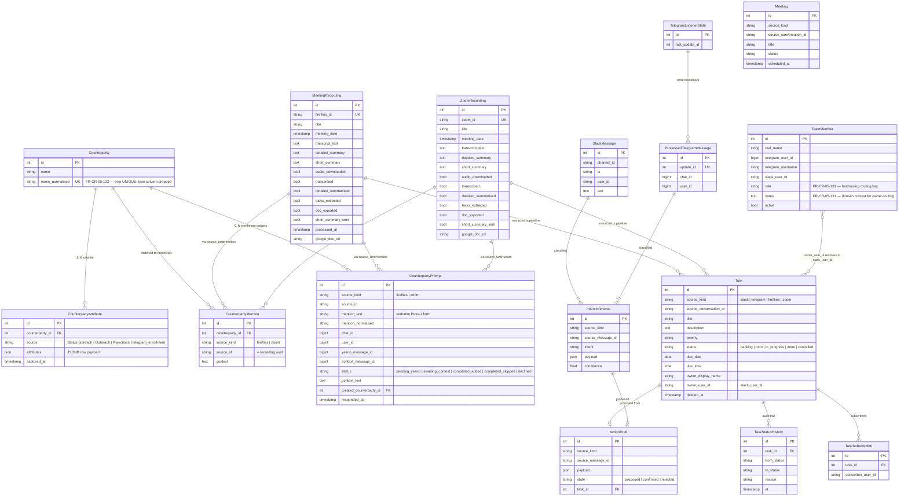

### Migration timeline

| Migration | What landed |
|---|---|
| `0001 → 0017` | Base SPEC + CR-01 + CR-02 + CR-03 + CR-04 |
| `0018` | `meeting_recordings` (Fireflies) |
| `0020` | `zoom_recordings` |
| `0021` | `tasks.source_kind` enum widened to `zoom` |
| `0022` | `counterparties` hub + `counterparty_attrs` satellite |
| `0023` | `counterparty_mentions` junction (recording ↔ counterparty) |
| `0024` | `counterparties.type` column DROPPED, `name_normalised` unique |
| `0025` | `counterparty_prompts` enrollment widget state (FR-CR-05-133) |

---

## 3. Service DFD — listener loops → services → persistence

```mermaid
flowchart LR
    classDef ext fill:#0c4a6e,color:#fff,stroke:#082f49;
    classDef svc fill:#7c2d12,color:#fff,stroke:#451a03;
    classDef store fill:#365314,color:#fff,stroke:#1a2e05;
    classDef llm fill:#581c87,color:#fff,stroke:#3b0764;
    classDef bot fill:#9f1239,color:#fff,stroke:#881337;

    %% External sources
    SLACK_API["Slack Bolt<br/>app_mention / message"]:::ext
    TG_API["Telegram Bot API<br/>getUpdates"]:::ext
    TG_VIEW["Postgres view<br/>humanoid_tg_chats"]:::ext
    FF_API["Fireflies GraphQL<br/>+ mp3 download"]:::ext
    ZOOM_API["Zoom REST + JWT<br/>+ mp4/mp3 download"]:::ext
    SHEETS["Google Sheets<br/>(Team / Status outreach /<br/>Outreach / Targets)"]:::ext
    GTASKS["Google Tasks API"]:::ext
    GDOCS["Google Docs API"]:::ext

    %% Listeners
    SLACK_BOT["app.main<br/>(Bolt app)"]:::bot
    TG_LISTENER["ops.telegram_listener<br/>(TelegramListener.tick loop)"]:::bot

    SLACK_API --> SLACK_BOT
    TG_API --> TG_LISTENER
    TG_VIEW --> TG_LISTENER

    %% Telegram listener tick fans out
    TG_LISTENER -->|every 60s| FF_POLL["FirefliesPoller<br/>list_recent → process_one"]:::svc
    TG_LISTENER -->|every 60s| ZM_POLL["ZoomPoller<br/>list_recent → process_one"]:::svc
    TG_LISTENER -->|every 30s| VIEW_POLL["TelegramIngestService<br/>(view → ActionDraft)"]:::svc
    TG_LISTENER -->|every 60s| TEAM_PULL["TeamSheetSync.pull"]:::svc
    TG_LISTENER -->|every 300s| CP_PULL["CounterpartiesSheetSync.pull"]:::svc
    TG_LISTENER -->|every 60s| TASKS_PULL["GoogleTasksPull"]:::svc

    FF_POLL --> FF_API
    ZM_POLL --> ZOOM_API
    TEAM_PULL --> SHEETS
    CP_PULL --> SHEETS
    TASKS_PULL --> GTASKS

    %% Pipeline steps (Fireflies side; Zoom mirrors)
    FF_POLL --> P1["_step_audio_download"]:::svc
    P1 --> P2["_step_transcribe<br/>(Whisper +<br/>build_whisper_bias_prompt)"]:::svc
    P2 --> P3["_step_detailed_summary"]:::llm
    P3 --> P4["_step_match_counterparties<br/>(Pass 1 extract + Pass 2 resolve)"]:::llm
    P4 --> P4B["_step_enroll_unresolved<br/>FR-CR-05-133"]:::svc
    P4 --> P5["_step_extract_tasks"]:::llm
    P5 --> P6["_step_verify_tasks"]:::llm
    P6 --> P7["_step_canonicalize_task_names<br/>Pass 3"]:::llm
    P7 --> P8["_step_consolidate_tasks<br/>Pass 4"]:::llm
    P8 --> P9["_step_dedupe_tasks"]:::svc
    P9 --> P10["_step_doc_export"]:::svc
    P10 --> P11["_step_short_summary<br/>(zoom: + extract_zoom_participants)"]:::llm
    P11 --> P12["_step_send_short_summary"]:::svc
    P12 --> P13["_step_post_task_cards"]:::svc

    %% Persistence
    P3 -->|detailed_summary| DB[(Postgres<br/>slack-task-db)]:::store
    P4 -->|CounterpartyMention| DB
    P4B -->|CounterpartyPrompt| DB
    P5 -->|Task INSERT| DB
    P6 -->|Task INSERT| DB
    P7 -->|Task UPDATE title/desc| DB
    P8 -->|Task soft-delete + INSERT| DB
    P10 --> GDOCS
    P12 --> TG_API
    P13 --> TG_API

    %% Slack/TG passive ingest
    SLACK_BOT --> INTENT["app.intent.classifier"]:::llm
    VIEW_POLL --> INTENT
    INTENT -->|ActionDraft| DB
    INTENT --> CARDS["draft cards in DM/channel"]:::bot
    CARDS -->|user clicks Confirm| ORCH["orchestrator.finalize<br/>(draft → Task)"]:::svc
    ORCH --> DB

    %% Telegram callbacks (FR-CR-05-133 enrollment + others)
    TG_LISTENER --> CB["_handle_callback_query<br/>+ _handle_pending_reply"]:::bot
    CB --> ENROLL["counterparty_enrollment<br/>(handle_yes/no/skip,<br/>complete_with_context)"]:::svc
    ENROLL --> DB

    %% Sheets writeback
    P5 --> CARD_SYNC["card_sync.schedule_for_sheets_sync"]:::svc
    CARD_SYNC --> SHEETS
```

### Key invariants

1. **Single Postgres for everything**: `slack-task-db` is the
   only durable store. Both `manager-bot` (Slack) and
   `slack-task-tg-listener` (Telegram + meetings) connect via
   `DATABASE_URL`.
2. **Listener tick is the only scheduler**: no cron, no
   external queue. Each `_maybe_run_*` checks an interval and
   short-circuits when too recent.
3. **Pipeline steps are resumable**: each Boolean flag on
   `MeetingRecording` / `ZoomRecording` lets a re-run skip
   completed steps. `processed_at IS NULL` requeues the row.
4. **Failures must NOT cascade**: every step except `transcribe`
   wraps the body in try/except so one broken sub-step doesn't
   block the rest of the pipeline (the operator gets at least
   the doc + short summary even if cards fail).
5. **Idempotent persistence**: `CounterpartyMention` UNIQUE on
   `(source_kind, source_id, counterparty_id)`; tasks soft-
   deleted on extract rerun (FR-CR-05-129); `CounterpartyPrompt`
   UNIQUE on `(source_kind, source_id, mention_normalised,
   user_id)` (FR-CR-05-133).

---

## 4. AI service DFD + prompts

Each LLM call gets ONE prompt md file under
[`docs/prompts/`](./prompts/). Inline source pointers tell you
where the constant lives + where it's invoked. The diagram
below labels each LLM node with the prompt name.

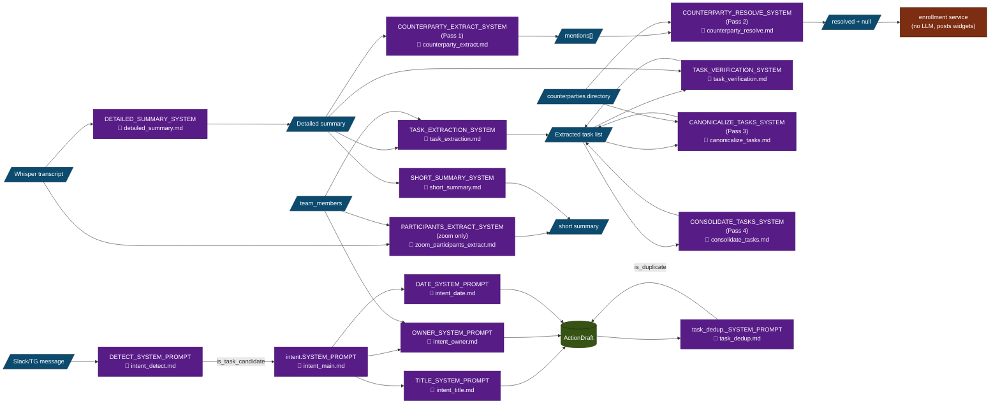

### Prompt inventory

| File | FR | Mode | Reasoning effort |
|---|---|---|---|
| [intent_detect.md](./prompts/intent_detect.md) | base | call_tool | n/a |
| [intent_main.md](./prompts/intent_main.md) | base | call_tool (cached) | n/a |
| [intent_title.md](./prompts/intent_title.md) | FR-CR-05-13 | call_tool | n/a |
| [intent_owner.md](./prompts/intent_owner.md) | FR-CR-04-04 | call_tool | n/a |
| [intent_date.md](./prompts/intent_date.md) | base + FR-CR-05-9 | call_tool | n/a |
| [task_dedup.md](./prompts/task_dedup.md) | FR-CR-05-13 | call_tool | n/a |
| [detailed_summary.md](./prompts/detailed_summary.md) | FR-CR-05-119 | call_tool | medium |
| [counterparty_match.md](./prompts/counterparty_match.md) | FR-CR-05-125 (legacy) | call_tool | medium |
| [counterparty_extract.md](./prompts/counterparty_extract.md) | FR-CR-05-129 | json_object | medium |
| [counterparty_resolve.md](./prompts/counterparty_resolve.md) | FR-CR-05-129 | json_object | medium |
| [canonicalize_tasks.md](./prompts/canonicalize_tasks.md) | FR-CR-05-130 | json_object | medium |
| [consolidate_tasks.md](./prompts/consolidate_tasks.md) | FR-CR-05-131 | json_object | medium |
| [task_extraction.md](./prompts/task_extraction.md) | FR-CR-05-120/129/131 | json_object | medium |
| [task_verification.md](./prompts/task_verification.md) | FR-CR-05-121 | json_object | medium |
| [short_summary.md](./prompts/short_summary.md) | FR-CR-05-127 | call_tool | n/a |
| [zoom_participants_extract.md](./prompts/zoom_participants_extract.md) | FR-CR-05-130 | json_object | n/a |

### Why two LLM call modes

- `call_tool`: Anthropic's tool-use API, schema-validated
  output, cache-friendly. Used for stable contracts.
- `complete_text(response_format={"type": "json_object"})`:
  OpenAI's JSON mode — required for reasoning models (gpt-5.5-thinking
  + reasoning_effort), since the OpenAI tool-use path 400s when
  reasoning is on. All Pass-1..4 counterparty calls use this
  mode (FR-CR-05-129+).

---

## 5. Infrastructure (containers, networking, volumes)

Two long-running app containers + one Postgres + 2 socat
proxies. Everything sits on a single bridge network. Code lives
in one repo (`~/manager`) but ships under two image tags
(`manager-bot` + `slack-task-bot:latest`) — they're the SAME
build, just running different entry-points.

### Container topology

```mermaid
flowchart TB
    classDef app fill:#7c2d12,color:#fff,stroke:#451a03;
    classDef db fill:#365314,color:#fff,stroke:#1a2e05;
    classDef proxy fill:#0c4a6e,color:#fff,stroke:#082f49;
    classDef ext fill:#581c87,color:#fff,stroke:#3b0764;
    classDef net fill:#1f2937,color:#fff,stroke:#111827;

    subgraph NET["🟦 docker network: slack-task-net (bridge)"]
        BOT["manager-bot-1<br/>image: manager-bot<br/>cmd: python -m app.main<br/>(Slack Bolt: socket-mode)"]:::app
        TGL["slack-task-tg-listener<br/>image: slack-task-bot:latest<br/>cmd: python -m ops.telegram_listener<br/>(TG long-poll + Fireflies + Zoom +<br/>counterparties pull + view-poll)"]:::app
        SBOT_LEGACY["slack-task-bot (legacy)<br/>image: slack-task-bot:latest<br/>predecessor of manager-bot;<br/>kept running, may be retired"]:::app
        DB[("slack-task-db<br/>postgres:16-alpine<br/>DB: slack_tasks")]:::db
        PG_PROXY["pg-proxy / pg-proxy-5433<br/>alpine/socat<br/>(external pg access from host)")]:::proxy
    end

    SLACK["Slack API<br/>(Bolt over WebSocket)"]:::ext
    TELEGRAM["Telegram Bot API<br/>(getUpdates HTTP long-poll)"]:::ext
    SUPABASE["Supabase Postgres<br/>humanoid_tg_chats view<br/>(read-only)"]:::ext
    OPENAI["OpenAI API<br/>(Whisper + gpt-5.5-thinking)"]:::ext
    ANTHROPIC["Anthropic API<br/>(Claude for intent + dedup)"]:::ext
    FIREFLIES["Fireflies GraphQL +<br/>mp3 download URL"]:::ext
    ZOOM["Zoom REST API +<br/>OAuth (account creds)<br/>+ recording download"]:::ext
    GOOGLE["Google APIs<br/>(Sheets / Docs / Tasks)"]:::ext

    BOT <-->|WebSocket| SLACK
    BOT --> ANTHROPIC
    BOT --> OPENAI

    TGL <-->|long-poll| TELEGRAM
    TGL -->|read-only| SUPABASE
    TGL --> OPENAI
    TGL --> ANTHROPIC
    TGL --> FIREFLIES
    TGL --> ZOOM
    TGL --> GOOGLE

    BOT -->|psycopg<br/>tcp:5432| DB
    TGL -->|psycopg<br/>tcp:5432| DB
    SBOT_LEGACY -->|psycopg<br/>tcp:5432| DB

    PG_PROXY -.->|tcp passthrough| DB
```

### Networks

| Network | Driver | Purpose | Members |
|---|---|---|---|
| `slack-task-net` | bridge | App + DB intra-container DNS (`slack-task-db` resolves) | `manager-bot-1`, `slack-task-tg-listener`, `slack-task-bot`, `slack-task-db`, `pg-proxy`, `pg-proxy-5433` |
| `manager_default` | bridge | Auto-created by `~/manager/docker-compose.yml`; effectively unused — compose's own `db` service is no longer in play, real DB is on `slack-task-net`. | (empty) |

Container-to-container DNS uses the slack-task-net aliases:
- `slack-task-db` resolves to the Postgres container.
- App containers DNS-discover the DB via the URL
  `postgresql+psycopg://postgres:<pw>@slack-task-db:5432/slack_tasks`.

External access to Postgres goes through `pg-proxy` (5432) and
`pg-proxy-5433` (5433) socat passthroughs — convenient for
operator psql sessions from the VM host without exec-ing into
the container.

### Volumes & bind mounts

| Mount | Container path | Used by | Purpose |
|---|---|---|---|
| `~/manager/data` | `/app/data` | bot, tg-listener | Misc app-side persistence (not the DB) |
| `~/manager/secrets` | `/app/secrets` | bot, tg-listener | `sa.json` (Google service account), other key files |
| `~/manager/audio` | `/app/audio` | tg-listener | Downloaded Fireflies/Zoom mp3s before Whisper |
| `~/manager/traces` | `/app/traces` | tg-listener | Per-recording JSONL trace files (FR-CR-05-128) |
| Postgres named volume | `/var/lib/postgresql/data` | slack-task-db | DB data files (lifecycle managed outside this compose) |

### Secrets

Provided via env-vars (sourced from `~/manager/.env` + the
saved `/tmp/tg-listener.env` for the listener container):

| Env | Service | Notes |
|---|---|---|
| `DATABASE_URL` | both apps | `postgresql+psycopg://postgres:<pw>@slack-task-db:5432/slack_tasks` |
| `TELEGRAM_SOURCE_DATABASE_URL` | tg-listener | Supabase read-only credentials for the `humanoid_tg_chats` view |
| `TELEGRAM_BOT_TOKEN` | tg-listener | bot user token |
| `TELEGRAM_ADMIN_USER_IDS` | tg-listener | comma-separated TG user_ids that get morning digests + enrollment widgets (FR-CR-05-133) |
| `SLACK_BOT_TOKEN` / `SLACK_APP_TOKEN` | bot | xoxb / xapp socket-mode pair |
| `OPENAI_API_KEY` | both | Whisper + gpt-5.5 + reasoning models |
| `ANTHROPIC_API_KEY` | both | Claude (intent + dedup paths) |
| `FIREFLIES_API_TOKEN` | tg-listener | GraphQL bearer |
| `ZOOM_ACCOUNT_ID` / `_CLIENT_ID` / `_CLIENT_SECRET` / `_SECRET_TOKEN` | tg-listener | OAuth account creds |
| `GOOGLE_SERVICE_ACCOUNT_JSON_PATH` | both | Path to mounted `sa.json` |
| `*_SHEET_ID` / `*_TAB_NAME` | both | Spreadsheet binding for Team / Counterparties / Tasks / Status outreach |
| `*_POLL_INTERVAL_SECONDS` | tg-listener | 30 (view) / 60 (zoom / fireflies / google_tasks) / 300 (counterparties) |

Secrets currently sit in plain-text env files on the VM. No
KMS / Vault integration yet.

### Process model

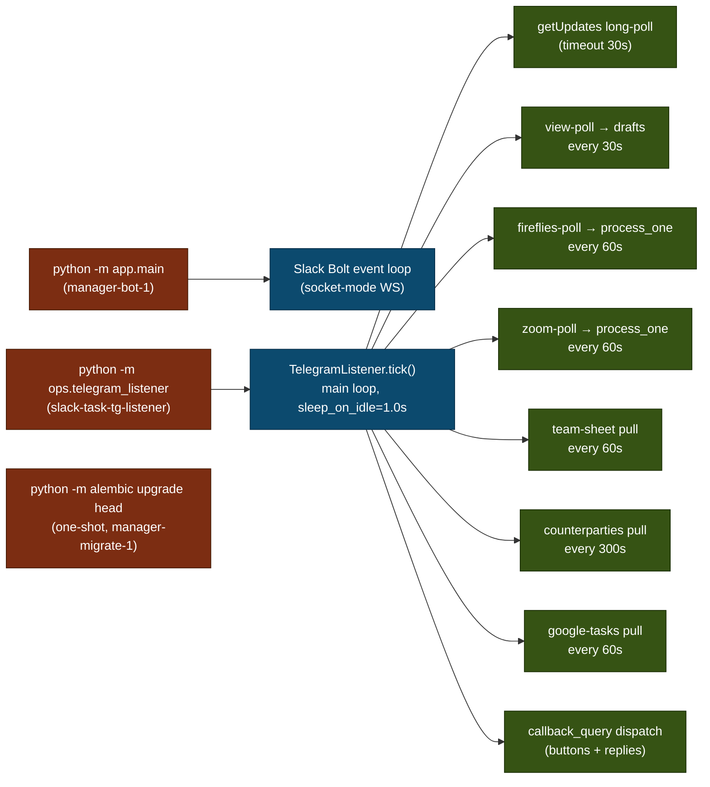

- **`bot` service** runs continuously under restart-policy
  `unless-stopped`.
- **`tg-listener` container** runs continuously under
  restart-policy `unless-stopped` (started via `docker run`,
  not the compose).
- **`migrate` service** runs once via
  `docker-compose run --rm migrate` (operator-triggered or on
  redeploy).
- **No background workers / no celery / no cron** — every
  periodic action is a `_maybe_run_*` check inside the listener
  tick loop.

### Deploy flow

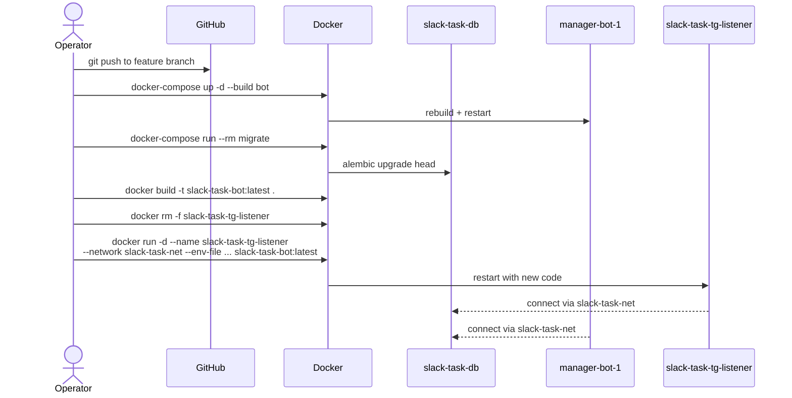

The ad-hoc `docker run` for the listener is a known wart —
should be folded into the compose as a second service in a
follow-up so a single `docker-compose up -d --build` covers
both apps.

### Health, restart, observability

- **Restart policy**: `unless-stopped` for both apps. Postgres
  managed externally.
- **No HTTP health endpoints** — health is implicit (logs
  showing tick output every ~60s).
- **Observability**:
  - `docker logs <name>` for raw structlog output.
  - `~/manager/traces/<source>-<recording-id>.jsonl` for the
    full per-recording event trace (FR-CR-05-128). See
    [`TRACES.md`](./TRACES.md).
  - Postgres queries via `docker exec slack-task-db psql -U postgres -d slack_tasks`.

### External-API budgets (current)

| API | Pattern | Cost dial |
|---|---|---|
| OpenAI Whisper | per-meeting transcribe | mp3 size (capped at 25MB Whisper limit; chunked via ffmpeg) |
| OpenAI gpt-5.5-thinking | 4 passes per meeting + extract + verify + canonicalize + consolidate + detailed + short | reasoning_effort (default `medium`) |
| Anthropic Claude | per-message in Slack/TG passive ingest + per-task dedup | prompt-cached system message |
| Fireflies | poll list + per-recording fetch | poll interval (60s) |
| Zoom | poll list + per-recording fetch + OAuth refresh | poll interval (60s) |
| Google Sheets | counterparties (300s) + team_members (60s) + tasks-pull (60s) | poll intervals |
| Telegram | long-poll (timeout 30s) + sendMessage / editMessageText per card | message volume |

---

## 6. Features & user flows

What real humans actually do with this system.

### Personas

| Persona | Surface | What they get |
|---|---|---|
| **Operator (admin)** — Andre, etc. | TG DM with bot + Slack workspace + Google Doc + Sheet | Morning + evening digests, meeting summaries, all task cards, enrollment widgets |
| **Team member** | TG DM with bot + Slack DMs | Task cards for their assigned tasks; subscription updates for tasks they follow |
| **External counterparty** | (none — never sees the bot) | n/a — they show up only as named entities in the directory |

### Feature catalogue

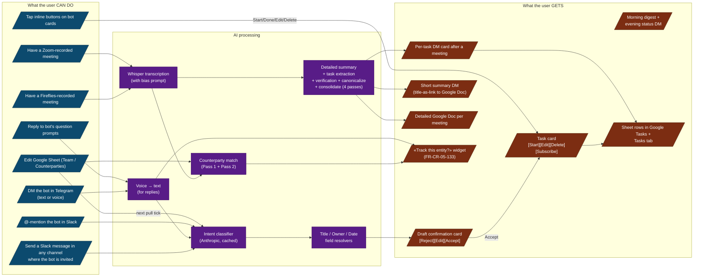

### Flow A — passive task creation in Slack/Telegram

«User says something in chat → bot proposes a task → user
confirms.»

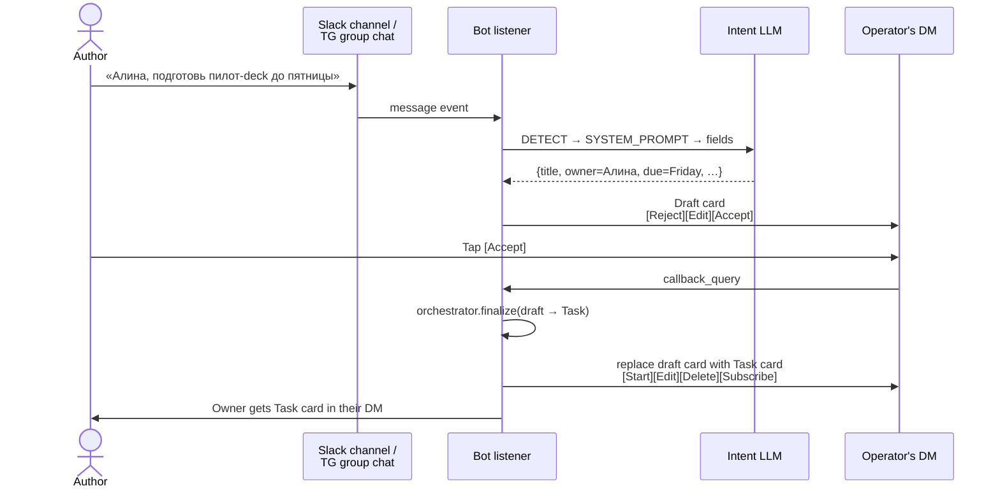

### Flow B — meeting → tasks & summary

«Meeting recorded → all the artefacts arrive while operator
sleeps.»

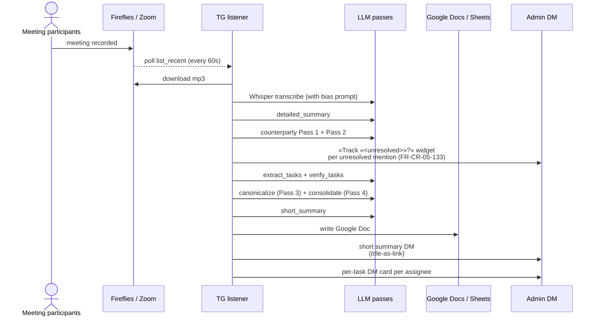

### Flow C — enrollment widget (FR-CR-05-133)

«Bot picked up an entity that isn't in the directory.»

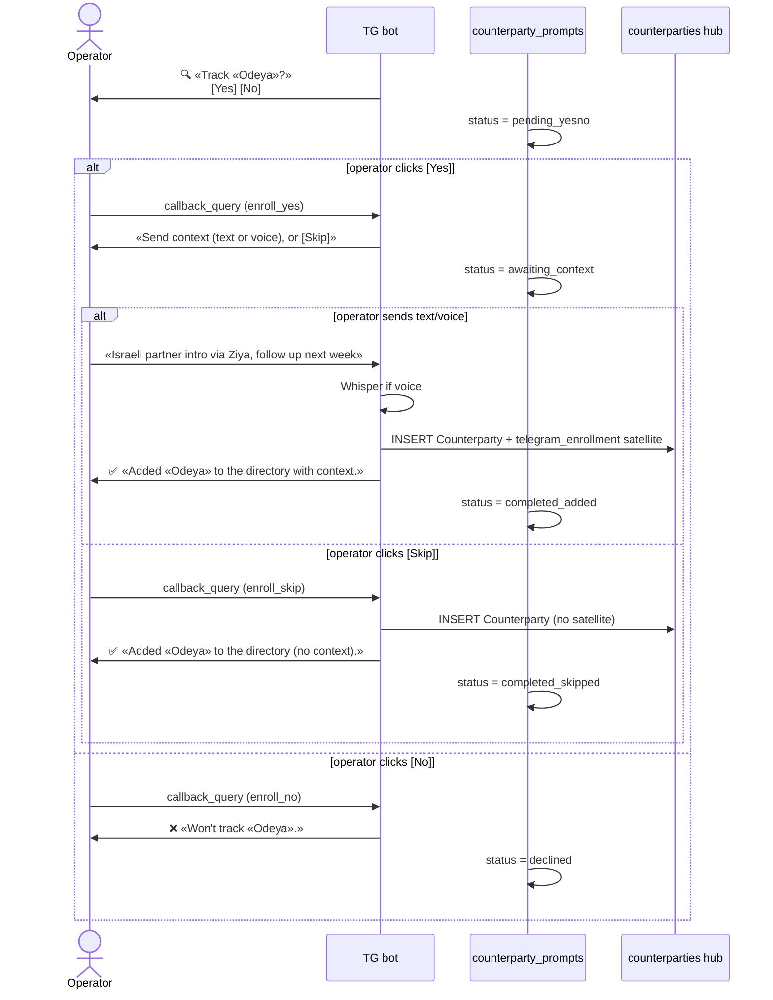

### Flow D — daily rhythm (operator's POV)

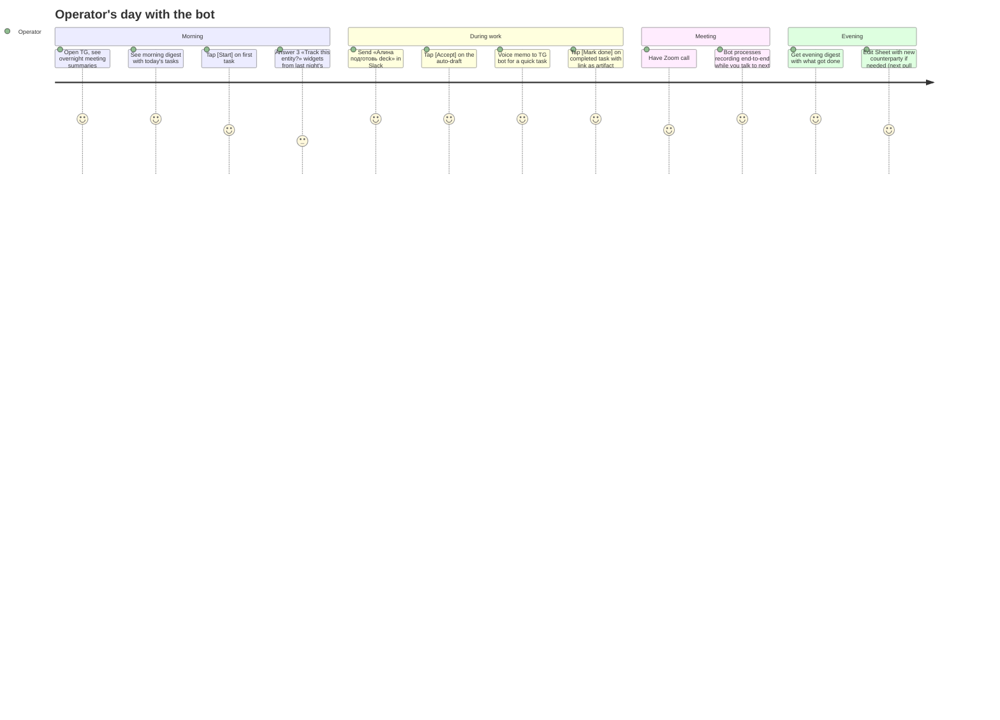

### Feature → code map

| Feature | Spec FR | Entry-point |
|---|---|---|
| Slack mention task creation | FR-1..5 | `app/intent/classifier.py` |
| Telegram passive ingest | FR-CR-04-30 | `app/telegram_ingest/service.py` |
| Telegram voice → text | FR-CR-05-14 | `_maybe_transcribe_voice` |
| Draft confirm/reject/edit | FR-CR-04-32 | `app/orchestrator/finalize.py` + handlers |
| Task lifecycle (Start/Done/Edit/Delete) | FR-CR-04 | `app/telegram_bot/listener.py::_dispatch_action` |
| Subscriptions | FR-CR-04 | `app/services/subscriptions.py` |
| Morning digest | FR-CR-05-10 | `app/telegram_bot/morning_cards.py` |
| Evening status | FR-CR-05-10 | `app/telegram_bot/evening_status.py` |
| Fireflies pipeline | FR-CR-05-119+ | `app/fireflies/pipeline.py` |
| Zoom pipeline | FR-CR-05-119+ | `app/zoom/pipeline.py` |
| Counterparty 4-pass canonicalisation | FR-CR-05-129..131 | `app/services/counterparty_match.py` |
| Counterparty enrollment widget | FR-CR-05-133 | `app/services/counterparty_enrollment.py` |
| Google Doc export per meeting | FR-CR-05-119 | `app/sync/docs.py` |
| Google Tasks bidirectional sync | FR-CR-05-11 | `app/sync/task_sync.py` + `tasks_pull.py` |
| Sheets writeback (Tasks tab) | FR-CR-05-11 | `app/services/card_sync.py` |
| Per-recording trace JSONL | FR-CR-05-128 | `app/services/trace_log.py` |

---

## 7. What's NOT in this doc

Now that infra + features are covered, the residual gaps:

- **Backup & disaster recovery** for `slack-task-db` —
  operator-managed (snapshots / pg_dump cadence not codified).
- **Secret rotation** — env files on the VM, manual rotation.
- **Webhook vs long-poll for Telegram** — currently long-poll
  via `getUpdates`, see `app/telegram_bot/listener.py`.
- **Multi-tenant story** — single workspace today; operator's
  Slack + a single TG bot user. No org-tenant model.
- **Rate-limiting / quotas** — relies on upstream API limits +
  poll-interval throttling; no internal queueing.
- **Cost reporting** — no per-call cost tracking yet (operator
  could read OpenAI dashboard).

For trace observability of any flow, see
[`TRACES.md`](./TRACES.md).
