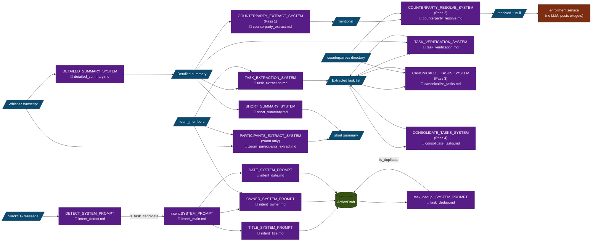

# Arch.md — Slack/Telegram Task Manager

Detailed architecture across four levels (infrastructure
deliberately out of scope — see `docker-compose.yml` for that).

1. [Project structure](#1-project-structure-git-layout) — what
   lives where on disk.
2. [Data model / ER](#2-data-model--er) — every persisted entity
   + its relations.
3. [Service DFD](#3-service-dfd--listener-loops--services--persistence)
   — listener loops, sync jobs, pipeline steps, persistence.
4. [AI service DFD + prompts](#4-ai-service-dfd--prompts) —
   every LLM call, link to its prompt md, IO contract.

> **Out of scope** (operator-pinned: «инфру не трогаем»):
> Docker compose topology, container networks, Postgres image,
> Telegram polling vs webhooks. See `docker-compose.yml` and
> `DEPLOY.md`.

---

## 1. Project structure (git layout)

```mermaid
graph TD
    classDef root fill:#1f2937,color:#fff,stroke:#0f172a;
    classDef pkg fill:#0e7490,color:#fff,stroke:#155e75;
    classDef sub fill:#0891b2,color:#fff,stroke:#0e7490;
    classDef test fill:#92400e,color:#fff,stroke:#78350f;
    classDef doc fill:#6d28d9,color:#fff,stroke:#5b21b6;
    classDef ops fill:#065f46,color:#fff,stroke:#064e3b;

    R["📁 manager/"]:::root
    R --> APP["app/"]:::pkg
    R --> ALEMBIC["alembic/<br/>versions/0001..0025"]:::sub
    R --> OPS["ops/<br/>(CLI scripts)"]:::ops
    R --> TESTS["tests/<br/>+ tests/requirements/"]:::test
    R --> DOCS["docs/<br/>+ docs/prompts/<br/>+ SPEC.md / Spec_eng.md"]:::doc
    R --> COMP["docker-compose.yml<br/>Dockerfile<br/>pyproject.toml"]:::root

    APP --> A_INTENT["intent/<br/>(LLM intent extraction:<br/>classifier + 5 prompts)"]:::sub
    APP --> A_ORCH["orchestrator/<br/>(finalize draft → task)"]:::sub
    APP --> A_PERSIST["persistence/<br/>(meetings + tasks repos)"]:::sub
    APP --> A_SCHEMAS["schemas/<br/>(intent payload pydantic)"]:::sub
    APP --> A_SERVICES["services/<br/>(counterparty match,<br/>enrollment, dedup,<br/>transcription, etc.)"]:::sub
    APP --> A_SLACK["slack_bot/<br/>(Bolt app, blocks)"]:::sub
    APP --> A_SYNC["sync/<br/>(Sheets, Tasks, Docs,<br/>counterparties pull)"]:::sub
    APP --> A_TG["telegram_bot/<br/>(listener, sender,<br/>cards, keyboards)"]:::sub
    APP --> A_TGI["telegram_ingest/<br/>(passive view → drafts)"]:::sub
    APP --> A_FF["fireflies/<br/>(client + pipeline + prompts)"]:::sub
    APP --> A_ZOOM["zoom/<br/>(client + pipeline)"]:::sub
    APP --> A_MODELS["models/<br/>(SQLAlchemy: 16 modules)"]:::sub

    DOCS --> D_PROMPTS["prompts/<br/>(16 .md files,<br/>one per LLM call)"]:::doc
    DOCS --> D_ARCH["ARCHITECTURE.md (legacy)<br/>Arch.md (this file)<br/>TRACES.md"]:::doc

    OPS --> O_LISTENER["telegram_listener.py<br/>(zoom + fireflies pipelines<br/>+ counterparties pull)"]:::ops
    OPS --> O_PULL["pull_counterparties.py<br/>pull_tasks_sheet.py"]:::ops
    OPS --> O_MIGRATE["migrate_zoom.py<br/>migrate_fireflies.py<br/>migrate_telegram_history.py"]:::ops
```

### Module ownership

| Path | Role | Key entry-points |
|---|---|---|
| `app/main.py` | Slack bot process | `python -m app.main` |
| `ops/telegram_listener.py` | TG listener + meeting pipelines | `python -m ops.telegram_listener` |
| `app/intent/` | Slack/TG intent extraction (LLM) | `classifier.classify_intent` |
| `app/fireflies/pipeline.py` | Fireflies → Doc + tasks | `FirefliesPipeline.process_one` |
| `app/zoom/pipeline.py` | Zoom → Doc + tasks | `ZoomPipeline.process_one` |
| `app/services/counterparty_match.py` | 4-pass counterparty resolution | `extract_counterparty_mentions`, `resolve_mentions_to_directory`, `canonicalize_task_content_via_llm`, `consolidate_tasks_via_llm` |
| `app/services/counterparty_enrollment.py` | FR-CR-05-133 enrollment widgets | `post_enrollment_prompts`, `handle_yes/no/skip`, `complete_with_context` |
| `app/services/transcription.py` | Whisper wrapper | `transcribe_bytes` |
| `app/sync/counterparties.py` | Counterparties pull from Google Sheets | `CounterpartiesSheetSync.pull` |
| `app/telegram_bot/listener.py` | Telegram polling + callback dispatch | `TelegramListener.tick`, `_handle_callback_query` |
| `alembic/versions/` | Schema migrations 0001 → 0025 | `alembic upgrade head` |

---

## 2. Data model / ER

### Migration timeline

| Migration | What landed |
|---|---|
| `0001 → 0017` | Base SPEC + CR-01 + CR-02 + CR-03 + CR-04 |
| `0018` | `meeting_recordings` (Fireflies) |
| `0020` | `zoom_recordings` |
| `0021` | `tasks.source_kind` enum widened to `zoom` |
| `0022` | `counterparties` hub + `counterparty_attrs` satellite |
| `0023` | `counterparty_mentions` junction (recording ↔ counterparty) |
| `0024` | `counterparties.type` column DROPPED, `name_normalised` unique |
| `0025` | `counterparty_prompts` enrollment widget state (FR-CR-05-133) |

---

## 3. Service DFD — listener loops → services → persistence

```mermaid
flowchart LR
    classDef ext fill:#0c4a6e,color:#fff,stroke:#082f49;
    classDef svc fill:#7c2d12,color:#fff,stroke:#451a03;
    classDef store fill:#365314,color:#fff,stroke:#1a2e05;
    classDef llm fill:#581c87,color:#fff,stroke:#3b0764;
    classDef bot fill:#9f1239,color:#fff,stroke:#881337;

    %% External sources
    SLACK_API["Slack Bolt<br/>app_mention / message"]:::ext
    TG_API["Telegram Bot API<br/>getUpdates"]:::ext
    TG_VIEW["Postgres view<br/>humanoid_tg_chats"]:::ext
    FF_API["Fireflies GraphQL<br/>+ mp3 download"]:::ext
    ZOOM_API["Zoom REST + JWT<br/>+ mp4/mp3 download"]:::ext
    SHEETS["Google Sheets<br/>(Team / Status outreach /<br/>Outreach / Targets)"]:::ext
    GTASKS["Google Tasks API"]:::ext
    GDOCS["Google Docs API"]:::ext

    %% Listeners
    SLACK_BOT["app.main<br/>(Bolt app)"]:::bot
    TG_LISTENER["ops.telegram_listener<br/>(TelegramListener.tick loop)"]:::bot

    SLACK_API --> SLACK_BOT
    TG_API --> TG_LISTENER
    TG_VIEW --> TG_LISTENER

    %% Telegram listener tick fans out
    TG_LISTENER -->|every 60s| FF_POLL["FirefliesPoller<br/>list_recent → process_one"]:::svc
    TG_LISTENER -->|every 60s| ZM_POLL["ZoomPoller<br/>list_recent → process_one"]:::svc
    TG_LISTENER -->|every 30s| VIEW_POLL["TelegramIngestService<br/>(view → ActionDraft)"]:::svc
    TG_LISTENER -->|every 60s| TEAM_PULL["TeamSheetSync.pull"]:::svc
    TG_LISTENER -->|every 300s| CP_PULL["CounterpartiesSheetSync.pull"]:::svc
    TG_LISTENER -->|every 60s| TASKS_PULL["GoogleTasksPull"]:::svc

    FF_POLL --> FF_API
    ZM_POLL --> ZOOM_API
    TEAM_PULL --> SHEETS
    CP_PULL --> SHEETS
    TASKS_PULL --> GTASKS

    %% Pipeline steps (Fireflies side; Zoom mirrors)
    FF_POLL --> P1["_step_audio_download"]:::svc
    P1 --> P2["_step_transcribe<br/>(Whisper +<br/>build_whisper_bias_prompt)"]:::svc
    P2 --> P3["_step_detailed_summary"]:::llm
    P3 --> P4["_step_match_counterparties<br/>(Pass 1 extract + Pass 2 resolve)"]:::llm
    P4 --> P4B["_step_enroll_unresolved<br/>FR-CR-05-133"]:::svc
    P4 --> P5["_step_extract_tasks"]:::llm
    P5 --> P6["_step_verify_tasks"]:::llm
    P6 --> P7["_step_canonicalize_task_names<br/>Pass 3"]:::llm
    P7 --> P8["_step_consolidate_tasks<br/>Pass 4"]:::llm
    P8 --> P9["_step_dedupe_tasks"]:::svc
    P9 --> P10["_step_doc_export"]:::svc
    P10 --> P11["_step_short_summary<br/>(zoom: + extract_zoom_participants)"]:::llm
    P11 --> P12["_step_send_short_summary"]:::svc
    P12 --> P13["_step_post_task_cards"]:::svc

    %% Persistence
    P3 -->|detailed_summary| DB[(Postgres<br/>slack-task-db)]:::store
    P4 -->|CounterpartyMention| DB
    P4B -->|CounterpartyPrompt| DB
    P5 -->|Task INSERT| DB
    P6 -->|Task INSERT| DB
    P7 -->|Task UPDATE title/desc| DB
    P8 -->|Task soft-delete + INSERT| DB
    P10 --> GDOCS
    P12 --> TG_API
    P13 --> TG_API

    %% Slack/TG passive ingest
    SLACK_BOT --> INTENT["app.intent.classifier"]:::llm
    VIEW_POLL --> INTENT
    INTENT -->|ActionDraft| DB
    INTENT --> CARDS["draft cards in DM/channel"]:::bot
    CARDS -->|user clicks Confirm| ORCH["orchestrator.finalize<br/>(draft → Task)"]:::svc
    ORCH --> DB

    %% Telegram callbacks (FR-CR-05-133 enrollment + others)
    TG_LISTENER --> CB["_handle_callback_query<br/>+ _handle_pending_reply"]:::bot
    CB --> ENROLL["counterparty_enrollment<br/>(handle_yes/no/skip,<br/>complete_with_context)"]:::svc
    ENROLL --> DB

    %% Sheets writeback
    P5 --> CARD_SYNC["card_sync.schedule_for_sheets_sync"]:::svc
    CARD_SYNC --> SHEETS
```

### Key invariants

1. **Single Postgres for everything**: `slack-task-db` is the
   only durable store. Both `manager-bot` (Slack) and
   `slack-task-tg-listener` (Telegram + meetings) connect via
   `DATABASE_URL`.
2. **Listener tick is the only scheduler**: no cron, no
   external queue. Each `_maybe_run_*` checks an interval and
   short-circuits when too recent.
3. **Pipeline steps are resumable**: each Boolean flag on
   `MeetingRecording` / `ZoomRecording` lets a re-run skip
   completed steps. `processed_at IS NULL` requeues the row.
4. **Failures must NOT cascade**: every step except `transcribe`
   wraps the body in try/except so one broken sub-step doesn't
   block the rest of the pipeline (the operator gets at least
   the doc + short summary even if cards fail).
5. **Idempotent persistence**: `CounterpartyMention` UNIQUE on
   `(source_kind, source_id, counterparty_id)`; tasks soft-
   deleted on extract rerun (FR-CR-05-129); `CounterpartyPrompt`
   UNIQUE on `(source_kind, source_id, mention_normalised,
   user_id)` (FR-CR-05-133).

---

## 4. AI service DFD + prompts

Each LLM call gets ONE prompt md file under
[`docs/prompts/`](./prompts/). Inline source pointers tell you
where the constant lives + where it's invoked. The diagram
below labels each LLM node with the prompt name.

### Prompt inventory

| File | FR | Mode | Reasoning effort |
|---|---|---|---|
| [intent_detect.md](./prompts/intent_detect.md) | base | call_tool | n/a |
| [intent_main.md](./prompts/intent_main.md) | base | call_tool (cached) | n/a |
| [intent_title.md](./prompts/intent_title.md) | FR-CR-05-13 | call_tool | n/a |
| [intent_owner.md](./prompts/intent_owner.md) | FR-CR-04-04 | call_tool | n/a |
| [intent_date.md](./prompts/intent_date.md) | base + FR-CR-05-9 | call_tool | n/a |
| [task_dedup.md](./prompts/task_dedup.md) | FR-CR-05-13 | call_tool | n/a |
| [detailed_summary.md](./prompts/detailed_summary.md) | FR-CR-05-119 | call_tool | medium |
| [counterparty_match.md](./prompts/counterparty_match.md) | FR-CR-05-125 (legacy) | call_tool | medium |
| [counterparty_extract.md](./prompts/counterparty_extract.md) | FR-CR-05-129 | json_object | medium |
| [counterparty_resolve.md](./prompts/counterparty_resolve.md) | FR-CR-05-129 | json_object | medium |
| [canonicalize_tasks.md](./prompts/canonicalize_tasks.md) | FR-CR-05-130 | json_object | medium |
| [consolidate_tasks.md](./prompts/consolidate_tasks.md) | FR-CR-05-131 | json_object | medium |
| [task_extraction.md](./prompts/task_extraction.md) | FR-CR-05-120/129/131 | json_object | medium |
| [task_verification.md](./prompts/task_verification.md) | FR-CR-05-121 | json_object | medium |
| [short_summary.md](./prompts/short_summary.md) | FR-CR-05-127 | call_tool | n/a |
| [zoom_participants_extract.md](./prompts/zoom_participants_extract.md) | FR-CR-05-130 | json_object | n/a |

### Why two LLM call modes

- `call_tool`: Anthropic's tool-use API, schema-validated
  output, cache-friendly. Used for stable contracts.
- `complete_text(response_format={"type": "json_object"})`:
  OpenAI's JSON mode — required for reasoning models (gpt-5.5-thinking
  + reasoning_effort), since the OpenAI tool-use path 400s when
  reasoning is on. All Pass-1..4 counterparty calls use this
  mode (FR-CR-05-129+).

---

## 5. What's NOT in this doc

Operator-pinned scope: «инфру не трогаем».

- **Docker compose topology** — see `docker-compose.yml`.
- **Container networking / `slack-task-net`** — operator-managed.
- **Postgres backup / disaster recovery** — out of scope.
- **Webhook vs long-poll for Telegram** — currently long-poll
  via `getUpdates`, see `app/telegram_bot/listener.py`.

For trace observability of any of the above flows, see
[`TRACES.md`](./TRACES.md).
