# Database — single ER diagram

One ER diagram for the whole project (all 46 tables + relationships, key
fields with English comments). Renders in GitHub / mermaid.live / VS Code /
Obsidian. (The inline preview validator caps the rendered image at 512 KB, so
it only previews in a full Mermaid renderer — the syntax itself is valid.)

Legend: `PK` primary key, `FK` foreign key (hard constraint). Dashed links
(`..`) are polymorphic / soft references with no DB foreign key.

```mermaid
erDiagram
    CONTEXT_SNAPSHOTS ||--o{ INTENT_INFERENCES : "classified from"
    INTENT_INFERENCES ||--o{ ACTION_DRAFTS : "yields"
    ACTION_DRAFTS }o--o| TASKS : "task_id (SET NULL)"
    CONTEXT_SNAPSHOTS ||--o{ TASKS : "provenance"
    CONTEXT_SNAPSHOTS ||--o{ MEETINGS : "provenance"
    TASKS ||--o{ TASKS : "parent_task_id"
    TASKS ||--o{ TASK_STATUS_HISTORY : "transitions"
    TASKS ||--o{ TASK_SUBSCRIPTIONS : "watchers"
    TASKS ||--o{ DAILY_PLAN_ITEMS : "planned"
    TASKS ||--o| GOOGLE_SHEETS_SYNC : "1:1"
    TASKS ||--o| GOOGLE_TASKS_SYNC : "1:1"
    TASKS ||--o{ PROCESSED_TELEGRAM_MESSAGES : "created from"
    COUNTERPARTIES ||--o{ COUNTERPARTY_ATTRS : "attrs"
    COUNTERPARTIES ||--o{ COUNTERPARTY_MENTIONS : "mentions"
    COUNTERPARTIES ||--o{ COUNTERPARTY_PROMPTS : "soft"
    COUNTERPARTY_PROMPT_BATCHES ||--o{ COUNTERPARTY_PROMPTS : "batch"
    COUNTERPARTY_BRIEFS_EVENTS ||--o{ COUNTERPARTY_BRIEF_LINKS : "groups"
    COUNTERPARTY_BRIEFS ||--o{ COUNTERPARTY_BRIEF_LINKS : "linked"
    COUNTERPARTIES ||..o{ COUNTERPARTY_BRIEFS : "soft"
    SLACK_CONVERSATIONS ||--o{ SLACK_MESSAGES : "has"
    GS_SHEET_INTEGRATIONS ||--o{ GS_RECORDS : "rows"
    GS_RECORDS ||--o{ GS_RECORD_STATES : "versions"
    GS_SHEET_INTEGRATIONS ||--o{ GS_SYNC_RUNS : "runs"
    GS_SYNC_RUNS ||--o{ GS_SYNC_ERRORS : "errors"
    GS_SHEET_INTEGRATIONS ||--o{ GS_SYNC_ERRORS : "scope"
    GS_SHEET_INTEGRATIONS ||--o{ GS_SHEET_SNAPSHOTS : "snapshots"
    GS_SYNC_RUNS ||--o{ GS_SHEET_SNAPSHOTS : "per run"
    GS_SHEET_INTEGRATIONS ||--o{ GS_TASK_ROW_MAPPINGS : "map"
    GS_RECORDS ||--o{ GS_TASK_ROW_MAPPINGS : "maps to"
    GS_SHEET_INTEGRATIONS ||--o{ GS_TASK_CONFIGS : "config"
    GS_SHEET_INTEGRATIONS ||--o{ GS_EXPORTED_SOURCES : "append dedup"
    ENTITY_CATALOG_INGEST ||..o{ ENTITY_CATALOG_STAGING : "chunks feed"
    ENTITY_EMBEDDINGS ||..o{ COUNTERPARTIES : "kind=counterparty"
    ENTITY_EMBEDDINGS ||..o{ TEAM_MEMBERS : "kind=team_member"
    ENTITY_EMBEDDINGS ||..o{ EMPLOYEES : "kind=employee"
    ZOOM_RECORDINGS ||..o{ COUNTERPARTY_MENTIONS : "source"
    MEETING_RECORDINGS ||..o{ COUNTERPARTY_MENTIONS : "source"

    CONTEXT_SNAPSHOTS {
        int id PK
        str conversation_id "channel/chat id"
        json source_message "triggering message"
        json history_before "N msgs above (Slack=10, TG ~10k chars)"
        json thread_messages "thread replies"
    }
    INTENT_INFERENCES {
        int id PK
        int context_snapshot_id FK
        enum intent "create_task|update_*|no_action"
        float confidence
        str invocation_type "passive|mention|shortcut"
    }
    ACTION_DRAFTS {
        int id PK
        int inference_id FK
        int task_id FK "set on confirm"
        enum state "proposed|confirmed|edited|ignored|expired|failed"
        json payload "task fields + direction + provenance"
    }
    TASKS {
        int id PK
        int parent_task_id FK "subtask parent"
        int context_snapshot_id FK
        str title
        str owner_user_id "resolved uid"
        str owner_display_name "clean human name"
        enum priority "low|medium|high|urgent"
        date due_date "always set"
        enum status "backlog|todo|in_progress|done"
        enum source_kind "slack|telegram|fireflies|zoom"
        json extra "direction, channel metadata"
        datetime deleted_at "soft delete"
    }
    MEETINGS {
        int id PK
        int context_snapshot_id FK
        str title
        datetime datetime_at
        enum status "scheduled|cancelled|done"
    }
    TASK_STATUS_HISTORY {
        int id PK
        int task_id FK
        enum from_status
        enum to_status
    }
    TASK_SUBSCRIPTIONS {
        int id PK
        int task_id FK
        str user_id
    }
    DAILY_PLAN_ITEMS {
        int id PK
        int task_id FK
        str user_id
        date plan_date
        datetime excluded_at
    }
    GOOGLE_SHEETS_SYNC {
        int id PK
        int task_id FK "unique"
        str spreadsheet_id
        int row_id
        enum status
    }
    GOOGLE_TASKS_SYNC {
        int id PK
        int task_id FK "unique"
        str tasklist_id
        str google_task_id
    }
    TEAM_MEMBERS {
        int id PK
        str real_name "canonical name (source of truth)"
        int telegram_user_id
        str slack_user_id
        str role
        bool active
    }
    EMPLOYEES {
        str slack_user_id PK
        str display_name
        str real_name
        bool is_bot
        bool is_admin
    }
    COUNTERPARTIES {
        int id PK
        str name
        str name_normalised "fuzzy dedup key (unique)"
    }
    COUNTERPARTY_ATTRS {
        int id PK
        int counterparty_id FK
        str source
        json attributes
    }
    COUNTERPARTY_MENTIONS {
        int id PK
        int counterparty_id FK
        str source_kind "zoom|fireflies|slack|telegram"
        str source_id
    }
    COUNTERPARTY_BRIEFS {
        int id PK
        int counterparty_id FK "soft link"
        str kind "org|person"
        str google_doc_url
    }
    COUNTERPARTY_BRIEFS_EVENTS {
        int id PK
        str calendar_event_id
    }
    COUNTERPARTY_BRIEF_LINKS {
        int id PK
        int event_id FK
        int brief_id FK
    }
    COUNTERPARTY_PROMPTS {
        int id PK
        int batch_id FK
        int created_counterparty_id FK "soft link"
        str status "pending|yes|no"
    }
    COUNTERPARTY_PROMPT_BATCHES {
        int id PK
        str source_kind
        int chat_id
    }
    ZOOM_RECORDINGS {
        int id PK
        str zoom_id "unique"
        str title
        datetime meeting_date
        str detailed_summary
        bool tasks_extracted
    }
    MEETING_RECORDINGS {
        int id PK
        str fireflies_id "unique"
        str title
        datetime meeting_date
        bool tasks_extracted
    }
    MEETING_AGENDAS {
        int id PK
        str calendar_event_id
        str title
        datetime scheduled_start_at
        json prior_meeting_zoom_ids
    }
    ENTITY_EMBEDDINGS {
        int id PK
        str kind "counterparty|team_member|employee"
        str entity_id "polymorphic source id"
        vector embedding "pgvector(3072)"
        str text_repr_hash "sha256 staleness"
    }
    ENTITY_CATALOG_STAGING {
        int id PK
        str name
        str name_normalised "unique with is_org"
        bool is_org
        str parent_org
        str description "embedded with name"
    }
    ENTITY_CATALOG_INGEST {
        int chunk_no PK
        int row_lo
        int row_hi
        str status "done|error"
    }
    ENTITY_RESOLUTION_CACHE {
        str cache_key PK
        json payload
        datetime expires_at
    }
    SLACK_CONVERSATIONS {
        str id PK "channel id"
        str kind "im|mpim|channel|group"
        str name
    }
    SLACK_MESSAGES {
        int id PK
        str conversation_id FK
        str ts
        str user_id
        str text
    }
    SLACK_EVENTS_ARCHIVE {
        int id PK
        str event_id
        str event_type
    }
    PROCESSED_SLACK_EVENTS {
        str event_id PK "dedup once"
    }
    SLACK_MESSAGE_ARCHIVE {
        int id PK
        str channel_id
        str ts
        date day
    }
    CLAUDE_RESPONDER_RUNS {
        int id PK
        str slack_channel_id
        str status
    }
    PROCESSED_TELEGRAM_MESSAGES {
        int chat_id PK
        int message_id PK
        int task_id FK
    }
    TELEGRAM_LISTENER_STATE {
        int id PK
        int last_update_id "poll offset"
    }
    TELEGRAM_CHAT_MEMBERS {
        int chat_id PK
        int user_id PK
        str username
    }
    GS_SHEET_INTEGRATIONS {
        str id PK "uuid"
        str spreadsheet_id
        int sheet_id "gid"
        str status "draft|active"
    }
    GS_RECORDS {
        str id PK
        str integration_id FK
        str business_key
        datetime deleted_at
    }
    GS_RECORD_STATES {
        str id PK
        str record_id FK
        str payload_hash "idempotency"
    }
    GS_SYNC_RUNS {
        str id PK
        str integration_id FK
    }
    GS_SYNC_ERRORS {
        str id PK
        str run_id FK
        str integration_id FK
    }
    GS_SHEET_SNAPSHOTS {
        str id PK
        str integration_id FK
        str run_id FK
    }
    GS_TASK_ROW_MAPPINGS {
        str id PK
        str integration_id FK
        str record_id FK
    }
    GS_TASK_CONFIGS {
        str id PK
        str integration_id FK
    }
    GS_EXPORTED_SOURCES {
        str id PK
        str integration_id FK
    }
    OAUTH_CREDENTIALS {
        int id PK
        str provider "google"
        str user_key
        str access_token_ciphertext "encrypted"
    }
    AUDIT_LOGS {
        int id PK
        str category
        str action
        str entity_type
        str entity_id
    }
```

