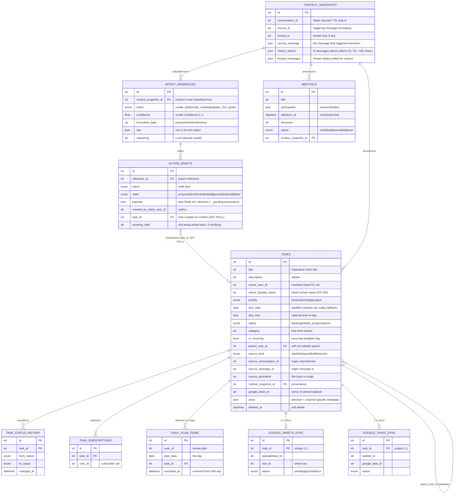
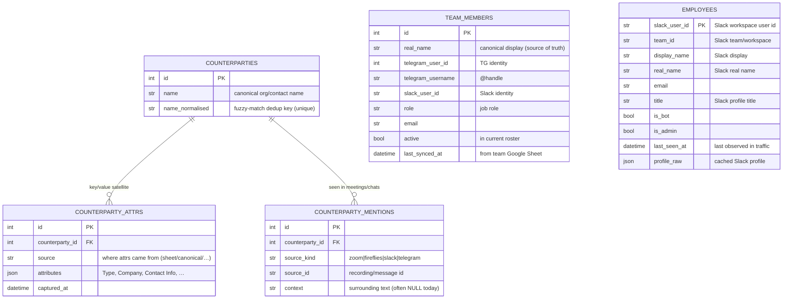
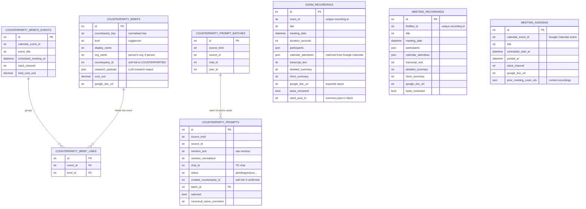
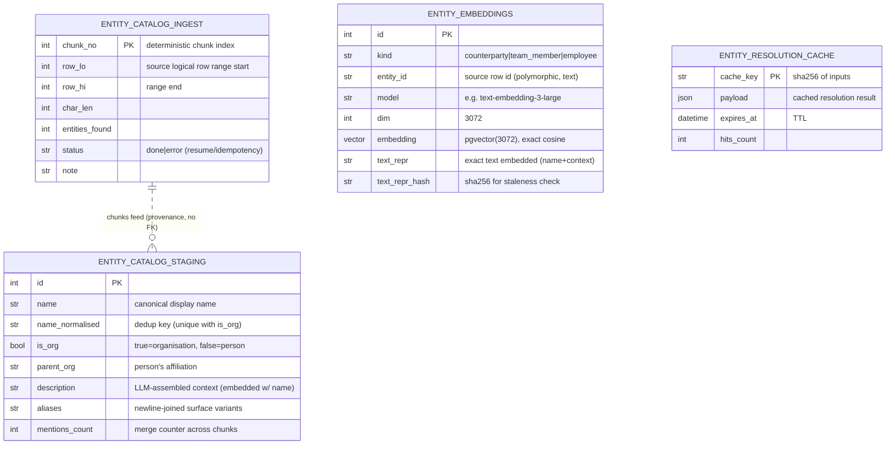
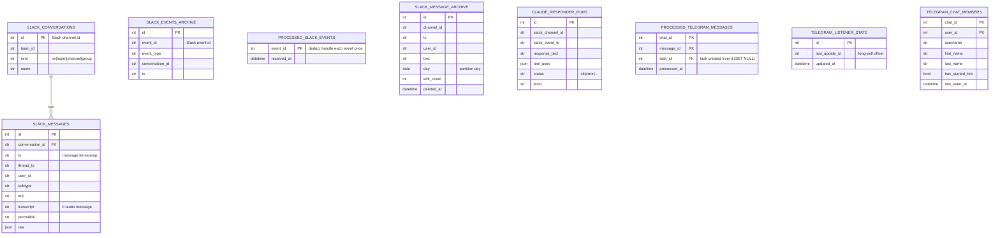
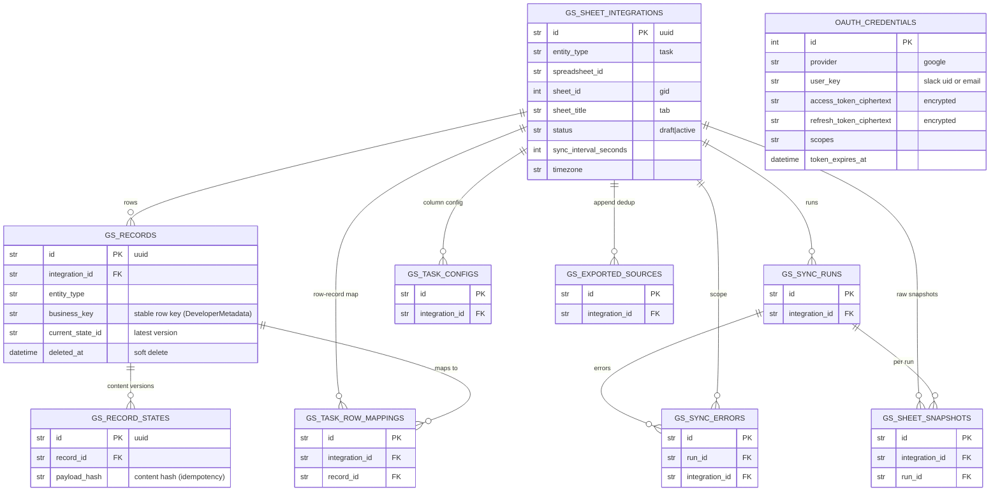
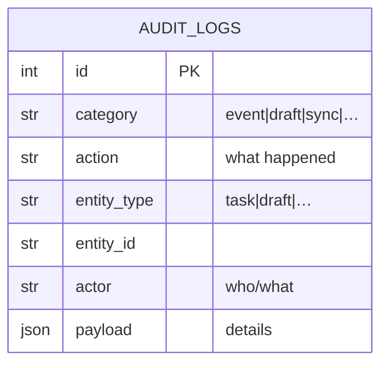

# Database Schema — Humanoid CEO Brain / Task Manager

End-to-end map of the Postgres schema: how tasks, the team, counterparties,
meetings, ingestion and Google-Sheet sync are organised and linked.

**Conventions**
- Most tables mix in `TimestampMixin` → `created_at` / `updated_at`
  (timestamptz, server default `now()`). Omitted from diagrams for brevity.
- `PK` = primary key, `FK` = foreign key (hard DB constraint). Soft links
  (polymorphic id columns with no FK) are listed in *Cross-domain links*.
- Enums are stored as strings; their allowed values are shown in comments.
- The schema is owned by Alembic migrations `0001…0038` (`alembic/versions`).

The system has seven domains:

| # | Domain | Purpose |
|---|--------|---------|
| A | Intent → Task → Sync | the core: message → classified intent → draft → task → Google mirror |
| B | Directories | who/what tasks refer to: team, employees, counterparties |
| C | Meeting pipeline | Zoom/Fireflies recordings, agendas, counterparty briefs |
| D | Vector / entity matching | pgvector embeddings + the new dedup entity catalog |
| E | Ingestion plumbing | raw Slack/Telegram capture, dedup, CEO-brain responder |
| F | Google Sheet sync engine | versioned two-way task↔sheet sync (`gs_*`) + OAuth |
| G | Audit | append-only event log |

---

## A. Intent → Task → Sync (core)

A Slack/Telegram message is snapshotted with its surrounding context, the LLM
classifies an **intent**, which produces one or more **action drafts**; on
confirmation a draft materialises a **task** (or meeting). Tasks mirror 1:1 to
a Google Sheet row and a Google Tasks entry.

---

## B. Directories (people & organisations)

Three independent directories that tasks/meetings refer to. **`team_members`**
is the operator's curated team (synced from a Google Sheet, keyed for both
Telegram and Slack). **`employees`** is the Slack-workspace user cache.
**`counterparties`** is the external org/contact hub, with a JSON attribute
satellite and a mention log.

---

## C. Meeting pipeline (Zoom / Fireflies → docs, briefs, prompts)

Recordings are downloaded, transcribed, summarised, exported to a Google Doc,
and mined for tasks. `meeting_agendas` posts a pre-meeting brief (pulling prior
Zoom recordings). `counterparty_briefs*` research external parties before a
meeting. `counterparty_prompts*` are the Telegram yes/no cards that confirm
new counterparties (auto-enrollment, now gated off by default).

---

## D. Vector / entity matching

`entity_embeddings` is the pgvector satellite (one current embedding per
source entity, polymorphic `entity_id`). `entity_catalog_staging` /
`entity_catalog_ingest` are the new deduplicated entity catalog being built
from the operator's export (FR-CR-05-231). `entity_resolution_cache` memoises
LLM resolution results.

---

## E. Ingestion plumbing (raw capture + dedup)

Raw Slack/Telegram traffic and idempotency stores. `slack_conversations` /
`slack_messages` mirror channels the bot sees; `*_archive` keep raw events;
`processed_*` tables enforce exactly-once handling. `claude_responder_runs`
tracks the CEO-brain @-mention responder. Telegram has its own member +
listener-offset tables.

---

## F. Google Sheet sync engine (`gs_*`) + OAuth

Versioned, append-only two-way sync between tasks and a Google Sheet
(`app/sheet_sync`). An *integration* is one (spreadsheet, tab); *records* are
sheet rows identified by DeveloperMetadata; *record states* are content
versions; *sync runs* + *errors* + *snapshots* give an audit trail.
`gs_exported_sources` dedups which drafts/tasks were already appended.

---

## G. Audit

---

## Cross-domain links (polymorphic / soft — no DB FK)

These connect domains without a hard foreign key (by design — satellites and
provenance must survive source-row churn):

- **`entity_embeddings.entity_id`** → `counterparties.id` / `team_members.id` /
  `employees.slack_user_id`, disambiguated by `kind`.
- **`counterparty_mentions.(source_kind, source_id)`** →
  `zoom_recordings` / `meeting_recordings` / `slack_messages` / Telegram.
- **`tasks.(source_kind, source_conversation_id, source_message_ts)`** →
  the originating Slack/Telegram message or Zoom/Fireflies recording.
- **`tasks.owner_user_id` / `action_drafts.created_by_slack_user_id`** →
  `team_members` / `employees` (resolved at extraction time).
- **`counterparty_briefs.counterparty_id`** and
  **`counterparty_prompts.created_counterparty_id`** → `counterparties.id`
  (nullable soft links).
- **`meeting_agendas.prior_meeting_zoom_ids`** (JSON) → `zoom_recordings.zoom_id`.
- **`tasks.context_snapshot_id` / `meetings.context_snapshot_id`** →
  `context_snapshots.id` (also the audit trail for *why* the task exists).

## Data flow in one line

`Slack/Telegram msg` **or** `Zoom/Fireflies transcript`
→ `context_snapshots` → `intent_inferences` → `action_drafts`
→ **`tasks`** → `google_sheets_sync` / `google_tasks_sync`
→ surfaced via Telegram cards & the strategic Slack digest; entities in the
text are resolved against the **directories** (B) using the **vector layer** (D).
