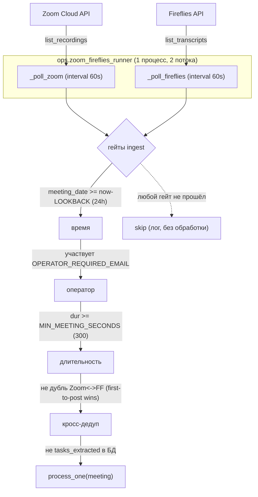
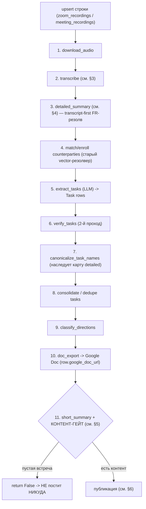
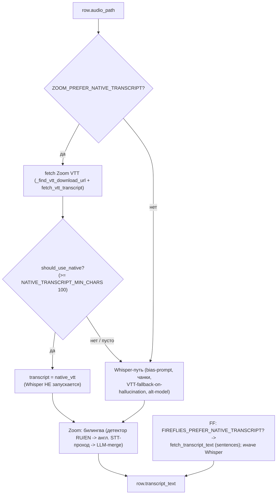
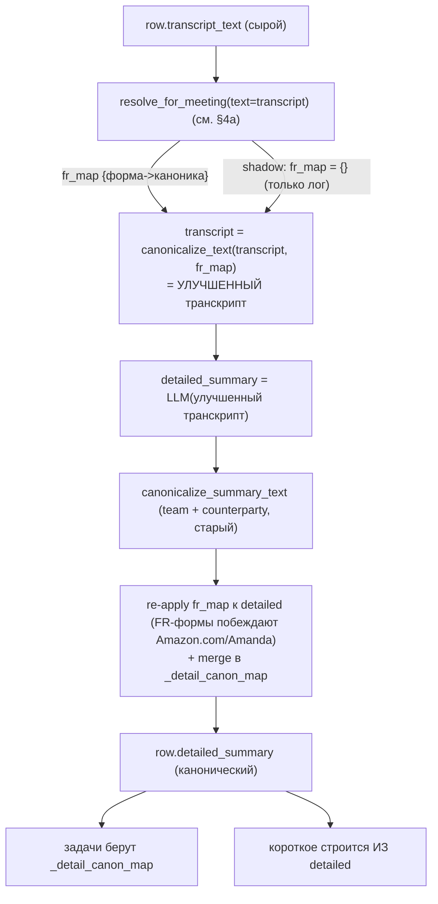
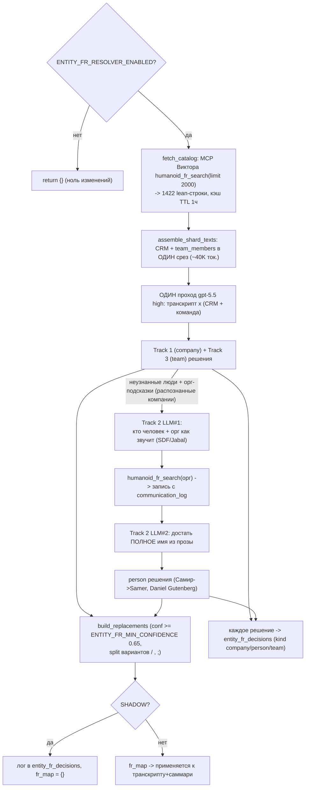
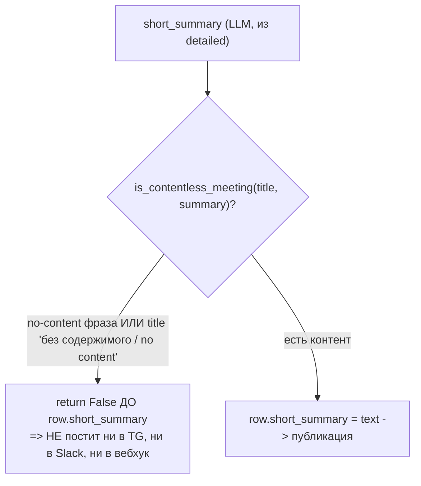
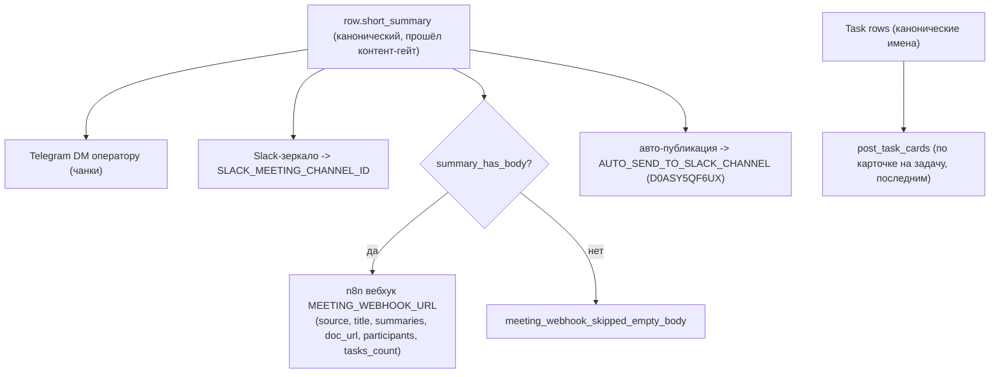

# Meeting pipeline — полный поток (актуально на 2026-06-04)

Как сейчас работает обработка встреч от записи до Slack/вебхука/задач, со всеми
включёнными фичами: нативные транскрипты, transcript-first FR-резолвер имён (3
трека), контент-гейт, FF-переименование.

Процесс: `ops/zoom_fireflies_runner` (контейнер `manager-zoom-ff-1`), два потока
— Zoom и Fireflies. Логика шагов: `app/zoom/pipeline.py`, `app/fireflies/pipeline.py`.

---

## 1. Топология и поллинг (ingest)

**Детали гейтов:**
- время: `started_at = now − OPERATOR_INGEST_LOOKBACK_HOURS(24)` — перезапуск не теряет день, старое не переобрабатывает;
- оператор: только встречи с `OPERATOR_REQUIRED_EMAIL` (`1@thehumanoid.ai`);
- длительность: `MIN_MEETING_SECONDS=300` (короче — `skipped_duration_too_short`);
- кросс-дедуп: одна встреча часто пишется и Zoom, и FF → `find_cross_source_duplicate`, кто первый запостил, тот выиграл;
- БД-дедуп: `tasks_extracted=true && last_error IS NULL` → `skipped_done` (идемпотентность).

---

## 2. process_one — конвейер шагов (идемпотентный)

Каждый шаг идемпотентен (флаг на строке БД), при падении пишет `last_error` и
инкрементит `attempts`; кап `MAX_ATTEMPTS_BEFORE_GIVE_UP`.

---

## 3. Шаг transcribe — нативный транскрипт сначала (FR-NT-TR)

**Детали:** `transcript_source = native_vtt | native_ff | whisper` пишется в трейс.
Инвариант: нативного нет/короткий → полный Whisper-fallback, транскрипт всегда
получается. Билингва Zoom не зависит от источника primary.

---

## 4. Шаг detailed_summary — transcript-first резолв имён

### 4a. FR-резолвер — 3 трека (resolve_for_meeting)

**Правила матчинга (промпт `_SYSTEM`):** CRM авторитетен по написанию; кросс-язык
транслитерация; предпочитать самую полную форму (Accenture Ventures > Accenture);
консистентность (мирая=Альмирая=мирка -> один Mirae); при неоднозначности
предпочитать active/in-pipeline; не матчить по созвучию в короткий акроним-фонд
(SDF/SVC/XTX); человек != компания; лучше null, чем кривое.

---

## 5. Контент-гейт (FR-CR-05-157e) — пустые встречи

Закрыл регресс «Запись без содержимого» (0 задач, 15К payload уходил и в Slack,
и в n8n). `summary_has_body` остаётся доп.гейтом на вебхуке.

---

## 6. Публикация (фан-аут)

**FF-переименование:** при derived-title (`_derive_topic_title`, английский) или
календарном матче — пуш в Fireflies UI как `DD/MM - Title` (`update_transcript_title`).
Zoom не переименовываем (политика «только Fireflies»).

---

## Флаги (env), актуальные значения в проде

| Флаг | Прод | Что |
|---|---|---|
| `ZOOM_PREFER_NATIVE_TRANSCRIPT` / `FIREFLIES_PREFER_NATIVE_TRANSCRIPT` | true | нативный транскрипт сначала |
| `ZOOM_BILINGUAL_RESTORATION_ENABLED` | true | англ. проход + merge (Zoom) |
| `ENTITY_FR_RESOLVER_ENABLED` | true | FR-резолвер имён |
| `ENTITY_FR_RESOLVER_SHADOW` | true→false | shadow (лог) -> apply (подмена) |
| `ENTITY_FR_PEOPLE_ENABLED` | true | Track-2 (люди из comm_log) |
| `ENTITY_FR_MIN_CONFIDENCE` | 0.65 | порог применения |
| `ENTITY_FR_MCP_URL` | (MCP Виктора) | источник CRM |
| `MIN_MEETING_SECONDS` | 300 | мин. длительность |
| `MEETING_WEBHOOK_URL` / `AUTO_SEND_TO_SLACK_*` | set | доставка |

## Где смотреть в коде
- ingest/поллинг: `ops/zoom_fireflies_runner.py`
- шаги: `app/zoom/pipeline.py`, `app/fireflies/pipeline.py`
- транскрипт: `app/services/transcription.py` (`should_use_native`, `is_contentless_meeting`)
- FR-резолвер: `app/services/entity_resolver_fr.py`, `entity_people_fr.py`, `fr_resolve_step.py`
- вебхук/Slack: `app/services/meeting_webhook.py`, `app/services/slack_mirror.py`
