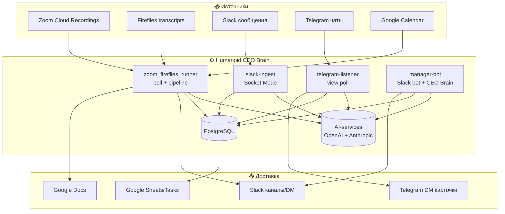
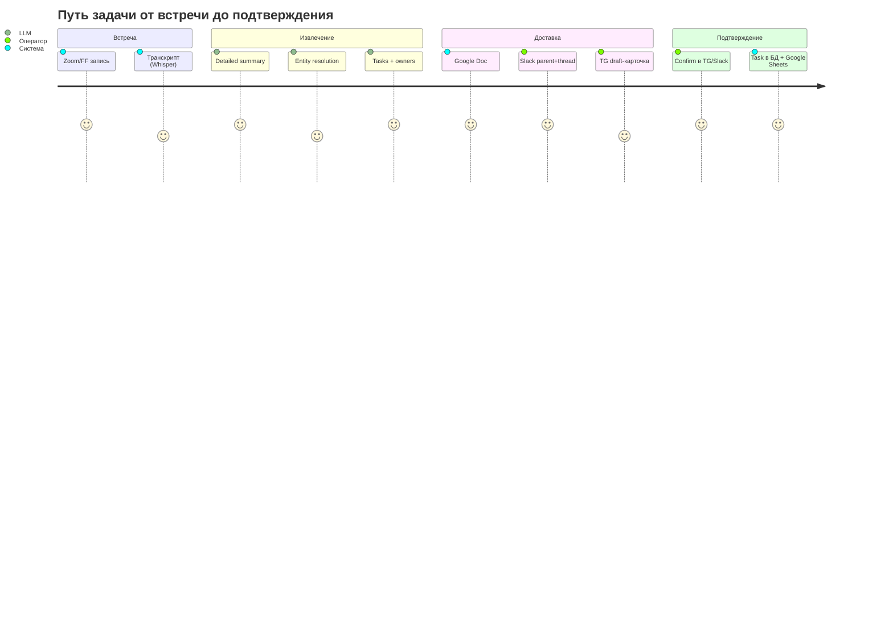
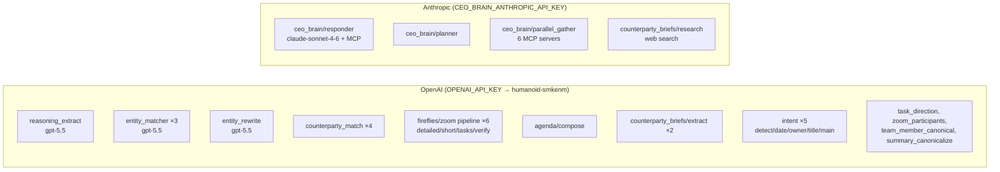
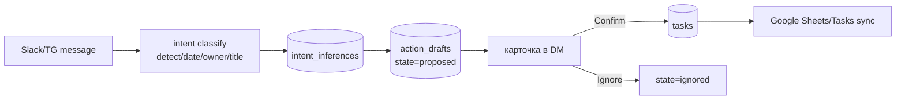
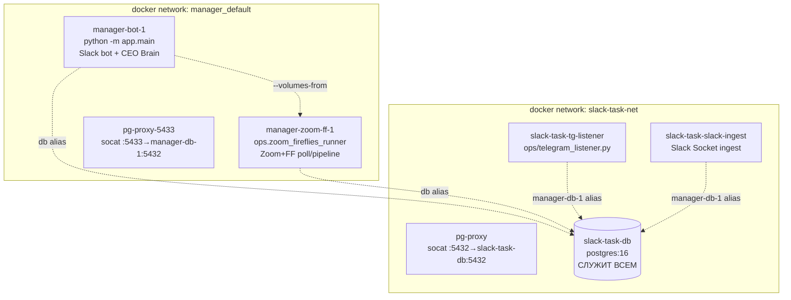

# Техническая архитектура — Humanoid CEO Brain / Task Manager

> **Статус:** authoritative source of truth по технической архитектуре.
> Заменяет устаревшие `docs/ARCHITECTURE.md` и `docs/Arch.md`.
> **SPEC.md** ссылается на этот документ (см. раздел «Spec ↔ Architecture»).
> Сгенерировано 2026-05-24 на коммите `e1c2fc1` (ветка
> `claude/slack-bot-task-extraction-9eGSC`).
>
> **Scope:** только техническая архитектура (компоненты, потоки данных,
> модели, инфра). Функциональные требования живут в SPEC.md и
> ссылаются сюда по якорям.

---

## 0. Spec ↔ Architecture навигация

Иерархия документации:

```
SPEC.md (функциональные требования, 558× FR-CR-*)
   │  Feature → User Story → User Flow → Use Case (Gherkin) → FR/NFR(ID) → test
   │
   └──ссылается──▶ docs/TECHNICAL_ARCHITECTURE.md (этот файл)
                      │ §2 UX/каналы  §3 API/entry-points  §4 Services
                      │ §5 AI-services + промпты  §6 Data flows
                      │ §7 ER (данные)  §8 Infra-as-code  §9 Spec-coverage
```

**Конвенция связи:** каждый FR в SPEC.md, затрагивающий компонент,
ставит в конце ссылку вида `→ ARCH §5.2 (entity_matcher)`. Каждый
раздел этого дока перечисляет релевантные FR-ID в начале.

---

## 1. Система в одном экране (C4 Context)



Четыре долгоживущих процесса (контейнера) + Postgres + внешние LLM.
Все LLM-вызовы идут через один `OPENAI_API_KEY` (org `humanoid-smkenm`)
+ отдельный `CEO_BRAIN_ANTHROPIC_API_KEY` для CEO Brain.

---

## 2. UX / каналы взаимодействия

> Связанные FR: FR-CR-02 (Slack card buttons), FR-CR-05-34 (confirm
> keyboard), FR-CR-05-119 (To-Do block), FR-CR-05-199 (Slack publish format).

| Канал | Роль | Что видит пользователь |
|---|---|---|
| **Slack каналы** (напр. D0ASY5QF6UX) | доставка summary + tasks | parent: `DD/MM - Title` (hyperlink на Google Doc) + Участники + суть + «TODO:» trailer; thread reply: важные tasks |
| **Slack DM (бот)** | интерактив | per-task карточки с кнопками `[Ignore][Edit][Confirm]`, модалки создания/редактирования |
| **Telegram DM** | подтверждение drafts | 🟡-карточки `title / 📝 desc / 👤 owner / 📅 due` с inline-кнопками Confirm/Edit/Ignore |
| **Google Docs** | полный отчёт | detailed summary встречи, ссылка из Slack-заголовка |
| **Google Sheets / Tasks** | зеркало задач | confirmed tasks синкаются (FR-CR-6) |



---

## 3. API / entry-points

> Связанные FR: FR-CR-05-35 (listener realtime), FR-CR-05-151 (auto-retry),
> FR-CR-05-160 (webhook), FR-CR-05-194 (auto-publish).

### 3.1 Входящие (откуда система получает данные)

| Entry-point | Файл | Триггер |
|---|---|---|
| Slack bot — mention | `app/slack_bot/app.py:120` `@app.event("app_mention")` | упоминание в канале |
| Slack bot — message | `app/slack_bot/app.py:132` `@app.event("message")` | сообщение |
| Slack bot — shortcuts | `app/slack_bot/app.py:145` `@app.shortcut(...)` | create task/meeting |
| Slack bot — actions | `app/slack_bot/app.py:154-280` `@app.action(...)` | кнопки Confirm/Edit/Ignore |
| Slack bot — modals | `app/slack_bot/app.py:174-225` `@app.view(...)` | submit модалок |
| Slack ingest | `app/slack_ingest/listener.py:120` `@app.event("message")` | Socket Mode message ingest |
| Telegram listener | `app/telegram_bot/listener.py:1018` `TelegramListener.tick()` | poll TG source view |
| Telegram bot handlers | `app/telegram_bot/handlers.py` | start/done/cancel/delete/subscribe + LLM-edit |
| CEO Brain poller | `app/ceo_brain/...SlackHistoryPoller.start()` | фоновый poll Slack history |
| Zoom/FF runner | `ops/zoom_fireflies_runner.py:169` `main()` | poll Zoom Cloud + Fireflies API |

### 3.2 Исходящие (внешние API)

| API | Куда | Назначение |
|---|---|---|
| Fireflies GraphQL | api.fireflies.ai | list transcripts, fetch sentences |
| Zoom REST | zoom.us | list recordings, download audio |
| Google Docs/Sheets/Tasks/Calendar | googleapis.com | docs, task mirror, agenda source |
| n8n webhook | `app/services/meeting_webhook.py:22` | POST meeting summary |
| OpenAI / Anthropic | api.openai.com / anthropic | LLM (см. §5) |

### 3.3 Ops-runner процессы (long-running)

- `ops/slack_listener.py:30` — Slack ingest (Socket Mode)
- `ops/telegram_listener.py:42` — Telegram poll loop
- `ops/zoom_fireflies_runner.py:169` — Zoom + Fireflies pipeline (2 потока)
- `python -m app.main` — Slack bot + CEO Brain standalone (manager-bot-1)

---

## 4. Services layer

> `app/services/` — 38 модулей. Каждый FR ссылается сюда `→ ARCH §4`.

| Модуль | FR | Назначение |
|---|---|---|
| reasoning_extract | 193a | Step 1: transcript → summary + raw tasks (LLM) |
| entity_matcher | 193b | Step 2: raw→canonical, STRICT scrub, speaker fallback (LLM) |
| entity_apply | 193c | Step 3: single-pass replace (regex) |
| entity_rewrite | 193c-3 | Step 3 alt: LLM-rewrite с падежами |
| entity_resolution_cache | 193e | cache key/get/set (TTL 7d) |
| team_member_canonical | 193b-7 | canonicalize participant names (LLM + email-resolve) |
| team_member_notes_dsl | 192r | DSL: DELEGATE_TASKS_TO / DO_NOT_CALL |
| counterparty_match | 125 | match org mentions → directory (LLM) |
| counterparty_aliases | 193d | aliases satellite |
| counterparty_enrollment(+batch) | 133/138 | enroll new mentions + widget |
| task_direction | 163 | classify direction (beta/budget/design/investors/deliverables) |
| task_due | — | parse due dates |
| task_dedup | 128 | near-dup soft-delete |
| transitions | — | task status transitions |
| slack_publish | 194 | reusable Slack publish (parent+thread) |
| slack_mirror | 137/141 | TG→Slack mirror + chunk/mrkdwn helpers |
| card_sync | — | sync in-channel card ↔ DM |
| meeting_webhook | 160 | n8n webhook POST |
| digest / admin_digest | 6 | daily/weekly/deadline дайджесты |
| notifications / subscriber_updates | 5/02 | подписчики |
| transcription | — | Whisper orchestration |
| bilingual_restorer | CB2-3.39 | bilingual transcript restore (Zoom) |
| calendar_attendees / calendar_match | 169/136 | calendar resolution + recording↔event match |
| zoom_participants | — | match Zoom participants → roster (LLM) |
| employees | — | Slack users.info sync |
| owners / workload | — | owner resolve + workload analysis |
| daily_plan / weekly_plan | — | планирование |
| thread_reminders / followup | — | reminders + draft follow-up |

---

## 5. AI-services + промпты

> ⚠️ **GAP: промпты в 4 разных местах** (см. §10.1). Рекомендуется
> консолидация в `app/prompts/`.

### 5.1 Карта LLM-вызовов



### 5.2 Где живут промпты (4 локации — техдолг)

| Локация | Промпты | Тип |
|---|---|---|
| **inline `_SYSTEM_PROMPT`** в services | reasoning_extract, entity_matcher, entity_rewrite, counterparty_match, task_direction, agenda/compose, counterparty_briefs/extract+research | Python-константы в коде |
| **`app/intent/*_prompt.py`** | prompts.py (main), date_prompt, owner_prompt, title_prompt, detect_prompt | Python-модули |
| **`app/fireflies/prompts.py`** | DETAILED_SUMMARY_SYSTEM, SHORT_SUMMARY_SYSTEM, TASK_EXTRACTION_SYSTEM, TASK_VERIFICATION_SYSTEM (reused Zoom'ом) | Python-модуль |
| **`app/*/prompts/*.md`** | agenda/prompts/agenda.md; counterparty_briefs/prompts/{extract,extract_beneficiaries,research_org,research_person}.md | Markdown |
| **`docs/prompts/*.md`** (16 файлов) | зеркала/документация промптов (canonicalize_tasks, task_extraction, intent_*, и т.д.) | Markdown-документация (не всегда live source) |

### 5.3 Модели по env-var

| Env var | Модель | Используется |
|---|---|---|
| OPENAI_MODEL | gpt-4o / gpt-5.5 | intent, entity-resolution V2, counterparty |
| FIREFLIES_SUMMARY_MODEL / _TASKS_MODEL | gpt-5.5 | pipeline summaries + tasks |
| FIREFLIES_WHISPER_MODEL | gpt-4o-transcribe | транскрипция |
| OPENAI_DATE_MODEL / _DEDUP_MODEL | gpt-5.4 | date parse / dedup |
| CEO_BRAIN_MODEL | claude-sonnet-4-6 | CEO Brain responder/planner/gather |
| COUNTERPARTY_BRIEFS_RESEARCH_MODEL | o4-mini-deep-research | брифы (web search) |

---

## 6. Потоки данных (pipelines)

> Связанные FR: FR-CR-05-122 (trace per step), FR-CR-05-151 (auto-retry),
> FR-CR-05-193g (V2 wiring), FR-CR-05-196/197 (cap/sentinel).

### 6.1 Zoom pipeline — `process_one()` (app/zoom/pipeline.py:2579)

```
[gate] attempts≥20 → permanent_failure (FR-196)
[gate] duration==86400 → 24h sentinel skip (FR-197)
[gate] duration<300 → too_short skip
  ↓
download_audio → transcribe(Whisper, +bilingual restore) → detailed_summary
  → match_counterparties → enroll_unresolved → extract_tasks → verify_tasks
  → canonicalize_task_names → consolidate_tasks → dedupe → classify_directions
  → doc_export → short_summary → post_task_cards → send_to_slack (FR-194)
```
> `_step_extract_via_reasoning` (V2, FR-193g) — присутствует, но **stub/не
> в основном flow**; V2 гоняется через `ops/v2_publish_meeting.py`.

### 6.2 Fireflies pipeline — `process_one()` (app/fireflies/pipeline.py:2951)

Симметрично Zoom + `match_calendar_title` + `send_short_summary`.
FF `duration` хранится ×60 (минуты→секунды, FR-195).

### 6.3 Slack/TG message → task


> 921 proposed-draft из telegram на момент аудита; в `tasks` идут только
> confirmed.

### 6.4 Listener tick (poll-loop, 60s)

```
zoom_fireflies_runner: 2 потока (zoom + ff) → list recent → per-meta
  process_one (idempotent, FR-151 self-heal) → 60s sleep
telegram_listener: view poll (seen=500) → intent → drafts → DM widgets → 30s
slack_ingest: Socket Mode → on message → intent → draft
manager-bot: Socket Mode (×2: main + CEO Brain) → on event → responder
```

---

## 7. Модель данных (ER)

> Связанные FR: FR-CR-01 (task schema), FR-CR-05-193d (entity cache),
> FR-CR-05-194 (slack_post_ts), FR-CR-05-195 (ff duration).
> Migrations chain head: **`0035_ff_duration_minutes`**.

```mermaid
erDiagram
    tasks ||--o{ task_status_history : "logs"
    tasks ||--o{ task_subscriptions : "watchers"
    tasks ||--o| google_sheets_sync : "mirror"
    tasks ||--o| google_tasks_sync : "mirror"
    tasks ||--o{ tasks : "subtasks (parent_task_id)"
    tasks }o--o| context_snapshots : "context"

    intent_inferences ||--o{ action_drafts : "proposes"
    intent_inferences }o--o| context_snapshots : "from"
    action_drafts }o--o| tasks : "materialises (task_id)"

    counterparties ||--o{ counterparty_attrs : "satellite"
    counterparties ||--o{ counterparty_mentions : "mentioned in"

    meeting_recordings {
        int id PK
        string fireflies_id UK
        string title
        datetime meeting_date
        int duration_seconds "MINUTES×60 (FR-195)"
        json calendar_attendees
        text transcript_text
        text detailed_summary
        text short_summary
        bool transcribed
        bool detailed_summarised
        bool tasks_extracted
        bool extracted_via_reasoning "FR-193g"
        string slack_post_ts "FR-194"
        int attempts "cap 20 (FR-196)"
        string last_error
    }
    zoom_recordings {
        int id PK
        string zoom_id UK
        string title
        int duration_seconds "86400=sentinel skip (FR-197)"
        text transcript_text
        text detailed_summary
        text short_summary
        bool transcribed
        bool tasks_extracted
        string slack_post_ts
        int attempts
    }
    tasks {
        int id PK
        string title
        text description
        enum priority
        enum status
        date due_date
        string owner_user_id
        string owner_display_name
        enum source_kind "slack|telegram|zoom|fireflies"
        string source_conversation_id
        int parent_task_id FK
        json extra "matcher_meta, direction, v2"
        datetime deleted_at "soft delete"
    }
    action_drafts {
        int id PK
        int inference_id FK
        enum intent
        enum state "proposed|confirmed|edited|ignored|expired|failed"
        json payload "_pending: source_kind/chat_id/text"
        int task_id FK
        string card_channel
        string card_ts
    }
    intent_inferences {
        int id PK
        int context_snapshot_id FK
        enum intent
        float confidence
        json raw
    }
    team_members {
        int id PK
        string real_name
        bigint telegram_user_id UK
        string slack_user_id UK
        string email "FR-199c email-resolve"
        text notes "DSL: DELEGATE_TASKS_TO/DO_NOT_CALL"
        bool active
    }
    counterparties {
        int id PK
        string name
        string name_normalised UK
    }
    counterparty_attrs {
        int id PK
        int counterparty_id FK
        string source "aliases|canonical_seed|Status outreach"
        json attributes
    }
    counterparty_mentions {
        int id PK
        int counterparty_id FK
        string source_kind
        string source_id
    }
    meeting_agendas {
        int id PK
        string calendar_event_id UK
        string title
        datetime scheduled_start_at
        json prior_meeting_zoom_ids
        string slack_ts
    }
    slack_message_archive {
        int id PK
        string channel_id
        string ts
        string thread_ts
        text text
        date day "indexed"
    }
    claude_responder_runs {
        int id PK
        string slack_channel_id
        string slack_event_ts
        enum status
        float cost_usd
        int input_tokens
        int output_tokens
    }
    entity_resolution_cache {
        int id PK
        string cache_key UK
        json resolved
        datetime expires_at "TTL 7d (FR-193e)"
    }
    employees {
        string slack_user_id PK
        string display_name
        string email
        bool is_bot
    }
    google_sheets_sync {
        int id PK
        int task_id FK
        string spreadsheet_id
        enum status
    }
    google_tasks_sync {
        int id PK
        int task_id FK
        string google_task_id
        enum status
    }
```



**Ключевые паттерны:**
- **Task — центральная сущность.** 4 источника (`source_kind`), soft-delete
  (`deleted_at`), self-ref subtasks, зеркала в Google Sheets/Tasks.
- **Intent → Draft → Task.** Сообщения Slack/TG проходят
  `intent_inferences` → `action_drafts` (proposed) → при Confirm
  материализуются в `tasks`. **921 proposed-draft из telegram** на момент
  аудита (большинство не confirmed → не в `tasks`).
- **Counterparty hub-satellite.** `counterparties` (canonical name) +
  `counterparty_attrs` (по source: aliases / canonical_seed / sheet) +
  `counterparty_mentions` (где упомянут).
- **Две recording-таблицы** (zoom/fireflies) с идентичной pipeline-моделью
  состояния (булевы флаги шагов + attempts/last_error).

---

## 8. Infrastructure-as-Code

> Связанные FR: NFR (deployment), DEPLOY.md.

### 8.1 Контейнерная топология (prod, фактическая)



> ⚠️ **Реальная prod-топология отличается от `docker-compose.yml`.**
> Compose описывает упрощённый `db + migrate + bot`. Фактически на
> операторском хосте крутятся 5 контейнеров через `docker run` (не
> compose), с socat-прокси и cross-network DNS-алиасами (`db`,
> `manager-db-1`). Единая БД — `slack-task-db`. См. §8.4 «Drift».

### 8.2 docker-compose.yml (декларативный, dev)

| Сервис | Образ | Команда | Назначение |
|---|---|---|---|
| `db` | postgres:16-alpine | — | Postgres, volume `pgdata`, port 5432 |
| `migrate` | build . | `alembic upgrade head` | one-shot миграции (depends_on db healthy) |
| `bot` | build . | (Dockerfile CMD) | основной процесс (depends_on migrate completed) |

env через `env_file: .env`.

### 8.3 GCP production path (DEPLOY.md)

- **Cloud SQL** Postgres 16 (db-f1-micro, private IP за VPC)
- **Artifact Registry** — Docker образы по регионам
- **Secret Manager** — все секреты (SLACK_*, ANTHROPIC_API_KEY,
  GOOGLE_CLIENT_*, DATABASE_URL, SECRETS_ENCRYPTION_KEY, ALLOWED_OWNERS)
- **GCE VM** (Container-Optimized OS, e2-micro) — Socket Mode по
  persistent WebSocket, без public HTTP endpoint
- **Cloud Run Jobs** (опц.) — дайджесты через Cloud Scheduler
- **Cloud Run service** (опц.) — health endpoint + background thread

**IaC-gap:** нет Terraform/Pulumi — деплой описан как ручные
docker/alembic операции + gcloud команды в DEPLOY.md.

### 8.4 Config drift (фактический prod vs декларация)

| Аспект | docker-compose.yml | Фактический prod |
|---|---|---|
| Запуск | `docker compose up` | `docker run` вручную (env прописан флагами/`runner.env`) |
| Контейнеры | db, migrate, bot | bot, zoom-ff, tg-listener, slack-ingest, slack-task-db |
| БД-хост | `db` (compose service) | `slack-task-db` + socat-прокси + DNS-алиасы |
| Env | `.env` | `/home/andre/manager-zff/runner.env` + inline `--env` |
| Networks | default | `manager_default` + `slack-task-net` (cross-aliased) |

> Это технический долг — prod собран руками. Рекомендация в §10.

---

## 9. Spec-coverage аудит

> Что есть в SPEC.md и насколько связано с тестами/кодом.

### 9.1 Текущая структура SPEC.md

- **558× `FR-CR-NN-NNN`** записей — плоская проза, inline-заголовки
  (`### FR-CR-05-32 — …`), **НЕ markdown-таблица** на большинстве.
  Поздние FR (190+) — в табличном формате `| FR-ID | описание | test |`.
- **НЕТ Gherkin/BDD-иерархии** — нет `Feature:`, `Scenario:`,
  `Given/When/Then`, `User Story`, `UC-`/`US-` якорей. Требования —
  прозой + acceptance-критерии в тексте.
- **Test-linkage частичный** — поздние FR (CR-05-190+) ссылаются на
  конкретные `test_*.py::test_*`. Ранние (CR-01..CR-05-189) — разрозненные
  inline-упоминания, без систематической матрицы.

### 9.2 Companion-спеки (v0.1 ecosystem)

| Файл | Покрытие | В коде? |
|---|---|---|
| SPEC_NOTE_TAKER | meeting→summary+tasks (Zoom/FF) | ✅ app/zoom, app/fireflies |
| SPEC_TASK_TRACKER | мультиканальная экстракция + Google sync | ✅ app/intent, app/persistence |
| SPEC_TASK_EXTRACTOR | TG-бот в группах | ✅ app/telegram_ingest |
| SPEC_CEO_BRAIN_BOT | Slack archive + Claude Q&A | ✅ app/ceo_brain |
| SPEC_COUNTERPARTY_BRIEFS | авто-брифы на Calendar-события | ✅ app/counterparty_briefs |
| SPEC_MEETING_AGENDA | pre-meeting агенда | ✅ app/agenda |
| SPEC_v0.1 / Spec_eng | зонтичные продукт-спеки | — обзорные |

### 9.3 Тесты

- **132 файла** в `tests/requirements/`, конвенция `test_<feature>.py`
- **114 (86%)** ссылаются на ≥1 `FR-CR` ID
- Нет single-source матрицы FR→test (требуется grep)

### 9.4 Что НЕ покрыто в старых arch-доках

`docs/ARCHITECTURE.md` (stale) и `docs/Arch.md` (current) **оба** не
содержат: Entity Resolution V2 (FR-193*), retry-cap/sentinels (FR-196/197),
auto-Slack-publish (FR-194), email-canonicalize (FR-199c). Этот документ
их включает.

---

## 10. Технический долг / рекомендации

1. **Промпты в 4 местах** (см. §5) — консолидировать в `app/prompts/`
   или единый реестр. Сейчас: `app/intent/*_prompt.py`, inline
   `_SYSTEM_PROMPT` в services, `app/*/prompts/*.md`, зеркала в
   `docs/prompts/`.
2. **Prod-drift** (§8.4) — собрать prod в один `docker-compose.prod.yml`
   с `env_file`, убрать ручные `docker run` + socat-прокси.
3. **IaC отсутствует** — добавить Terraform для Cloud SQL/GCE/Secret Manager.
4. **Spec без BDD-структуры** — 558 плоских FR; миграция в
   Feature→US→Gherkin→FR требует отдельного проекта (см. §11 framework).
5. **FR→test матрица** — сгенерировать автоматически (grep FR-CR в тестах).
6. **Google Tasks list 404** — `GOOGLE_TASKS_DEFAULT_TASKLIST_ID` невалиден.

---

## 11. Framework: Feature → US → Use Case (Gherkin) → FR/NFR → test

> SPEC.md сейчас — 558 плоских FR. Целевая BDD-иерархия (для будущей
> миграции). Образец на Entity Resolution V2 (FR-CR-05-193*):

```
FEATURE: Universal Entity Resolution V2 (FR-CR-05-193)
  USER STORY: Как оператор, я хочу чтобы имена/компании в саммари и
    задачах были canonical и задачи назначались на реальных участников,
    чтобы не путать Дмитрия Седова и Диму Дроздова.

  USER FLOW: transcript → Step1 extract → Step2 match → Step3 rewrite →
    owner apply → publish

  USE CASE 1 (Gherkin):
    Scenario: Resolve raw owner to meeting participant
      Given транскрипт с задачей "Дима подготовит deck"
        And Дима Дроздов НЕ участник встречи
        And Дмитрий Седов участник встречи
      When matcher резолвит raw_owner="Дима"
      Then tm_real_name = "Дмитрий Седов"
        And reasoning указывает на participant-context
    → FR-CR-05-193b (matcher), FR-CR-05-193b-6 (STRICT scrub)
    → test_entity_matcher_people.py::test_fr_cr_05_193b_6_scrubs_non_participant_owner

  USE CASE 2 (Gherkin):
    Scenario: Collective pronoun → host
      Given задача с raw_owner="мы" (CEO-level)
      When matcher применяет Rule 4b
      Then owner = host/principal участник
    → FR-CR-05-193b-8
    → test_entity_matcher_people.py::test_fr_cr_05_193b_8_*

  NFR: Step 1-3 идемпотентны; fallback на пустой LLM-ответ; rewrite
    откатывается если длина <50% или >200% исходника (anti-hallucination).
```

**Применение:** каждая Feature в SPEC.md получает блок US + UserFlow +
≥1 Gherkin Scenario, каждый Scenario мапится на FR-ID(ы) и тест. Полная
миграция 558 FR — отдельный backlog-эпик.

---

## 12. Ссылки

- Функциональные требования: **SPEC.md** (558× FR-CR-*)
- Companion-спеки: SPEC_{NOTE_TAKER,TASK_TRACKER,TASK_EXTRACTOR,
  CEO_BRAIN_BOT,COUNTERPARTY_BRIEFS,MEETING_AGENDA}_v0.1.md
- Deploy: DEPLOY.md
- Traces: docs/TRACES.md
- **Устаревшие** (заменены этим документом): docs/ARCHITECTURE.md, docs/Arch.md
