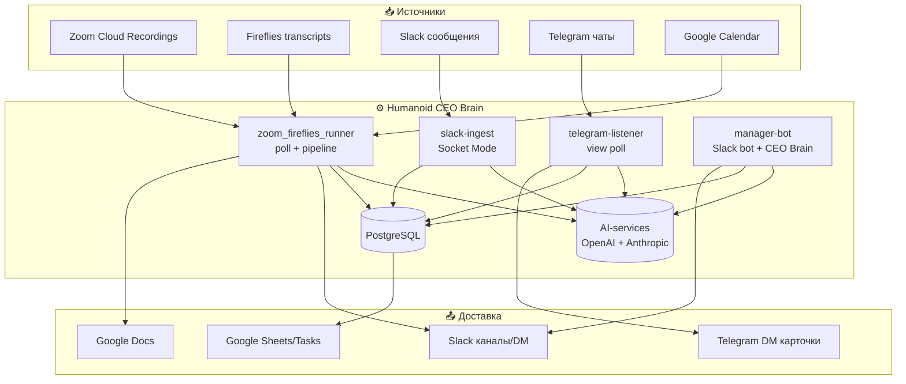
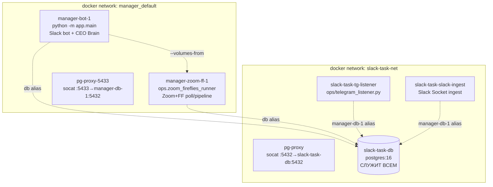

# Техническая архитектура — Humanoid CEO Brain / Task Manager

> **Статус:** authoritative source of truth по технической архитектуре.
> Заменяет устаревшие `docs/ARCHITECTURE.md` и `docs/Arch.md`.
> **SPEC.md** ссылается на этот документ (см. раздел «Spec ↔ Architecture»).
> Сгенерировано 2026-05-24 на коммите `e1c2fc1` (ветка
> `claude/slack-bot-task-extraction-9eGSC`).
>
> **Scope:** только техническая архитектура (компоненты, потоки данных,
> модели, инфра). Функциональные требования живут в SPEC.md и
> ссылаются сюда по якорям.

---

## 0. Spec ↔ Architecture навигация

Иерархия документации:

```
SPEC.md (функциональные требования, 558× FR-CR-*)
   │  Feature → User Story → User Flow → Use Case (Gherkin) → FR/NFR(ID) → test
   │
   └──ссылается──▶ docs/TECHNICAL_ARCHITECTURE.md (этот файл)
                      │ §2 UX/каналы  §3 API/entry-points  §4 Services
                      │ §5 AI-services + промпты  §6 Data flows
                      │ §7 ER (данные)  §8 Infra-as-code  §9 Spec-coverage
```

**Конвенция связи:** каждый FR в SPEC.md, затрагивающий компонент,
ставит в конце ссылку вида `→ ARCH §5.2 (entity_matcher)`. Каждый
раздел этого дока перечисляет релевантные FR-ID в начале.

---

## 1. Система в одном экране (C4 Context)



Четыре долгоживущих процесса (контейнера) + Postgres + внешние LLM.
Все LLM-вызовы идут через один `OPENAI_API_KEY` (org `humanoid-smkenm`)
+ отдельный `CEO_BRAIN_ANTHROPIC_API_KEY` для CEO Brain.

---

## 7. Модель данных (ER)

> Связанные FR: FR-CR-01 (task schema), FR-CR-05-193d (entity cache),
> FR-CR-05-194 (slack_post_ts), FR-CR-05-195 (ff duration).
> Migrations chain head: **`0035_ff_duration_minutes`**.


**Ключевые паттерны:**
- **Task — центральная сущность.** 4 источника (`source_kind`), soft-delete
  (`deleted_at`), self-ref subtasks, зеркала в Google Sheets/Tasks.
- **Intent → Draft → Task.** Сообщения Slack/TG проходят
  `intent_inferences` → `action_drafts` (proposed) → при Confirm
  материализуются в `tasks`. **921 proposed-draft из telegram** на момент
  аудита (большинство не confirmed → не в `tasks`).
- **Counterparty hub-satellite.** `counterparties` (canonical name) +
  `counterparty_attrs` (по source: aliases / canonical_seed / sheet) +
  `counterparty_mentions` (где упомянут).
- **Две recording-таблицы** (zoom/fireflies) с идентичной pipeline-моделью
  состояния (булевы флаги шагов + attempts/last_error).

---

## 8. Infrastructure-as-Code

> Связанные FR: NFR (deployment), DEPLOY.md.

### 8.1 Контейнерная топология (prod, фактическая)



> ⚠️ **Реальная prod-топология отличается от `docker-compose.yml`.**
> Compose описывает упрощённый `db + migrate + bot`. Фактически на
> операторском хосте крутятся 5 контейнеров через `docker run` (не
> compose), с socat-прокси и cross-network DNS-алиасами (`db`,
> `manager-db-1`). Единая БД — `slack-task-db`. См. §8.4 «Drift».

### 8.2 docker-compose.yml (декларативный, dev)

| Сервис | Образ | Команда | Назначение |
|---|---|---|---|
| `db` | postgres:16-alpine | — | Postgres, volume `pgdata`, port 5432 |
| `migrate` | build . | `alembic upgrade head` | one-shot миграции (depends_on db healthy) |
| `bot` | build . | (Dockerfile CMD) | основной процесс (depends_on migrate completed) |

env через `env_file: .env`.

### 8.3 GCP production path (DEPLOY.md)

- **Cloud SQL** Postgres 16 (db-f1-micro, private IP за VPC)
- **Artifact Registry** — Docker образы по регионам
- **Secret Manager** — все секреты (SLACK_*, ANTHROPIC_API_KEY,
  GOOGLE_CLIENT_*, DATABASE_URL, SECRETS_ENCRYPTION_KEY, ALLOWED_OWNERS)
- **GCE VM** (Container-Optimized OS, e2-micro) — Socket Mode по
  persistent WebSocket, без public HTTP endpoint
- **Cloud Run Jobs** (опц.) — дайджесты через Cloud Scheduler
- **Cloud Run service** (опц.) — health endpoint + background thread

**IaC-gap:** нет Terraform/Pulumi — деплой описан как ручные
docker/alembic операции + gcloud команды в DEPLOY.md.

### 8.4 Config drift (фактический prod vs декларация)

| Аспект | docker-compose.yml | Фактический prod |
|---|---|---|
| Запуск | `docker compose up` | `docker run` вручную (env прописан флагами/`runner.env`) |
| Контейнеры | db, migrate, bot | bot, zoom-ff, tg-listener, slack-ingest, slack-task-db |
| БД-хост | `db` (compose service) | `slack-task-db` + socat-прокси + DNS-алиасы |
| Env | `.env` | `/home/andre/manager-zff/runner.env` + inline `--env` |
| Networks | default | `manager_default` + `slack-task-net` (cross-aliased) |

> Это технический долг — prod собран руками. Рекомендация в §10.

---

## 9. Spec-coverage аудит

> Что есть в SPEC.md и насколько связано с тестами/кодом.

### 9.1 Текущая структура SPEC.md

- **558× `FR-CR-NN-NNN`** записей — плоская проза, inline-заголовки
  (`### FR-CR-05-32 — …`), **НЕ markdown-таблица** на большинстве.
  Поздние FR (190+) — в табличном формате `| FR-ID | описание | test |`.
- **НЕТ Gherkin/BDD-иерархии** — нет `Feature:`, `Scenario:`,
  `Given/When/Then`, `User Story`, `UC-`/`US-` якорей. Требования —
  прозой + acceptance-критерии в тексте.
- **Test-linkage частичный** — поздние FR (CR-05-190+) ссылаются на
  конкретные `test_*.py::test_*`. Ранние (CR-01..CR-05-189) — разрозненные
  inline-упоминания, без систематической матрицы.

### 9.2 Companion-спеки (v0.1 ecosystem)

| Файл | Покрытие | В коде? |
|---|---|---|
| SPEC_NOTE_TAKER | meeting→summary+tasks (Zoom/FF) | ✅ app/zoom, app/fireflies |
| SPEC_TASK_TRACKER | мультиканальная экстракция + Google sync | ✅ app/intent, app/persistence |
| SPEC_TASK_EXTRACTOR | TG-бот в группах | ✅ app/telegram_ingest |
| SPEC_CEO_BRAIN_BOT | Slack archive + Claude Q&A | ✅ app/ceo_brain |
| SPEC_COUNTERPARTY_BRIEFS | авто-брифы на Calendar-события | ✅ app/counterparty_briefs |
| SPEC_MEETING_AGENDA | pre-meeting агенда | ✅ app/agenda |
| SPEC_v0.1 / Spec_eng | зонтичные продукт-спеки | — обзорные |

### 9.3 Тесты

- **132 файла** в `tests/requirements/`, конвенция `test_<feature>.py`
- **114 (86%)** ссылаются на ≥1 `FR-CR` ID
- Нет single-source матрицы FR→test (требуется grep)

### 9.4 Что НЕ покрыто в старых arch-доках

`docs/ARCHITECTURE.md` (stale) и `docs/Arch.md` (current) **оба** не
содержат: Entity Resolution V2 (FR-193*), retry-cap/sentinels (FR-196/197),
auto-Slack-publish (FR-194), email-canonicalize (FR-199c). Этот документ
их включает.

---

## 10. Технический долг / рекомендации

1. **Промпты в 4 местах** (см. §5) — консолидировать в `app/prompts/`
   или единый реестр. Сейчас: `app/intent/*_prompt.py`, inline
   `_SYSTEM_PROMPT` в services, `app/*/prompts/*.md`, зеркала в
   `docs/prompts/`.
2. **Prod-drift** (§8.4) — собрать prod в один `docker-compose.prod.yml`
   с `env_file`, убрать ручные `docker run` + socat-прокси.
3. **IaC отсутствует** — добавить Terraform для Cloud SQL/GCE/Secret Manager.
4. **Spec без BDD-структуры** — 558 плоских FR; миграция в
   Feature→US→Gherkin→FR требует отдельного проекта (см. §11 framework).
5. **FR→test матрица** — сгенерировать автоматически (grep FR-CR в тестах).
6. **Google Tasks list 404** — `GOOGLE_TASKS_DEFAULT_TASKLIST_ID` невалиден.

---

<!-- СЕКЦИИ §2 (UX/каналы), §3 (API/entry-points), §4 (Services),
     §5 (AI-services + промпты), §6 (Data flows) — заполняются после
     завершения services-mapping агента. -->
