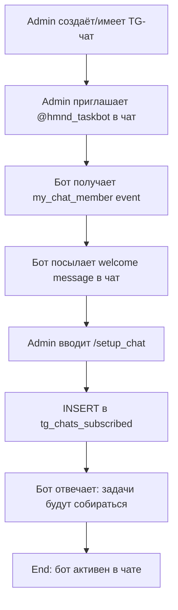
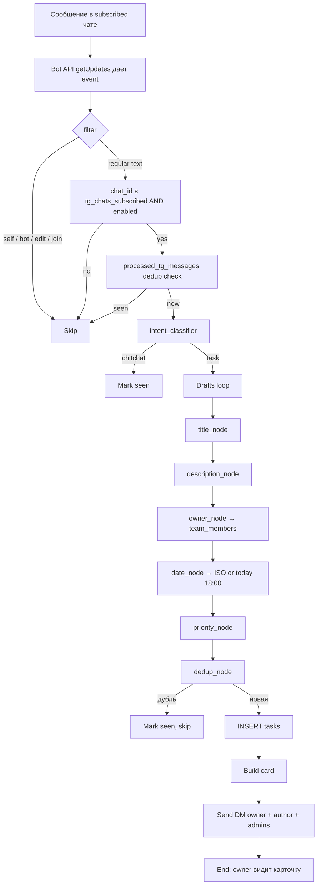
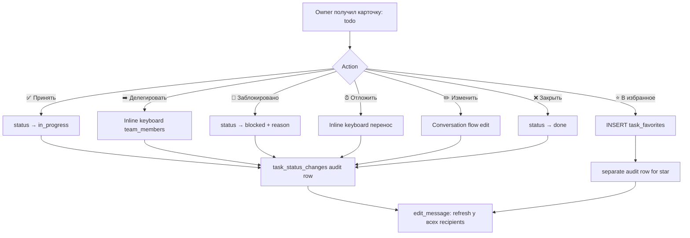
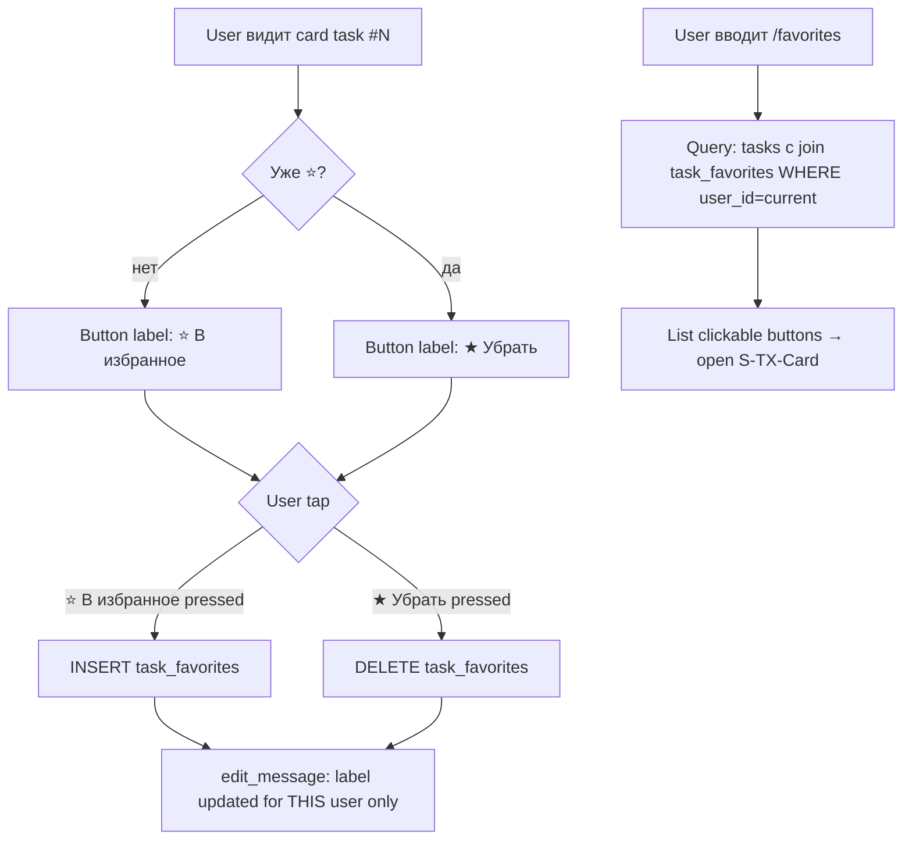
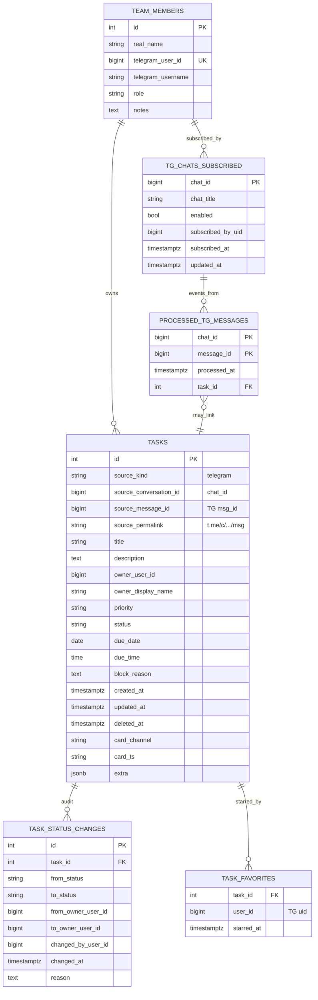
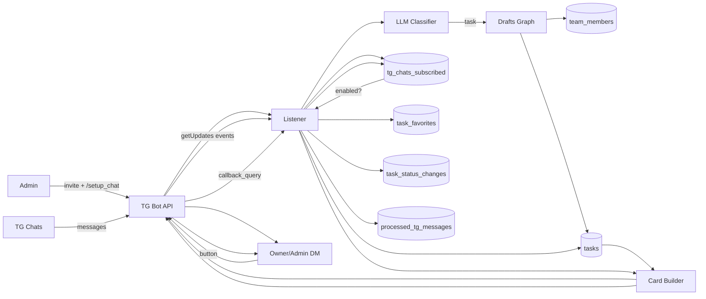

# SPEC v0.1 — Task Extractor Agent (NEW)

> **🗄️ АРХИВ (2026-06-05).** Спека forward-looking — net-new (Favorites, chat-subscription,
> `blocked`-статус, `/audit`) **не построен**. Унаследованный TG-пайплайн из `FR-CR-*` есть.
> Перечень расхождений — `AUDIT.md` §7.
> Реальная трассировка — `FR-CR-05-*` в коде (см. `PRD.md` §4).

> **Уровень:** Product + Business + Solution Architecture (Draft)
> **Дата:** 2026-05-11
> **Версия:** 0.1
> **Scope:** TG-bot-in-chats (Bot API getUpdates) → задачи + статусы + избранное per-user
> **Целевой пользователь:** CEO, solopreneur, предприниматель

---

# 1. Краткое описание продукта

**Task Extractor** — TG-бот, которого CEO добавляет в любые свои TG-чаты как обычного члена. Бот читает все сообщения в этих чатах через TG Bot API (`getUpdates` long-poll), классифицирует через LLM, извлекает задачи с auto-assigned владельцем + auto-parsed дедлайном, и шлёт TG-карточку с кнопками владельцу + admin'у.

**Модель ingest'a — bot-as-member:**
- CEO/admin добавляет бота в чат (group / private / channel) командой Telegram `Add member → @hmnd_taskbot`
- Бот авторизуется в этом чате как обычный участник
- Bot API даёт боту все сообщения этого чата через events (`message`, `edited_message`)
- Никаких внешних источников (Supabase / MTProto / scraper) — только официальный TG Bot API

Дополнительные возможности:
- **Жизненный цикл статусов**: `todo → in_progress → blocked → done → cancelled` через кнопки
- **Избранное (favorites) per-user**: ⭐ для CEO/owner отдельно — попадает в утренний дайджест и `/favorites`
- **Auto-deadline**: LLM-парсинг «к пятнице»; дефолт `сегодня 18:00` если LLM не выявил

---

# 2. Клиент и пользователь

## 2.1 Основной клиент

CEO / solopreneur с командой 10-30 человек:
- Хочет добавить бот в 5-20 TG-чатов (с командой, инвесторами, клиентами)
- Не хочет настраивать никакой MTProto / userbot
- Хочет single-tap setup: `/invite @bot → done`

## 2.2 Роли пользователей

| Роль | Кол-во | Что делает | Через какой интерфейс |
|---|---|---|---|
| **CEO (admin)** | 1 | Видит все задачи, маркирует ⭐, переназначает, закрывает | TG bot DM |
| **Owner (сотрудник)** | 10-30 | Получает свою задачу, нажимает Принять/Закрыть, ставит ⭐ для себя | TG bot DM |
| **Chat-member** (не в команде) | случайно | Пишет в чате; бот молча извлекает task если адресован к team-member | (бот молчит в чате) |
| **Watcher (Q3)** | случайно | 👀 на чужой задаче, push'ы при смене статуса | TG bot DM |

## 2.3 Контекст использования

| Момент | Что хочет |
|---|---|
| Добавил бота в новый чат | Через `/setup_chat` команду подтверждает что extract включён для этого chat_id |
| Написал «Алина, сделай X» в чате | Через ≤30 секунд Алина получает в TG-DM карточку |
| Утром 08:00 (Q2) | TG-дайджест: ⭐ Избранное / 🔴 Просроченные / 🟡 На сегодня |
| Открыл DM бота | Кнопки `/favorites`, `/today`, `/overdue`, `/active` |
| Закрыл задачу | ✅ — карточка обновляется in-place у admin'a + owner'а |

## 2.4 Частота использования

- 5-20 чатов, в которых бот сидит
- 20-50 задач/день у активного CEO
- 1-5 карточек/день у обычного owner'а
- 5-15 ⭐ у CEO в любой момент

## 2.5 Уровень боли

**Высокий**: см. секцию 3.

---

# 3. Проблема

## 3.1 Какую решаем

CEO/solopreneur обещает / делегирует десятки раз в день в разных TG-чатах. Без автоматизации забывает 30-50%, команда не понимает приоритетов, нет single view «что мне сегодня».

Альтернативные **технические** подходы (Supabase view с MTProto userbot'ом) требуют:
- Регистрацию client app в `my.telegram.org`
- Userbot аккаунт (Telethon / Telegram-Pyrogram)
- Поддержку API_ID/API_HASH
- Регулярные re-auth'и
- Хранение session-файлов

**Task Extractor избегает всего этого** — использует только официальный Bot API, бот = full member чатов.

## 3.2 Почему важна

- **Setup-friction = barrier**: chat owner не хочет настраивать userbot
- **Maintenance overhead**: userbot regular re-auth = ops burden
- **Privacy**: userbot читает все его TG (личное + рабочее); Bot API читает только те чаты где он invited

## 3.3 Как решает сейчас (другими инструментами)

- **Notion / Trello ручкой** → заброс
- **Память** → 30-50% потерь
- **Личный ассистент** → $40-80k/год

## 3.4 Что не работает

- Ручной ввод не масштабируется
- Нет связи «было сказано в чате» → «появилось у Алины»
- Нет ⭐ per-user
- Дедлайны размытые

## 3.5 Последствия

- 30-50% обещаний не выполняется
- Burnout от «всё в голове»

---

# 4. Решение

## 4.1 Что предлагает продукт

Task Extractor авто:

1. **Onboarding в чат**: admin добавляет `@hmnd_taskbot` в чат → бот выполняет `/setup_chat` → row в `tg_chats_subscribed` (фича-флаг для опт-аута)
2. **Bot API getUpdates** — long-poll (timeout 30s), bot получает все `message` events из subscribed чатов
3. **Intent classifier** — LLM: task / chitchat / question
4. **Drafts loop** — title / desc / owner / date / priority / dedup
5. **Save** в `tasks` table c source_kind='telegram'
6. **TG card** в DM owner'a + admin'a с кнопками
7. **Status lifecycle** через button-press
8. **Favorites per-user** ⭐

## 4.2 Как решает

| Боль | Что делает |
|---|---|
| «Куча MTProto / userbot setup» | Нет — стандартный Bot API + invite-в-чат |
| «Privacy: бот видит личное» | Только subscribed чаты, opt-out per-chat через `/disable_chat` |
| «Куда задача делась» | Все в одном Postgres, audit log |
| «Кому это поручить?» | LLM owner_node + team_members |
| «Когда?» | LLM date_node + дефолт today 18:00 |
| «Что важно?» | ⭐ favorites per-user + дайджест |

## 4.3 Почему лучше альтернатив

| Критерий | Notion | Trello | Userbot+MTProto | Task Extractor (Bot API) |
|---|---|---|---|---|
| Setup в TG | n/a | n/a | API_ID/HASH + session | **invite в чат** |
| Privacy | full Notion | full Trello | userbot читает ALL | **только subscribed чаты** |
| Self-hosted | ⚠️ no | ⚠️ no | ✅ | ✅ |
| Maintenance | low | low | **high (session re-auth)** | **low** |
| Auto-extract | ❌ | ❌ | ✅ | ✅ |
| Auto-assign owner | ❌ | ❌ | ✅ | ✅ |
| Favorites per-user | ⚠️ basic | ⚠️ labels | ✅ | ✅ |

## 4.4 Ключевая ценность

> «Я приглашаю @hmnd_taskbot в новый чат `/invite @hmnd_taskbot`. Бот сразу начинает читать сообщения в этом чате. Я пишу 'Алина, отправь Mark до пятницы' — Алина получает карточку в DM с бот'ом. Ставлю ⭐ если задача критичная. Утром получаю TG-дайджест.»

## 4.5 Ограничения

- Только TG (не Slack/Email — separate agents)
- Только TG-output (нет web UI на MVP)
- Recipient должен `/start`-нуть бота в DM (TG limit)
- LLM зависимость
- Bot должен быть **invited** в чат (admin step)

---

# 5. Продуктовые метрики

## 5.1 North Star Metric

**Time-to-Card**: время от TG-сообщения в subscribed чате до карточки в DM owner'а.

- Цель MVP: ≤ 5 мин (median)
- Цель v1: ≤ 1 мин (LLM-batch optimization)

## 5.2 Метрики качества

| ID | Метрика | Цель |
|---|---|---|
| M-TX-Q1 | Owner-routing accuracy (без redelegation) | ≥ 75% |
| M-TX-Q2 | Deadline parsing accuracy | ≥ 85% |
| M-TX-Q3 | Task extraction precision (accepted vs rejected) | ≥ 80% |
| M-TX-Q4 | Dedup accuracy | ≥ 95% |
| M-TX-Q5 | Classifier accuracy (task vs chitchat) | ≥ 90% |

## 5.3 Метрики эффективности

| ID | Метрика | Цель |
|---|---|---|
| M-TX-E1 | CEO-time saved per week | ≥ 4 часа |
| M-TX-E2 | Tasks completed in time | ≥ 70% |
| M-TX-E3 | Forgotten commitments reduction | -50% vs до |

## 5.4 Метрики использования

| ID | Метрика | Цель |
|---|---|---|
| M-TX-U1 | Subscribed chats | 5-20 |
| M-TX-U2 | Tasks/day | 20-50 |
| M-TX-U3 | Card button engagement | ≥ 60% |
| M-TX-U4 | Favorites usage (% tasks с ⭐) | 10-25% |

## 5.5 Метрики ошибок

| ID | Метрика | Цель |
|---|---|---|
| M-TX-F1 | Pipeline failure rate | < 3% |
| M-TX-F2 | TG card DM failure rate (recipient без /start) | < 30% |
| M-TX-F3 | Bot uptime | ≥ 99% |

---

# 6. Фичи

## 6.1 MVP (must-have)

| ID | Фича | Описание | Зависимости |
|---|---|---|---|
| **F-TX-01** | **Bot-in-chat ingest** | Bot API getUpdates long-poll. Filter: only subscribed `chat_id`s в `tg_chats_subscribed` table | TG Bot Token |
| **F-TX-02** | **Chat subscription** | `/setup_chat` adds chat to `tg_chats_subscribed`. `/disable_chat` removes | TG Bot |
| **F-TX-03** | **Intent classifier** | LLM: task / chitchat / question | LLM |
| **F-TX-04** | **Drafts loop** | LLM-graph: title / desc / owner / date / priority / dedup | LLM + team_members |
| **F-TX-05** | **Auto-deadline** | LLM date_node; дефолт today 18:00 | LLM |
| **F-TX-06** | **Owner LLM-router** | LLM по контексту → team_members.telegram_user_id | team_members |
| **F-TX-07** | **Task dedup** | Topic-prefix + fuzzy title (SeqMatcher ≥0.85) | LLM + Python |
| **F-TX-08** | **TG card** | DM-карточка с title + owner + deadline + priority + status + кнопки | TG Bot |
| **F-TX-09** | **Status lifecycle** | `todo / in_progress / blocked / done / cancelled` + button transitions | DB |
| **F-TX-10** | **Favorites per-user** | ⭐ кнопка: каждый user (CEO, owner) ставит свою независимую метку | DB (`task_favorites`) |
| **F-TX-11** | **`/favorites` command** | TG bot DM command: список ⭐ tasks этого user | TG Bot |
| **F-TX-12** | **Multi-recipient delivery** | Card → author + owner + admins (deduped) | TG Bot |
| **F-TX-13** | **Audit log** | `task_status_changes`: from/to status, by, reason | DB |
| **F-TX-14** | **Anti-self-loop** | Skip bot's own messages, edits, joins | TG Bot |

## 6.2 Should-have (Q2-2026)

| ID | Фича | Описание |
|---|---|---|
| F-TX-15 | **Morning digest** | TG DM 08:00 local: ⭐ / 🔴 overdue / 🟡 today |
| F-TX-16 | **Evening digest** | TG DM 18:00: done сегодня + план завтра |
| F-TX-17 | **Deadline reminders** | За день / в день / overdue push |
| F-TX-18 | **Recurring tasks** | Cron-based templates |
| F-TX-19 | **Manual `/task <text>`** | Создание вручную через TG DM |
| F-TX-20 | **/active /today /overdue** | TG commands для quick view |

## 6.3 Could-have (Q3-Q4 2026)

| ID | Фича | Описание |
|---|---|---|
| F-TX-21 | **Subscriptions (👀)** | Подписка на чужую задачу |
| F-TX-22 | **Inline edit** | Edit через TG форму |
| F-TX-23 | **Voice commands** | TG voice → speech → task |
| F-TX-24 | **Google Tasks 2-way sync** | Push/pull mapping |
| F-TX-25 | **Web admin UI** | CRUD + FTS поиск |
| F-TX-26 | **Chat-specific routing rules** | «В этом чате owner всегда Алина» |

---

# 7. User Stories

## US-TX-1 — Setup bot в чат

> Как admin, я хочу добавить бота в TG-чат и через одну команду включить task-extraction для этого чата.

**AC (Gherkin):**
```gherkin
Given бот @hmnd_taskbot не в чате X
When admin приглашает бота в чат X через TG UI (Add member)
Then бот получает event `my_chat_member` с new_chat_member.user.id = бот
And бот шлёт welcome message в чат: "Привет! Чтобы я начал собирать задачи здесь — введи /setup_chat"
When admin вводит /setup_chat
Then INSERT row в `tg_chats_subscribed` (chat_id, enabled=true, subscribed_at, by_user_id=admin)
And бот отвечает "✅ Задачи из этого чата будут собираться"
```

## US-TX-2 — TG-сообщение → задача

> Как CEO, любое сообщение в subscribed чате с глаголом-обязательством автоматически становится задачей.

**AC:**
```gherkin
Given чат C с chat_id=12345 subscribed
And в team_members есть row real_name="Алина" telegram_user_id=<int>
When в C приходит "Алина, отправь Mark follow-up до пятницы"
Then бот получает message event через getUpdates
And intent_classifier returns intent="task" confidence>0.8
And drafts loop creates ActionDraft (title, owner=Алина uid, due=next Friday, priority=medium)
And tasks INSERT с source_kind='telegram', source_conversation_id=12345, source_message_id=<ts>
And TG card в DM Алины + admin (CEO)
```

## US-TX-3 — Status через кнопки

> Как owner, я хочу управлять задачей через кнопки на карточке.

**AC:**
```gherkin
Given task #N в status='todo'
When Алина нажимает ✅ Принять
Then task.status → in_progress
And task_status_changes audit row
And card edit_message у Алины и admin'a

When Алина нажимает 🚫 Заблокировано
And вводит reason "ожидаю ответ от Mark"
Then task.status → blocked, task.block_reason saved
```

## US-TX-4 — Favorites per-user

> Как CEO или owner, я могу пометить ⭐ задачу для себя; другие user'ы не видят моих ⭐.

**AC:**
```gherkin
Given task #N с recipient = CEO + Алина + admin
When CEO нажимает ⭐ В избранное
Then task_favorites row: (task_id=N, user_id=CEO_uid)
And у CEO кнопка меняется на ★ Убрать
And у Алины кнопка остаётся ⭐ В избранное (per-user)

When Алина потом сама нажимает ⭐ В избранное
Then новый row: (task_id=N, user_id=Алина_uid)
And у Алины тоже теперь ★ Убрать

When CEO вводит /favorites
Then список его ⭐ tasks (status NOT IN done/cancelled), sorted
```

## US-TX-5 — Default deadline

> Как CEO, у каждой задачи всегда есть дедлайн (даже если LLM не выявил).

**AC:**
```gherkin
Given сообщение "Отправь Mark материалы" (без срока)
When date_node returns iso=None
Then task.due_date = today, task.due_time = 18:00
And card показывает "DD.MM.YYYY 18:00"
```

## US-TX-6 — Дубль

> Как CEO, одна задача не создаётся дважды если повторили в чате.

**AC:**
```gherkin
Given task #1234 "написать Йохану по BYD" exists
When новое сообщение "Глянь выходы на BYD"
Then dedup_node returns duplicate_of=1234
And новый task НЕ создаётся
And processed_telegram_messages помечает (chat_id, message_id) seen
```

## US-TX-7 — Audit log

> Как CEO, я могу видеть кто и когда менял статус задачи.

**AC:**
```gherkin
Given task #N: todo → in_progress → done → reopened → done
When admin вводит /audit <N>
Then список с timestamps + user + reason
```

## US-TX-8 — Opt-out для чата

> Как admin, я могу отключить task-extraction в конкретном чате (например, в личном чате).

**AC:**
```gherkin
Given чат C subscribed
When admin в C вводит /disable_chat
Then tg_chats_subscribed.enabled = false для chat_id=C
And бот отвечает "Задачи в этом чате больше не собираются"
And новые messages в C игнорятся listener'ом
```

## US-TX-9 — Anti-self-loop

> Как admin, бот не должен реагировать на свои собственные сообщения (welcome / status updates) и создавать из них задачи.

**AC:**
```gherkin
Given бот шлёт welcome message в чат
When listener получает event для этого message (echo)
Then event.user == bot_user_id detected
And message skipped, нет task создания
```

---

# 8. User Flow

## 8.1 Onboarding flow (admin)



## 8.2 Main flow (message → task)



## 8.3 Card lifecycle flow



## 8.4 Favorites flow



---

# 9. BDD Use Cases

## Use Case Map

| UC ID | Название | Фича | User Story | Приоритет |
|---|---|---|---|---|
| **UC-TX-01** | Bot onboard в чат | F-TX-02, 14 | US-TX-1, US-TX-9 | Must |
| **UC-TX-02** | TG-сообщение → task | F-TX-01, 03..07, 12 | US-TX-2 | Must |
| **UC-TX-03** | Status lifecycle | F-TX-09, 13 | US-TX-3, US-TX-7 | Must |
| **UC-TX-04** | Favorites per-user | F-TX-10, 11 | US-TX-4 | Must |
| **UC-TX-05** | Multi-recipient delivery | F-TX-12 | US-TX-2 | Must |
| **UC-TX-06** | Default deadline | F-TX-05 | US-TX-5 | Must |
| **UC-TX-07** | Dedup | F-TX-07 | US-TX-6 | Must |
| **UC-TX-08** | Audit log | F-TX-13 | US-TX-7 | Should |
| **UC-TX-09** | Chat opt-out | F-TX-02 | US-TX-8 | Must |
| **UC-TX-10** | Manual /task | F-TX-19 | (no US) | Should Q2 |
| **UC-TX-11** | Recurring | F-TX-18 | (no US) | Should Q2 |
| **UC-TX-12** | Digests | F-TX-15, 16 | (no US) | Should Q2 |

## UC-TX-01 (Full Gherkin)

```gherkin
Feature: UC-TX-01 — Bot onboard в чат
  Implements: US-TX-1, US-TX-9
  Covers: FR-TX-2.1..2.4, FR-TX-14.1
  Tested by: T-TX-001..006

  Background:
    Given бот @hmnd_taskbot имеет валидный TELEGRAM_BOT_TOKEN
    And TG-чат `C` exists, admin = user U
    And tg_chats_subscribed для chat_id=C пуст

  Scenario: Invite + setup
    When U приглашает бота в C
    Then бот получает event `my_chat_member`
    And бот отправляет welcome message: "Привет! /setup_chat чтобы включить"
    When U в C вводит /setup_chat
    Then row tg_chats_subscribed (chat_id=C, enabled=true, by_user_id=U)
    And бот отвечает "✅ Задачи будут собираться"

  Scenario: /setup_chat от non-admin
    Given не-admin user V в чате C
    When V вводит /setup_chat
    Then бот игнорит / отвечает "Только admin может настраивать"
    And tg_chats_subscribed не меняется

  Scenario: Bot's own message не создаёт task
    Given бот в чате C subscribed
    When бот сам шлёт welcome message
    Then listener получает event message
    And event.user == bot_user_id detected
    And task НЕ создаётся

  Scenario: /disable_chat opt-out
    Given chat C subscribed enabled=true
    When admin в C вводит /disable_chat
    Then tg_chats_subscribed.enabled = false для C
    And бот отвечает "Задачи больше не собираются"
    And новые сообщения в C игнорятся listener'ом
```

## UC-TX-02 (Full Gherkin)

```gherkin
Feature: UC-TX-02 — TG-сообщение → task
  Implements: US-TX-2
  Covers: FR-TX-1.1..1.5, FR-TX-3.1..3.5, FR-TX-4.1..4.5, FR-TX-5.1, FR-TX-6.1, FR-TX-7.1..7.5
  Tested by: T-TX-010..025

  Background:
    Given chat C subscribed
    And team_members имеет Алина с telegram_user_id=A1
    And Алина /start-нула бота

  Scenario: Простая задача с явным owner и deadline
    Given в C приходит "Алина, отправь Mark follow-up до пятницы"
    When listener tick читает getUpdates
    Then chat_id in tg_chats_subscribed AND enabled → continue
    And processed_tg_messages не имеет (C, msg_id) → continue
    And intent_classifier → task, confidence > 0.8
    And drafts loop производит ActionDraft:
      | field | value |
      | title | отправить Mark follow-up |
      | owner_user_id | A1 |
      | due_date | next Friday |
      | priority | medium |
    And tasks INSERT (source_kind=telegram, status=todo)
    And processed_tg_messages helps dedup
    And TG card в DM Алины
    And TG card в DM admin

  Scenario: Chitchat skipped
    Given в C приходит "ага понял спасибо"
    When intent → chitchat
    Then drafts НЕ запускается
    And processed_tg_messages dedup row создан
    And tasks не меняется

  Scenario: Owner not in team → fallback admin
    Given сообщение "Кто-то проверьте контракт"
    When owner_node returns final_uid=None
    Then fallback owner = admin
    And card идёт только admin'у

  Scenario: Recipient без /start
    Given owner = Дима, telegram_user_id=D1, не /start-нул
    When sendMessage Диме → 400 "chat not found"
    Then telegram_card_dm_failed logged
    And admin получает card с пометкой "Owner: @Дима (не активирован)"
    And task сохранена

  Scenario: Чат не subscribed
    Given chat Y не в tg_chats_subscribed
    When в Y приходит "Алина, сделай X"
    Then listener сразу skip
    And task НЕ создаётся
    And processed_tg_messages НЕ обновляется (мы даже не смотрим на это сообщение)
```

## UC-TX-04 (Favorites Full Gherkin)

```gherkin
Feature: UC-TX-04 — Favorites per-user
  Implements: US-TX-4
  Covers: FR-TX-8.1..8.5
  Tested by: T-TX-040..050

  Background:
    Given task #N exists, recipients = CEO_uid + Алина_uid + admin_uid
    And CEO_uid = 700469400
    And Алина_uid = 412243973

  Scenario: CEO ставит ⭐
    When CEO нажимает "⭐ В избранное" на карточке task #N
    Then INSERT task_favorites (task_id=N, user_id=700469400)
    And у CEO кнопка → "★ Убрать из избранного"
    And у Алины кнопка остаётся "⭐ В избранное" (per-user)

  Scenario: Owner отдельно ставит ⭐ для себя
    Given CEO уже поставил ⭐
    When Алина нажимает "⭐ В избранное"
    Then новый row task_favorites (N, 412243973)
    And у Алины кнопка → "★"

  Scenario: /favorites command
    Given CEO имеет 3 ⭐ tasks: #5, #12, #20
    When CEO вводит "/favorites" в DM
    Then бот возвращает список с buttons "Открыть карточку"
    And сортировка: todo first, потом in_progress

  Scenario: Toggle off
    Given CEO имеет ⭐ для #N
    When CEO нажимает "★ Убрать"
    Then DELETE task_favorites
    And button → "⭐ В избранное"

  Scenario: ⭐ закрытой задачи скрыта
    Given task #N status=done, CEO имел ⭐
    When /favorites
    Then в списке нет (filter status NOT IN done/cancelled)
    But row task_favorites сохраняется для аналитики
```

---

# 10. Functional Requirements Register

## Категория 1 — Ingest (Bot API)

| ID | Требование | Приоритет | UC | Tests |
|---|---|---|---|---|
| **FR-TX-1.1** | Listener использует TG Bot API `getUpdates` long-poll (timeout 30s) | Must | UC-TX-02 | T-TX-010, T-TX-011 |
| **FR-TX-1.2** | allowed_updates = ["message", "edited_message", "callback_query", "my_chat_member"] | Must | UC-TX-01, 02 | T-TX-012 |
| **FR-TX-1.3** | Listener фильтрует сообщения: только из chat_id в `tg_chats_subscribed` AND enabled=true | Must | UC-TX-02, 09 | T-TX-013, T-TX-014 |
| **FR-TX-1.4** | processed_tg_messages используется для dedup (chat_id, message_id PK) | Must | UC-TX-02 | T-TX-015 |
| **FR-TX-1.5** | Pre-startup messages (sent_at < listener startup) → skip | Must | UC-TX-02 | T-TX-016 |
| **FR-TX-1.6** | Listener имеет watchdog (max_silence_seconds default 600) → os._exit(1) | Must | UC-TX-02 | T-TX-017 |

## Категория 2 — Chat subscription

| ID | Требование | Приоритет | UC | Tests |
|---|---|---|---|---|
| **FR-TX-2.1** | `/setup_chat` в группе создаёт row tg_chats_subscribed (chat_id, enabled=true, by_user_id, subscribed_at) | Must | UC-TX-01 | T-TX-001 |
| **FR-TX-2.2** | `/disable_chat` ставит enabled=false для current chat_id | Must | UC-TX-09 | T-TX-002 |
| **FR-TX-2.3** | `/setup_chat` от non-admin (по chat permissions) игнорится | Must | UC-TX-01 | T-TX-003 |
| **FR-TX-2.4** | На `my_chat_member` event (бот added) бот шлёт welcome message в чат | Should | UC-TX-01 | T-TX-004 |

## Категория 3 — Classification

| ID | Требование | Приоритет | UC | Tests |
|---|---|---|---|---|
| **FR-TX-3.1** | LLM intent_classifier возвращает intent ∈ {task, chitchat, question, status_update} + confidence | Must | UC-TX-02 | T-TX-020, T-TX-021 |
| **FR-TX-3.2** | Только intent="task" идёт в drafts loop | Must | UC-TX-02 | T-TX-022 |
| **FR-TX-3.3** | На LLM error → skip + retry на next tick | Must | UC-TX-02 | T-TX-023 |
| **FR-TX-3.4** | confidence < 0.5 → skip | Should | UC-TX-02 | T-TX-024 |

## Категория 4 — Drafts loop

| ID | Требование | Приоритет | UC | Tests |
|---|---|---|---|---|
| **FR-TX-4.1** | title_node → ≤60 chars | Must | UC-TX-02 | T-TX-030, T-TX-031 |
| **FR-TX-4.2** | description_node → ≤500 chars | Must | UC-TX-02 | T-TX-032 |
| **FR-TX-4.3** | owner_node → telegram_user_id из team_members + reasoning | Must | UC-TX-02 | T-TX-033, T-TX-034 |
| **FR-TX-4.4** | date_node → ISO date + reasoning | Must | UC-TX-02, 06 | T-TX-035, T-TX-036 |
| **FR-TX-4.5** | priority_node → low/medium/high/urgent | Must | UC-TX-02 | T-TX-037 |
| **FR-TX-4.6** | dedup_node → duplicate_of или None | Must | UC-TX-07 | T-TX-060 |

## Категория 5 — Default deadline

| ID | Требование | Приоритет | UC | Tests |
|---|---|---|---|---|
| **FR-TX-5.1** | date_node iso=None → due_date=today, due_time=18:00 | Must | UC-TX-06 | T-TX-040, T-TX-041 |
| **FR-TX-5.2** | Card render: DD.MM.YYYY HH:MM | Must | UC-TX-03 | T-TX-042 |

## Категория 6 — Owner resolution

| ID | Требование | Приоритет | UC | Tests |
|---|---|---|---|---|
| **FR-TX-6.1** | owner_node получает text + team_members (real_name, role, notes) | Must | UC-TX-02 | T-TX-033 |
| **FR-TX-6.2** | Fallback admin при LLM no match | Must | UC-TX-02 | T-TX-050 |
| **FR-TX-6.3** | Post-LLM validation: final_uid реально в team_members | Must | UC-TX-02 | T-TX-051 |

## Категория 7 — Dedup

| ID | Требование | Приоритет | UC | Tests |
|---|---|---|---|---|
| **FR-TX-7.1** | Topic-prefix exact match (case-insensitive NFKD) | Must | UC-TX-07 | T-TX-060 |
| **FR-TX-7.2** | Title fuzzy SeqMatcher ≥0.85 | Must | UC-TX-07 | T-TX-061 |
| **FR-TX-7.3** | Owner overlap → strict | Should | UC-TX-07 | T-TX-062 |
| **FR-TX-7.4** | На дубль → skip + log | Must | UC-TX-07 | T-TX-063 |

## Категория 8 — Favorites

| ID | Требование | Приоритет | UC | Tests |
|---|---|---|---|---|
| **FR-TX-8.1** | task_favorites schema: (task_id FK, user_id BIGINT, starred_at), PK(task_id, user_id) | Must | UC-TX-04 | T-TX-070 |
| **FR-TX-8.2** | Кнопка ⭐ → INSERT/DELETE для (task_id, current_user_id) | Must | UC-TX-04 | T-TX-071, T-TX-072 |
| **FR-TX-8.3** | Label toggle "⭐ В избранное" / "★ Убрать" по state | Must | UC-TX-04 | T-TX-073 |
| **FR-TX-8.4** | Per-user isolation: ⭐ CEO не показывается у owner'a | Must | UC-TX-04 | T-TX-074, T-TX-075 |
| **FR-TX-8.5** | `/favorites` → user's tasks (status NOT IN done/cancelled) sorted by status, created_at desc | Must | UC-TX-04 | T-TX-076, T-TX-077, T-TX-078 |

## Категория 9 — Statuses

| ID | Требование | Приоритет | UC | Tests |
|---|---|---|---|---|
| **FR-TX-9.1** | status enum: todo / in_progress / blocked / done / cancelled | Must | UC-TX-03 | T-TX-080 |
| **FR-TX-9.2** | Allowed transitions matrix | Must | UC-TX-03 | T-TX-081, T-TX-082, T-TX-083 |
| **FR-TX-9.3** | block с optional reason text → task.block_reason | Should | UC-TX-03 | T-TX-084 |
| **FR-TX-9.4** | Reopen (done → todo) разрешён | Should | UC-TX-03 | T-TX-085 |

## Категория 10 — Card

| ID | Требование | Приоритет | UC | Tests |
|---|---|---|---|---|
| **FR-TX-10.1** | Card: title, owner, deadline, priority emoji, status emoji, desc preview, source permalink, кнопки | Must | UC-TX-05 | T-TX-090 |
| **FR-TX-10.2** | Recipients = author + owner + admins (deduped) | Must | UC-TX-05 | T-TX-091 |
| **FR-TX-10.3** | Long cards >4096 chars → splitting на paragraphs | Must | UC-TX-05 | T-TX-092 |
| **FR-TX-10.4** | DM failure (chat not found) → log info, продолжаем | Must | UC-TX-05 | T-TX-093 |
| **FR-TX-10.5** | Кнопки: ✅ ➡️ ⭐ ⏰ 🚫 ✏️ ❌ 🔄 | Must | UC-TX-03 | T-TX-094 |
| **FR-TX-10.6** | edit_message обновляет у всех recipients | Must | UC-TX-03 | T-TX-095 |

## Категория 11 — Persistence

| ID | Требование | Приоритет | UC | Tests |
|---|---|---|---|---|
| **FR-TX-11.1** | tasks table со всеми полями | Must | UC-TX-02 | T-TX-100 |
| **FR-TX-11.2** | processed_tg_messages PK (chat_id, message_id) | Must | UC-TX-02 | T-TX-101 |
| **FR-TX-11.3** | Soft-delete через deleted_at | Should | UC-TX-03 | T-TX-102 |
| **FR-TX-11.4** | tg_chats_subscribed table | Must | UC-TX-01, 09 | T-TX-103 |

## Категория 12 — team_members

| ID | Требование | Приоритет | UC | Tests |
|---|---|---|---|---|
| **FR-TX-12.1** | team_members: real_name, telegram_user_id, telegram_username, role, notes | Must | UC-TX-02 | T-TX-110 |
| **FR-TX-12.2** | owner_node имеет доступ к role + notes для disambiguation | Must | UC-TX-02 | T-TX-111 |

## Категория 13 — Audit

| ID | Требование | Приоритет | UC | Tests |
|---|---|---|---|---|
| **FR-TX-13.1** | task_status_changes: id, task_id, from_status, to_status, changed_by, changed_at, reason | Should | UC-TX-08 | T-TX-120 |
| **FR-TX-13.2** | Каждое status change → audit row | Should | UC-TX-08 | T-TX-121 |
| **FR-TX-13.3** | `/audit <task_id>` returns list изменений | Should | UC-TX-08 | T-TX-122 |

## Категория 14 — Anti-self-loop

| ID | Требование | Приоритет | UC | Tests |
|---|---|---|---|---|
| **FR-TX-14.1** | Skip event если event.user == bot_user_id | Must | UC-TX-01 | T-TX-130 |
| **FR-TX-14.2** | Skip subtype channel_join / channel_leave / etc | Must | UC-TX-01 | T-TX-131 |
| **FR-TX-14.3** | Skip edited_message (только original message обрабатываем) | Should | UC-TX-02 | T-TX-132 |

---

# 11. Non-Functional Requirements

| ID | Категория | Требование | Цель |
|---|---|---|---|
| **NFR-TX-P.1** | Performance | Time-to-card ≤ 5 min (median) | ≤ 5 min |
| **NFR-TX-P.2** | Performance | Button-press response ≤ 2s | ≤ 2s |
| **NFR-TX-P.3** | Performance | getUpdates timeout 30s, batch до 100 events | TG Bot limit |
| **NFR-TX-R.1** | Reliability | TG long-poll auto-reconnect | enforced |
| **NFR-TX-R.2** | Reliability | Listener uptime ≥ 99% (watchdog) | ≥ 99% |
| **NFR-TX-S.1** | Security | TG bot token не логируется | enforced |
| **NFR-TX-S.2** | Security | task_favorites операции только для current user (TG callback_query authenticated) | enforced |
| **NFR-TX-S.3** | Security | `/setup_chat` доступен только admin'ам чата (check chat.permissions) | enforced |
| **NFR-TX-O.1** | Observability | Каждый node drafts loop логирует reasoning | enforced |
| **NFR-TX-O.2** | Observability | Audit log всех status changes | enforced |
| **NFR-TX-C.1** | Cost | Per-message LLM ≤ $0.10 | ≤ $0.10/msg |
| **NFR-TX-C.2** | Cost | Daily LLM cost ≤ $50 для 50 tasks/day | ≤ $50/day |
| **NFR-TX-U.1** | Usability | Кнопки emoji + Russian labels, intuitive | enforced |
| **NFR-TX-U.2** | Usability | Card in-place edit (no spam new cards) | enforced |
| **NFR-TX-U.3** | Usability | ⭐ per-user toggle без побочных эффектов | enforced |
| **NFR-TX-D.1** | Data | Soft-delete vs hard-delete | enforced |
| **NFR-TX-D.2** | Data | Audit trail every status change | enforced |
| **NFR-TX-D.3** | Data | cascade-delete task_favorites/audit при hard-delete (или сохранять на soft) | enforced |
| **NFR-TX-I.1** | Integration | Bot API getUpdates compliant (rate limits) | TG Bot quota |

---

# 12. Architecture

## 12.1 Project Structure

```
/manager
├── app/
│   ├── config.py                              # SLACK_INGEST_ENABLED + bot tokens + tg subscribe defaults
│   ├── db/
│   ├── models/
│   │   ├── task.py                            # Task, TaskSourceKind, TaskStatus
│   │   ├── team.py                            # team_members
│   │   ├── task_favorite.py                   # task_favorites (new)
│   │   ├── task_status_change.py              # audit log (extend)
│   │   └── tg_chat_subscribed.py              # tg_chats_subscribed (new)
│   ├── telegram_bot/
│   │   ├── listener.py                        # main listener (extend with subscribed-filter)
│   │   ├── cards.py                           # post_initial_card, refresh_card
│   │   ├── handlers.py                        # callback_query handlers
│   │   ├── favorites.py                       # NEW: ⭐ toggle + /favorites command
│   │   ├── chat_setup.py                      # NEW: /setup_chat /disable_chat handlers
│   │   ├── status_service.py                  # NEW: transition validation + audit
│   │   └── sender.py
│   ├── telegram_ingest/
│   │   └── service.py                         # TelegramIngestService.prepare_drafts
│   ├── intent/
│   │   ├── classifier.py                      # LLM classify
│   │   └── llm_backends.py
│   └── services/
│       ├── team_members.py
│       ├── owner_node.py                      # NEW (split out)
│       ├── date_node.py                       # NEW (split out)
│       └── dedup_node.py                      # NEW (split out)
├── ops/
│   └── telegram_listener.py                   # entrypoint
├── alembic/versions/
│   ├── XXX_task_favorites.py                  # NEW migration
│   └── YYY_tg_chats_subscribed.py             # NEW migration
├── docs/prompts/
│   ├── intent_classifier.md
│   ├── title_node.md
│   ├── description_node.md
│   ├── owner_node.md
│   ├── date_node.md
│   ├── priority_node.md
│   └── dedup_node.md
└── tests/
    ├── unit/
    ├── integration/
    ├── e2e/
    ├── ai_evals/                              # golden datasets per node
    └── infra/                                 # docker / db / smoke
```

## 12.2 Client Layer (Telegram)

### Screens

| Screen ID | Назначение | Когда | Элементы |
|---|---|---|---|
| **S-TX-Welcome** | Welcome в чат при invite | После `my_chat_member` | "Привет! /setup_chat чтобы включить" |
| **S-TX-Setup** | Confirmation | После `/setup_chat` | "✅ Задачи будут собираться" |
| **S-TX-Disable** | Disable confirm | После `/disable_chat` | "Задачи больше не собираются" |
| **S-TX-Card** | Task card в DM | После INSERT task | Title, owner, deadline DD.MM.YYYY HH:MM, priority emoji, status emoji, desc preview, source permalink, кнопки |
| **S-TX-CardRefresh** | Refresh card после button-press | После status/owner/⭐ change | Same as Card с новым state |
| **S-TX-DelegateKeyboard** | Inline keyboard выбора нового owner | После "➡️" | Список team_members |
| **S-TX-PostponeKeyboard** | Inline keyboard переноса due | После "⏰" | "+1 день" / "+1 неделя" / "Другое" |
| **S-TX-BlockReason** | Conversation flow ввода reason | После "🚫" | Text input |
| **S-TX-EditFlow** | Conversation edit | После "✏️" | Serial TG messages |
| **S-TX-Favorites** | Список ⭐ tasks | По `/favorites` | List clickable buttons |
| **S-TX-Audit** | Audit log | По `/audit <id>` | List с timestamps |
| **S-TX-Help** | Help message | По `/help` или `/start` | List commands |

### Кнопки card-keyboard

| Кнопка | Кто видит | Action |
|---|---|---|
| ✅ Принять | Owner (todo) | status → in_progress |
| 🟢 В работе | Owner (in_progress) | (информативная, не нажимаемая) |
| ➡️ Делегировать | Owner | S-TX-DelegateKeyboard |
| ⭐ В избранное / ★ Убрать | All (per-user) | task_favorites INSERT/DELETE |
| ⏰ Отложить | Owner | S-TX-PostponeKeyboard |
| 🚫 Заблокировано | Owner | S-TX-BlockReason |
| ✏️ Изменить | Owner/Admin | S-TX-EditFlow |
| ❌ Закрыть | Owner/Admin | status → done |
| ↩️ Reopen | Admin (done) | status → todo |
| 🔄 Refresh | All | re-render card |

## 12.3 Service Layer

| Service | UC | API |
|---|---|---|
| **TelegramListener** | UC-TX-02 | `run_forever()` |
| **TelegramIngestService** | UC-TX-02 | `prepare_drafts(session, message, classification)` |
| **IntentClassifier** | UC-TX-02 | `classify(text, context)` |
| **DraftsGraph** | UC-TX-02 | `run(...)` |
| **TaskCardBuilder** | UC-TX-03, 04, 05 | `post_initial_card`, `refresh_card`, `build_keyboard(viewer_uid)` |
| **CallbackHandler** | UC-TX-03 | `handle_callback_query(...)` |
| **FavoritesService** | UC-TX-04 | `toggle_favorite(task_id, user_id)`, `list_user_favorites(user_id)`, `is_favorited(task_id, user_id)` |
| **StatusService** | UC-TX-03 | `change_status(task_id, to_status, by_uid, reason)`, `validate_transition(from, to)` |
| **ChatSubscriptionService** | UC-TX-01, 09 | `subscribe(chat_id, by_uid)`, `disable(chat_id, by_uid)`, `is_subscribed(chat_id)` |
| **AuditService** | UC-TX-08 | `record_status_change(...)`, `list_changes(task_id)` |

## 12.4 AI Service Layer

| AI Service | Model | Prompt file |
|---|---|---|
| **IntentClassifier** | openai_model | `docs/prompts/intent_classifier.md` |
| **TitleNode** | openai_model | `docs/prompts/title_node.md` |
| **DescriptionNode** | openai_model | `docs/prompts/description_node.md` |
| **OwnerNode** | openai_model | `docs/prompts/owner_node.md` |
| **DateNode** | openai_date_model | `docs/prompts/date_node.md` |
| **PriorityNode** | openai_model | `docs/prompts/priority_node.md` |
| **DedupNode** | openai_dedup_model | `docs/prompts/dedup_node.md` |

### Prompt MD template

```markdown
# Prompt: <name>
## Purpose
What this prompt does.
## Input variables
- `var1`: description
- `var2`: description
## Output JSON schema
```json
{"type":"object", "properties":{...}, "required":[...]}
```
## System prompt
```
You are ...
```
## User template
```
{var1}
{var2}
```
## Validation
- schema validation
- confidence threshold
- fallback behavior
## Eval cases (≥3 inputs with expected outputs)
| Eval ID | Input | Expected | Metric |
|---|---|---|---|
```

## 12.5 Data Layer

### ER Diagram



### Data Flow Diagram



## 12.6 Infrastructure

| Component | Implementation |
|---|---|
| Runtime | Python 3.11 Docker |
| Hosting | GCP `human-1` (e2-medium, europe-west1-b) |
| Database | Postgres 16 в Docker (persistent volume) |
| Queue | Postgres rows + Bot API getUpdates polling |
| Secrets | env-file mode 600 |
| CI/CD | manual git + docker build + docker run |
| Monitoring | structlog JSON → docker logs |
| Backups | TODO pg_dump cron |
| Security | Internal docker network + GCP firewall + OS Login |
| Environments | Production only (MVP) |
| Scaling | Vertical |

### Watchdog

Daemon thread (FR-CR-05-161) — kills listener if tick silence >10 min. Docker `--restart unless-stopped` revives within seconds.

### Bot API rate limits

- getUpdates: long-poll up to 30s, до 100 updates per call
- sendMessage: 30/sec per chat, 20/min per group
- TG имеет soft-limit 1 msg/sec per chat — listener sequential per recipient

---

# 13. Implementation Plan

## 13.1 Feature → Story → Task → Subtask decomposition

### F-TX-01 (Bot-in-chat ingest)

| Story | Task | Subtask | Acceptance Criteria |
|---|---|---|---|
| US-TX-2 | Configure getUpdates allowed_updates | Add "my_chat_member" to allowed_updates list | listener receives event при invite |
|   | Filter messages by chat subscription | New check в _fetch_updates / handle loop | non-subscribed chat → skip |
|   | Tests | Unit: filter logic | T-TX-013 |
|   |   | Integration: subscribe → message arrives | T-TX-014 |

### F-TX-02 (Chat subscription)

| Story | Task | Subtask | AC |
|---|---|---|---|
| US-TX-1 | DB migration | Alembic XXX_tg_chats_subscribed.py | table created с (chat_id PK, chat_title, enabled bool default true, subscribed_by_uid, subscribed_at, updated_at) |
|   | `/setup_chat` command handler | New `app/telegram_bot/chat_setup.py:handle_setup_chat` | inserts row + replies confirmation |
|   |   | Permission check | non-admin → reply "только admin" + не вставляет |
|   | `/disable_chat` command handler | `handle_disable_chat` | enabled=false |
|   | `my_chat_member` event handler | Welcome message in chat | "Привет! /setup_chat ..." |
|   | Tests | Unit: permission check | T-TX-003 |
|   |   | Integration: full subscribe flow | T-TX-001 |
|   |   | Integration: disable flow | T-TX-002 |
|   |   | E2E: full onboarding TG sandbox | T-TX-005 |

### F-TX-10 (Favorites per-user)

| Story | Task | Subtask | AC |
|---|---|---|---|
| US-TX-4 | DB migration | Alembic XXX_task_favorites.py | table (task_id FK, user_id BIGINT, starred_at), PK(task_id, user_id) |
|   | FavoritesService | `toggle_favorite(task_id, user_id) → "added" \| "removed"` | INSERT or DELETE, returns op |
|   |   | `list_user_favorites(user_id, limit=50) → List[Task]` | Filter status, sort |
|   |   | `is_favorited(task_id, user_id) → bool` | для card label render |
|   | Card keyboard render | TaskCardBuilder includes ⭐/★ button по is_favorited | Card test: 2 users → 2 different labels |
|   | Callback handler | `handle_toggle_favorite(cb)` | toggle + refresh card |
|   | /favorites command | New `app/telegram_bot/favorites.py:handle_favorites_cmd` | List + clickable buttons |
|   | Tests | Unit: toggle logic | T-TX-071 |
|   |   | Unit: list query filter | T-TX-076 |
|   |   | Integration: per-user isolation | T-TX-074 |
|   |   | Integration: button label per viewer | T-TX-073 |
|   |   | E2E: full /favorites flow | T-TX-078 |
|   |   | Data: cascade on task soft-delete | T-TX-075 |

### F-TX-09 (Status lifecycle)

| Story | Task | Subtask | AC |
|---|---|---|---|
| US-TX-3 | StatusService | `validate_transition(from, to) → bool` | Allowed transitions matrix |
|   |   | `change_status(task_id, to, by_uid, reason)` | Validates + UPDATE + audit |
|   | Block reason flow | Conversation handler для ввода reason | Reason saved в task.block_reason |
|   | Reopen support | Button "↩️ Reopen" if status=done | status → todo + audit |
|   | Tests | Unit: transition matrix | T-TX-081 |
|   |   | Unit: invalid transition rejected | T-TX-082 |
|   |   | Integration: button → status + audit | T-TX-083 |

## 13.2 Эпики и приоритизация

| Epic | Состав | Effort | Quarter |
|---|---|---|---|
| **E-TX-1** | Bot-in-chat ingest + onboarding (F-TX-01, 02, 14) | 1 неделя | Q2-2026 |
| **E-TX-2** | Statuses + audit (F-TX-09, 13) | 1 неделя | Q2-2026 |
| **E-TX-3** | Favorites per-user (F-TX-10, 11) | 1 неделя | Q2-2026 |
| **E-TX-4** | Existing TG-flow inherit (F-TX-03..08, 12) | 0 — уже работает | Q2-2026 |
| **E-TX-5** | Manual /task + commands (/today /overdue /active) (F-TX-19, 20) | 1 неделя | Q2-2026 |
| **E-TX-6** | Digests + reminders (F-TX-15, 16, 17) | 2 недели | Q2-2026 |
| **E-TX-7** | Recurring (F-TX-18) | 2 недели | Q2-2026 |
| **E-TX-8** | Subscriptions 👀 + voice + 2-way GTasks (F-TX-21, 23, 24) | 6 недель | Q3-2026 |
| **E-TX-9** | Web UI (F-TX-25) | 6 недель | Q4-2026 |

---

# 14. Tests Traceability Matrix

> Каждое FR имеет ≥1 тест (часто несколько уровней). Тесты разделены по типам и связаны с FR ID.

## 14.1 Test type counts

| Type | Кол-во | Цель |
|---|---|---|
| Unit | ~50 | Pure logic, ≥60% test mass |
| Integration | ~30 | DB + LLM mocks + service composition, ~25% |
| E2E | ~10 | Sandboxed TG bot + real Postgres, ~10% |
| AI evals | ~7 (golden dataset per node) | LLM accuracy, ~3% |
| Infra | ~5 | Docker / healthcheck / watchdog, ~2% |
| Data | ~10 | Migrations / cascades / constraints |

## 14.2 Полная матрица FR ↔ Tests

| FR ID | Tests |
|---|---|
| FR-TX-1.1 | T-TX-010 (int: getUpdates poll), T-TX-011 (int: long-poll 30s) |
| FR-TX-1.2 | T-TX-012 (int: allowed_updates contents) |
| FR-TX-1.3 | T-TX-013 (unit: chat_id filter), T-TX-014 (int: subscribe → message arrives) |
| FR-TX-1.4 | T-TX-015 (int: processed_tg_messages dedup) |
| FR-TX-1.5 | T-TX-016 (unit: pre-startup filter) |
| FR-TX-1.6 | T-TX-017 (int: watchdog kill 11min freeze) |
| FR-TX-2.1 | T-TX-001 (int: /setup_chat flow), T-TX-002 (int: idempotent /setup) |
| FR-TX-2.2 | T-TX-003 (int: /disable flow) |
| FR-TX-2.3 | T-TX-004 (unit: admin permission check) |
| FR-TX-2.4 | T-TX-006 (int: welcome message on invite) |
| FR-TX-3.1 | T-TX-020 (unit: classifier returns intent), T-TX-021 (ai-eval: 50-message golden) |
| FR-TX-3.2 | T-TX-022 (unit: only task → drafts) |
| FR-TX-3.3 | T-TX-023 (unit: LLM error → skip + retry) |
| FR-TX-3.4 | T-TX-024 (unit: low confidence → skip) |
| FR-TX-4.1 | T-TX-030 (unit), T-TX-031 (ai-eval: title ≤60) |
| FR-TX-4.2 | T-TX-032 (unit: desc ≤500) |
| FR-TX-4.3 | T-TX-033 (ai-eval: owner picks Алина from "Алина, сделай"), T-TX-034 (unit: fallback admin) |
| FR-TX-4.4 | T-TX-035 (ai-eval: "к пятнице" → next Friday), T-TX-036 (unit: "сегодня" → today) |
| FR-TX-4.5 | T-TX-037 (ai-eval: "срочно" → urgent) |
| FR-TX-4.6 | T-TX-060 (unit: topic-prefix), T-TX-061 (unit: fuzzy match) |
| FR-TX-5.1 | T-TX-040 (unit: iso=None → today 18:00), T-TX-041 (int: stored в DB) |
| FR-TX-5.2 | T-TX-042 (unit: card render DD.MM.YYYY HH:MM) |
| FR-TX-6.1 | T-TX-033 (ai-eval, see above) |
| FR-TX-6.2 | T-TX-050 (unit: fallback admin) |
| FR-TX-6.3 | T-TX-051 (int: post-LLM team validation) |
| FR-TX-7.1 | T-TX-060 (see above) |
| FR-TX-7.2 | T-TX-061 (see above) |
| FR-TX-7.3 | T-TX-062 (unit: owner overlap dedup) |
| FR-TX-7.4 | T-TX-063 (int: дубль → skip log) |
| FR-TX-8.1 | T-TX-070 (data: migration creates table + PK) |
| FR-TX-8.2 | T-TX-071 (unit: toggle INSERT/DELETE), T-TX-072 (int: callback handler) |
| FR-TX-8.3 | T-TX-073 (int: label toggle by state) |
| FR-TX-8.4 | T-TX-074 (int: per-user isolation), T-TX-075 (data: cascade on soft-delete) |
| FR-TX-8.5 | T-TX-076 (unit: filter status), T-TX-077 (int: sorted), T-TX-078 (e2e: /favorites flow) |
| FR-TX-9.1 | T-TX-080 (data: enum constraint) |
| FR-TX-9.2 | T-TX-081 (unit: matrix valid), T-TX-082 (unit: matrix reject), T-TX-083 (int: change_status + audit) |
| FR-TX-9.3 | T-TX-084 (int: block reason saved) |
| FR-TX-9.4 | T-TX-085 (int: reopen done → todo) |
| FR-TX-10.1 | T-TX-090 (int: card content layout) |
| FR-TX-10.2 | T-TX-091 (int: recipients = author + owner + admins) |
| FR-TX-10.3 | T-TX-092 (unit: splitter >4096) |
| FR-TX-10.4 | T-TX-093 (int: chat_not_found graceful) |
| FR-TX-10.5 | T-TX-094 (int: keyboard buttons по роли) |
| FR-TX-10.6 | T-TX-095 (int: edit_message у всех recipients) |
| FR-TX-11.1 | T-TX-100 (data: tasks schema) |
| FR-TX-11.2 | T-TX-101 (data: processed_tg_messages PK) |
| FR-TX-11.3 | T-TX-102 (data: soft-delete filter в queries) |
| FR-TX-11.4 | T-TX-103 (data: tg_chats_subscribed) |
| FR-TX-12.1 | T-TX-110 (data: team_members schema nullable telegram_user_id) |
| FR-TX-12.2 | T-TX-111 (ai-eval: owner_node role+notes disambiguation) |
| FR-TX-13.1 | T-TX-120 (data: task_status_changes schema) |
| FR-TX-13.2 | T-TX-121 (int: каждый status change → audit) |
| FR-TX-13.3 | T-TX-122 (e2e: /audit command) |
| FR-TX-14.1 | T-TX-130 (unit: skip if event.user==bot) |
| FR-TX-14.2 | T-TX-131 (unit: skip subtype channel_join) |
| FR-TX-14.3 | T-TX-132 (unit: edited_message skipped) |

## 14.3 Test pyramid

```
        /\
       /  \        ~10% e2e (real TG sandbox + Postgres)
      /----\
     / int  \     ~25% DB + service composition + LLM mocks
    /--------\
   /          \   ~5%  AI evals (golden dataset per LLM node)
  /------------\
 /     unit     \ ~60% pure logic
/----------------\
```

## 14.4 Tests by layer

### Infra tests

- T-TX-INF-1: docker container healthcheck
- T-TX-INF-2: Postgres up after restart
- T-TX-INF-3: watchdog kills frozen process
- T-TX-INF-4: env-file change → docker run new container picks up

### Data tests

- T-TX-070, 075, 080, 100, 101, 102, 103, 110, 120 (см. матрицу выше)
- Alembic forward + backward migration
- Foreign key constraints
- Cascade behavior

### Service tests (Integration)

- T-TX-001..006 (chat subscription)
- T-TX-014 (subscribed → message arrives in pipeline)
- T-TX-041 (default deadline → stored)
- T-TX-051 (post-LLM owner validation)
- T-TX-063, 072, 073, 074, 077, 083, 084, 085, 091..095, 111, 121

### AI Evals (golden datasets)

- T-TX-021 (intent classifier 50 messages, accuracy ≥90%)
- T-TX-031 (title node 30 messages)
- T-TX-033 (owner node 30 messages, accuracy ≥75%)
- T-TX-035 (date node 30 messages, accuracy ≥85%)
- T-TX-037 (priority node 20 messages)
- T-TX-111 (owner node role/notes disambiguation)

### Unit tests (pure logic)

- All "(unit)" rows in матрица — около 30 tests

### E2E tests (sandboxed)

- T-TX-005: full onboarding (invite → /setup_chat → confirm)
- T-TX-078: /favorites command
- T-TX-095 (parts): callback edit_message in real TG
- T-TX-122: /audit command
- T-TX-INF-1..4

## 14.5 TDD Order

1. **Infra & Data first** — migrations + tables + watchdog
   - T-TX-070, 080, 100, 101, 102, 103, 110, 120
   - T-TX-INF-1..4
2. **Pure unit** — transitions, default deadline, dedup, filters
   - T-TX-013, 016, 040, 042, 062, 071, 076, 081, 082, 092, 130, 131, 132
3. **AI evals** — golden dataset accuracy
   - T-TX-021, 031, 033, 035, 037, 111
4. **Integration** — DB + LLM mocks + service composition
   - T-TX-001..006, 014, 015, 041, 051, 063, 072..075, 077, 083..085, 091, 093, 094, 095, 121
5. **E2E** — full TG bot sandbox + Postgres
   - T-TX-005, 017, 078, 122
6. **Smoke + deploy verification** — после первого deploy

---

# 15. Assumptions, Out of Scope, Open Questions

## 15.1 Assumptions

| ID | Допущение | Риск если неверно |
|---|---|---|
| A-TX-1 | TG Bot API getUpdates стабилен с 30s long-poll | NSM не достижим |
| A-TX-2 | LLM intent_classifier accuracy ≥90% | Spam карточек |
| A-TX-3 | team_members ≤100 человек | LLM token budget overflow |
| A-TX-4 | Owners /start-нут бот при onboarding | Карточки не доходят |
| A-TX-5 | Дедлайны редко с точностью до минут | date_node simplification ok |
| A-TX-6 | Admin понимает /setup_chat для нового чата | Onboarding friction |
| A-TX-7 | Бот может быть добавлен в private chats без verification | TG Bot API permissive |

## 15.2 Out of Scope

- ❌ Slack-ingest (отдельный агент)
- ❌ Email-ingest (отдельный агент)
- ❌ Meeting recordings (Note Taker — отдельный агент)
- ❌ Project management (Gantt / sprints / dependencies)
- ❌ Time tracking
- ❌ File attachments
- ❌ Comments на задачах
- ❌ Multi-tenant
- ❌ Web UI до Q4
- ❌ Userbot / MTProto / scraping

## 15.3 Open Questions

| ? | Why important | Who answers |
|---|---|---|
| TIMEZONE single или per-user | UX distributed team | CEO |
| Subscriptions 👀 нужны или только owner+admin | Scope F-TX-21 | CEO |
| Web UI до Q4 или весь lifecycle TG? | UX для не-tech admin'ов | CEO |
| Soft-delete period (forever / 90 дней) | Storage growth | Ops |
| Auto-/setup_chat при добавлении бота? | UX vs explicit consent | CEO |

---

# 16. Appendices

## 16.1 Glossary

- **Task Extractor** — этот агент: bot-in-chats + statuses + favorites
- **Bot-in-chats** — модель ingest'a: бот добавлен в TG-чат как член, читает через Bot API
- **Subscribed chat** — chat_id в `tg_chats_subscribed` AND enabled=true
- **Drafts loop** — серия LLM-вызовов (title/desc/owner/date/priority/dedup)
- **TG card** — Telegram DM с inline-keyboard
- **Recipient** — пользователь, получающий копию card (author + owner + admins)
- **Favorite** — ⭐ метка per-user (CEO и Алина независимо)
- **Watchdog** — daemon thread, kills frozen listener

## 16.2 References

- `app/telegram_bot/listener.py` — main TG listener (extend with subscribed-filter)
- `app/telegram_ingest/service.py` — TelegramIngestService
- `app/telegram_bot/cards.py` — card builder
- `app/intent/classifier.py` — LLM classifier
- `SPEC_TASK_TRACKER_v0.1.md` — full task tracker spec (superset со Slack + Email + recurring + GTasks sync)
- `SPEC_NOTE_TAKER_v0.1.md` — meeting recordings agent

## 16.3 Migration notes (from current TG-Supabase setup)

**Если переходим с текущей Supabase-view модели на bot-in-chats:**

1. Создать @hmnd_taskbot в @BotFather (или используй существующий)
2. Pause Supabase view listener
3. Invite бот в нужные чаты по одному
4. В каждом: `/setup_chat`
5. Listener теперь reads from getUpdates вместо view
6. Tasks остаются в той же DB

Существующая TelegramIngestService переиспользуется почти без изменений — отличается только `_fetch_updates` (Bot API vs Supabase) и фильтр по `tg_chats_subscribed`.

---

**Версия:** v0.1, 2026-05-11
**Maintainer:** Артём Соколов
**Lifecycle:** spec обновляется вместе с PR'ами кода. Каждый новый feature → US + UC + FR + tests + delivery plan в одном PR.
